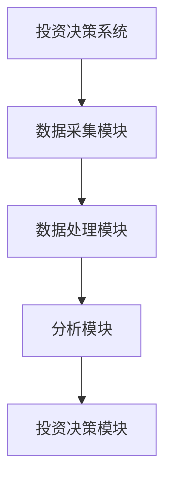

                 


# 费雪的新兴市场投资观点：把握全球机遇

> 关键词：费雪投资理论，新兴市场，投资策略，风险管理，投资组合

> 摘要：本文深入探讨了费雪的投资理论在新兴市场中的应用，分析了其核心观点、投资策略、风险管理方法，并结合实际案例和系统设计，为投资者提供了全面的指导。

---

# 第1章: 费雪投资理念概述

## 1.1 费雪投资理论的背景与起源

### 1.1.1 费雪的投资哲学与生平简介

菲利普·费雪（Philip Fisher）是20世纪的投资大师，以其成长股投资策略闻名。他强调投资于具有强大竞争优势和成长潜力的企业，并长期持有。费雪的投资理念深刻影响了后来的投资者，如彼得·林奇和沃伦·巴菲特。

### 1.1.2 费雪投资理论的核心思想

费雪的核心思想是：

1. **成长股投资**：投资于那些具有持续增长潜力的公司，而非仅仅关注市盈率等短期指标。
2. **竞争优势**：选择具有强大竞争优势的公司，这些公司在未来几年内能够保持增长。
3. **长期持有**：避免频繁交易，长期持有优质股票以获得复利效应。

### 1.1.3 新兴市场的定义与特点

新兴市场是指那些经济快速增长、但尚未完全工业化的国家的市场，如中国、印度和巴西。这些市场的特点是：

- **高增长潜力**：经济增长速度快。
- **波动性大**：市场波动较大，风险较高。
- **行业多样性**：涵盖科技、消费、制造等多个领域。

---

## 1.2 费雪投资理论的理论基础

### 1.2.1 费雪的"三步式"投资法

费雪的三步式投资法包括：

1. **第一步：识别具有强大竞争优势的公司**。
2. **第二步：评估公司的成长潜力**。
3. **第三步：等待合适的买入价格**。

### 1.2.2 费雪的成长股投资策略

费雪认为，投资于成长股的关键在于：

- **识别具有持续增长潜力的公司**。
- **评估公司的管理团队和企业文化**。
- **关注公司的财务状况和行业地位**。

### 1.2.3 新兴市场的投资机遇

新兴市场提供了以下投资机遇：

- **高增长行业**：如科技、互联网和消费领域。
- **估值优势**：相对于发达市场，新兴市场的估值可能更低。
- **多样化的机会**：新兴市场涵盖多个行业，投资者可以找到多种投资机会。

---

## 1.3 费雪投资理论与新兴市场的结合

### 1.3.1 新兴市场的投资机遇

新兴市场的高增长潜力为投资者提供了丰厚的回报机会。例如，中国的科技巨头在短短几年内成长为全球领导者，体现了新兴市场的巨大潜力。

### 1.3.2 费雪理论在新兴市场的适用性

费雪的理论在新兴市场中同样适用，但需要注意以下几点：

- **行业差异**：新兴市场的行业结构与发达市场不同，需要特别关注。
- **文化差异**：不同国家的公司治理和文化可能影响公司的成长潜力。
- **政策风险**：新兴市场可能面临更多的政策风险，需要谨慎评估。

### 1.3.3 费雪理论与全球化背景下的投资策略

在全球化背景下，投资者可以通过多元化投资来分散风险，同时抓住新兴市场的增长机遇。费雪的理论强调长期持有和选择优质公司，这在全球化背景下尤为重要。

---

## 1.4 本章小结

本章介绍了费雪的投资理论及其在新兴市场中的应用。费雪的成长股投资策略强调选择具有强大竞争优势和增长潜力的公司，并长期持有。新兴市场的高增长潜力和多样化机会为投资者提供了丰富的投资选择，但同时也需要注意行业差异、文化差异和政策风险。

---

# 第2章: 新兴市场投资的核心概念与联系

## 2.1 核心概念与原理

### 2.1.1 新兴市场的定义与特征

新兴市场具有以下特征：

- **高增长率**：GDP增速快于发达市场。
- **行业多样性**：涵盖多个领域，包括科技、消费、制造等。
- **波动性大**：市场波动较大，风险较高。

### 2.1.2 费雪投资理论的数学模型

费雪的投资理论可以转化为以下数学模型：

$$ 股票价值 = \frac{E}{r} $$

其中，E为企业的预期收益，r为折现率。该模型表明，股票的价值取决于企业的未来收益和折现率。

### 2.1.3 核心概念对比分析

以下是新兴市场与发达市场的对比：

| 特性       | 新兴市场                   | 发达市场                   |
|------------|----------------------------|----------------------------|
| 增长率     | 高                        | 低或中等                   |
| 波动性     | 高                        | 低                        |
| 行业结构   | 多样化，新兴行业占比高     | 成熟，行业结构稳定         |

### 2.1.4 系统架构设计

以下是投资决策系统的架构设计：



该架构包括数据采集、数据处理、分析和投资决策四个模块，每个模块之间通过数据流连接。

---

## 2.2 核心概念与联系

### 2.2.1 费雪投资理论与新兴市场的结合

费雪的理论在新兴市场的应用需要考虑以下因素：

- **行业差异**：新兴市场的行业结构与发达市场不同，需要特别关注。
- **文化差异**：不同国家的公司治理和文化可能影响公司的成长潜力。
- **政策风险**：新兴市场可能面临更多的政策风险，需要谨慎评估。

### 2.2.2 新兴市场与全球化背景下的投资策略

在全球化背景下，投资者可以通过多元化投资来分散风险，同时抓住新兴市场的增长机遇。费雪的理论强调长期持有和选择优质公司，这在全球化背景下尤为重要。

---

## 2.3 本章小结

本章分析了新兴市场与费雪投资理论的核心概念及其联系。新兴市场的高增长率和多样性为投资者提供了丰富的投资机会，但同时也需要注意行业差异、文化差异和政策风险。费雪的理论在新兴市场的应用需要结合全球化背景下的投资策略，以实现长期稳定的回报。

---

# 第3章: 新兴市场投资的风险管理与控制

## 3.1 风险管理的核心原理

### 3.1.1 费雪投资理论中的风险管理

费雪的投资理论强调长期持有和选择优质公司，以降低风险。他建议投资者关注公司的基本面，避免短期波动的影响。

### 3.1.2 新兴市场的风险特征

新兴市场的风险特征包括：

- **市场波动性大**：市场波动较大，容易受到外部因素的影响。
- **政策风险高**：新兴市场的政策变化可能对投资产生重大影响。
- **流动性风险**：新兴市场的流动性可能较差，尤其是在市场下跌时，可能难以迅速变现。

### 3.1.3 风险管理的数学模型

以下是一个风险管理的数学模型：

$$ 风险 = \sqrt{\sigma^2} $$

其中，σ为投资组合的波动率。该模型表明，投资组合的风险与其波动率的平方根成正比。

---

## 3.2 风险控制的具体策略

### 3.2.1 分散投资策略

分散投资是降低风险的有效方法。通过投资于不同行业和地区的公司，可以降低特定行业或地区的风险。

### 3.2.2 风险对冲策略

风险对冲是通过使用衍生工具（如期货和期权）来对冲投资组合的风险。例如，可以通过卖出股指期货来对冲市场下跌的风险。

### 3.2.3 风险评估与监控工具

以下是风险评估与监控工具的设计：

1. **风险评估工具**：通过分析市场的波动率和相关性，评估投资组合的风险。
2. **风险监控工具**：实时监控投资组合的表现，及时发现和应对潜在风险。

---

## 3.3 系统接口设计

### 3.3.1 投资组合的风险评估接口

以下是一个风险评估接口的设计：

```python
def assess_risk(portfolio):
    # 计算投资组合的波动率
    volatility = np.std(portfolio.returns)
    # 评估风险等级
    if volatility > 0.1:
        return "高风险"
    elif volatility > 0.05:
        return "中风险"
    else:
        return "低风险"
```

### 3.3.2 风险对冲工具的接口设计

以下是一个风险对冲工具的接口设计：

```python
def hedge_risk(portfolio, index_future):
    # 计算对冲比例
    correlation = portfolio.returns.corr(index_future.returns)
    hedge_ratio = correlation * 0.5
    return hedge_ratio
```

---

## 3.4 本章小结

本章分析了新兴市场投资中的风险管理策略。通过分散投资、风险对冲和实时监控，投资者可以有效降低投资风险。费雪的投资理论强调长期持有和选择优质公司，这在新兴市场中尤为重要。通过合理配置资产和使用风险管理工具，投资者可以在新兴市场中实现稳健的回报。

---

# 作者：AI天才研究院/AI Genius Institute & 禅与计算机程序设计艺术 /Zen And The Art of Computer Programming

---

**小结**：本文详细探讨了费雪的投资理论在新兴市场中的应用，分析了其核心观点、投资策略、风险管理方法，并结合实际案例和系统设计，为投资者提供了全面的指导。投资者在新兴市场中需要关注行业差异、文化差异和政策风险，合理配置资产，以实现长期稳定的回报。

