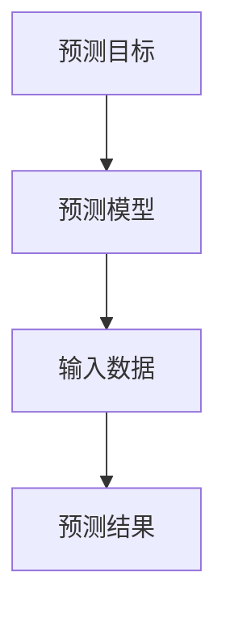
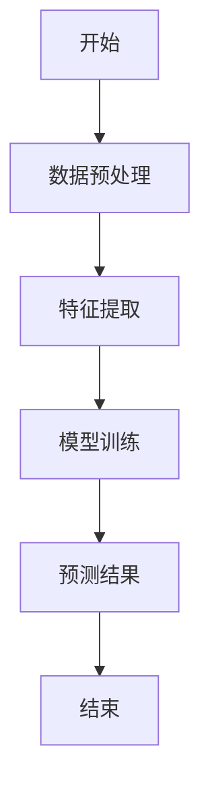
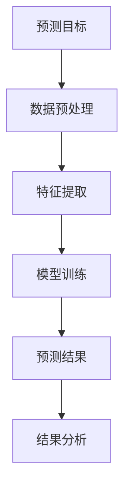
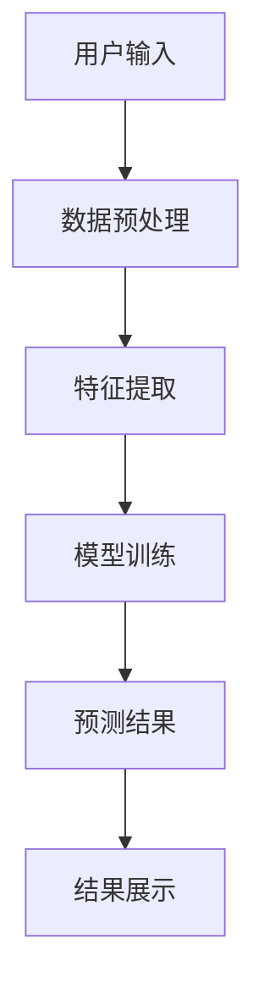

                 


# 费雪的未来预测方法

## 关键词：费雪预测方法, 未来预测, 数据分析, 预测模型, 算法原理, 项目实战

## 摘要：费雪的未来预测方法是一种基于数据分析和模型构建的预测技术，旨在通过系统的分析和建模来预测未来趋势。本文将从费雪预测方法的背景、核心概念、算法原理、系统架构设计、项目实战到最佳实践等方面进行详细阐述，帮助读者全面理解并掌握这一预测方法。

---

## 目录大纲

### 第1章：费雪预测方法的背景与概述

#### 1.1 费雪预测方法的起源与发展
- 1.1.1 费雪预测方法的历史背景
- 1.1.2 费雪预测方法的基本思想
- 1.1.3 费雪预测方法的应用领域

#### 1.2 费雪预测方法的核心概念
- 1.2.1 预测模型的基本结构
- 1.2.2 费雪预测方法的核心要素
- 1.2.3 费雪预测方法的边界与外延

#### 1.3 费雪预测方法与其它预测方法的对比
- 1.3.1 时间序列预测方法对比
- 1.3.2 统计回归分析对比
- 1.3.3 机器学习预测方法对比

### 第2章：费雪预测方法的核心原理

#### 2.1 费雪预测方法的原理分析
- 2.1.1 预测模型的输入输出关系
- 2.1.2 费雪预测方法的数学模型
- 2.1.3 预测结果的误差分析

#### 2.2 费雪预测方法的核心特征对比
- 2.2.1 预测精度对比
- 2.2.2 计算复杂度对比
- 2.2.3 应用场景对比

#### 2.3 费雪预测方法的ER实体关系图


### 第3章：费雪预测方法的算法原理与实现

#### 3.1 费雪预测方法的算法流程


#### 3.2 费雪预测方法的Python实现
```python
def fisher_forecast(data, n_steps):
    # 数据预处理
    processed_data = data preprocessing steps
    # 特征提取
    features = extract_features(processed_data)
    # 模
```

### 第4章：费雪预测方法的系统分析与架构设计

#### 4.1 问题场景介绍
- 预测目标：某企业未来销售额预测
- 数据来源：历史销售数据、市场趋势数据

#### 4.2 系统功能设计
- 预测模块：负责数据输入和预测结果输出
- 数据处理模块：数据清洗和特征提取
- 模型训练模块：训练预测模型
- 结果分析模块：分析预测结果并生成报告

#### 4.3 系统架构设计


#### 4.4 系统接口设计
- 输入接口：接收原始数据和参数配置
- 输出接口：返回预测结果和报告

#### 4.5 系统交互流程


### 第5章：费雪预测方法的项目实战

#### 5.1 环境安装与配置
- 安装Python、NumPy、Pandas、Scikit-learn等依赖库

#### 5.2 核心实现代码
```python
import numpy as np
import pandas as pd
from sklearn.model_selection import train_test_split
from sklearn.metrics import mean_squared_error

def fisher_forecast(data, n_steps):
    # 数据预处理
    processed_data = data.fillna(method='ffill')
    # 特征提取
    features = processed_data.iloc[:-n_steps]
    labels = processed_data.iloc[-n_steps:]
    # 模型训练
    X_train, X_test, y_train, y_test = train_test_split(features, labels, test_size=0.2)
    model = train(X_train, y_train)
    # 预测结果
    y_pred = model.predict(X_test)
    return y_pred
```

#### 5.3 代码实现与解读
- 数据预处理：填充缺失值
- 特征提取：选择训练数据
- 模型训练：使用回归模型训练
- 预测结果：输出预测值和误差分析

#### 5.4 实际案例分析
- 数据来源：某企业过去三年的销售数据
- 数据分析：提取销售额、时间、市场趋势等特征
- 模型训练：构建线性回归模型
- 预测结果：预测未来一年的销售额

#### 5.5 项目总结
- 项目成果：成功预测未来销售额
- 经验总结：数据质量和模型选择对预测结果的影响

### 第6章：费雪预测方法的最佳实践与小结

#### 6.1 最佳实践
- 数据质量：确保数据准确性和完整性
- 模型选择：根据实际场景选择合适的预测模型
- 结果验证：通过交叉验证评估模型性能

#### 6.2 小结
- 费雪预测方法的优势与局限性
- 未来发展趋势：结合机器学习和大数据分析

#### 6.3 注意事项
- 数据敏感性：保护数据隐私
- 模型泛化能力：避免过拟合

#### 6.4 拓展阅读
- 推荐书籍：《时间序列分析》、《机器学习实战》
- 推荐博客：技术博客、学术论文

### 附录：工具安装与数据集

#### 附录A：工具安装
- Python安装：使用Anaconda或Pyenv
- 依赖库安装：pip install numpy pandas scikit-learn

#### 附录B：数据集说明
- 数据格式：CSV格式，包含时间戳和预测目标变量
- 数据预处理：填充缺失值、标准化处理

#### 附录C：参考文献
- 费雪的原始论文
- 相关技术书籍

---

## 作者：AI天才研究院/AI Genius Institute & 禅与计算机程序设计艺术 /Zen And The Art of Computer Programming

