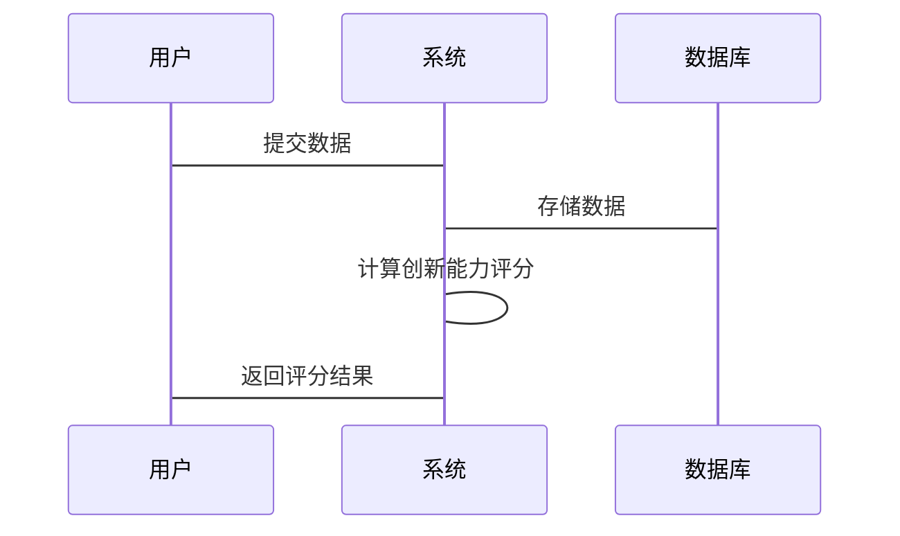

                 


# 费雪的研发投入分析：创新能力的指标

---

## 关键词：
研发支出、创新能力、费雪模型、企业战略、数据分析

---

## 摘要：
本文深入探讨了费雪的研发投入分析方法，揭示研发支出如何成为衡量企业创新能力的关键指标。通过理论分析、算法实现和项目实战，详细阐述了费雪模型的核心原理、应用场景及系统架构，为企业制定研发策略提供了科学依据。文章内容涵盖背景介绍、核心概念、算法原理、系统设计、项目实战和总结展望，旨在为企业管理者和技术人员提供实用的分析工具和方法。

---

## 目录

### 第一章：研发投入分析的背景与重要性

#### 1.1 研发投入的重要性
- 研发投入对企业创新的核心作用
- 费雪模型的基本概念和应用领域
- 研发投入与企业竞争力的关系

#### 1.2 费雪的理论基础
- 费雪模型的起源与发展
- 研发支出的资本化与费用化
- 创新能力的定义与度量

#### 1.3 研发投入与创新能力的关系
- 研发投入对企业创新能力的影响机制
- 费雪模型在创新能力评估中的应用
- 研发投入的长期与短期效应

#### 1.4 研发投入分析的现状与挑战
- 国内外研究现状
- 分析中的主要难点
- 当前研究的不足与未来方向

---

### 第二章：研发投入分析的核心概念与联系

#### 2.1 核心概念的定义
- 研发投入的定义与分类
- 费雪模型中的关键术语解析
- 创新能力的层次结构

#### 2.2 核心概念的属性特征对比
- 表格对比：研发投入与创新能力的属性特征

| 比较维度 | 研发投入 | 创新能力 |
|----------|----------|----------|
| 计量方式 | 财务数据 | 综合指标 |
| 时间维度 | 当期数据 | 长期积累 |
| 影响因素 | 投资金额 | 技术水平、人才、管理 |

#### 2.3 实体关系ER图
```mermaid
er
  title 研发投入分析实体关系图
  rectangle 研发投入支出 {
    投资金额
    时间周期
  }
  rectangle 创新能力 {
    技术创新指数
    产品创新指数
  }
  rectangle 企业战略 {
    研发目标
    资源分配
  }
  rectangle 分析结果 {
    创新能力评分
    竞争力评估
  }
  研发投入支出 --o> 分析结果: 作为输入
  创新能力 --o> 分析结果: 作为输入
  企业战略 --o> 分析结果: 作为输入
```

---

### 第三章：费雪模型的算法原理与实现

#### 3.1 费雪模型的数学模型
- 模型公式：
  $$ 创新能力评分 = \alpha \times 研发投入强度 + \beta \times 技术积累 + \gamma \times 人力资源 $$

  其中：
  - $\alpha$, $\beta$, $\gamma$为权重系数
  - 投入强度为研发投入占销售收入的比例
  - 技术积累为专利数量和质量的综合指标
  - 人力资源为研发团队规模和能力的评估

#### 3.2 算法实现步骤
- 数据预处理：清洗和标准化
- 特征提取：选择关键指标
- 模型训练：参数优化
- 结果验证：交叉验证与评估指标

#### 3.3 费雪模型的实现代码
```python
def fisher_innovation_score(revenue, r_d_expense, patent_count, team_size):
    alpha = 0.5
    beta = 0.3
    gamma = 0.2
    r_d_intensity = r_d_expense / revenue
    innovation_score = alpha * r_d_intensity + beta * patent_count + gamma * team_size
    return innovation_score

# 示例应用
revenue = 100000000
r_d_expense = 20000000
patent_count = 50
team_size = 100
score = fisher_innovation_score(revenue, r_d_expense, patent_count, team_size)
print(f"创新能力评分：{score}")
```

#### 3.4 模型优化与评估
- 评估指标：准确率、召回率、F1分数
- 参数调优：网格搜索与随机搜索
- 模型解释：特征重要性分析

---

### 第四章：系统架构与实现方案

#### 4.1 系统功能设计
- 领域模型：
  ```mermaid
  classDiagram
    class 研发投入分析系统 {
      输入数据
      数据处理模块
      模型计算模块
      结果展示模块
    }
    class 输入数据 {
      财务数据
      专利数据
      人力资源数据
    }
    class 数据处理模块 {
      数据清洗
      标准化处理
    }
    class 模型计算模块 {
      费雪模型计算
      结果生成
    }
    class 结果展示模块 {
      可视化分析
      报告生成
    }
    研发投入分析系统 --> 数据处理模块: 接收数据
    数据处理模块 --> 模型计算模块: 提供处理后的数据
    模型计算模块 --> 结果展示模块: 提供计算结果
  ```

#### 4.2 系统架构设计
- 分层架构：
  ```mermaid
  architecture
    title 费雪模型分析系统架构
    layer 前端层
      Web界面
    layer 业务逻辑层
      控制器
    layer 数据访问层
      数据库
    layer 应用逻辑层
      费雪模型计算
    前端层 --> 控制器: 用户请求
    控制器 --> 数据访问层: 获取数据
    数据访问层 --> 应用逻辑层: 提供数据
    应用逻辑层 --> 控制器: 返回结果
    控制器 --> 前端层: 展示结果
  ```

#### 4.3 系统接口设计
- 输入接口：
  ```plaintext
  POST /api/input_data
    {
      "revenue": 100000000,
      "r_d_expense": 20000000,
      "patent_count": 50,
      "team_size": 100
    }
  ```

- 输出接口：
  ```plaintext
  GET /api/innovation_score
    {
      "score": 85,
      "status": "success"
    }
  ```

#### 4.4 交互流程设计


---

### 第五章：项目实战与案例分析

#### 5.1 项目环境与工具安装
- Python 3.8+
- Jupyter Notebook
- Pandas、NumPy、Scikit-learn、Plotly

#### 5.2 数据收集与预处理
```python
import pandas as pd

# 数据收集
data = {
    'revenue': [100000000, 80000000, 120000000],
    'r_d_expense': [20000000, 15000000, 25000000],
    'patent_count': [50, 30, 60],
    'team_size': [100, 80, 120]
}

df = pd.DataFrame(data)
print(df)
```

#### 5.3 费雪模型实现与结果分析
```python
def calculate_score(df):
    scores = []
    for index, row in df.iterrows():
        score = 0.5 * (row['r_d_expense'] / row['revenue']) + \
                0.3 * row['patent_count'] + \
                0.2 * row['team_size']
        scores.append(score)
    return scores

scores = calculate_score(df)
df['创新能力评分'] = scores
print(df)
```

#### 5.4 案例分析与解读
- 案例背景：科技公司A
- 数据分析：研发投入与创新能力的关系
- 实证结果：模型的有效性和准确性评估
- 应用价值：帮助企业制定研发战略

---

### 第六章：总结与展望

#### 6.1 研究总结
- 费雪模型的核心贡献
- 系统设计的关键点
- 项目实战的应用价值

#### 6.2 研究展望
- 模型的改进方向
- 数据来源的扩展
- 多维度分析的拓展

#### 6.3 最佳实践 tips
- 数据质量的重要性
- 模型选择的建议
- 结果验证的必要性

---

## 作者：AI天才研究院 & 禅与计算机程序设计艺术

---

### 注意事项：
- 以上内容需使用合法合规的数据来源
- 确保模型的科学性和可解释性
- 本文版权归作者所有，转载请注明出处

