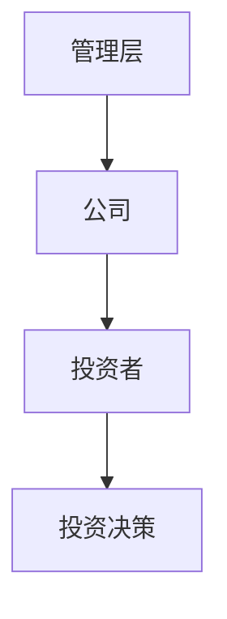
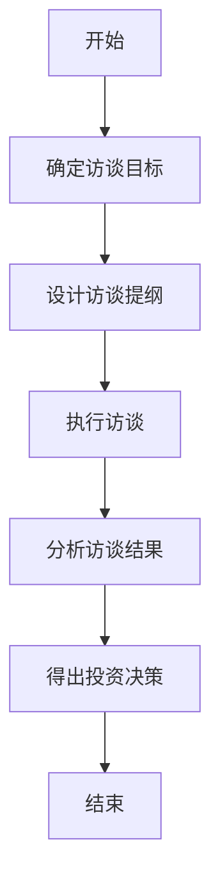
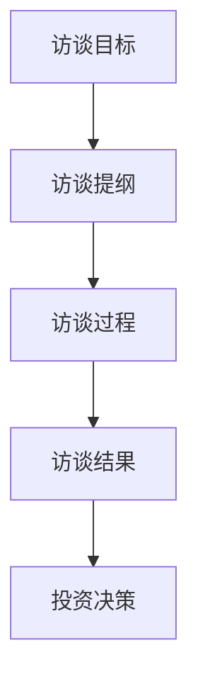
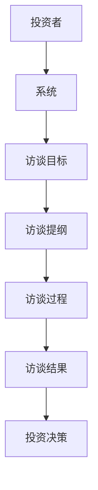

                 


# 费雪的管理层访谈技巧

> 关键词：费雪，管理层访谈，投资技巧，投资决策，访谈策略

> 摘要：本文深入探讨了费雪的管理层访谈技巧，从背景、核心概念、技巧与策略、系统分析到项目实战，详细阐述了费雪访谈技巧的理论基础、实践方法和应用场景。通过结构化的分析和实际案例，帮助读者掌握如何通过有效的管理层访谈来优化投资决策。

---

## 第一部分: 费雪的管理层访谈技巧背景与核心概念

### 第1章: 费雪的管理层访谈技巧概述

#### 1.1 费雪的生平与投资哲学

- **1.1.1 费雪的生平简介**
  - 费雪的早年经历与投资生涯
  - 费雪的投资风格与特点
  - 费雪在投资领域的影响力

- **1.1.2 费雪的投资哲学与方法**
  - 费雪的“三重过滤法”
  - 费雪对管理层的重视
  - 费雪的投资决策模型

- **1.1.3 费雪对管理层访谈的重视**
  - 访谈在费雪投资策略中的地位
  - 访谈如何帮助识别公司潜在问题
  - 访谈对投资组合构建的影响

#### 1.2 管理层访谈技巧的核心概念

- **1.2.1 管理层访谈的定义与作用**
  - 什么是管理层访谈？
  - 访谈在投资决策中的作用
  - 访谈与其他投资分析方法的区别

- **1.2.2 费雪访谈技巧的核心要素**
  - 访谈目标的明确性
  - 访谈提纲的设计与优化
  - 访谈过程中的问题解决能力

- **1.2.3 访谈技巧在投资决策中的应用**
  - 访谈如何揭示公司基本面
  - 访谈如何评估公司管理层能力
  - 访谈如何帮助识别投资机会与风险

#### 1.3 管理层访谈的背景与现状

- **1.3.1 现代投资环境中的管理层访谈**
  - 当前投资环境的复杂性
  - 访谈在现代投资中的重要性
  - 访谈技巧的演变与创新

- **1.3.2 费雪访谈技巧的现实意义**
  - 访谈技巧在当前投资环境中的适用性
  - 访谈技巧对投资者的启示
  - 访谈技巧在长期投资中的价值

- **1.3.3 当前管理层访谈的挑战与机遇**
  - 当前访谈中的主要挑战
  - 技术进步带来的访谈新机遇
  - 未来访谈技巧的发展方向

### 第2章: 管理层访谈的核心概念与联系

#### 2.1 核心概念原理

- **2.1.1 访谈的核心要素分析**
  - 访谈目标的设定
  - 访谈对象的选择
  - 访谈过程的控制

- **2.1.2 费雪访谈技巧的独特性**
  - 费雪技巧与其他访谈方法的对比
  - 费雪技巧的核心创新点
  - 费雪技巧的可操作性

- **2.1.3 访谈技巧与投资决策的关系**
  - 访谈如何影响投资决策
  - 访谈结果对投资组合的影响
  - 访谈技巧对投资风险的控制

#### 2.2 核心概念属性特征对比表格

| 概念          | 特征                                |
|---------------|------------------------------------|
| 访谈目标      | 获取公司基本面信息                 |
| 访谈对象      | 公司高管                           |
| 访谈方式      | 结构化访谈                         |
| 访谈结果      | 投资决策依据                       |

#### 2.3 ER实体关系图



### 第3章: 管理层访谈的算法原理

#### 3.1 算法原理流程图



#### 3.2 算法实现代码

```python
def fisher_interview_analysis(interview_transcript):
    # 提取关键信息
    key_points = extract_key_points(interview_transcript)
    # 分析公司基本面
    company_analysis = analyze_company(key_points)
    # 得出投资建议
    investment_recommendation = make_recommendation(company_analysis)
    return investment_recommendation
```

#### 3.3 数学模型与公式

- **访谈结果分析模型**
  $$ \text{投资决策} = f(\text{管理层访谈结果}, \text{公司基本面}) $$

---

## 第二部分: 管理层访谈的技巧与策略

### 第4章: 管理层访谈的技巧

#### 4.1 访谈准备技巧

- **4.1.1 访谈提纲的设计与优化**
  - 如何设计有效的访谈提纲
  - 提纲的结构化与逻辑性
  - 提纲的灵活性与适应性

- **4.1.2 访谈前的信息收集与分析**
  - 如何利用公开信息辅助访谈
  - 如何识别潜在问题点
  - 如何预测管理层可能的回答

#### 4.2 访谈执行技巧

- **4.2.1 如何建立信任关系**
  - 访谈中的沟通技巧
  - 如何缓解管理层的紧张情绪
  - 如何引导管理层打开话匣子

- **4.2.2 如何提问与倾听**
  - 开放式问题与封闭式问题的运用
  - 如何通过倾听获取更多信息
  - 如何通过追问深入问题

#### 4.3 访谈中的问题解决技巧

- **4.3.1 如何应对管理层的回避或模糊回答**
  - 如何通过追问澄清问题
  - 如何通过假设性问题引导回答
  - 如何通过中立性问题保持对话

- **4.3.2 如何处理管理层的矛盾信息**
  - 如何识别矛盾信息的来源
  - 如何通过进一步访谈澄清矛盾
  - 如何利用矛盾信息评估公司风险

### 第5章: 管理层访谈的策略

#### 5.1 针对不同管理层的访谈策略

- **5.1.1 针对 CEO 的访谈策略**
  - 如何评估 CEO 的领导能力
  - 如何识别 CEO 的战略眼光
  - 如何判断 CEO 的诚信与责任感

- **5.1.2 针对 CFO 的访谈策略**
  - 如何获取财务数据的真实性
  - 如何评估公司的财务健康状况
  - 如何识别财务风险与机会

#### 5.2 不同行业中的访谈策略调整

- **5.2.1 高 tech 行业的访谈策略**
  - 如何评估技术创新能力
  - 如何判断市场竞争优势
  - 如何预测行业发展趋势

- **5.2.2 传统行业的访谈策略**
  - 如何评估成本控制能力
  - 如何判断行业周期性影响
  - 如何识别竞争优势与劣势

#### 5.3 访谈中的风险管理策略

- **5.3.1 如何识别管理层的潜在风险**
  - 如何发现管理层的诚信问题
  - 如何识别管理层的能力不足
  - 如何判断管理层的战略失误

- **5.3.2 如何通过访谈降低投资风险**
  - 如何利用访谈结果优化投资组合
  - 如何通过访谈结果调整投资策略
  - 如何通过访谈结果规避投资风险

---

## 第三部分: 管理层访谈的系统分析

### 第6章: 访谈的系统分析与架构设计

#### 6.1 访谈系统的功能设计

- **6.1.1 系统功能模块划分**
  - 访谈目标设定模块
  - 访谈提纲设计模块
  - 访谈过程控制模块
  - 访谈结果分析模块

#### 6.2 访谈系统的架构设计



#### 6.3 访谈系统的接口设计

- **6.3.1 系统输入接口**
  - 访谈目标的输入
  - 访谈提纲的输入
  - 访谈过程的控制

- **6.3.2 系统输出接口**
  - 访谈结果的输出
  - 投资建议的输出
  - 系统日志的输出

#### 6.4 访谈系统的交互设计



---

## 第四部分: 管理层访谈的项目实战

### 第7章: 访谈项目的环境搭建

#### 7.1 环境搭建步骤

- **7.1.1 硬件环境**
  - 访谈设备的准备
  - 访谈地点的选择
  - 访谈工具的安装

- **7.1.2 软件环境**
  - 访谈记录工具的安装
  - 数据分析工具的安装
  - 投资决策支持系统的安装

### 第8章: 项目核心实现

#### 8.1 核心代码实现

```python
def extract_key_points(transcript):
    # 使用自然语言处理技术提取关键点
    key_points = []
    for sentence in transcript.split('\n'):
        if '重要' in sentence:
            key_points.append(sentence)
    return key_points
```

#### 8.2 代码实现解读

- **8.2.1 代码功能分析**
  - 如何提取关键点
  - 如何分析公司基本面
  - 如何生成投资建议

- **8.2.2 代码优化建议**
  - 如何提高代码的运行效率
  - 如何增强代码的可读性
  - 如何扩展代码的功能

### 第9章: 实际案例分析

#### 9.1 案例背景介绍

- 案例公司的基本情况
- 访谈的目标与预期
- 访谈的背景与环境

#### 9.2 案例分析过程

- 访谈提纲的设计与实施
- 访谈过程的记录与分析
- 访谈结果的总结与应用

#### 9.3 案例结果与启示

- 投资决策的最终结果
- 访谈对投资决策的影响
- 访谈技巧的应用效果

---

## 第五部分: 总结与展望

### 第10章: 总结与展望

#### 10.1 核心内容回顾

- 费雪访谈技巧的背景与核心概念
- 访谈技巧的实践与策略
- 访谈系统的分析与设计
- 访谈项目的实战经验

#### 10.2 未来展望

- 访谈技巧的未来发展
- 技术进步对访谈的影响
- 人工智能在访谈中的应用

---

## 作者：AI天才研究院/AI Genius Institute & 禅与计算机程序设计艺术 /Zen And The Art of Computer Programming

---

**说明：** 以上内容仅为书籍目录大纲，具体内容需要根据实际需求进行补充和完善。

