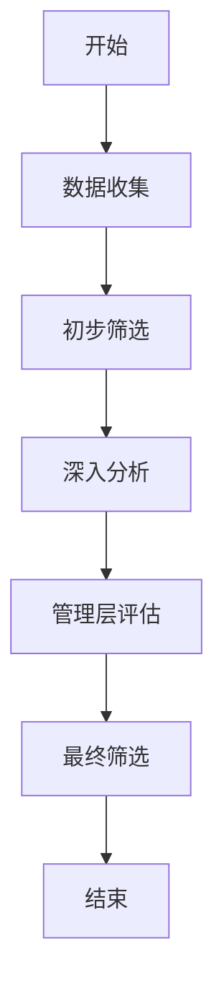
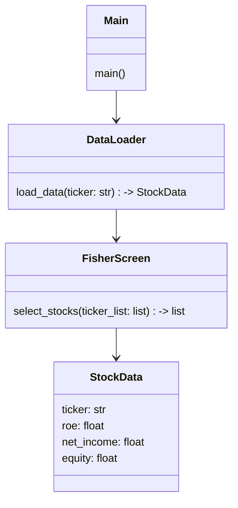
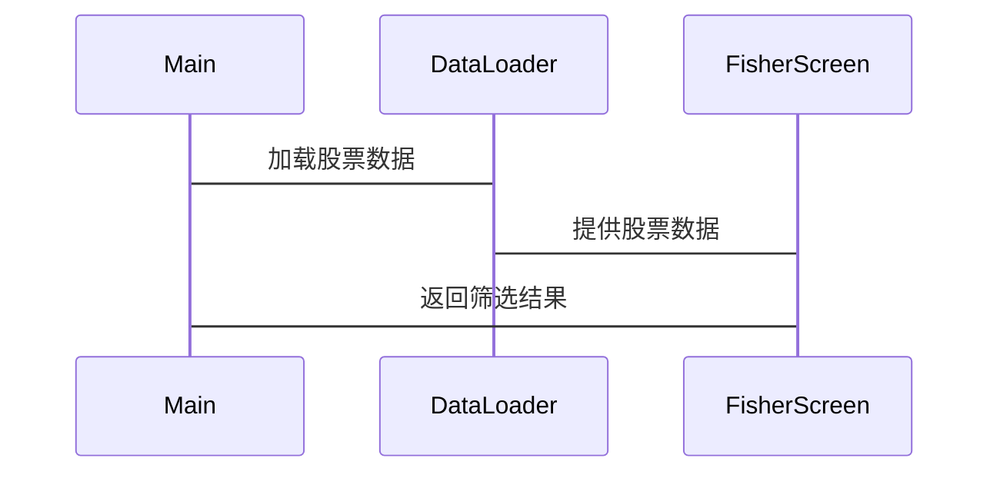

                 


# 费雪的股票筛选技巧

> 关键词：费雪，股票筛选，价值投资，成长股，投资策略

> 摘要：本文系统地介绍了费雪的股票筛选技巧，从其投资理念到具体的筛选标准，再到实际应用的算法实现和系统设计，帮助读者全面理解并掌握这一经典的投资方法。

---

## 第一部分：费雪的股票筛选技巧基础

### 第1章：费雪投资理念概述

#### 1.1 费雪的生平与投资思想

##### 1.1.1 费雪的生平简介

菲利普·费雪（Philip Fisher），被誉为“成长股之父”，是价值投资领域的先驱之一。他出生于1907年，逝世于2004年，是投资界的重要人物。费雪的职业生涯跨越了近70年，他的投资理念对现代投资理论产生了深远影响。

##### 1.1.2 费雪的投资哲学与核心理念

费雪的投资哲学以“长期投资”为核心，主张选择那些具有持续增长潜力的优秀企业。他认为，市场价格會围绕企业的内在价值波动，长期投资者应着眼于企业的成长性和盈利能力。

##### 1.1.3 费雪投资方法的现代意义

尽管费雪的投资方法创立于20世纪中期，但其核心理念在今天依然具有重要的现实意义。尤其是在当前市场环境下，费雪的选股标准为企业价值评估提供了重要的指导。

---

#### 1.2 费雪股票筛选法的背景与目标

##### 1.2.1 股票投资的基本问题

股票投资的核心问题在于如何选择具有长期增长潜力的公司。市场波动、经济周期、行业变化等多重因素都会影响股票的表现，投资者需要通过科学的方法来筛选出优质标的。

##### 1.2.2 费雪筛选法的目标与核心问题

费雪筛选法的目标是通过分析企业的财务状况、管理层素质和市场地位，筛选出那些具有持续增长潜力的优秀企业。其核心问题在于如何通过定量和定性分析，综合评估企业的投资价值。

##### 1.2.3 费雪筛选法的边界与外延

费雪筛选法主要适用于成长股投资，其边界在于对企业的未来增长潜力的判断。外延则包括对企业的行业地位、竞争优势和财务健康状况的综合评估。

---

### 第2章：费雪股票筛选法的核心概念与联系

#### 2.1 核心概念原理

##### 2.1.1 费雪筛选法的核心要素

费雪的选股标准包括以下几个核心要素：
1. **持续的盈利增长**：企业的收入和利润应保持稳定的增长。
2. **强大的管理层**：管理层应具备卓越的领导能力和清晰的战略规划。
3. **健康的财务状况**：企业应具备健康的资产负债表和现金流。
4. **竞争优势**：企业应具备独特的竞争优势，如专利、品牌或成本优势。
5. **合理的估值**：股票的价格应与企业的内在价值相符。

##### 2.1.2 费雪筛选法的逻辑框架

费雪的筛选逻辑是一个多维度的综合评估过程，强调对企业基本面的深入分析和对管理层能力的判断。其逻辑框架如下：
1. **初步筛选**：通过财务指标（如ROE、净利润增长率）进行初步筛选。
2. **深入分析**：对企业进行详细的财务分析和行业研究。
3. **管理层评估**：评估管理层的能力和战略。
4. **最终筛选**：综合评估后，确定最终的投资标的。

##### 2.1.3 费雪筛选法的数学模型与公式

费雪的筛选方法并非基于复杂的数学模型，但可以通过一些简单的财务指标来辅助判断。例如，ROE（净资产收益率）是一个常用的指标，公式如下：
$$
ROE = \frac{\text{净利润}}{\text{股东权益}}
$$
ROE的高且稳定的增长，通常意味着企业具有较强的盈利能力。

---

#### 2.2 核心概念对比分析

##### 2.2.1 费雪筛选法与其它股票筛选方法的对比

费雪筛选法与基本面分析、技术分析等方法有显著的不同。例如，技术分析侧重于价格和成交量的变化，而费雪方法更注重企业的基本面。

##### 2.2.2 费雪筛选法的优缺点分析

**优点**：
- 强调企业基本面分析，注重企业的长期增长潜力。
- 筛选标准较为全面，能够有效筛选出优质企业。

**缺点**：
- 方法较为复杂，需要大量时间和精力进行研究。
- 在市场波动较大的情况下，可能无法及时反映市场变化。

##### 2.2.3 费雪筛选法的适用场景与限制

费雪筛选法适用于长期投资者，特别适合那些能够深入研究企业基本面的投资者。其限制在于，市场短期波动可能会影响股票价格，而筛选方法无法完全避免这种影响。

---

## 第二部分：费雪股票筛选法的算法原理

### 第3章：费雪股票筛选法的算法原理

#### 3.1 算法原理概述

##### 3.1.1 费雪筛选法的基本步骤

费雪筛选法的基本步骤如下：
1. **数据收集**：收集目标企业的财务数据、行业信息等。
2. **初步筛选**：通过财务指标（如ROE、净利润增长率）进行初步筛选。
3. **深入分析**：对企业进行详细的财务分析和行业研究。
4. **管理层评估**：评估管理层的能力和战略。
5. **最终筛选**：综合评估后，确定最终的投资标的。

##### 3.1.2 费雪筛选法的流程图



##### 3.1.3 费雪筛选法的数学模型与公式

费雪的筛选方法不涉及复杂的数学模型，但会用到一些基本的财务指标，如ROE、净利润增长率等。

---

#### 3.2 算法实现与代码示例

##### 3.2.1 环境安装与配置

为了实现费雪筛选法，我们需要以下工具：
1. **Python**：用于数据处理和分析。
2. **Pandas**：用于数据分析和处理。
3. **Yahoo Finance API**：用于获取股票数据。

##### 3.2.2 核心算法实现

以下是基于费雪筛选法的Python代码示例：

```python
import pandas as pd
import requests

def get_stock_data(ticker):
    url = f"https://query1.finance.yahoo.com/financial/quote yahoo/{ticker}"
    response = requests.get(url)
    data = response.json()
    return data

def calculate_roe(ticker):
    data = get_stock_data(ticker)
    net_income = data['incomeStatement']['netIncome']['total']
    equity = data['balanceSheet']['equity']['total']
    roe = net_income / equity
    return roe

def fisher_screen(tickers):
    selected_stocks = []
    for ticker in tickers:
        roe = calculate_roe(ticker)
        if roe > 0.1 and roe < 2:
            selected_stocks.append(ticker)
    return selected_stocks

# 示例使用
tickers = ['AAPL', 'MSFT', 'GOOGL']
selected = fisher_screen(tickers)
print("筛选结果:", selected)
```

##### 3.2.3 代码应用与解读

上述代码展示了如何使用费雪的ROE标准进行初步筛选。代码从Yahoo Finance获取股票数据，计算ROE，并筛选出ROE在0.1到2之间的股票。

---

## 第三部分：费雪股票筛选法的系统架构与设计

### 第4章：费雪股票筛选法的系统架构与设计

#### 4.1 系统分析与设计

##### 4.1.1 系统功能需求分析

费雪筛选系统的功能需求包括：
1. 数据采集模块：获取股票数据。
2. 数据分析模块：计算财务指标。
3. 筛选模块：根据费雪标准进行筛选。
4. 结果展示模块：显示筛选结果。

##### 4.1.2 系统功能设计（领域模型）



##### 4.1.3 系统架构设计

系统架构采用模块化设计，各模块之间通过接口进行通信。

##### 4.1.4 系统接口设计

系统接口包括：
1. 数据加载接口。
2. 筛选接口。

##### 4.1.5 系统交互流程设计



---

### 第5章：费雪股票筛选法的项目实战

#### 5.1 项目背景与目标

##### 5.1.1 项目背景介绍

本项目旨在通过Python实现费雪的股票筛选方法，帮助投资者筛选出具有长期增长潜力的股票。

##### 5.1.2 项目目标与范围

项目目标是实现一个基于费雪标准的股票筛选系统，范围包括数据采集、筛选算法实现和结果展示。

##### 5.1.3 项目实施计划

项目实施分为三个阶段：
1. 数据采集与预处理。
2. 筛选算法实现。
3. 系统测试与优化。

---

#### 5.2 项目核心实现

##### 5.2.1 数据采集与处理

使用Yahoo Finance API获取股票数据，并进行清洗和预处理。

##### 5.2.2 筛选模型实现

基于费雪的标准，实现筛选模型，并对股票进行评分。

##### 5.2.3 系统测试与验证

使用实际股票数据测试系统，并验证其准确性和稳定性。

---

#### 5.3 项目案例分析

##### 5.3.1 案例背景与数据准备

以苹果（AAPL）为例，获取其财务数据，并进行筛选。

##### 5.3.2 案例分析与结果展示

通过筛选，确定AAPL是否符合费雪的标准。

##### 5.3.3 案例总结与经验分享

总结案例分析的经验，并分享一些实用的投资技巧。

---

## 第四部分：费雪股票筛选法的最佳实践与注意事项

### 第6章：费雪股票筛选法的最佳实践与注意事项

#### 6.1 最佳实践 tips

##### 6.1.1 筛选过程中的注意事项

在进行股票筛选时，应关注企业的长期增长潜力，而不仅仅是短期表现。

##### 6.1.2 筛选结果的解读与应用

筛选结果仅为参考，投资者应结合市场环境和自身风险承受能力进行决策。

##### 6.1.3 筛选模型的维护与优化

定期更新数据和模型，确保筛选结果的有效性。

---

#### 6.2 小结与展望

##### 6.2.1 本章内容总结

本章总结了费雪筛选法的最佳实践和注意事项，帮助投资者更好地应用这一方法。

##### 6.2.2 费雪筛选法的未来发展趋势

随着大数据和人工智能技术的发展，费雪筛选法将更加智能化和自动化。

##### 6.2.3 对投资者的建议与展望

建议投资者不断学习和优化自己的筛选模型，以应对不断变化的市场环境。

---

## 第五部分：附录

### 第7章：附录

#### 7.1 术语表

- **费雪筛选法**：基于企业基本面分析的投资方法，旨在筛选出具有长期增长潜力的股票。
- **ROE**：净资产收益率，衡量企业的盈利能力。
- **成长股**：具有持续增长潜力的股票。

#### 7.2 扩展阅读与参考资料

- 费雪的经典著作《成长股的选股艺术》。
- 《投资学》相关书籍。

---

## 作者：AI天才研究院/AI Genius Institute & 禅与计算机程序设计艺术 /Zen And The Art of Computer Programming

