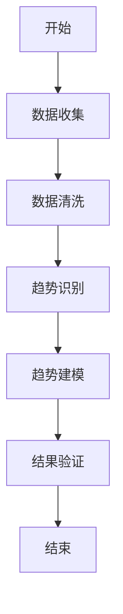
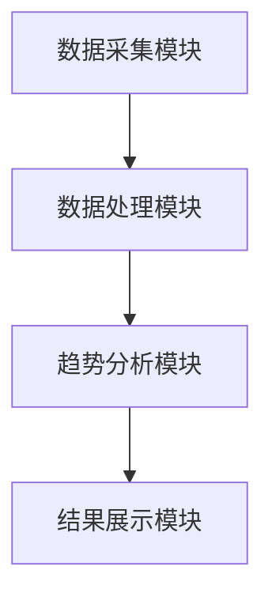

                 


# 费雪的行业趋势分析：把握未来增长机会

## 关键词：行业趋势分析，费雪，趋势预测，数据驱动，人工智能，投资机会

## 摘要：  
本文详细探讨了费雪的行业趋势分析方法，通过数据分析和人工智能技术，帮助投资者和企业把握行业趋势，抓住未来增长机会。文章从行业趋势分析的背景、核心概念、算法原理、系统架构到项目实战，全面解析了如何利用数据驱动的方法进行趋势分析，并通过实际案例展示了如何将理论应用于实践。

---

# 1. 背景介绍：行业趋势分析的背景与概念

## 1.1 什么是行业趋势分析  
行业趋势分析是通过对行业数据的收集、处理和分析，识别行业内的长期趋势、短期波动和周期性变化，从而帮助企业或投资者制定更科学的决策。费雪的行业趋势分析方法是一种基于数据驱动的分析框架，旨在通过量化手段捕捉行业发展的规律。

### 1.1.1 行业趋势分析的定义  
行业趋势分析是对行业内企业的经营状况、市场表现、消费者行为等多方面数据进行分析，以识别行业内的发展趋势、周期性变化和潜在机会。  

### 1.1.2 费雪行业趋势分析的核心概念  
- **趋势识别**：通过数据分析技术，识别行业的长期趋势和短期波动。  
- **数据驱动决策**：利用数据和模型预测行业未来的发展方向。  
- **行业洞察**：通过趋势分析，为企业和投资者提供行业发展的洞察和建议。  

---

## 1.2 行业趋势分析的重要性  

### 1.2.1 行业趋势分析的意义  
- **帮助企业制定战略**：通过识别行业趋势，企业可以更好地制定产品开发、市场拓展和投资计划。  
- **辅助投资决策**：投资者可以通过行业趋势分析，找到具有增长潜力的行业和企业。  
- **优化资源配置**：通过分析行业趋势，企业和投资者可以更好地配置资源，提高效率。  

### 1.2.2 费雪趋势分析的核心价值  
- 费雪趋势分析通过数据驱动的方法，将行业趋势的识别和预测系统化、量化，为企业和投资者提供可靠的决策依据。  

---

## 1.3 费雪趋势分析的基本原理  

### 1.3.1 数据驱动的分析方法  
- **数据收集**：从行业报告、企业财务数据、市场调研等多渠道获取行业数据。  
- **数据分析**：通过统计分析、时间序列分析等方法，识别行业趋势。  
- **模型预测**：利用机器学习和统计模型，预测行业未来发展趋势。  

### 1.3.2 费雪趋势分析的流程  
1. 数据收集与清洗。  
2. 数据可视化与初步分析。  
3. 趋势识别与建模。  
4. 模型验证与优化。  
5. 趋势预测与结果解读。  

---

# 2. 行业趋势分析的核心概念与联系  

## 2.1 趋势的定义与分类  

### 2.1.1 趋势的定义  
趋势是指在一定时间内，行业或市场中某种现象或指标的持续变化方向。  

### 2.1.2 趋势的分类  
- **长期趋势**：持续时间较长，反映了行业的基本发展规律。  
- **短期趋势**：短期内的波动，可能受到市场情绪或突发事件的影响。  
- **周期性趋势**：具有周期性特征的趋势，如经济周期对行业的影响。  

---

## 2.2 费雪趋势分析的核心要素  

### 2.2.1 数据源  
- 行业报告：如行业市场规模、增长率等。  
- 企业财务数据：如收入、利润、研发投入等。  
- 市场调研数据：如消费者行为、产品偏好等。  

### 2.2.2 分析方法  
- **统计分析**：如均值、方差、相关性分析等。  
- **时间序列分析**：如移动平均线、指数平滑法等。  
- **机器学习**：如ARIMA、LSTM等模型。  

---

## 2.3 费雪趋势分析的流程图  



---

# 3. 费雪趋势分析的算法原理  

## 3.1 时间序列分析  

### 3.1.1 时间序列分析的定义  
时间序列分析是一种通过分析时间数据的序列特性，预测未来趋势的方法。  

### 3.1.2 移动平均线（MA）模型  
$$ \hat{y}_t = \frac{y_{t-1} + y_{t-2} + \dots + y_{t-k}}{k} $$  
其中，$k$ 是窗口大小。  

### 3.1.3 指数平滑法（Exponential Smoothing）  
$$ \hat{y}_t = \alpha y_{t-1} + (1-\alpha)\hat{y}_{t-1} $$  
其中，$\alpha$ 是平滑因子，取值范围为 $0 < \alpha < 1$。  

---

## 3.2 机器学习模型  

### 3.2.1 LSTM 网络  
LSTM（长短期记忆网络）是一种特殊的 RNN，适用于时间序列数据的预测。  

- LSTM 的结构包括输入门、遗忘门和输出门。  
- 通过门控机制，LSTM 能够捕捉时间序列中的长依赖关系。  

### 3.2.2 ARIMA 模型  
ARIMA（自回归积分滑动平均模型）是一种常用的时间序列预测模型。  

- ARIMA 的数学表达式为：$$ ARIMA(p, d, q) $$  
  - $p$：自回归阶数  
  - $d$：差分阶数  
  - $q$：移动平均阶数  

---

# 4. 费雪趋势分析的系统架构设计  

## 4.1 系统功能设计  

### 4.1.1 数据采集模块  
- 负责从多种数据源采集行业数据，如行业报告、企业财务数据等。  

### 4.1.2 数据处理模块  
- 对采集到的数据进行清洗、转换和预处理，确保数据的可用性。  

### 4.1.3 趋势分析模块  
- 使用时间序列分析、机器学习等方法，对行业趋势进行建模和预测。  

### 4.1.4 结果展示模块  
- 将分析结果以可视化的方式展示，如图表、报告等。  

---

## 4.2 系统架构图  



---

# 5. 费雪趋势分析的项目实战  

## 5.1 数据处理与建模  

### 5.1.1 数据集准备  
- 数据来源：行业报告、企业财务数据、市场调研等。  

### 5.1.2 数据清洗  
- 删除缺失值、异常值。  
- 处理数据格式，统一时间格式。  

### 5.1.3 模型训练  
- 使用 ARIMA 或 LSTM 模型进行趋势预测。  

---

## 5.2 代码实现  

### 5.2.1 环境安装  
```bash
pip install numpy pandas matplotlib sklearn
```

### 5.2.2 数据处理代码  
```python
import pandas as pd
import numpy as np

# 数据加载
data = pd.read_csv('industry_data.csv')

# 数据清洗
data.dropna(inplace=True)
data['date'] = pd.to_datetime(data['date'])
data.set_index('date', inplace=True)
```

### 5.2.3 模型训练代码  
```python
from statsmodels.tsa.arima.model import ARIMA

# 模型训练
model = ARIMA(data['value'], order=(5, 1, 0))
model_fit = model.fit()

# 预测
forecast = model_fit.forecast(steps=10)
```

---

## 5.3 结果分析  
- 预测结果与实际值进行对比，评估模型的准确性。  
- 通过残差分析，优化模型参数。  

---

# 6. 费雪趋势分析的最佳实践  

## 6.1 数据质量控制  
- 确保数据的完整性和准确性。  
- 处理数据偏差，避免影响分析结果。  

## 6.2 模型选择与优化  
- 根据数据特征选择合适的模型。  
- 使用交叉验证优化模型参数。  

## 6.3 结果验证  
- 对预测结果进行验证，确保模型的可靠性。  
- 定期更新模型，适应行业变化。  

---

# 7. 附录  

## 7.1 参考文献  
- 费雪行业趋势分析的相关文献。  
- 时间序列分析的经典书籍。  

## 7.2 代码仓库  
- 提供代码仓库的链接，方便读者获取代码。  

---

# 作者：AI天才研究院 & 禅与计算机程序设计艺术

