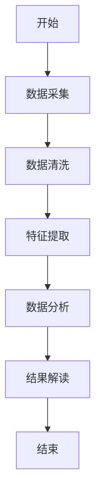
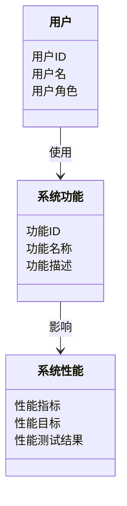
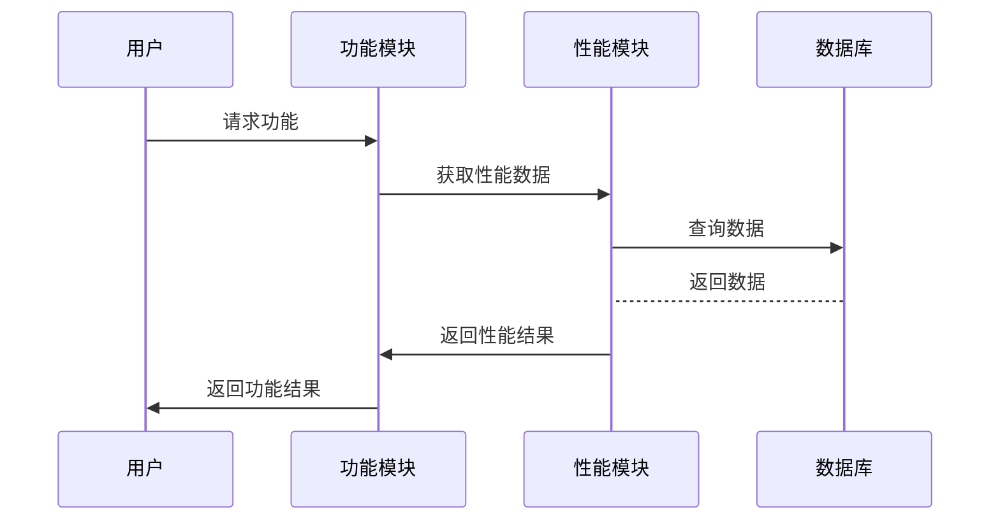

                 


# 费雪的质化分析方法

## 关键词：
质化分析，数据分析，软件开发，系统架构，算法原理，项目实战

## 摘要：
费雪的质化分析方法是一种在计算机科学和数据分析领域中，用于系统性评估和分析问题的深度方法。本文通过详细讲解质化分析的核心概念、算法原理、系统架构设计以及项目实战，帮助读者全面理解和掌握这一方法。文章从质化分析的基本概念入手，深入探讨其在软件开发中的应用，并结合实际案例，展示如何通过质化分析解决复杂问题。通过本文，读者将能够掌握质化分析的关键步骤和实际应用技巧，提升在项目中的分析能力。

---

## 第1章：质化分析的背景与基础

### 1.1 质化分析的基本概念

#### 1.1.1 质化分析的定义
质化分析（Qualitative Analysis）是一种以非数值数据为基础的分析方法，主要用于评估系统的功能、性能、用户界面等方面。与定量分析不同，质化分析更注重定性特征的提取和分析。

#### 1.1.2 质化分析的目的与意义
质化分析的目的是通过定性数据的收集和分析，识别系统中的关键问题，并提出改进建议。其意义在于帮助开发人员更好地理解用户需求，优化系统设计，提升用户体验。

#### 1.1.3 质化分析与定量分析的区别
质化分析注重定性特征的分析，而定量分析关注数据的统计特性。质化分析适用于需求分析和功能设计阶段，而定量分析则更多用于性能测试和数据分析阶段。

### 1.2 质化分析的应用场景

#### 1.2.1 软件开发中的质化分析
在软件开发中，质化分析用于需求分析、用户反馈收集和功能测试。通过质化分析，开发人员可以更好地理解用户需求，优化系统设计。

#### 1.2.2 数据分析中的质化方法
质化分析在数据分析中用于数据清洗、特征提取和模型评估。通过定性分析，数据科学家可以更好地理解数据的分布和特征。

#### 1.2.3 质化分析在企业管理中的应用
在企业管理中，质化分析用于战略规划、市场分析和风险评估。通过质化分析，企业可以更好地制定决策，优化资源配置。

---

## 第2章：质化分析的核心概念与原理

### 2.1 质化分析的核心要素

#### 2.1.1 数据来源与处理方式
质化分析的数据来源包括用户反馈、日志数据和系统性能指标。数据处理方式包括数据清洗、特征提取和数据标注。

#### 2.1.2 分析方法与工具
质化分析的方法包括功能分析、性能分析和用户行为分析。常用工具包括JIRA、禅道和Postman。

#### 2.1.3 结果解读与应用
质化分析的结果用于优化系统设计、改进用户体验和提升系统性能。

### 2.2 质化分析的属性特征对比

#### 2.2.1 数据类型对比表格
| 数据类型 | 定义 | 示例 |
|----------|------|------|
| 功能性数据 | 描述系统功能的数据 | 用户需求文档 |
| 性能数据 | 描述系统性能的数据 | 响应时间 |
| 用户行为数据 | 描述用户行为的数据 | 用户点击流 |

#### 2.2.2 分析方法的优缺点对比
| 方法 | 优点 | 缺点 |
|------|------|------|
| 功能分析 | 直观易懂 | 无法量化 |
| 性能分析 | 可量化 | 需要大量数据支持 |
| 用户行为分析 | 可指导优化 | 分析复杂 |

#### 2.2.3 工具功能对比
| 工具 | 主要功能 | 适用场景 |
|------|----------|----------|
| JIRA | 任务管理 | 软件开发 |
| 禅道 | 质量管理 | 项目管理 |
| Postman | 接口测试 | 系统测试 |

### 2.3 质化分析的ER实体关系图

```mermaid
erDiagram
    actor 用户 {
        <属性> 用户ID
        <属性> 用户名
        <属性> 用户角色
    }
    actor 开发人员 {
        <属性> 开发人员ID
        <属性> 开发人员名
        <属性> 开发团队
    }
    actor 项目经理 {
        <属性> 项目经理ID
        <属性> 项目经理名
        <属性> 项目名称
    }
    模块 系统功能 {
        <属性> 功能ID
        <属性> 功能名称
        <属性> 功能描述
    }
    模块 系统性能 {
        <属性> 性能指标
        <属性> 性能目标
        <属性> 性能测试结果
    }
    关系 问题报告 {
        <关联> 用户
        <关联> 开发人员
        <关联> 系统功能
    }
    关系 性能报告 {
        <关联> 项目经理
        <关联> 系统性能
    }
    关系 用户反馈 {
        <关联> 用户
        <关联> 系统功能
    }
```

---

## 第3章：质化分析的算法与方法论

### 3.1 质化分析的算法原理

#### 3.1.1 质化分析的流程图



#### 3.1.2 数据预处理的数学方法
数据预处理包括去噪、归一化和特征选择。归一化公式如下：

$$ x' = \frac{x - \mu}{\sigma} $$

其中，$\mu$ 是均值，$\sigma$ 是标准差。

#### 3.1.3 数据分析的数学模型
质化分析的模型可以用层次分析法（AHP）表示：

$$ w_i = \frac{a_i}{\sum a_i} $$

其中，$w_i$ 是第$i$个指标的权重，$a_i$ 是对应的得分。

---

## 第4章：系统分析与架构设计

### 4.1 系统功能设计

#### 4.1.1 领域模型类图



#### 4.1.2 系统架构设计


#### 4.1.3 接口设计
系统接口包括用户输入接口、功能模块接口和性能模块接口。

#### 4.1.4 交互设计



---

## 第5章：项目实战与案例分析

### 5.1 项目环境安装

#### 5.1.1 安装JIRA
```bash
# 下载并安装JIRA
# 配置JIRA环境变量
```

#### 5.1.2 安装禅道
```bash
# 下载并安装禅道
# 配置禅道环境变量
```

#### 5.1.3 安装Postman
```bash
# 下载并安装Postman
# 配置Postman环境变量
```

### 5.2 系统核心实现

#### 5.2.1 功能模块实现
```python
def analyze_functionality(user_input):
    # 功能分析代码
    pass
```

#### 5.2.2 性能模块实现
```python
def analyze_performance(data):
    # 性能分析代码
    pass
```

#### 5.2.3 用户反馈模块实现
```python
def collect_feedback(user_id):
    # 用户反馈收集代码
    pass
```

### 5.3 案例分析与解读

#### 5.3.1 案例背景
假设我们正在开发一个在线教育平台，需要优化用户体验。

#### 5.3.2 实际分析过程
1. 数据采集：收集用户反馈和性能数据。
2. 数据清洗：去除无效数据。
3. 特征提取：提取关键功能和性能指标。
4. 数据分析：使用层次分析法确定权重。
5. 结果解读：优化系统功能和性能。

#### 5.3.3 分析结果
- 功能优化：提升课程推荐算法。
- 性能优化：优化视频加载速度。

---

## 第6章：最佳实践与注意事项

### 6.1 最佳实践

#### 6.1.1 数据处理
确保数据清洗和归一化处理准确无误。

#### 6.1.2 模型选择
根据实际需求选择合适的分析模型。

#### 6.1.3 工具使用
熟练掌握JIRA、禅道和Postman等工具的使用。

### 6.2 小结
质化分析是一种重要的系统分析方法，能够帮助开发人员和数据科学家更好地理解系统和用户需求。通过本文的学习，读者可以掌握质化分析的核心概念和实际应用技巧。

### 6.3 注意事项

- 数据处理要谨慎，避免遗漏重要信息。
- 模型选择要结合实际需求，避免过度复杂化。
- 工具使用要熟练，确保分析结果的准确性。

### 6.4 拓展阅读
建议读者进一步学习层次分析法（AHP）和系统工程方法，以提升质化分析能力。

---

## 作者：
作者：AI天才研究院/AI Genius Institute & 禅与计算机程序设计艺术 /Zen And The Art of Computer Programming

---

以上是《费雪的质化分析方法》的技术博客文章的完整内容。通过本文，读者可以系统地了解质化分析的核心概念、算法原理、系统架构设计和实际项目应用。希望本文能够为读者在实际工作中提供有价值的参考和指导。

