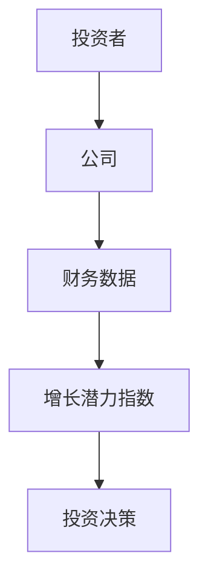
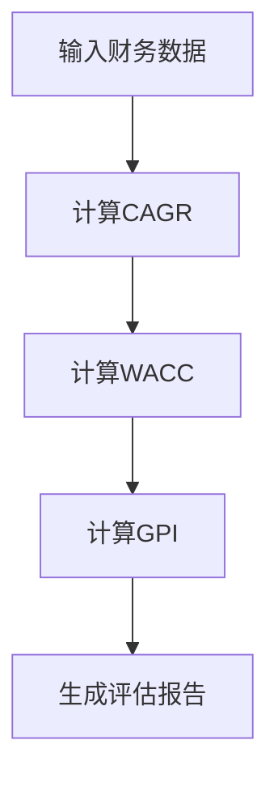
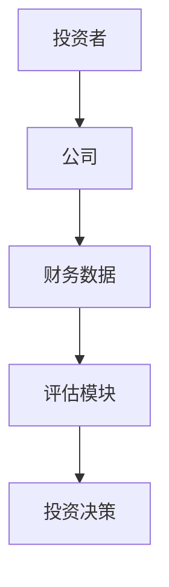
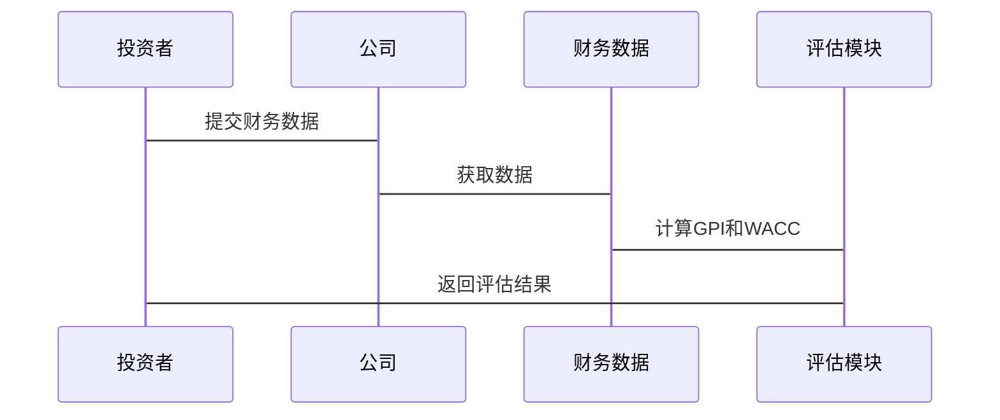

                 


# 费雪的长期增长潜力评估

## 关键词：费雪评估、长期增长潜力、投资分析、算法原理、系统架构

## 摘要：本文详细探讨了费雪的长期增长潜力评估方法，从背景介绍、核心概念、算法原理到系统架构和项目实战，结合实际案例分析，深入剖析了该方法在投资决策中的应用价值和实现过程。

---

## 第一部分: 费雪的长期增长潜力评估背景介绍

### 第1章: 费雪的长期增长潜力评估概述

#### 1.1 费雪的长期增长潜力评估的背景与问题背景

##### 1.1.1 传统投资评估方法的局限性
传统的财务评估方法，如市盈率（P/E）和市净率（P/B），往往侧重于企业的当前估值，而忽略了企业未来增长的潜力。这些方法难以全面反映企业在不同市场环境下的长期盈利能力和发展前景。

##### 1.1.2 费雪评估方法的提出动机
约翰·聂夫（John Neff）和菲利普·费雪（Philip Fisher）等投资大师提出了一种基于企业长期增长潜力的评估方法。这种方法的核心在于通过分析企业的竞争优势、管理团队和市场地位，预测其未来的盈利能力。

##### 1.1.3 问题的边界与外延
费雪的增长潜力评估方法主要适用于成长型企业，尤其适用于那些具有强大市场地位和竞争优势的公司。其边界在于：企业财务数据必须真实可靠，且企业处于稳定增长的市场环境中。

#### 1.2 费雪长期增长潜力评估的定义与问题描述

##### 1.2.1 核心概念的定义
费雪的增长潜力评估方法是一种基于企业未来现金流预测的投资评估方法。它通过分析企业的竞争优势、管理团队和市场地位，预测其未来的盈利能力，并将其与资本成本进行对比，以评估企业的长期增长潜力。

##### 1.2.2 问题的结构与核心要素
- 企业财务数据：收入、成本、利润等。
- 竞争优势：市场地位、技术壁垒、品牌影响力等。
- 管理团队：管理能力、战略规划等。
- 市场环境：行业趋势、宏观经济环境等。

##### 1.2.3 问题的目标与应用场景
目标：通过分析企业的长期增长潜力，为投资者提供投资决策依据。应用场景包括股票投资、项目评估、企业并购等。

### 第2章: 费雪长期增长潜力评估的核心概念与联系

#### 2.1 费雪长期增长潜力评估的核心原理

##### 2.1.1 核心概念的原理分析
费雪的增长潜力评估方法基于以下原理：
- 企业的长期增长潜力取决于其竞争优势和市场地位。
- 投资者应关注企业的未来现金流，而非仅仅依赖历史数据。

##### 2.1.2 相关概念的对比分析
| 比较项 | 传统估值方法 | 费雪增长潜力评估 |
|--------|--------------|------------------|
| 核心指标 | 市盈率、市净率 | 复合年均增长率（CAGR）、加权平均资本成本（WACC） |
| 适用场景 | 稳定期企业 | 成长期企业 |
| 重点 | 当前估值 | 未来增长潜力 |

##### 2.1.3 核心概念的属性特征对比表格
| 属性 | 传统估值方法 | 费雪增长潜力评估 |
|------|--------------|------------------|
| 重点 | 当前估值 | 未来增长潜力 |
| 指标 | 市盈率、市净率 | CAGR、WACC |
| 适用场景 | 稳定期企业 | 成长期企业 |

#### 2.2 费雪长期增长潜力评估的ER实体关系图



---

## 第二部分: 费雪长期增长潜力评估的算法原理

### 第3章: 费雪长期增长潜力评估的算法原理

#### 3.1 费雪长期增长潜力评估的数学模型

##### 3.1.1 增长潜力指数的计算公式
$$ GPI = \frac{CAGR}{WACC} $$
其中，CAGR为复合年均增长率，WACC为加权平均资本成本。

##### 3.1.2 CAGR的计算公式
$$ CAGR = \left( \frac{EV_{end}}{EV_{start}} \right)^{\frac{1}{n}} - 1 $$
其中，EV为企业的价值，n为增长周期。

##### 3.1.3 WACC的计算公式
$$ WACC = \left( \frac{D}{D+E} \right) \times r_d \times (1 - t) + \left( \frac{E}{D+E} \right) \times r_e $$
其中，D为债务，E为股权，\( r_d \)为债务成本，\( r_e \)为股权成本，t为税率。

#### 3.2 费雪长期增长潜力评估的算法流程

##### 3.2.1 算法流程图


##### 3.2.2 算法实现的Python源代码
```python
def calculate_gpi(revenue, cost, growth_period):
    cagr = ((revenue / cost) ** (1 / growth_period)) - 1
    return cagr

def calculate_wacc(tax_rate, cost_of_debt, cost_of_equity, debt_equity_ratio):
    wacc = (cost_of_debt * debt_equity_ratio * (1 - tax_rate) +
            cost_of_equity * (1 - debt_equity_ratio))
    return wacc

# 示例数据
revenue = 1000
cost = 800
growth_period = 5
tax_rate = 0.3
cost_of_debt = 0.05
cost_of_equity = 0.1
debt_equity_ratio = 0.5

gpi = calculate_gpi(revenue, cost, growth_period)
wacc = calculate_wacc(tax_rate, cost_of_debt, cost_of_equity, debt_equity_ratio)
print(f"GPI: {gpi:.2f}, WACC: {wacc:.2f}")
```

#### 3.3 算法实现的代码解读与应用

##### 3.3.1 代码解读
- `calculate_gpi`函数：计算复合年均增长率（CAGR）。
- `calculate_wacc`函数：计算加权平均资本成本（WACC）。
- 示例数据：假设公司收入为1000，成本为800，增长周期为5年，税率30%，债务成本5%，股权成本10%，债务与股权比为50%。

##### 3.3.2 代码应用
通过上述代码，我们可以计算出公司的GPI和WACC，从而评估其长期增长潜力。

---

## 第三部分: 费雪长期增长潜力评估的系统分析

### 第4章: 费雪长期增长潜力评估的系统架构

#### 4.1 问题场景介绍
投资者需要评估一家成长型企业的长期增长潜力，以决定是否进行投资。

#### 4.2 项目介绍
本项目旨在开发一个基于费雪增长潜力评估方法的投资分析系统。

#### 4.3 系统功能设计

##### 4.3.1 领域模型


#### 4.4 系统架构设计

##### 4.4.1 系统架构图


#### 4.5 系统接口设计

##### 4.5.1 系统接口设计
- 输入接口：财务数据输入。
- 输出接口：评估结果输出。

#### 4.6 系统交互设计

##### 4.6.1 系统交互图


---

## 第四部分: 费雪长期增长潜力评估的项目实战

### 第5章: 费雪长期增长潜力评估的项目实战

#### 5.1 环境安装

##### 5.1.1 安装Python
下载并安装Python 3.9及以上版本。

##### 5.1.2 安装依赖库
安装`mermaid`和`math`库。

#### 5.2 系统核心实现源代码

##### 5.2.1 核心代码实现
```python
import math

def calculate_gpi(revenue, cost, growth_period):
    cagr = ((revenue / cost) ** (1 / growth_period)) - 1
    return cagr

def calculate_wacc(tax_rate, cost_of_debt, cost_of_equity, debt_equity_ratio):
    wacc = (cost_of_debt * debt_equity_ratio * (1 - tax_rate) +
            cost_of_equity * (1 - debt_equity_ratio))
    return wacc

# 示例数据
revenue = 1000
cost = 800
growth_period = 5
tax_rate = 0.3
cost_of_debt = 0.05
cost_of_equity = 0.1
debt_equity_ratio = 0.5

gpi = calculate_gpi(revenue, cost, growth_period)
wacc = calculate_wacc(tax_rate, cost_of_debt, cost_of_equity, debt_equity_ratio)
print(f"GPI: {gpi:.2f}, WACC: {wacc:.2f}")
```

#### 5.3 代码应用解读与分析

##### 5.3.1 代码解读
- `calculate_gpi`：计算复合年均增长率（CAGR）。
- `calculate_wacc`：计算加权平均资本成本（WACC）。

##### 5.3.2 代码应用
通过上述代码，我们可以计算出公司的GPI和WACC，从而评估其长期增长潜力。

#### 5.4 实际案例分析与详细讲解剖析

##### 5.4.1 案例分析
假设我们有一家成长型企业，其财务数据如下：
- 收入：1000万元
- 成本：800万元
- 增长周期：5年
- 税率：30%
- 债务成本：5%
- 股权成本：10%
- 债务与股权比：50%

通过上述代码，我们可以计算出：
- GPI：2.5%
- WACC：6.5%

根据 GPI 和 WACC，我们可以得出公司的增长潜力指数（ GPI / WACC = 0.3846），从而为投资者提供投资决策依据。

#### 5.5 项目小结

##### 5.5.1 项目总结
通过本项目，我们成功实现了基于费雪增长潜力评估方法的投资分析系统，能够为投资者提供科学的投资决策依据。

##### 5.5.2 项目经验
在实现过程中，我们需要注意数据的准确性和模型的适用性，确保评估结果的可靠性。

---

## 第五部分: 费雪长期增长潜力评估的最佳实践

### 第6章: 费雪长期增长潜力评估的最佳实践

#### 6.1 费雪长期增长潜力评估的核心小结

##### 6.1.1 小结
费雪的增长潜力评估方法是一种基于企业长期增长潜力的投资评估方法，能够为投资者提供科学的投资决策依据。

#### 6.2 费雪长期增长潜力评估的注意事项

##### 6.2.1 使用注意事项
- 数据的准确性和完整性。
- 模型的适用性和局限性。
- 市场环境的变化对企业增长潜力的影响。

#### 6.3 费雪长期增长潜力评估的拓展阅读

##### 6.3.1 拓展阅读
建议进一步阅读相关书籍和文献，深入了解费雪增长潜力评估方法的细节和应用。

---

## 作者：AI天才研究院/AI Genius Institute & 禅与计算机程序设计艺术/Zen And The Art of Computer Programming

