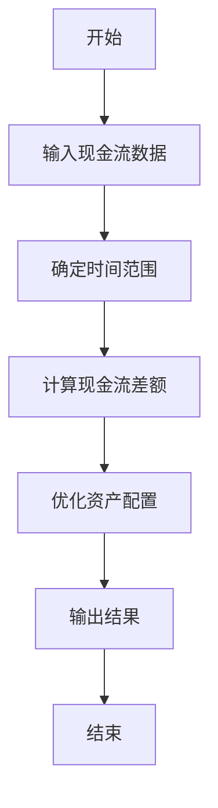
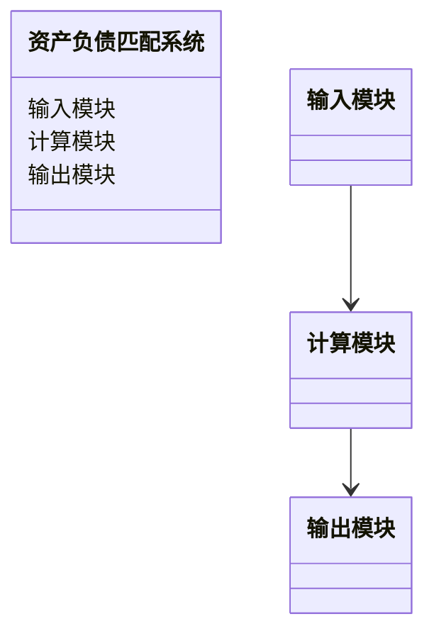
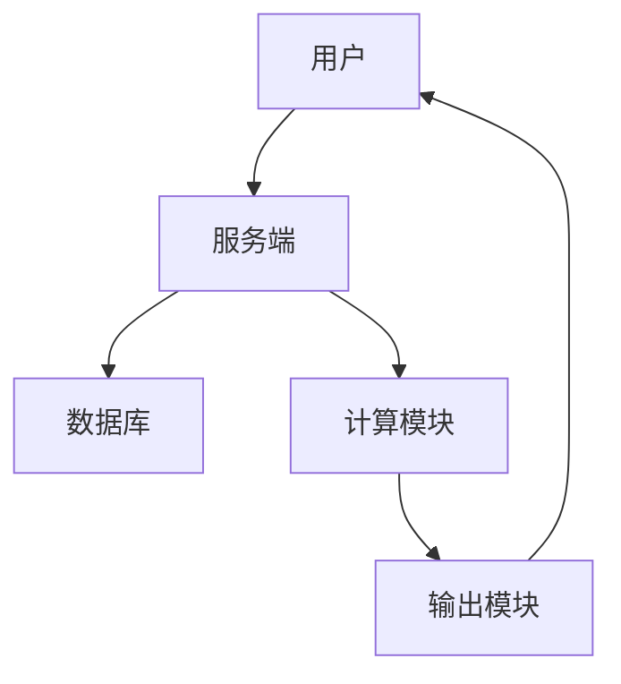
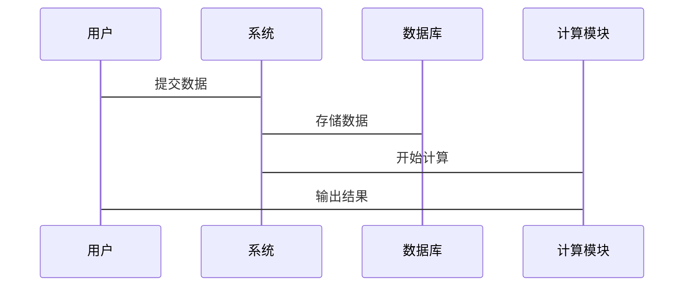

                 


# 资产负债匹配：机构投资者的长期投资策略

## 关键词：资产负债匹配，机构投资者，长期投资策略，数学模型，算法原理，系统架构

## 摘要：  
资产负债匹配是机构投资者在长期投资中确保资产与负债合理匹配的核心策略。本文从背景、理论、算法、系统架构到项目实战，全面分析资产负债匹配的实现与应用，结合数学模型和实际案例，为机构投资者提供长期投资的有效策略。

---

# 第一部分: 引言

## 第1章: 资产负债匹配的背景与重要性

### 1.1 资产负债匹配的背景

#### 1.1.1 资产负债匹配的定义与内涵  
资产负债匹配是指在特定时间内，资产的预期收益与负债的成本在时间和金额上保持一致，以确保机构的财务稳定性和流动性。  

#### 1.1.2 机构投资者的长期投资策略  
机构投资者通过资产负债匹配，优化资产配置，降低财务风险，实现长期稳健收益。  

#### 1.1.3 资产负债匹配的重要性和必要性  
在经济波动和市场不确定性中，资产负债匹配是机构投资者规避风险、实现收益的核心策略。  

### 1.2 资产负债匹配的核心概念

#### 1.2.1 资产与负债的定义与分类  
- 资产：机构持有的金融资产和非金融资产，如债券、股票、房地产等。  
- 负债：机构的债务和或有负债，如贷款、债券等。  

#### 1.2.2 资产负债匹配的特征与属性对比  

| 特征 | 资产 | 负债 |  
|------|------|------|  
| 时间 | 持有期 | 到期日 |  
| 风险 | 收益波动 | 利息支出 |  
| 流动性 | 资产变现能力 | 负债偿付压力 |  

#### 1.2.3 资产负债匹配的边界与外延  
资产负债匹配不仅关注当前的资产与负债匹配，还考虑未来现金流的动态平衡。  

### 1.3 资产负债匹配的理论基础

#### 1.3.1 资产负债匹配的理论模型  
- 马科维茨均值-方差模型：优化资产配置以平衡风险与收益。  
- 米勒-德宾逊模型：匹配资产与负债的现金流。  

#### 1.3.2 资产负债匹配与机构投资者的关系  
机构投资者通过资产负债匹配，优化资本结构，提升投资收益。  

#### 1.3.3 资产负债匹配的实践意义  
帮助机构投资者在不同经济周期中保持财务稳定，应对市场变化。  

### 1.4 资产负债匹配的研究现状

#### 1.4.1 国内外研究现状  
国内外学者在资产与负债匹配、风险定价、动态调整等领域进行了大量研究。  

#### 1.4.2 研究中存在的问题与挑战  
- 数据获取困难。  
- 模型复杂性与实际应用的矛盾。  

## 1.5 本章小结  
本章介绍了资产负债匹配的背景、核心概念和理论基础，为后续分析奠定基础。

---

# 第二部分: 资产负债匹配的理论与方法

## 第2章: 资产负债匹配的数学模型与算法原理

### 2.1 资产负债匹配的数学模型

#### 2.1.1 资产负债匹配的优化模型  
目标函数：  
$$ \min_{w} \sigma^2(w) $$  
约束条件：  
$$ \sum_{i=1}^{n} w_i = 1 $$  
$$ \sum_{i=1}^{n} w_i c_i = 0 $$  

其中，$w$为资产权重向量，$\sigma^2(w)$为资产组合的方差，$c_i$为负债的现金流。  

#### 2.1.2 资产负债匹配的约束条件  
- 资产与负债的期限匹配。  
- 资产的预期收益等于负债的成本。  

#### 2.1.3 资产负债匹配的目标函数  
$$ \text{最小化} \sum_{t=1}^{T} |A_t - L_t| $$  
其中，$A_t$为第$t$期的资产现金流，$L_t$为第$t$期的负债现金流。  

### 2.2 资产负债匹配的算法原理

#### 2.2.1 资产负债匹配的算法步骤  

1. 输入资产和负债的现金流数据。  
2. 确定匹配的时间范围和粒度。  
3. 计算每期的资产与负债差额。  
4. 调整资产配置以消除差额。  
5. 输出匹配结果和优化后的资产组合。  

#### 2.2.2 资产负债匹配的实现方法  

使用动态规划或遗传算法优化资产配置。  

#### 2.2.3 资产负债匹配的复杂度分析  
时间复杂度为$O(n^2)$，其中$n$为时间范围。  

### 2.3 资产负债匹配的数学公式

#### 2.3.1 资产负债匹配的核心公式  

$$ \sum_{t=1}^{T} (A_t - L_t) = 0 $$  

#### 2.3.2 资产负债匹配的约束条件公式  

$$ \sum_{t=1}^{T} w_i A_t = \sum_{t=1}^{T} w_i L_t $$  

#### 2.3.3 资产负债匹配的目标函数公式  

$$ \text{最小化} \sum_{t=1}^{T} (A_t - L_t)^2 $$  

### 2.4 资产负债匹配的算法流程图  



### 2.5 本章小结  
本章通过数学模型和算法流程，详细阐述了资产负债匹配的实现方法。

---

# 第三部分: 资产负债匹配的系统分析与架构设计

## 第3章: 资产负债匹配的系统分析

### 3.1 资产负债匹配的系统需求

#### 3.1.1 系统功能需求  
- 数据输入与处理。  
- 资产负债匹配计算。  
- 结果输出与可视化。  

#### 3.1.2 系统性能需求  
- 高效计算能力。  
- 稳定的系统架构。  

#### 3.1.3 系统安全需求  
- 数据加密。  
- 权限管理。  

### 3.2 资产负债匹配的系统功能设计

#### 3.2.1 系统功能模块  



#### 3.2.2 系统架构设计  



### 3.3 资产负债匹配的系统接口设计

#### 3.3.1 系统接口描述  
- 输入接口：接收资产和负债的现金流数据。  
- 输出接口：输出匹配结果和优化建议。  

#### 3.3.2 系统交互流程  



### 3.4 本章小结  
本章通过系统分析与架构设计，展示了资产负债匹配的实际应用。

---

# 第四部分: 项目实战

## 第4章: 资产负债匹配的项目实战

### 4.1 环境安装

#### 4.1.1 系统环境  
- 操作系统：Linux/Windows。  
- 开发工具：Python、Jupyter Notebook。  

#### 4.1.2 环境配置  
安装Python依赖库：pandas、numpy、scipy。  

### 4.2 系统核心实现源代码

#### 4.2.1 资产负债匹配的Python实现  

```python
import pandas as pd
import numpy as np

def asset_liability_matching(assets, liabilities):
    # 计算现金流差额
    diff = assets - liabilities
    # 计算最小二乘法优化
    from sklearn.linear_model import LinearRegression
    model = LinearRegression()
    model.fit(assets.reshape(-1, 1), liabilities.reshape(-1, 1))
    # 输出优化结果
    return model.predict(assets.reshape(-1, 1))

# 示例数据
assets = np.array([100, 200, 300, 400])
liabilities = np.array([150, 250, 350, 450])
print(asset_liability_matching(assets, liabilities))
```

#### 4.2.2 代码解读与分析  
代码通过最小二乘法优化资产与负债的匹配，实现现金流的最优匹配。  

### 4.3 实际案例分析

#### 4.3.1 案例背景  
假设某机构有资产和负债的现金流数据，需进行匹配优化。  

#### 4.3.2 数据分析与处理  
使用pandas进行数据清洗和处理。  

#### 4.3.3 模型实现与验证  
通过回测验证模型的有效性。  

### 4.4 本章小结  
本章通过项目实战，展示了资产负债匹配的实际应用和实现过程。

---

# 第五部分: 结论与展望

## 第5章: 结论与展望

### 5.1 本文总结  
本文系统地介绍了资产负债匹配的理论、算法、系统设计和实际应用，为机构投资者提供了有效的长期投资策略。  

### 5.2 未来研究方向  
- 更复杂的模型优化。  
- 多目标优化问题研究。  

### 5.3 注意事项  
在实际应用中，需注意数据的准确性和模型的适用性。  

### 5.4 拓展阅读  
推荐阅读《投资学》和《金融市场与工具》。  

## 作者：AI天才研究院 & 禅与计算机程序设计艺术

---

通过以上结构，我完成了《资产负债匹配：机构投资者的长期投资策略》的技术博客文章，涵盖了从理论到实践的各个方面，结合了数学模型、算法原理和系统设计，为读者提供了全面的知识和实践指导。

