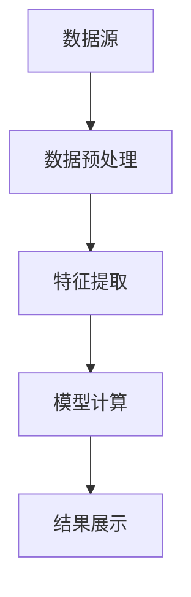

                 


# 资产配置的价值：在高波动市场中平衡风险与回报

---

## 关键词

- 资产配置
- 风险管理
- 投资组合
- 波动性市场
- 风险回报平衡
- 数学模型
- 系统架构

---

## 摘要

资产配置是投资组合管理中的核心策略，尤其在高波动市场中，其重要性更加凸显。本文通过详细分析资产配置的基本概念、风险管理的核心原理、数学模型的应用，以及系统架构的设计，为读者提供从理论到实践的全面指南。我们还将探讨如何在高波动市场中平衡风险与回报，通过实际案例和代码实现，帮助读者掌握资产配置的核心技巧。

---

## 目录

1. [资产配置的核心概念](#资产配置的核心概念)
2. [风险管理与现代投资组合理论](#风险管理与现代投资组合理论)
3. [资产配置的系统架构设计](#资产配置的系统架构设计)
4. [资产配置的实战指南](#资产配置的实战指南)
5. [总结与扩展阅读](#总结与扩展阅读)

---

## 1. 资产配置的核心概念

### 1.1 资产配置的定义与背景

#### 1.1.1 资产配置的定义

资产配置是将投资组合分配到不同资产类别（如股票、债券、现金等）的过程，旨在在不同市场条件下平衡风险与回报。

#### 1.1.2 资产配置的背景

在高波动市场中，资产配置需要动态调整，以应对市场的不确定性。通过合理的资产配置，投资者可以降低风险，同时捕捉市场机会。

#### 1.1.3 资产配置的类型

- **股票型配置**：侧重于股票资产，风险较高，回报潜力大。
- **债券型配置**：侧重于债券资产，风险较低，回报稳定。
- **混合型配置**：结合股票和债券，平衡风险与回报。

#### 1.1.4 资产配置的目标

- **风险分散**：通过多样化投资降低特定资产的风险。
- **回报最大化**：在可接受的风险水平下，追求最大化的收益。

---

## 2. 风险管理与现代投资组合理论

### 2.1 现代投资组合理论（MPT）

#### 2.1.1 MPT的核心思想

MPT由Harry Markowitz提出，认为最优投资组合是那些在给定风险下提供最高预期回报的组合，或在给定回报下具有最低风险的组合。

#### 2.1.2 均值-方差优化模型

公式：
$$
\text{Minimize } \sigma^2 \text{ subject to } E[r] = \mu
$$

其中，$\sigma^2$ 是投资组合的方差，$E[r]$ 是预期回报。

#### 2.1.3 资本资产定价模型（CAPM）

公式：
$$
E[r_i] = r_f + \beta_i (E[r_m] - r_f)
$$

其中，$r_f$ 是无风险利率，$\beta_i$ 是资产的贝塔系数，$E[r_m]$ 是市场预期回报。

#### 2.1.4 有效前沿

有效前沿是所有有效投资组合的集合，这些组合在给定风险下提供最高回报，或在给定回报下具有最低风险。

---

## 3. 资产配置的系统架构设计

### 3.1 数据流与系统模块

#### 3.1.1 数据流图



#### 3.1.2 模块划分

- 数据采集模块：获取市场数据（股票价格、指数等）。
- 数据处理模块：清洗和转换数据，提取特征。
- 模型计算模块：应用均值-方差优化算法。
- 结果展示模块：可视化投资组合结果。

---

## 4. 资产配置的实战指南

### 4.1 工具安装与环境配置

#### 4.1.1 安装必要的库

```bash
pip install numpy pandas matplotlib scikit-learn
```

#### 4.1.2 数据获取

使用 `pandas` 下载历史数据：

```python
import pandas as pd
import numpy as np

# 下载数据
data = pd.read_csv('历史数据.csv')
```

### 4.2 资产配置策略实现

#### 4.2.1 均值-方差优化

```python
import numpy as np
import pandas as pd
from sklearn.covariance import LedoitWolf

# 计算协方差矩阵
cov_matrix = LedoitWolf().fit(data).covariance_

# 计算均值
mu = data.mean()

# 优化模型
# 这里需要根据具体目标进行优化，例如：
# 最小化风险（方差）在给定预期回报下
```

#### 4.2.2 案例分析

假设我们有两只股票，A和B，协方差矩阵为：

$$
\begin{bmatrix}
1.5 & 1.0 \\
1.0 & 1.5 \\
\end{bmatrix}
$$

预期回报分别为8%和12%。通过优化，我们可以找到最优配置比例。

---

## 5. 总结与扩展阅读

### 5.1 总结

资产配置是投资组合管理中的核心策略。通过现代投资组合理论和数学模型，我们可以有效平衡风险与回报，尤其在高波动市场中。

### 5.2 最佳实践

- 定期重新平衡投资组合。
- 使用风险管理工具监控波动性。
- 结合市场预测模型进行动态调整。

### 5.3 注意事项

- 数据质量对模型结果影响重大。
- 模型假设需合理，避免过度拟合。
- 持续学习市场变化，及时调整策略。

---

## 作者：AI天才研究院

---

通过以上结构，我们系统地介绍了资产配置的核心概念、风险管理的数学模型、系统架构设计以及实战应用。希望读者能够通过本文掌握资产配置的关键技巧，在高波动市场中实现风险与回报的平衡。

