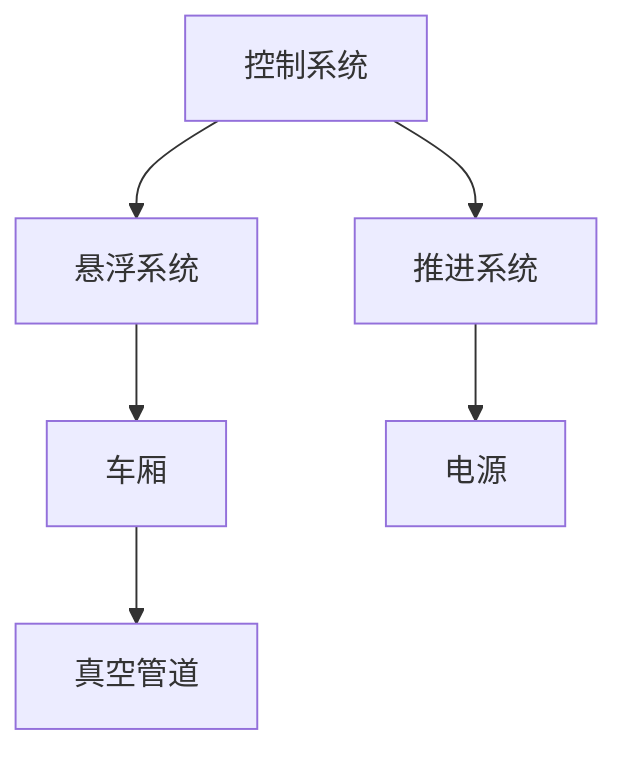
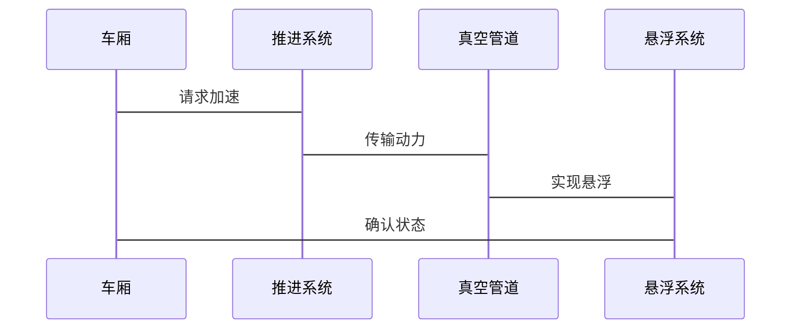

                 

# 超级高铁技术的发展与交通运输业投资机会

## 关键词：超级高铁，真空管道，悬浮系统，交通运输，投资机会，可持续发展

## 摘要：超级高铁作为一种革命性的交通技术，正在改变全球交通运输格局。本文深入分析超级高铁的核心技术、系统架构、经济效益及投资机会，并探讨其对交通运输业的深远影响。

---

## 第1章: 超级高铁技术的背景与概念

### 1.1 超级高铁的起源与发展

超级高铁（Hyperloop）的概念最初由埃隆·马斯克（Elon Musk）在2013年提出，旨在打造一种比飞机、火车、汽车更快、更便宜的交通方式。超级高铁的核心理念是通过真空管道和磁悬浮技术，实现接近音障的高速行驶。

#### 1.1.1 超级高铁的定义与核心理念
超级高铁是一种通过真空管道运行的磁悬浮交通系统，利用电力驱动车厢在管道中以接近500公里/小时的速度运行。其核心理念包括：
- **真空环境**：通过抽气技术减少空气阻力。
- **磁悬浮技术**：利用电磁力实现无轮运行。
- **高效能**：低能耗、低排放，适合长距离运输。

#### 1.1.2 超级高铁的历史发展与现状
超级高铁的概念源于19世纪末，但真正实现商业化运营的技术始于21世纪初。目前，全球多个国家和地区正在推进超级高铁项目，如美国的Hyperloop One、中国的真空管道试验段等。

#### 1.1.3 超级高铁与传统交通方式的对比
| 交通方式 | 速度（理论） | 成本 | 建设周期 | 环保性 |
|----------|--------------|------|----------|--------|
| 高铁     | 350公里/小时 | 高   | 长       | 较好    |
| 飞机     | 900公里/小时 | 高   | 极长      | 较好    |
| 超级高铁 | 500-1000公里/小时 | 中 | 中       | 优      |

### 1.2 超级高铁的技术优势

超级高铁的核心技术包括真空管道、悬浮系统和推进系统。这些技术的结合使得超级高铁在速度、能耗和环保方面具有显著优势。

---

## 第2章: 超级高铁的核心技术与系统架构

### 2.1 超级高铁的技术组成

超级高铁的技术系统包括以下几个关键部分：

#### 2.1.1 真空管道系统的构造与原理
- **构造**：真空管道由高强度铝合金或复合材料制成，内部真空度可达10^-5大气压。
- **原理**：通过抽气技术减少空气阻力，降低能耗。

#### 2.1.2 悬浮系统的类型与优劣
- **类型**：
  - 电磁悬浮（EMS）：利用电磁力产生推力。
  - 电动悬浮（EDS）：通过电动机驱动车厢。
- **优劣对比**：
| 悬浮类型 | 优点 | 缺点 |
|----------|------|------|
| EMS      | 高速、低能耗 | 技术复杂 |
| EDS      | 易于实现 | 速度受限 |

#### 2.1.3 推进系统的动力来源
- **动力来源**：超级高铁采用电力驱动，通过直线电机或电磁推进系统实现高速运行。

### 2.2 超级高铁的系统架构设计

超级高铁的系统架构设计是一个复杂的工程问题，涉及多个功能模块的协同工作。

#### 2.2.1 系统整体架构图（Mermaid）

#### 2.2.2 系统功能模块划分
- **控制模块**：负责整个系统的运行协调。
- **推进模块**：提供动力。
- **悬浮模块**：实现无轮运行。
- **真空管道**：减少空气阻力。

#### 2.2.3 系统接口设计与交互流程（Mermaid）

---

## 第3章: 超级高铁对交通运输业的颠覆性影响

### 3.1 传统交通方式的不足与痛点

#### 3.1.1 高铁与飞机的效率瓶颈
- 高铁的速度有限，无法满足长距离运输的需求。
- 飞机的能耗高，且受天气条件限制。

#### 3.1.2 城市交通拥堵问题
- 城市交通拥堵导致时间浪费和能源浪费。

#### 3.1.3 长途运输的成本与时间问题
- 长途运输成本高，时间长，影响物流效率。

### 3.2 超级高铁如何改变行业格局

#### 3.2.1 高速交通的网络化构建
- 超级高铁可以构建区域性的高速交通网络，提升运输效率。

#### 3.2.2 对城市交通模式的重构
- 超级高铁可以缓解城市交通压力，优化城市规划。

#### 3.2.3 对物流与供应链的影响
- 超级高铁可以降低物流成本，提升供应链效率。

---

## 第4章: 超级高铁的投资机会分析

### 4.1 产业链分析

超级高铁的产业链包括以下几个环节：
- **研发**：技术开发与创新。
- **制造**：车厢、真空管道等设备的生产。
- **建设**：真空管道、车站等基础设施的建设。
- **运营**：线路运营与维护。

#### 4.1.1 投资机会
- **研发阶段**：技术门槛高，投资风险大。
- **制造阶段**：市场需求大，投资回报高。
- **建设阶段**：资金需求大，周期长。
- **运营阶段**：稳定收益，风险较低。

### 4.2 区域经济与交通网络

#### 4.2.1 区域经济的影响
- 超级高铁可以促进区域经济发展，提升区域竞争力。

#### 4.2.2 交通网络的优化
- 超级高铁可以优化交通网络，提升运输效率。

### 4.3 政策与市场环境

#### 4.3.1 政策支持
- 各国政府对超级高铁技术的支持力度不同，影响投资决策。

#### 4.3.2 市场需求
- 随着城市化进程加快，超级高铁市场需求增长。

---

## 第5章: 国际视野与技术对比

### 5.1 美国与中国的超级高铁发展

#### 5.1.1 美国的Hyperloop One
- 技术特点：真空管道+电磁悬浮。
- 商业化进展：已建成试验线路。

#### 5.1.2 中国的真空管道试验段
- 技术特点：真空管道+电动悬浮。
- 商业化进展：正在规划试验线路。

### 5.2 技术路线对比

| 技术指标 | 美国Hyperloop One | 中国真空管道试验段 |
|----------|------------------|---------------------|
| 悬浮技术 | EMS              | EDS                 |
| 真空度   | 10^-5大气压      | 10^-5大气压         |
| 速度     | 500公里/小时     | 500公里/小时        |

---

## 第6章: 超级高铁的未来展望与挑战

### 6.1 未来技术突破

#### 6.1.1 新材料的应用
- 高强度轻质材料，如碳纤维复合材料。

#### 6.1.2 人工智能的融入
- 智能控制系统，提升运行效率。

### 6.2 商业化进程

#### 6.2.1 技术成熟度
- 目前仍处于试验阶段，商业化还需时间。

#### 6.2.2 市场接受度
- 公众对新技术的接受度影响商业化进程。

### 6.3 可持续发展

#### 6.3.1 环保性
- 超级高铁能耗低，排放少，符合绿色交通理念。

#### 6.3.2 经济性
- 高速交通网络的建设和运营成本需进一步优化。

---

## 结语

超级高铁作为一种革命性的交通技术，正在改变全球交通运输格局。其核心技术包括真空管道、悬浮系统和推进系统，具有高速、低能耗和环保等显著优势。超级高铁的商业化将对交通运输业产生深远影响，同时也带来了巨大的投资机会。然而，超级高铁的发展仍面临技术、成本和政策等多方面的挑战。

---

## 作者：AI天才研究院（AI Genius Institute） & 禅与计算机程序设计艺术（Zen And The Art of Computer Programming）

--- 

以上是文章的详细目录大纲，您可以根据实际需求进一步扩展每个章节的具体内容，添加更多的技术细节、案例分析和投资策略。

