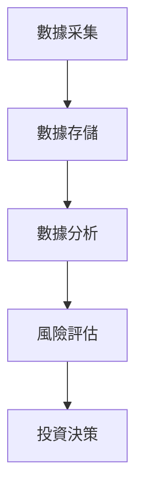

                 

# 跨境投資：機會與挑戰並存

---

## 關鍵詞：
跨境投資、全球化、金融市場、風險管理、投資策略、資產組合、數學模型

---

## 來源：
作者：AI天才研究院/AI Genius Institute & 禪與計算機程序設計藝術 /Zen And The Art of Computer Programming

---

## 摘要：
跨境投資是指在不同國家或地區之間進行的資產買賣行為，旨在通過多元化配置和風險管理實現投資收益的最大化。本文將從跨境投資的基本概念、機會與挑戰入手，探討其背后的全球化背景、核心原理和實踐策略。通過數學模型、算法原理和實際案例的分析，幫助讀者更好地理解跨境投資的複雜性和潛力，並提供實用的投資建議。

---

---

# 第一部分：跨境投資的背景與核心概念

---

## 第1章：跨境投資的定義與歷史淵源

### 1.1 跨境投資的定義

跨境投資是指將資金投向不同國家或地區的金融市場，以實現資產多元化和收益最大化的投資行為。它涉及跨國家的貨幣兌換、市場分析和風險評估等多個環節。

#### 1.1.1 跨境投資的基本概念

跨境投資的核心在于突破地域限制，將資金配置到不同國家的股票、債券、外匯等金融資產中。這種投資方式強調全球化視野，通過分散投資來降低風險。

#### 1.1.2 跨境投資的歷史發展

跨境投資的歷史可以追溯到20世紀初，但真正大規模發展是在20世紀80年代後期，隨著金融自由化和技術進步，跨境投資逐漸成為全球金融市場的主流趨勢。

#### 1.1.3 跨境投資的現狀與未來趨勢

當前，跨境投資在ETF（交易所交易基金）、主題基金等金融產品的推動下快速發展。未來，隨著人工智能和大數據技術的進步，跨境投資將更加智能化和個性化。

---

### 1.2 跨境投資的核心要素

跨境投資的核心要素包括資金流動、經濟體互動和政治法律環境等。這些要素相互影響，共同構成跨境投資的複雜生態。

#### 1.2.1 資金流動

資金流動是跨境投資的核心驅動力。資金從收益率低的國家流向收益率高的國家，推動了國際金融市場的價格發現和資源配置。

#### 1.2.2 經濟體之間的互動

不同國家的經濟政策、貿易往來和資金流動相互影響，形成了錯综複雜的經濟互動網絡。這對跨境投資的決策具有重要影響。

#### 1.2.3 政治與法律環境的影響

政治風險、法律政策和稅務差異是影響跨境投資的重要因素。投資者需要密切關注這些因素的變化，以避免風險。

---

## 第2章：跨境投資的機會與挑戰

### 2.1 跨境投資的機會

#### 2.1.1 經濟全球化帶來的機會

全球化使得跨境投資成為可能，不同國家的市場機會可以被整合到投資組合中，實現多元化配置。

#### 2.1.2 新興市場的投資潛力

新興市場的快速增長為跨境投資提供了豐厚的回報機會，但也伴隨著更高的風險。

#### 2.1.3 多元化投資組合的優勢

通過配置不同國家的資產，投資者可以有效降低系統性風險，提高整體投資收益。

---

### 2.2 跨境投資的挑戰

#### 2.2.1 經濟不確定性

全球經濟的不穩定性，如地緣政治風險、經濟衰退等，對跨境投資造成重大影響。

#### 2.2.2 政治風險

政治變動、政策變化和國際關係的不穩定性，是跨境投資的主要風險來源。

#### 2.2.3 稅務與法律障礙

不同國家的稅法差異和法律政策 complexity，增加了跨境投資的複雜性。

---

---

# 第二部分：跨境投資的核心概念與原理

---

## 第3章：跨境投資的全球化背景

### 3.1 全球化與金融自由化

全球化推動了金融市場的自由化，使跨境投資成為可能。金融自由化使得資金可以更自由地流動，提升了市場效率。

#### 3.1.1 全球化對跨境投資的影響

全球化降低了信息 asymmetry，提高了市場透明度，為跨境投資提供了良好的基礎。

#### 3.1.2 金融自由化與市場開放

金融自由化使得各國金融市場更加開放，跨境投資的通道更加暢通。

---

### 3.2 現代金融市場的結構

現代金融市場是一個錯綜複雜的網絡，不同市場之間相互影響，形成了複雜的市場結構。

#### 3.2.1 主要國際金融市場介紹

美元、歐元、日元等主要貨幣的市場交易情況，及其對跨境投資的影響。

#### 3.2.2 經濟體之間的相互依存性

各國經濟之間的高度依存性，使得跨境投資成為必然選擇。

---

## 第4章：跨境投資的核心原理

### 4.1 資產組合管理理論

資產組合管理理論是跨境投資的核心理論之一，強調通過多元化配置來降低風險。

#### 4.1.1 現金流分析

通過分析不同國家的經濟數據，評估投資的風險和收益。

#### 4.1.2 資產配置模型

通過數學模型確定各國資產的配置比例，實現風險與收益的最佳平衡。

#### 4.1.3 風險分散化原理

通過配置不同國家的資產，降低整體投資風險。

---

### 4.2 資本流動與匯率理論

資本流動和匯率變化是影響跨境投資的重要因素。

#### 4.2.1 汇率的決定因素

經濟基本面、利率水平、市場心理等因素共同決定匯率變化。

#### 4.2.2 資本流動的動力與影響

資金流動的動力來源於收益率差異和避險需求，其影響包括市場價格和匯率變化。

#### 4.2.3 汇率波動對投資者的影响

汇率波動對跨境投資的收益有重要影響，投資者需要密切關注匯率變化。

---

## 第5章：跨境投資的風險管理

### 5.1 系統性風險與非系統性風險

風險管理是跨境投資的關鍵，需要區分系統性風險和非系統性風險。

#### 5.1.1 系統性風險的來源

系統性風險來源於全球性事件，如經濟衰退和地緣政治風險。

#### 5.1.2 非系統性風險的來源

非系統性風險來源於個別國家或市場的特殊事件，如政策變化和市場崩盤。

#### 5.1.3 風險評估方法

通過數學模型評估風險，為投資決策提供支持。

---

### 5.2 風險管理工具與策略

有效的風險管理工具和策略是實現穩定收益的關鍵。

#### 5.2.1 多元化投資策略

通過配置不同國家的資產，降低整體風險。

#### 5.2.2 金融衍生工具的應用

使用期貨、期权等衍生工具進行風險對沖。

#### 5.2.3 風險控制的具體措施

設置止损線、監控市場趨勢、定期評估投資組合。

---

---

# 第三部分：跨境投資的數學模型與算法

---

## 第6章：跨境投資的數學模型

### 6.1 資產組合風險收益模型

#### 6.1.1 風險收益模型的數學表達

$$E(r_p) = \sum w_i E(r_i)$$

$$\sigma_p^2 = \sum w_i^2 \sigma_i^2 + 2 \sum w_i w_j \sigma_{ij}$$

其中，\(w_i\) 是資產 \(i\) 的配置比例，\(E(r_i)\) 是期望收益率，\(\sigma_i\) 是風險，\(\sigma_{ij}\) 是資產 \(i\) 和 \(j\) 的協方差。

#### 6.1.2 案例分析

假設投資者配置三種國家的股票，それぞれ的期望收益率和風險已知，計算最優配置比例。

---

### 6.2 汇率與資本流動模型

#### 6.2.1 汇率模型的數學表達

$$S_{t+1} = \alpha + \beta S_t + \epsilon_t$$

其中，\(S_t\) 是當前匯率，\(\alpha\) 是截距，\(\beta\) 是自相關係數，\(\epsilon_t\) 是擾動項。

#### 6.2.2 資本流動模型的數學表達

$$I_t = \gamma r_t + \delta (Y_t - P_t)$$

其中，\(I_t\) 是國際資本流動，\(r_t\) 是利率，\(Y_t\) 是收入，\(P_t\) 是價格水平。

---

## 第7章：跨境投資的算法實現

### 7.1 管理層面的算法

#### 7.1.1 额外層面算法

使用動態規劃算法進行資產配置。

#### 7.1.2 最大化客戶價值算法

使用最優控制理論進行風險管理。

---

---

# 第四部分：跨境投資的系統架構與項目實戰

---

## 第8章：跨境投資分析系統的架構設計

### 8.1 系統功能設計

#### 8.1.1 系統功能模塊

1. 数据采集模塊：實時采集各國金融市場數據。
2. 数据分析模塊：進行市場分析和風險評估。
3. 風險評估模塊：計算投資風險並提出對策。
4. 投資決策模塊：根據分析結果制定投資策略。

#### 8.1.2 系統架構圖

---

## 第9章：跨境投資項目的實戰

### 9.1 環境安裝與配置

#### 9.1.1 環境安裝

安裝Python、Pandas、NumPy等庫，搭建數據分析環境。

#### 9.1.2 系統核心實現

編寫數據采集、分析和風險評估的Python代碼。

---

### 9.2 核心實現

#### 9.2.1 数据采集

使用API獲取各國金融市場數據。

#### 9.2.2 数据分析

通過數學模型計算投資風險和收益。

---

### 9.3 案例分析

#### 9.3.1 投資策略實現

根據模型分析結果，制定具體的投資策略。

---

---

## 第五部分：跨境投資的最佳實踐與總結

---

## 第10章：最佳實踐與總結

### 10.1 最佳實踴

1. 分散投資，降低風險。
2. 關注政策變化，提前佈署。
3. 持續學習，更新投資理念。

---

### 10.2 總結

跨境投資是一種複雜但潛力巨大的投資行為，投資者需要結合全球化背景、數學模型和實戰經驗，做出明智的投資決策。

---

## 注意事项：

跨境投資涉及風險，投資者需根據自身風險承受能力進行合理配置。

---

## 拓展閱讀：

1. 《金融市場與機構投資》
2. 《國際金融學》
3. 《數據驅動的投資決策》

