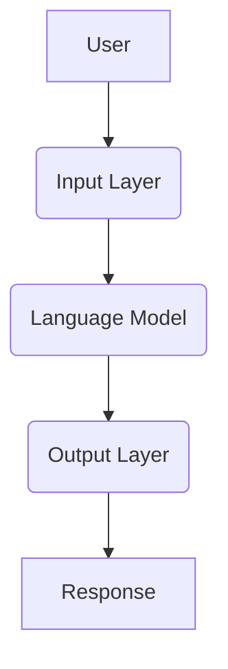

                 


# 跨语言AI Agent开发：挑战与解决方案

## 关键词：跨语言AI Agent, 多语言模型, 跨语言理解, AI系统架构, 机器学习算法, 自然语言处理, 跨语言迁移学习

## 摘要：  
本文系统地探讨了跨语言AI Agent开发的核心挑战与解决方案。从背景与概念出发，分析了多语言模型构建、跨语言理解机制、系统架构设计等关键问题，结合具体算法实现和项目实战，深入剖析了跨语言AI Agent的开发过程，并提出了实际应用中的最佳实践建议。本文旨在为开发者提供一份全面的技术指南，帮助他们更好地理解和实现跨语言AI Agent。

---

## 第一部分：跨语言AI Agent开发背景与挑战

### 第1章：跨语言AI Agent的背景介绍

#### 1.1 AI Agent的基本概念与作用
- **AI Agent**：智能体（Agent）是指能够感知环境并采取行动以实现目标的实体。AI Agent结合了人工智能技术，能够执行复杂任务，如自然语言理解、决策制定和自主学习。
- **作用**：AI Agent广泛应用于聊天机器人、推荐系统、智能客服等领域，能够提高用户体验和效率。

#### 1.2 跨语言处理的重要性
- **多语言支持**：在全球化的背景下，支持多种语言的AI Agent能够满足不同地区用户的需求，提升产品的市场竞争力。
- **跨语言理解**：实现跨语言理解意味着AI Agent能够处理多种语言的输入，并生成相应语言的输出，这需要自然语言处理技术的支持。

#### 1.3 当前AI Agent的发展现状
- **技术进步**：基于深度学习的模型（如BERT、GPT）为AI Agent的开发提供了强大的语言理解能力。
- **挑战与不足**：跨语言支持的模型性能通常不如单语言模型，且开发复杂度较高。

---

### 第2章：跨语言AI Agent的核心问题

#### 2.1 多语言模型的构建挑战
- **数据多样性**：跨语言模型需要处理多种语言的数据，数据量和质量直接影响模型的性能。
- **模型通用性**：如何设计通用的模型架构以支持多种语言，是跨语言AI Agent开发的关键问题。

#### 2.2 跨语言理解机制
- **跨语言迁移学习**：通过将一种语言的特征迁移到另一种语言，减少多语言数据的需求。
- **多语言模型训练**：使用多语言语料库进行模型训练，提升模型在多种语言上的表现。

---

## 第二部分：跨语言AI Agent的核心概念与技术

### 第3章：跨语言AI Agent的核心原理

#### 3.1 多语言模型的构建
- **多语言模型**：如XLM-R、Marian等模型，能够在多种语言之间共享参数，提升跨语言处理能力。
- **对比分析**：通过表格对比单语言模型和多语言模型的优缺点，帮助读者理解选择合适的模型。

| 模型类型   | 优势                               | 劣势                               |
|------------|------------------------------------|------------------------------------|
| 单语言模型 | 高性能，针对特定语言优化           | 不适用于多语言场景                 |
| 多语言模型 | 支持多种语言，参数共享，节省资源 | 性能可能略逊于单语言模型           |

#### 3.2 跨语言理解机制
- **跨语言迁移学习**：通过在资源丰富的语言上预训练模型，然后迁移到资源不足的语言。
- **跨语言词嵌入**：利用词嵌入技术，将不同语言的词汇映射到同一语义空间。

#### 3.3 跨语言AI Agent的架构
- **ER实体关系图**：展示跨语言AI Agent的核心组件及其关系。



---

## 第三部分：跨语言AI Agent的算法原理与实现

### 第4章：多语言模型与算法

#### 4.1 多语言模型的训练方法
- **多语言预训练**：使用多语言语料库进行预训练，如Facebook的XLM-R模型。
- **对比学习**：在不同语言之间进行对比学习，增强模型的跨语言理解能力。

#### 4.2 跨语言迁移学习算法
- **算法流程**：
  1. 预训练单语言模型。
  2. 迁移学习到目标语言。
  3. 微调模型以适应目标任务。

#### 4.3 数学模型与公式
- **语言模型的概率分布**：
  $$ P(w_i | w_{i-1}, ..., w_1) $$
- **跨语言迁移学习的损失函数**：
  $$ L = \sum_{i=1}^{N} (y_i - \hat{y}_i)^2 $$

---

### 第5章：跨语言AI Agent的系统架构设计

#### 5.1 问题场景介绍
- **应用场景**：如多语言客服系统，需要支持中文、英文等多种语言的交互。

#### 5.2 系统功能设计
- **领域模型设计**：
  ```mermaid
  classDiagram
  class Agent {
    - id: int
    - language: String
    - status: String
  }
  class User {
    - id: int
    - name: String
    - language: String
  }
  Agent --> User: handles
  ```

#### 5.3 系统架构设计
- **分层架构**：
  ```mermaid
  architecture
  Client --> API Gateway
  API Gateway --> Service Layer
  Service Layer --> Database Layer
  ```

#### 5.4 系统接口设计
- **RESTful API**：
  - POST /agent/input
  - GET /agent/status

#### 5.5 系统交互流程
- **序列图**：
  ```mermaid
  sequenceDiagram
  User ->> Agent: 发送查询请求
  Agent ->> NLP Engine: 解析请求
  NLP Engine ->> Database: 获取数据
  Database --> NLP Engine: 返回结果
  NLP Engine ->> Agent: 处理结果
  Agent ->> User: 返回响应
  ```

---

## 第四部分：跨语言AI Agent的项目实战

### 第6章：环境安装与核心代码实现

#### 6.1 环境安装
- **Python环境**：使用虚拟环境管理依赖。
  ```bash
  pip install transformers
  pip install torch
  pip install mermaid
  ```

#### 6.2 核心代码实现
- **多语言文本分类代码**：
  ```python
  from transformers import AutoTokenizer, AutoModelForSequenceClassification
  model_name = "facebook/xlm-r"
  tokenizer = AutoTokenizer.from_pretrained(model_name)
  model = AutoModelForSequenceClassification.from_pretrained(model_name)
  inputs = tokenizer("This is a test", return_tensors="pt")
  outputs = model(**inputs)
  prediction = outputs.logits.argmax().item()
  print(f"Prediction: {prediction}")
  ```

#### 6.3 代码解读与分析
- **输入处理**：将输入文本编码为张量。
- **模型推理**：使用预训练模型进行分类预测。
- **结果输出**：打印预测结果。

#### 6.4 实际案例分析
- **案例背景**：一个支持多语言的客服系统。
- **挑战分析**：处理多种语言的文本分类和实体识别。
- **解决方案**：采用多语言模型并进行微调，提升分类准确率。

---

### 第7章：数学模型与公式

#### 7.1 语言模型的概率分布
- **公式**：
  $$ P(w_i | w_{i-1}, ..., w_1) = \frac{P(w_i, w_{i-1}, ..., w_1)}{P(w_{i-1}, ..., w_1)} $$
- **解释**：计算当前词在给定上下文中的概率。

#### 7.2 跨语言迁移学习的数学表达
- **公式**：
  $$ L = \sum_{i=1}^{N} (y_i - f(x_i))^2 $$
  $$ f(x_i) \text{ 是目标语言的特征表示} $$
- **解释**：通过最小化损失函数，优化模型在目标语言上的表现。

---

## 第五部分：最佳实践与总结

### 第8章：最佳实践与小结

#### 8.1 开发建议
- **选择合适的模型**：根据任务需求选择单语言或多语言模型。
- **数据预处理**：确保多语言数据的质量和多样性。
- **模型微调**：针对特定任务对多语言模型进行微调，提升性能。

#### 8.2 注意事项
- **性能优化**：多语言模型通常比单语言模型复杂，需优化计算资源。
- **用户体验**：确保多语言交互的流畅性和准确性。

#### 8.3 未来展望
- **更强大的多语言模型**：如基于更大参数的模型，提升跨语言理解能力。
- **领域特定应用**：开发适用于特定领域的多语言AI Agent，提高实用性。

---

## 作者：AI天才研究院/AI Genius Institute & 禅与计算机程序设计艺术/Zen And The Art of Computer Programming

---

这篇文章系统地探讨了跨语言AI Agent开发的各个方面，从背景与挑战到算法实现，再到系统架构和项目实战，为开发者提供了全面的技术指导。通过详细的技术分析和实际案例，帮助读者更好地理解和应用跨语言AI Agent技术。

