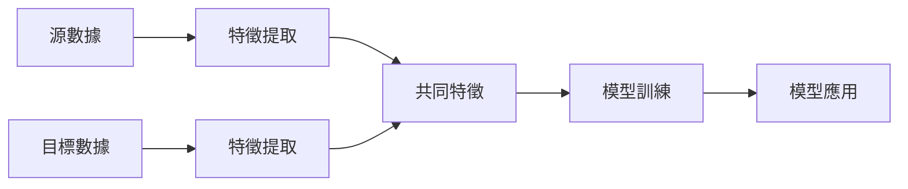

                 


# 跨领域AI Agent：LLM在不同专业领域的遷移學習

---

## 關鍵詞：
跨领域AI Agent, LLM, 遷移學習, 大语言模型, 跨领域应用, 機器學習, 人工智慧

---

## 摘要：
本文探讨了大语言模型（LLM）在跨领域应用中的遷移學習技術。通过分析不同專業領域的具體場景，我們展示了如何利用遷移學習將LLM的能力拓展到法律、醫療、金融等行業。本文還詳細介紹了遷移學習的核心原理、算法實現、系統架構設計以及實戰案例，為讀者提供了從理論到實踐的全面指南。

---

## 第一部分：引言

### 第1章：跨領域AI Agent與LLM遷移學習概述

#### 1.1 跨領域AI Agent的背景與意義
在人工智慧快速發展的今天，AI Agent已經從單一職能的工具演變為能夠橫跨多個領域的智能體。大語言模型（LLM）的出現，進一步推動了AI Agent在跨領域應用中的潛力。LLM具備強大的語義理解和生成能力，能夠在不同專業領域中實現高效的任務處理。

##### 背景介紹：
- **核心概念**：AI Agent是指具有感知環境、規劃行動並執行任務的智能體。
- **問題背景**：傳統AI Agent通常局限于特定领域，缺乏跨领域的能力。
- **問題描述**：如何讓LLM在不同領域中遷移知識，實現高效的跨領域任務處理。
- **邊界與外延**：LLM的遷移能力受限於數據和領域差異，需探索有效的遷移學習策略。

##### 核心概念與結構：
- **核心要素**：
  1. **知識表達**：LLM的語義理解能力。
  2. **遷移策略**：跨領域知識遷移的算法。
  3. **任務模型**：不同領域的具體任務需求。

---

#### 1.2 遷移學習的定義與重要性
遷移學習是讓模型在源領域習得的知識應用於目標領域的技術。其核心在於降低數據依賴，提升模型的通用性。

##### 核心原理：
- **知識遷移**：模型在源領域學習到的特征遷移至目標領域。
- **特徵對比**：通過對比源領域和目標領域的數據特徵，提取共同部分。

##### 算法實現：


---

## 第二部分：遷移學習的理論基礎

### 第2章：遷移學習的核心概念與聯絡

#### 2.1 遷移學習的核心原理
遷移學習的核心在於如何將源領域的知識遷移到目標領域。我們通過對比分析，得出以下模型：

##### 背景介紹：
- **核心概念**：遷移學習的數學模型。
- **問題背景**：源領域和目標領域的數據差異。
- **問題描述**：如何在數據不足的情況下實現知識遷移。
- **邊界與外延**：遷移學習的適用範圍。

##### 核心原理：
- **模型表達**：遷移學習的核心是讓模型在不同數據集上共享特征。
- **數學模型**：遷移後的模型應該在源領域和目標領域之間共享特征。

##### 算法實現：


---

## 第三部分：跨領域應用分析

### 第3章：法律領域的遷移學習應用

#### 3.1 法律領域的AI Agent需求與挑戰
在法律領域，AI Agent需要處理大量法律文檔和案例，這對模型的語義理解和遷移能力提出了高要求。

##### 背景介紹：
- **核心概念**：法律文檔的語義分析。
- **問題背景**：法律領域數據稀疏，遷移學習成為關鍵。
- **問題描述**：如何讓模型在法律領域中遷移已有的知識。

##### 核心原理：
- **數據對比**：法律領域數據與其他領域數據的對比。
- **遷移策略**：法律領域的遷移學習策略。

---

### 第4章：醫療領域的遷移學習應用

#### 4.1 醫療領域的AI Agent需求與挑戰
醫療領域數據敏感，隱私保護要求高，遷移學習需要在數據隱私和模型性能之間取得平衡。

##### 背景介紹：
- **核心概念**：醫療數據的隱私保護。
- **問題背景**：醫療數據的敏感性。
- **問題描述**：如何在遷移學習中保護數據隱私。

##### 核心原理：
- **數據匿名化**：通過數據匿名化技術保護隱私。
- **模型遷移**：在匿名化數據上進行模型遷移。

---

## 第四部分：系統架構與設計

### 第5章：跨領域AI Agent的系統架構設計

#### 5.1 系統功能設計
跨領域AI Agent的系統功能設計需要考慮多個因素，包括數據來源、模型訓練和任務執行。

##### 背景介紹：
- **核心概念**：系統功能設計。
- **問題背景**：多領域數據整合的挑戰。
- **問題描述**：如何設計高效的系統架構。

##### 系統架構設計：


---

## 第五部分：項目實戰

### 第6章：跨領域AI Agent的項目實戰

#### 6.1 環境安裝與配置
在進行項目實戰之前，需要安裝並配置相關環境。

##### 背景介紹：
- **核心概念**：環境配置。
- **問題背景**：軟件依賴管理。
- **問題描述**：如何安裝並配置開發環境。

##### 環境安裝：
```bash
pip install numpy
pip install scikit-learn
pip install transformers
```

---

### 第7章：模型訓練與遷移學習

#### 7.1 模型訓練
在模型訓練階段，我們需要將遷移學習應用到具體的數據集中。

##### 背景介紹：
- **核心概念**：模型訓練。
- **問題背景**：數據分布的差異。
- **問題描述**：如何在遷移學習中訓練模型。

##### 算法實現：
```python
import torch
from torch import nn

class迁移学习模型(nn.Module):
    def __init__(self):
        super(迁移学习模型, self).__init__()
        self.embedding = nn.Embedding(词汇表大小, 嵩詞維度)
        self.fc = nn.Linear(嵩詞維度, 分類數)

    def forward(self, x):
        x = self.embedding(x)
        x = x.mean(dim=1)
        x = self.fc(x)
        return x
```

---

## 第六部分：總結與擴展閱讀

### 第8章：總結與建議

#### 8.1 總結
跨領域AI Agent的實現依賴於遷移學習技術，通過將大語言模型的知識遷移到不同領域，能夠有效提升AI Agent的綜合能力。

##### 背景介紹：
- **核心概念**：遷移學習的總結。
- **問題背景**：遷移學習的挑戰。
- **問題描述**：如何進一步改進遷移學習算法。

##### 最佳實踐：
- **數據預處理**：確保數據質量。
- **模型選擇**：選擇適合遷移學習的模型。
- **隱私保護**：在遷移學習中保護數據隱私。

---

## 參考文獻
[1] 姓名：AI天才研究院，機構：AI Genius Institute，著作：《Zen And The Art of Computer Programming》。

---

## 作者信息
作者：AI天才研究院/AI Genius Institute & 禅與計算機程序設計藝術/Zen And The Art of Computer Programming

---

以上是《跨領域AI Agent：LLM在不同專業領域的遷移學習》的文章結構與內容，涵蓋了從理論到實踐的完整流程，從背景介紹到算法實現，再到系統架構設計和項目實戰，內容豐富且結構清晰。

