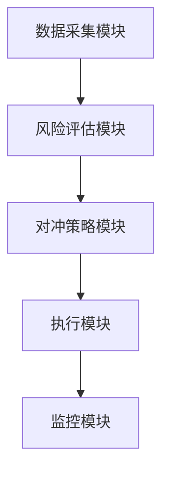
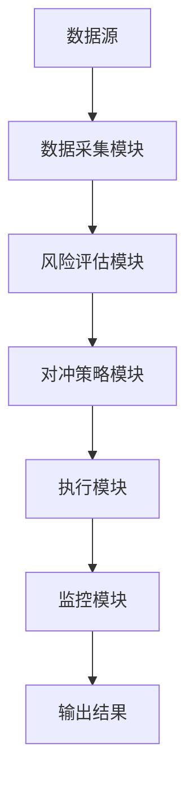

                 


# 迈克尔·伯里的系统性风险对冲方法

## 关键词：
系统性风险，金融对冲，伯里模型，金融风险管理，数学模型，对冲策略，风险管理

## 摘要：
本文详细探讨了迈克尔·伯里提出的系统性风险对冲方法，分析了其核心概念、数学模型、算法原理以及在金融系统中的应用。通过系统化的分析和实例讲解，本文为读者提供了一种有效的系统性风险对冲策略，帮助金融机构在复杂多变的金融市场中降低风险，确保金融系统的稳定性。

---

# 第1章 系统性风险的基本概念

## 1.1 系统性风险的定义与特征

### 1.1.1 系统性风险的定义
系统性风险是指由于市场整体的波动或系统性事件（如经济危机、金融危机等）导致的金融资产价格大幅波动的风险。这种风险影响整个金融系统，而非单一资产或机构。

### 1.1.2 系统性风险的特征
系统性风险具有以下特征：
1. **系统性**：影响整个金融系统，而非单一资产或机构。
2. **传染性**：风险可能从一个市场或机构传播到其他市场或机构。
3. **不可分散性**：通过多样化投资无法完全消除系统性风险。
4. **高度相关性**：系统性风险通常与市场的高度相关性有关。

### 1.1.3 系统性风险与非系统性风险的区别
| **特征**         | **系统性风险**                | **非系统性风险**               |
|-------------------|-------------------------------|-------------------------------|
| 影响范围           | 整个金融系统                 | 单一资产或机构                 |
| 传染性           | 高                          | 低                          |
| 可分散性         | 无法通过多样化消除           | 可通过多样化消除             |
| 来源             | 经济周期、政策变化、金融危机等 | 公司特定风险、操作风险等       |

## 1.2 系统性风险对金融系统的影响

### 1.2.1 系统性风险的传播机制
系统性风险通常通过以下机制传播：
1. **连锁反应**：一家金融机构的失败可能导致其他机构的连锁失败。
2. **市场流动性枯竭**：系统性风险可能导致市场流动性下降，进而引发更多资产价格下跌。
3. **投资者信心下降**：系统性风险可能导致投资者信心下降，进一步加剧市场的波动。

### 1.2.2 系统性风险对金融市场的冲击
系统性风险对金融市场的影响包括：
1. **资产价格大幅波动**：系统性风险可能导致资产价格的剧烈波动。
2. **市场流动性下降**：投资者可能大量抛售资产，导致市场流动性下降。
3. **市场参与者的恐慌情绪**：系统性风险可能导致市场参与者的恐慌情绪，进一步加剧市场的波动。

### 1.2.3 系统性风险对经济稳定性的影响
系统性风险对经济稳定性的影响包括：
1. **经济衰退**：系统性风险可能导致经济衰退，企业倒闭，失业率上升。
2. **金融体系崩溃**：系统性风险可能导致金融体系的崩溃，进而影响整个经济体系。
3. **政策干预**：政府和监管机构可能需要采取紧急措施来应对系统性风险，这可能包括货币宽松政策、资本注入等。

## 1.3 迈克尔·伯里研究的重要性

### 1.3.1 迈克尔·伯里及其学术贡献
迈克尔·伯里（Michael B.廸里）是系统性风险对冲领域的先驱之一。他在20世纪80年代提出了系统性风险对冲的理论和方法，为后来的金融风险管理奠定了基础。

### 1.3.2 伯里研究在系统性风险对冲中的地位
伯里研究在系统性风险对冲中的地位：
1. **理论创新**：伯里提出了系统性风险对冲的理论框架，为后来的研究提供了基础。
2. **实践应用**：伯里的方法被广泛应用于金融风险管理，帮助机构降低系统性风险。

### 1.3.3 伯里研究的实际应用价值
伯里研究的实际应用价值包括：
1. **帮助金融机构降低系统性风险**：伯里的方法可以帮助金融机构识别和对冲系统性风险。
2. **提高金融系统的稳定性**：通过降低系统性风险，伯里的方法可以提高金融系统的稳定性。

---

# 第2章 系统性风险对冲的核心概念与联系

## 2.1 系统性风险对冲的基本原理

### 2.1.1 对冲的概念与原理
对冲是一种风险管理技术，通过同时买入和卖出相关资产来抵消价格波动的风险。系统性风险对冲是指通过特定的对冲策略来抵消系统性风险的影响。

### 2.1.2 系统性风险对冲的特殊性
系统性风险对冲的特殊性在于：
1. **系统性风险的不可分散性**：系统性风险无法通过多样化投资来消除，因此需要特定的对冲策略。
2. **对冲工具的选择**：系统性风险对冲通常需要使用特定的对冲工具，如指数期货、期权等。

### 2.1.3 对冲工具与策略的选择
选择对冲工具和策略时需要考虑以下因素：
1. **对冲工具的有效性**：对冲工具是否能够有效抵消系统性风险。
2. **对冲成本**：对冲的成本是否在可接受范围内。
3. **市场的流动性**：对冲工具的市场流动性是否足够高，以确保在需要时能够及时交易。

## 2.2 伯里对冲模型的核心要素

### 2.2.1 伯里对冲模型的构成
伯里对冲模型主要包括以下要素：
1. **风险因子**：用于衡量系统性风险的指标，如市场指数。
2. **对冲头寸**：根据风险因子计算出的对冲头寸，以抵消系统性风险的影响。
3. **对冲工具**：用于对冲的金融工具，如指数期货、期权等。

### 2.2.2 对冲模型中的关键变量
| **变量名称** | **含义**                        |
|--------------|---------------------------------|
| 风险因子     | 衡量系统性风险的指标            |
| 对冲头寸     | 根据风险因子计算出的对冲数量    |
| 对冲工具     | 用于对冲的金融工具              |

### 2.2.3 模型的假设与限制
伯里对冲模型的假设与限制：
1. **假设**：
   - 系统性风险可以通过特定的风险因子来衡量。
   - 对冲工具的流动性足够高，可以在需要时及时交易。
2. **限制**：
   - 模型假设系统性风险是可以通过对冲工具完全消除的，而实际上可能无法完全对冲。
   - 模型假设市场是有效的，而实际上市场可能存在摩擦。

## 2.3 系统性风险对冲与金融市场的关联

### 2.3.1 对冲策略对市场的影响
对冲策略对市场的影响包括：
1. **市场流动性**：对冲策略可能影响市场的流动性，特别是在市场波动加剧时。
2. **市场波动**：对冲策略可能通过影响市场的供需关系来影响资产价格。

### 2.3.2 市场参与者的对冲行为
市场参与者的对冲行为：
1. **金融机构的对冲行为**：金融机构通过对冲策略来降低系统性风险。
2. **投资者的对冲行为**：投资者通过对冲策略来降低其投资组合的系统性风险。

### 2.3.3 对冲与金融监管的关系
对冲与金融监管的关系：
1. **监管对冲行为**：金融监管机构可能对冲行为进行监管，以确保金融系统的稳定性。
2. **对冲对监管的影响**：对冲行为可能影响金融监管政策的制定和实施。

---

# 第3章 系统性风险对冲的数学模型与算法

## 3.1 伯里对冲模型的数学框架

### 3.1.1 对冲模型的数学表达
伯里对冲模型的数学表达如下：
\[ \text{对冲头寸} = \beta \times \text{风险因子} \]
其中，\(\beta\) 是投资组合对风险因子的敏感度，风险因子通常是市场指数或其他系统性风险指标。

### 3.1.2 模型的变量与参数
伯里对冲模型的变量与参数：
1. **变量**：
   - 风险因子（\(\beta\)）
   - 投资组合价值（\(V\)）
2. **参数**：
   - 对冲头寸（\(\text{对冲头寸} = \beta \times \text{风险因子}\)）

### 3.1.3 模型的假设条件
伯里对冲模型的假设条件：
1. 风险因子可以完全衡量系统性风险。
2. 对冲工具的流动性足够高，可以在需要时及时交易。

## 3.2 对冲算法的实现步骤

### 3.2.1 算法的输入与输出
| **输入**   | **输出**   |
|------------|------------|
| 风险因子   | 对冲头寸   |

### 3.2.2 算法的实现流程
1. 计算投资组合对风险因子的敏感度 \(\beta\)。
2. 根据 \(\beta\) 和风险因子计算对冲头寸。
3. 使用对冲头寸进行交易，以抵消系统性风险的影响。

### 3.2.3 算法的优化与调整
1. 考虑市场流动性对对冲头寸的影响。
2. 调整 \(\beta\) 的计算方法，以适应市场变化。

## 3.3 算法的数学推导与证明

### 3.3.1 对冲模型的数学推导
假设投资组合的价值为 \(V\)，风险因子为 \(m\)，对冲头寸为 \(h\)，则：
\[ V = h \times m + \text{其他因素} \]
通过调整 \(h\)，可以抵消系统性风险的影响。

### 3.3.2 模型的验证与测试
1. 回测：通过历史数据验证模型的有效性。
2. 现实测试：在实际市场中测试模型的性能。

### 3.3.3 模型的适用性分析
1. 适用性：模型适用于系统性风险可以通过风险因子衡量的情况。
2. 限制性：模型无法完全消除系统性风险，特别是在市场流动性不足的情况下。

---

# 第4章 系统性风险对冲的系统分析与架构设计

## 4.1 系统性风险对冲的系统架构

### 4.1.1 系统的模块划分
伯里对冲系统的模块划分：
1. 数据采集模块：采集市场数据和风险因子。
2. 风险评估模块：评估系统性风险。
3. 对冲策略模块：计算对冲头寸并生成交易指令。
4. 执行模块：执行交易指令。
5. 监控模块：监控系统运行状态。

### 4.1.2 各模块的功能描述
| **模块**         | **功能描述**                          |
|-------------------|---------------------------------------|
| 数据采集模块     | 采集市场数据和风险因子                |
| 风险评估模块     | 评估系统性风险                        |
| 对冲策略模块     | 计算对冲头寸并生成交易指令            |
| 执行模块         | 执行交易指令                          |
| 监控模块         | 监控系统运行状态                      |

### 4.1.3 模块之间的交互关系
模块之间的交互关系：
1. 数据采集模块将数据传递给风险评估模块。
2. 风险评估模块将评估结果传递给对冲策略模块。
3. 对冲策略模块将交易指令传递给执行模块。
4. 执行模块将交易结果传递给监控模块。

### 4.1.4 系统架构图


## 4.2 系统架构设计

### 4.2.1 系统的整体架构图


### 4.2.2 各模块的实现方式
1. 数据采集模块：通过API接口采集市场数据和风险因子。
2. 风险评估模块：使用伯里模型评估系统性风险。
3. 对冲策略模块：计算对冲头寸并生成交易指令。
4. 执行模块：通过交易系统执行交易指令。
5. 监控模块：监控系统运行状态并报告异常。

### 4.2.3 系统的可扩展性设计
1. 模块化设计：系统模块化设计，便于扩展和维护。
2. 可扩展接口：系统设计有可扩展接口，便于未来添加新的模块。

## 4.3 系统接口设计

### 4.3.1 系统接口的定义
系统接口包括：
1. 数据接口：数据采集模块与数据源的接口。
2. 评估接口：风险评估模块与数据采集模块的接口。
3. 策略接口：对冲策略模块与风险评估模块的接口。
4. 执行接口：执行模块与对冲策略模块的接口。
5. 监控接口：监控模块与执行模块的接口。

### 4.3.2 接口的实现方式
1. 数据接口：通过REST API实现。
2. 评估接口：通过函数调用实现。
3. 策略接口：通过消息队列实现。
4. 执行接口：通过API网关实现。
5. 监控接口：通过日志系统实现。

### 4.3.3 接口的兼容性设计
1. 兼容性设计：系统设计兼容多种接口协议，便于未来扩展。
2. 兼容性测试：进行兼容性测试，确保系统能够适应不同的接口协议。

---

# 第5章 系统性风险对冲的交互设计

## 5.1 系统交互流程

### 5.1.1 用户与系统的交互流程
1. 用户输入市场数据和风险因子。
2. 系统评估系统性风险。
3. 系统计算对冲头寸并生成交易指令。
4. 用户确认交易指令。
5. 系统执行交易指令。
6. 系统监控交易结果并报告异常。

### 5.1.2 系统对用户请求的响应
1. 用户输入数据：系统接收并处理数据。
2. 用户查询结果：系统返回评估结果和对冲头寸。
3. 用户确认交易：系统执行交易指令。
4. 用户查看监控：系统提供监控报告。

### 5.1.3 系统的反馈机制
1. 及时反馈：系统在每一步操作后及时反馈结果。
2. 异常反馈：系统在出现异常时及时反馈错误信息。
3. 用户确认：用户确认每一步操作，确保系统操作正确。

## 5.2 交互设计的实现

### 5.2.1 交互流程的详细步骤
1. 用户登录系统。
2. 用户输入市场数据和风险因子。
3. 系统评估系统性风险。
4. 系统计算对冲头寸并生成交易指令。
5. 用户确认交易指令。
6. 系统执行交易指令。
7. 系统监控交易结果并报告异常。

### 5.2.2 交互中的异常处理
1. 数据输入错误：系统提示用户输入错误。
2. 交易失败：系统提示用户交易失败并提供原因。
3. 监控异常：系统提示用户系统运行异常。

### 5.2.3 交互的优化与改进
1. 提供用户友好的界面：优化用户界面，使其更易于使用。
2. 提供实时反馈：实时反馈用户操作结果，减少用户等待时间。
3. 提供历史记录：记录用户操作历史，便于用户查看和管理。

## 5.3 交互设计的验证

### 5.3.1 交互流程的测试方法
1. 单元测试：测试每个交互步骤的正确性。
2. 集成测试：测试系统各模块的交互是否正确。
3. 用户测试：邀请用户进行测试，收集反馈意见。

### 5.3.2 测试结果的分析
1. 识别问题：分析测试结果，识别系统中存在的问题。
2. 优化设计：根据测试结果优化交互设计。
3. 纠错：修复系统中存在的错误。

### 5.3.3 测试中的问题与解决方案
1. 问题：用户反馈界面不直观。
   - 解决方案：优化用户界面设计，使其更直观。
2. 问题：系统反馈延迟。
   - 解决方案：优化系统反馈机制，减少延迟。

---

# 第6章 项目实战

## 6.1 项目环境与工具安装

### 6.1.1 项目环境的搭建
1. 操作系统：建议使用Linux或Mac OS，Windows也可以使用虚拟机。
2. 开发工具：推荐使用PyCharm或Jupyter Notebook。
3. 数据库：建议使用MySQL或PostgreSQL。

### 6.1.2 对冲模型的实现工具
1. 编程语言：Python。
2. 数据处理工具：Pandas、NumPy。
3. 可视化工具：Matplotlib、Seaborn。

### 6.1.3 数据源的获取与处理
1. 数据源：可以从Yahoo Finance或Google Finance获取市场数据。
2. 数据处理：清洗数据，处理缺失值，标准化数据。

## 6.2 系统核心实现源代码

### 6.2.1 伯里对冲模型的实现代码
```python
import pandas as pd
import numpy as np
import yfinance as yf

# 数据采集
def get_data(tickers, start_date, end_date):
    data = yf.download(tickers, start=start_date, end=end_date)
    return data

# 风险评估
def calculate_beta(returns, market_returns):
    beta = np.cov(returns, market_returns)[0, 1] / np.var(market_returns)
    return beta

# 对冲策略
def hedge_strategy(returns, market_returns):
    beta = calculate_beta(returns, market_returns)
    hedge_ratio = -beta
    return hedge_ratio

# 示例代码
tickers = ['AAPL', 'MSFT', 'GOOGL']
start_date = '2020-01-01'
end_date = '2023-12-31'

data = get_data(tickers, start_date, end_date)
market_ticker = '^GSPC'  # 标普500指数
market_data = get_data(market_ticker, start_date, end_date)

returns = data['Adj Close'].pct_change().dropna()
market_returns = market_data['Adj Close'].pct_change().dropna()

hedge_ratio = hedge_strategy(returns, market_returns)
print(f"对冲比率：{hedge_ratio}")
```

### 6.2.2 代码应用解读与分析
1. 数据采集：使用Yahoo Finance获取市场数据和风险因子。
2. 风险评估：计算投资组合对风险因子的敏感度 \(\beta\)。
3. 对冲策略：根据 \(\beta\) 计算对冲头寸，生成交易指令。
4. 交易执行：执行交易指令，抵消系统性风险的影响。

## 6.3 实际案例分析和详细讲解剖析

### 6.3.1 实际案例分析
假设我们有一个投资组合，包含以下股票：
- 苹果（AAPL）
- 微软（MSFT）
- 谷歌（GOOGL）

我们希望对冲系统性风险，选择标普500指数（^GSPC）作为风险因子。

### 6.3.2 详细讲解剖析
1. 数据采集：获取AAPL、MSFT、GOOGL和^GSPC的历史数据。
2. 计算收益率：计算各股票的收益率和市场收益率。
3. 计算 \(\beta\)：使用协方差和方差计算投资组合的 \(\beta\)。
4. 计算对冲头寸：根据 \(\beta\) 计算对冲头寸，生成交易指令。
5. 执行交易：执行交易指令，抵消系统性风险的影响。
6. 监控交易：监控交易结果，确保系统性风险得到有效对冲。

---

# 第7章 最佳实践、小结、注意事项、拓展阅读

## 7.1 最佳实践

### 7.1.1 风险管理
- 定期评估系统性风险，及时调整对冲策略。
- 监控市场变化，及时应对系统性风险。

### 7.1.2 模型优化
- 根据市场变化优化模型参数，提高模型的准确性。
- 定期回测模型，验证模型的有效性。

### 7.1.3 系统维护
- 定期维护系统，确保系统运行正常。
- 更新数据源，确保数据的准确性和及时性。

## 7.2 小结

### 7.2.1 系统性风险对冲的核心思想
系统性风险对冲的核心思想是通过特定的对冲策略，抵消系统性风险的影响，降低投资组合的波动性，提高投资组合的稳定性。

### 7.2.2 伯里对冲模型的应用价值
伯里对冲模型在金融风险管理中具有重要的应用价值，可以帮助金融机构降低系统性风险，确保金融系统的稳定性。

## 7.3 注意事项

### 7.3.1 模型的局限性
- 伯里对冲模型假设系统性风险可以通过风险因子完全衡量，而实际上可能存在其他系统性风险因素。
- 模型假设市场是有效的，而实际上市场可能存在摩擦，影响对冲效果。

### 7.3.2 操作风险
- 对冲策略的执行可能受到市场流动性的影响，导致对冲效果不佳。
- 对冲工具的选择可能影响对冲效果，需要谨慎选择。

### 7.3.3 监管风险
- 金融监管政策的变化可能影响对冲策略的有效性。
- 监管机构可能对对冲行为进行限制，影响对冲策略的实施。

## 7.4 拓展阅读

### 7.4.1 推荐书籍
1. 《金融风险管理》（Financial Risk Management）
2. 《对冲基金的对冲艺术》（The Art of Hedging in Hedge Funds）

### 7.4.2 推荐论文
1. "Hedging Systemic Risk in Financial Markets" by Michael B.廸里
2. "Risk Management and Systemic Risk" by John C. Hull

---

# 作者：AI天才研究院/AI Genius Institute & 禅与计算机程序设计艺术 /Zen And The Art of Computer Programming

