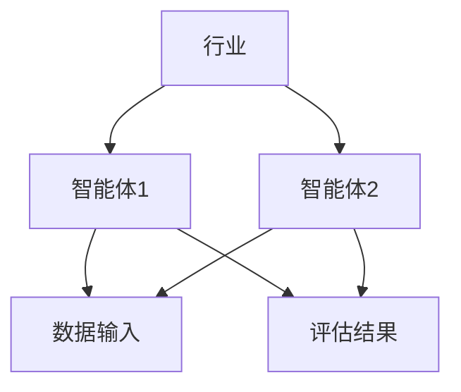
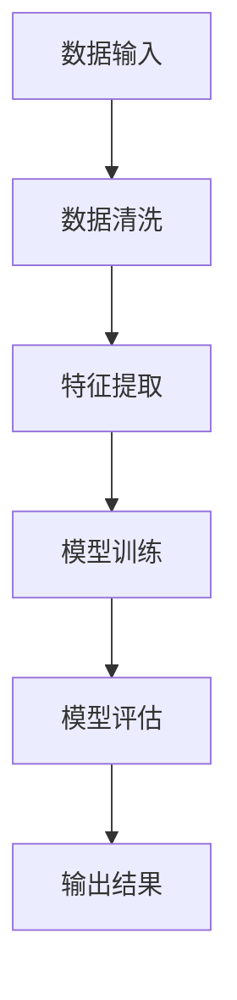
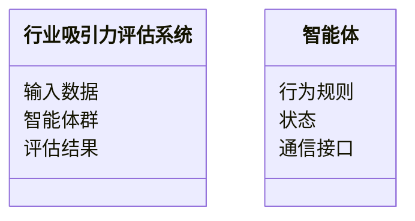
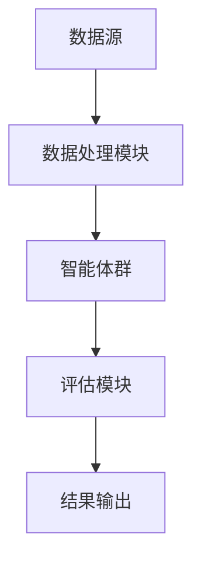
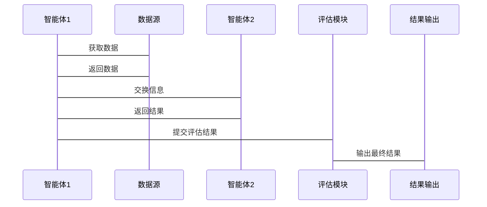

                 


# 运用AI智能体群体实现动态行业吸引力评估

> 关键词：AI智能体、行业吸引力、动态评估、群体智能、协同优化

> 摘要：本文详细探讨了如何利用AI智能体群体进行动态行业吸引力评估。通过分析行业吸引力的核心要素，设计并实现了基于AI智能体的动态评估模型，展示了其在实际应用中的价值。

---

## 目录

### 第1章: 背景与核心概念

#### 1.1 动态行业吸引力评估的背景与问题描述

- 1.1.1 行业吸引力评估的传统方法
- 1.1.2 传统方法的局限性
- 1.1.3 动态评估的必要性

#### 1.2 问题描述

- 1.2.1 行业吸引力的定义
- 1.2.2 动态评估的核心目标
- 1.2.3 评估的边界与外延

#### 1.3 问题解决思路

- 1.3.1 AI智能体群体的优势
- 1.3.2 动态评估的实现路径
- 1.3.3 解决方案的可行性分析

### 第2章: AI智能体群体的核心概念与联系

#### 2.1 核心概念

- 2.1.1 AI智能体的定义
- 2.1.2 群体智能的特征
- 2.1.3 智能体之间的协同机制

#### 2.2 核心概念对比

- 2.2.1 AI智能体与传统算法的对比
- 2.2.2 群体智能与单体智能的对比
- 2.2.3 动态评估与静态评估的对比

#### 2.3 实体关系图



### 第3章: 动态行业吸引力评估的算法原理

#### 3.1 算法概述

- 3.1.1 算法的目标
- 3.1.2 算法的基本流程
- 3.1.3 算法的核心思想

#### 3.2 算法实现步骤

- 3.2.1 数据预处理
- 3.2.2 特征提取
- 3.2.3 模型训练
- 3.2.4 模型评估

#### 3.3 算法流程图



### 第4章: 数学模型与公式

#### 4.1 数学模型概述

- 4.1.1 模型的输入变量
- 4.1.2 模型的输出变量
- 4.1.3 模型的假设条件

#### 4.2 核心公式

- 4.2.1 行业吸引力指数公式

$$ 吸引力指数 = \sum_{i=1}^{n} w_i x_i $$

其中，$w_i$ 是第i个特征的权重，$x_i$ 是第i个特征的值。

- 4.2.2 智能体协同

### 第5章: 系统分析与架构设计

#### 5.1 问题场景介绍

- 5.1.1 问题场景描述
- 5.1.2 系统目标
- 5.1.3 系统约束条件

#### 5.2 系统功能设计

- 5.2.1 领域模型



#### 5.3 系统架构设计



#### 5.4 系统接口设计

- 5.4.1 接口定义
- 5.4.2 接口实现
- 5.4.3 接口调用流程

#### 5.5 系统交互



### 第6章: 项目实战

#### 6.1 环境安装

- 6.1.1 系统要求
- 6.1.2 安装步骤
- 6.1.3 配置环境

#### 6.2 核心代码实现

- 6.2.1 数据预处理代码

```python
import pandas as pd

def preprocess_data(data):
    # 数据清洗和特征提取
    data = data.dropna()
    data = pd.get_dummies(data)
    return data
```

- 6.2.2 模型训练代码

```python
from sklearn.linear_model import LinearRegression

model = LinearRegression()
model.fit(X_train, y_train)
```

- 6.2.3 评估模块代码

```python
def evaluate_model(model, X_test, y_test):
    score = model.score(X_test, y_test)
    return score
```

#### 6.3 代码解读与分析

- 6.3.1 数据预处理模块
- 6.3.2 模型训练模块
- 6.3.3 评估模块

#### 6.4 实际案例分析

- 6.4.1 案例背景
- 6.4.2 数据准备
- 6.4.3 模型训练
- 6.4.4 结果分析

### 第7章: 最佳实践与小结

#### 7.1 经验总结

- 7.1.1 关键点总结
- 7.1.2 常见问题及解决方案
- 7.1.3 性能优化技巧

#### 7.2 小结

- 7.2.1 核心成果回顾
- 7.2.2 应用价值总结
- 7.2.3 未来展望

#### 7.3 注意事项

- 7.3.1 数据质量的重要性
- 7.3.2 模型调优的注意事项
- 7.3.3 系统维护建议

#### 7.4 拓展阅读

- 7.4.1 相关技术领域
- 7.4.2 进一步研究方向
- 7.4.3 推荐阅读资料

---

### 作者：AI天才研究院 & 禅与计算机程序设计艺术

