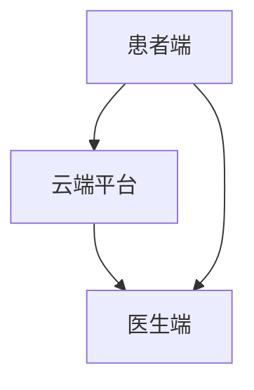

                 

# 远程医疗技术的普及对医疗行业的影响

## 关键词：远程医疗技术，医疗行业，医疗资源分配，医生角色转变，患者体验提升

## 摘要：远程医疗技术的普及正在深刻改变医疗行业的运作方式。通过数字化医疗资源和便捷的医患互动，远程医疗不仅提高了医疗服务的效率，还优化了医疗资源的分配，提升了患者的就诊体验。本文从技术基础、影响分析、系统架构、挑战与对策以及未来趋势等方面，全面探讨远程医疗技术对医疗行业的影响。

---

## 第1章: 远程医疗技术的背景与核心概念

### 1.1 远程医疗技术的定义与背景

#### 1.1.1 远程医疗技术的起源与发展
远程医疗技术起源于20世纪60年代，随着互联网技术的成熟，逐步从简单的电子通信发展为集数据传输、视频会诊和智能诊断于一体的综合系统。

#### 1.1.2 远程医疗技术的核心概念
远程医疗技术是指通过通信技术和计算机系统，实现医疗资源的远程共享和医患之间的远程互动，涵盖远程诊断、远程会诊、远程治疗等多个环节。

#### 1.1.3 远程医疗技术的分类与特点
- **分类**：按应用场景可分为远程诊断、远程治疗和远程健康管理；按技术手段可分为基于视频的远程会诊和基于数据的远程诊断。
- **特点**：便捷性、高效性、跨地域性。

### 1.2 远程医疗技术的背景与现状

#### 1.2.1 医疗行业的发展趋势
医疗行业正从传统模式向数字化、智能化方向转型，远程医疗技术成为推动这一转型的重要力量。

#### 1.2.2 远程医疗技术在全球范围内的应用现状
- 美国：远程医疗技术普及率高，特别是在农村地区。
- 中国：远程医疗技术在疫情期间发挥了重要作用，尤其是在偏远地区。

#### 1.2.3 远程医疗技术在中国的发展与挑战
- 发展：政策支持、技术进步、市场需求推动。
- 挑战：技术标准不统一、隐私保护问题、医生资质认证。

### 1.3 远程医疗技术的核心要素

#### 1.3.1 医疗资源的数字化与共享
- 数据共享：医疗数据的标准化和共享平台的建设。
- 资源优化：通过远程会诊优化医疗资源分配。

#### 1.3.2 医患互动的远程化与便捷化
- 患者端：在线问诊、预约挂号。
- 医生端：远程诊断、多学科会诊。

#### 1.3.3 医疗数据的安全与隐私保护
- 数据加密技术：确保患者隐私不被泄露。
- 法律法规：《个人信息保护法》等对医疗数据的保护。

---

## 第2章: 远程医疗技术的核心技术与实现原理

### 2.1 远程医疗技术的核心技术

#### 2.1.1 通信技术
- **技术基础**：5G网络、光纤通信。
- **实现原理**：高速数据传输、低延迟，确保视频会诊的流畅性。

#### 2.1.2 数据安全技术
- **数据加密**：AES加密算法。
- **隐私保护**：通过区块链技术实现数据不可篡改。

#### 2.1.3 人工智能技术
- **应用领域**：辅助诊断、智能分诊。
- **算法原理**：基于深度学习的图像识别技术，用于医学影像分析。

### 2.2 远程医疗系统的实现原理

#### 2.2.1 系统架构
- **分层架构**：分为患者端、医生端、云端平台。
- **数据流**：患者数据通过终端上传至云端，医生端进行分析处理。

#### 2.2.2 算法实现
- **医学影像识别**：使用卷积神经网络（CNN）进行图像分类。
  $$CNN = \text{Conv}(k=3) \rightarrow \text{ReLU} \rightarrow \text{MaxPool} \rightarrow \text{FC}(10)$$
- **自然语言处理**：用于医疗文档的自动分类。

#### 2.2.3 系统交互流程
- 患者提交症状和数据。
- 系统生成初步诊断建议。
- 医生进行远程会诊并给出最终诊断。

---

## 第3章: 远程医疗技术对医疗行业的影响分析

### 3.1 医疗资源分配的优化

#### 3.1.1 资源分配的现状与问题
- **现状**：医疗资源分布不均，优质资源集中在大城市。
- **问题**：偏远地区患者难以获得优质医疗资源。

#### 3.1.2 远程医疗技术的作用
- **资源下沉**：通过远程会诊，优质医疗资源覆盖更多地区。
- **效率提升**：减少患者等待时间，提高医疗资源利用率。

### 3.2 医生角色的转变

#### 3.2.1 传统医生角色
- **面对面诊断**：依赖医生的经验和现场检查。
- **工作模式**：集中在医院内部，工作时间受限。

#### 3.2.2 远程医疗时代医生的角色
- **多点执业**：医生可以同时为多地患者提供服务。
- **效率提升**：通过远程会诊，医生可以更高效地处理患者需求。
- **数据驱动决策**：利用大数据分析辅助诊断，提升准确性。

### 3.3 患者体验的提升

#### 3.3.1 患者的实际需求
- **便捷性**：减少就医时间成本。
- **隐私保护**：避免面对面就医的尴尬。

#### 3.3.2 远程医疗带来的体验改善
- **便捷性**：患者可以足不出户完成问诊。
- **隐私性**：远程问诊保护患者隐私。
- **及时性**：患者可以更快获得医疗建议。

---

## 第4章: 远程医疗系统的架构与实现

### 4.1 系统架构设计

#### 4.1.1 系统组成部分
- **患者端**：智能终端设备、移动应用。
- **医生端**：远程诊断系统、电子病历系统。
- **云端平台**：数据存储、处理和分析。

#### 4.1.2 系统功能设计
- **预约挂号**：患者在线预约医生。
- **远程会诊**：医生与患者进行视频会诊。
- **数据共享**：医疗数据在医生和医院之间共享。

#### 4.1.3 系统架构图

### 4.2 系统实现细节

#### 4.2.1 患者端功能
- **预约挂号**：通过移动应用完成。
- **数据上传**：上传检查报告和病历。

#### 4.2.2 医生端功能
- **远程会诊**：通过视频进行诊断。
- **数据查看**：查看患者的医疗记录。

#### 4.2.3 云端平台功能
- **数据存储**：存储患者的医疗数据。
- **分析处理**：利用AI技术辅助诊断。

### 4.3 系统交互流程

#### 4.3.1 患者发起问诊
- 患者打开移动应用，选择医生并提交问诊请求。

#### 4.3.2 医生端处理
- 医生在云端平台接收请求，通过视频进行问诊。

#### 4.3.3 数据共享
- 诊断结果通过云端平台共享给患者和其他医疗机构。

---

## 第5章: 远程医疗技术普及中的挑战与对策

### 5.1 技术挑战

#### 5.1.1 技术瓶颈
- **网络延迟**：影响视频会诊的流畅性。
- **数据传输速度**：影响医疗数据的实时性。

#### 5.1.2 解决策略
- **优化网络性能**：采用5G技术提高数据传输速度。
- **提升系统稳定性**：通过冗余设计确保系统不中断。

### 5.2 政策法规挑战

#### 5.2.1 当前政策环境
- **政策支持**：国家出台政策鼓励远程医疗发展。
- **法规限制**：医生资质认证和医疗责任界定尚不明确。

#### 5.2.2 应对策略
- **完善法规**：明确远程医疗的法律地位和责任划分。
- **加强监管**：确保远程医疗服务质量。

### 5.3 患者接受度挑战

#### 5.3.1 患者的疑虑
- **信任问题**：患者对远程诊断的准确性有疑虑。
- **技术障碍**：部分患者不熟悉远程医疗的操作流程。

#### 5.3.2 解决策略
- **宣传教育**：通过多种渠道宣传远程医疗的优势。
- **提供培训**：帮助患者和医生掌握远程医疗的操作方法。

---

## 第6章: 远程医疗技术的未来发展趋势

### 6.1 新技术的应用

#### 6.1.1 5G技术
- **应用场景**：支持超高清视频会诊和实时数据传输。

#### 6.1.2 人工智能
- **未来发展**：AI辅助诊断将更加智能化和精准化。

#### 6.1.3 区块链技术
- **应用潜力**：用于医疗数据的共享和隐私保护。

### 6.2 医疗模式的创新

#### 6.2.1 远程手术
- **技术支撑**：通过机器人和虚拟现实技术实现远程手术。

#### 6.2.2 个性化医疗
- **发展方向**：基于患者个体数据提供个性化治疗方案。

#### 6.2.3 远程健康管理
- **服务延伸**：从疾病治疗扩展到健康管理。

---

## 结语

远程医疗技术的普及正在重塑医疗行业的格局，通过优化医疗资源分配、提升医生工作效率和改善患者体验，远程医疗技术正在为医疗行业带来深远的影响。未来，随着技术的不断进步和政策的完善，远程医疗技术将在医疗行业中发挥更大的作用，推动医疗行业的全面升级。

---

## 作者：AI天才研究院/AI Genius Institute & 禅与计算机程序设计艺术 /Zen And The Art of Computer Programming

