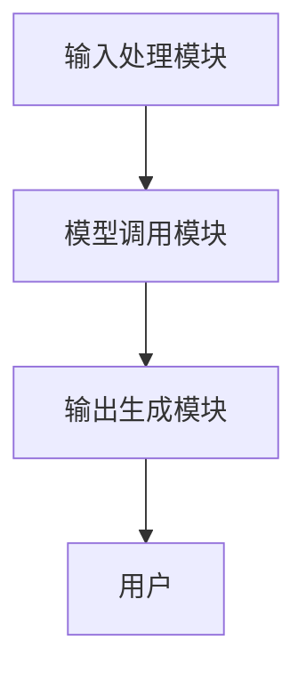
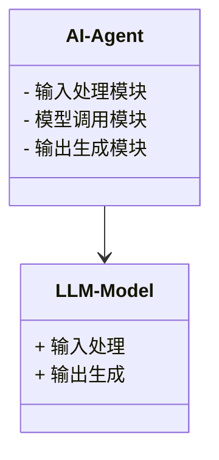
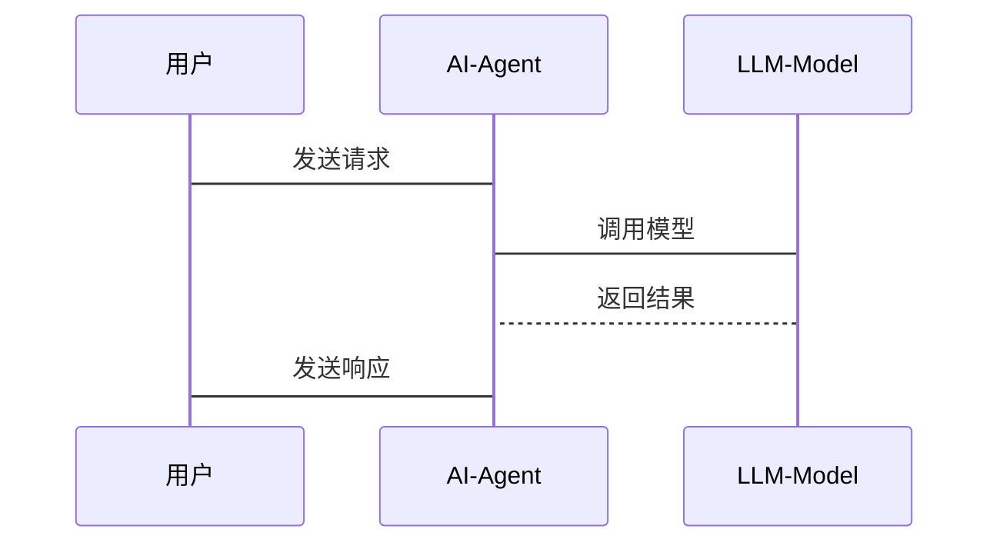

                 


# 选择合适的LLM模型：AI Agent开发的第一步

> 关键词：LLM模型，AI Agent，人工智能，大型语言模型，模型选择，系统架构

> 摘要：选择合适的LLM模型是开发AI Agent的第一步，也是最关键的一步。本文将从LLM模型的基本概念出发，逐步分析AI Agent的需求与目标，探讨如何选择合适的模型，并详细讲解系统的架构设计、项目实战以及最佳实践。通过本文，读者将能够全面了解如何在AI Agent开发中选择合适的LLM模型。

---

# 第1章: 大型语言模型与AI Agent概述

## 1.1 LLM模型的基本概念

### 1.1.1 大型语言模型的定义
大型语言模型（Large Language Models, LLMs）是指基于深度学习技术构建的能够处理自然语言数据的模型，通常具有大量的参数和强大的上下文理解能力。LLM模型的核心在于其神经网络结构，能够通过大量数据的训练来捕捉语言的规律。

### 1.1.2 LLM模型的核心特点
- **大规模数据训练**：LLM模型通常使用海量的文本数据进行训练，使其能够理解和生成多种语言。
- **Transformer架构**：大多数LLM模型基于Transformer架构，通过自注意力机制捕捉长距离依赖关系。
- **可微调性**：LLM模型可以在特定任务上进行微调，以适应不同的应用场景。
- **多语言支持**：许多LLM模型支持多种语言的处理，能够满足全球化的需求。

### 1.1.3 AI Agent的基本概念
AI Agent（人工智能代理）是指能够感知环境并采取行动以实现目标的智能体。AI Agent可以通过与用户的交互来提供信息、完成任务或解决问题。LLM模型作为AI Agent的核心驱动力，为其提供了自然语言理解和生成的能力。

## 1.2 LLM模型与AI Agent的关系

### 1.2.1 LLM模型在AI Agent中的作用
- **自然语言理解**：LLM模型能够理解用户的输入，分析其意图和需求。
- **自然语言生成**：LLM模型能够生成符合用户需求的文本输出，例如回答问题、撰写文档等。
- **任务执行**：通过与LLM模型的结合，AI Agent可以执行复杂的任务，例如信息检索、决策支持等。

### 1.2.2 AI Agent的工作原理
AI Agent通常包括以下几个关键步骤：
1. **感知环境**：通过LLM模型理解和分析用户的输入。
2. **分析需求**：根据用户的输入生成相应的理解和需求分析。
3. **决策与行动**：基于分析结果，AI Agent决定采取何种行动。
4. **反馈与优化**：通过与用户的互动，不断优化自身的模型和行为。

### 1.2.3 LLM模型与AI Agent的结合场景
- **智能客服**：通过LLM模型实现自动回答用户的问题，提供高效的客户服务。
- **智能助手**：例如Siri、Alexa等，通过LLM模型提供语音交互和任务执行。
- **内容生成**：AI Agent可以根据用户的输入生成高质量的内容，例如文章、报告等。

## 1.3 LLM模型的发展现状

### 1.3.1 GPT系列模型的发展历程
从GPT到GPT-4，每次版本的升级都带来了性能的显著提升。GPT-4不仅在生成能力上更加出色，还具备更强的多模态处理能力。

### 1.3.2 其他主流LLM模型介绍
- **BERT**：专注于文本的理解，通过预训练技术提升模型的上下文理解能力。
- **PaLM**：Google开发的基于Transformer的大型语言模型，具有强大的多语言处理能力。
- **Llama**：Meta开源的LLM模型，具有高效的推理能力和较低的计算成本。

### 1.3.3 LLM模型在AI Agent中的应用现状
目前，LLM模型已经在多种AI Agent应用中得到广泛应用，例如智能客服、智能助手、内容生成等领域。随着技术的不断进步，LLM模型在AI Agent中的应用前景将更加广阔。

## 1.4 选择合适的LLM模型的重要性

### 1.4.1 不同场景下LLM模型的选择标准
- **任务需求**：不同的任务需要不同类型的LLM模型，例如文本生成、问答系统等。
- **性能指标**：包括准确率、响应速度、生成质量等。
- **资源限制**：包括计算资源、存储资源和预算限制。

### 1.4.2 LLM模型性能对AI Agent的影响
性能出色的LLM模型能够显著提升AI Agent的表现，包括更快的响应速度、更高的准确率和更自然的生成结果。

### 1.4.3 选择LLM模型的常见误区
- **盲目追求大模型**：并非所有场景都需要最大的模型，选择合适的模型才是关键。
- **忽略实际需求**：选择模型时需要结合实际应用场景和需求，避免选择过于通用的模型。

## 1.5 本章小结
本章从LLM模型的基本概念出发，详细介绍了AI Agent的工作原理以及两者的关系。通过分析LLM模型的发展现状，强调了选择合适模型的重要性，并指出了常见的误区。下一章将深入探讨LLM模型的核心概念与原理。

---

# 第2章: LLM模型的核心概念与原理

## 2.1 LLM模型的原理概述

### 2.1.1 神经网络的基本结构
神经网络是LLM模型的核心，主要包括输入层、隐藏层和输出层。通过神经元之间的连接和权重调整，模型能够学习输入数据的特征和规律。

### 2.1.2 变压器模型的工作原理
Transformer模型由编码器和解码器两部分组成，编码器负责将输入序列编码为一个固定长度的向量，解码器则根据编码结果生成输出序列。

### 2.1.3 注意力机制的数学模型
注意力机制通过计算输入序列中每个位置的重要性，从而决定模型在生成输出时的关注点。其数学公式如下：

$$
\text{Attention}(Q, K, V) = \text{softmax}\left(\frac{QK^T}{\sqrt{d_k}}\right)V
$$

其中，$Q$、$K$、$V$分别为查询、键和值向量，$d_k$为键的维度。

## 2.2 LLM模型的主要特点

### 2.2.1 大规模数据训练
通过使用海量的文本数据进行预训练，LLM模型能够捕捉到语言的规律和语义信息。

### 2.2.2 微调与零样本学习
微调是指在预训练的基础上，针对特定任务进行进一步的训练。零样本学习则是指模型在没有特定任务训练数据的情况下，直接利用预训练的知识进行推理和生成。

### 2.2.3 多模态能力
部分LLM模型具备多模态处理能力，能够同时处理文本、图像等多种类型的数据。

## 2.3 LLM模型的对比分析

### 2.3.1 模型参数与性能的关系
模型参数越多，通常性能越强，但计算成本也越高。因此，在选择模型时需要在性能和成本之间进行权衡。

### 2.3.2 不同LLM模型的优缺点对比
| 模型 | 优点 | 缺点 |
|------|------|------|
| GPT-4 | 高生成能力，多模态支持 | 计算成本高，资源需求大 |
| BERT | 强大的文本理解能力 | 生成能力较弱 |
| Llama | 计算效率高 | 模型规模较小，性能有限 |

### 2.3.3 模型选择的权衡点
在选择LLM模型时，需要综合考虑模型的性能、计算成本、资源限制等因素，找到最适合当前任务的模型。

## 2.4 本章小结
本章详细讲解了LLM模型的核心原理和主要特点，并通过对比分析帮助读者更好地理解不同模型的优缺点。下一章将探讨如何选择合适的LLM模型。

---

# 第3章: 选择合适的LLM模型的步骤与方法

## 3.1 确定AI Agent的需求与目标

### 3.1.1 明确AI Agent的功能需求
在选择LLM模型之前，首先需要明确AI Agent的功能需求，例如是否需要支持多语言、是否需要实时响应等。

### 3.1.2 设定性能指标
包括准确率、响应速度、生成质量等，这些指标将直接影响模型的选择。

### 3.1.3 确定预算与资源限制
根据项目的预算和资源限制，选择适合的模型规模和计算资源。

## 3.2 评估LLM模型的性能

### 3.2.1 模型的准确率与响应速度
准确率是模型性能的重要指标，而响应速度则关系到用户体验。

### 3.2.2 模型的可解释性
可解释性是模型的重要特性，尤其是在需要透明决策的应用场景中。

### 3.2.3 模型的通用性与适应性
模型是否能够在不同场景下表现出色，是否需要进行微调等。

## 3.3 模型选择的流程与工具

### 3.3.1 模型选择流程
1. 明确需求与目标
2. 评估候选模型的性能
3. 根据需求选择合适的模型
4. 验证与优化

### 3.3.2 模型选择工具
- **Hugging Face**：提供丰富的开源模型和工具，方便用户选择和使用。
- **Transformers Library**：提供多种LLM模型的实现，用户可以根据需求选择合适的模型。

## 3.4 本章小结
本章详细介绍了选择合适LLM模型的步骤与方法，包括需求分析、性能评估和模型选择流程。通过合理的流程和工具选择，能够帮助读者高效地找到最适合的模型。

---

# 第4章: 系统架构设计与实现

## 4.1 系统架构设计

### 4.1.1 AI Agent的模块划分
AI Agent通常包括以下几个核心模块：
- **输入处理模块**：负责接收用户的输入并进行初步处理。
- **模型调用模块**：负责调用选择的LLM模型进行处理。
- **输出生成模块**：根据模型的输出生成最终的响应。

### 4.1.2 系统架构的Mermaid图


## 4.2 系统功能设计

### 4.2.1 领域模型的Mermaid类图


### 4.2.2 系统功能模块
- **输入处理模块**：包括数据清洗、格式转换等功能。
- **模型调用模块**：负责与LLM模型进行交互，传递输入和接收输出。
- **输出生成模块**：对模型的输出进行处理，生成最终的用户响应。

## 4.3 系统架构的交互流程

### 4.3.1 系统交互的Mermaid序列图


## 4.4 系统接口设计

### 4.4.1 API接口的设计
- **输入接口**：接收用户的输入请求。
- **输出接口**：返回生成的文本或结果。

### 4.4.2 接口设计的注意事项
- **兼容性**：确保接口能够支持多种输入格式和输出格式。
- **安全性**：保护用户的数据和隐私，防止数据泄露。

## 4.5 本章小结
本章详细讲解了AI Agent的系统架构设计与实现，包括模块划分、系统功能设计和交互流程。通过合理的架构设计，能够提升系统的稳定性和可扩展性。

---

# 第5章: 项目实战：基于LLM模型的AI Agent开发

## 5.1 环境安装与配置

### 5.1.1 安装Python环境
使用Anaconda或虚拟环境管理工具安装Python，并配置开发环境。

### 5.1.2 安装必要的库
安装如`transformers`、`torch`等必要的库，用于模型的加载和运行。

## 5.2 系统核心实现

### 5.2.1 加载LLM模型
使用Hugging Face的Transformers库加载预训练好的模型，例如GPT-2或Bert。

```python
from transformers import AutoTokenizer, AutoModelForCausalLM
model_name = "gpt2"
tokenizer = AutoTokenizer.from_pretrained(model_name)
model = AutoModelForCausalLM.from_pretrained(model_name)
```

### 5.2.2 模型调用与交互
定义一个函数，接收用户输入并生成响应。

```python
def generate_response(input_text):
    inputs = tokenizer(input_text, return_tensors="np")
    outputs = model.generate(**inputs)
    response = tokenizer.decode(outputs[0])
    return response
```

### 5.2.3 系统集成与测试
将模型调用模块与输入输出模块集成，进行功能测试和性能优化。

## 5.3 项目案例分析

### 5.3.1 案例背景
假设我们开发一个智能客服系统，用于回答用户的问题。

### 5.3.2 案例实现
通过上述代码实现模型调用，并集成到智能客服系统中。

## 5.4 本章小结
本章通过一个实际的项目案例，详细展示了如何基于LLM模型开发AI Agent。从环境配置到代码实现，再到案例分析，帮助读者掌握实际操作技能。

---

# 第6章: 总结与展望

## 6.1 本章总结
本文详细介绍了选择合适的LLM模型以开发AI Agent的过程，包括模型选择、系统架构设计和项目实战等内容。通过本文的学习，读者能够掌握AI Agent开发的核心技能。

## 6.2 未来展望
随着技术的不断进步，LLM模型在AI Agent中的应用将更加广泛。未来，我们需要关注模型的优化、多模态能力的提升以及计算成本的降低等方面。

## 6.3 最佳实践 Tips
- **选择模型时，需结合实际需求**：并非所有场景都需要最大的模型。
- **注重系统的可扩展性**：在设计系统架构时，考虑未来的扩展需求。
- **关注模型的可解释性**：在需要透明决策的应用中，模型的可解释性尤为重要。

## 6.4 本章小结
本章总结了全文的主要内容，并对未来的发展进行了展望。通过本文的学习，读者能够全面了解如何在AI Agent开发中选择合适的LLM模型。

---

# 附录

## 附录 A: 常用的LLM模型与工具

| 模型名称 | 特点 | 工具支持 |
|---------|------|----------|
| GPT-4   | 多模态，生成能力强 | OpenAI API |
| BERT     | 强大的文本理解能力 | Hugging Face |
| Llama    | 计算效率高 | Meta开源工具 |

## 附录 B: 代码实现示例

```python
from transformers import AutoTokenizer, AutoModelForCausalLM

model_name = "gpt2"
tokenizer = AutoTokenizer.from_pretrained(model_name)
model = AutoModelForCausalLM.from_pretrained(model_name)

def generate_response(input_text):
    inputs = tokenizer(input_text, return_tensors="np")
    outputs = model.generate(**inputs)
    response = tokenizer.decode(outputs[0])
    return response

# 示例
print(generate_response("今天天气如何？"))
```

## 附录 C: 进一步学习的资源

- **书籍推荐**：
  - 《Deep Learning》
  - 《自然语言处理入门》
- **在线课程**：
  - Coursera: Natural Language Processing with PyTorch
  - edX: Introduction to Artificial Intelligence

---

# 作者：AI天才研究院/AI Genius Institute & 禅与计算机程序设计艺术/Zen And The Art of Computer Programming

---

希望这个目录大纲能满足你的需求！如果需要进一步调整或补充，请随时告诉我！

