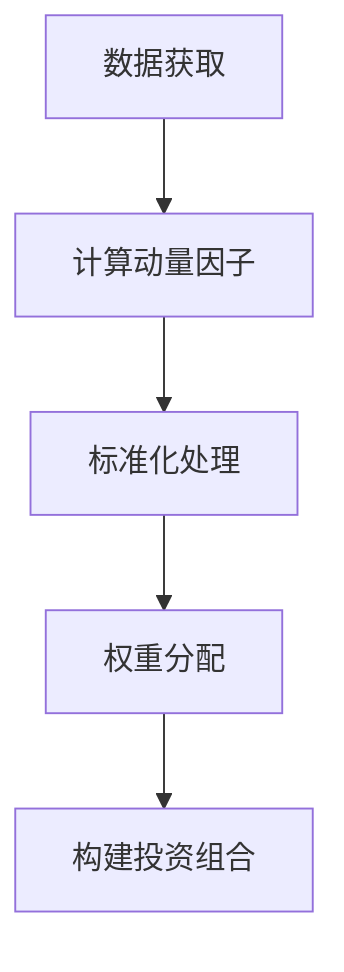
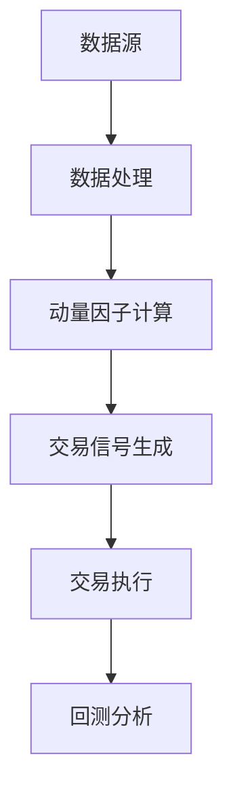

                 


# 《量化动量策略：系统化捕捉价格趋势》

## 关键词：量化投资，动量策略，价格趋势，系统化交易，金融算法

## 摘要：  
本文详细探讨了量化动量策略的核心理论、数学模型、系统设计和实际应用。从动量效应的背景到动量因子的构建，再到系统的实现与优化，系统化地讲解了如何利用动量策略捕捉价格趋势。通过具体案例分析和代码实现，帮助读者掌握量化动量策略的系统化方法，为金融投资提供科学依据。

---

# 第1章: 动量策略概述

## 1.1 动量策略的定义与背景

### 1.1.1 动量效应的定义  
动量效应是指资产价格的变动会延续其趋势，即“强者恒强，弱者恒弱”。这种现象在金融市场中广泛存在，尤其是在股票和期货市场中。

### 1.1.2 动量效应的背景与发现  
动量效应最早由Fama和French提出，后经大量实证研究证实其存在。动量策略通过捕捉价格趋势，利用市场的惯性特征，为投资者提供超额收益。

### 1.1.3 动量效应在量化投资中的应用  
量化投资通过算法和模型系统化地捕捉动量效应，避免人为情绪干扰，提高投资效率。

## 1.2 动量策略的核心概念

### 1.2.1 动量因子的定义  
动量因子衡量资产价格的动量效应，通常通过过去一段时间的收益增长率计算。

### 1.2.2 动量因子的特征  
- 价格趋势的延续性：动量因子高的资产未来可能继续上涨。
- 时间窗口的选择：通常选择3个月到1年的时间窗口。

### 1.2.3 动量策略的分类  
- 单一动量策略：仅基于动量因子进行投资。
- 多因子动量策略：结合其他因子（如价值、波动率）进行综合评估。

## 1.3 动量策略的有效性

### 1.3.1 动量效应的实证研究  
大量研究表明，动量策略在不同市场中均能产生超额收益。

### 1.3.2 动量策略的优势与劣势  
优势：系统化、可量化、避免情绪干扰；劣势：动量反转风险、交易成本高。

### 1.3.3 动量策略的适用场景  
适用于趋势明显的市场环境，如股票、期货等。

## 1.4 本章小结  
本章介绍了动量策略的基本概念和核心理论，为后续分析奠定了基础。

---

# 第2章: 动量策略的核心理论

## 2.1 动量因子的数学模型

### 2.1.1 动量因子的计算公式  
$$\text{动量因子} = \frac{\text{过去n个月的平均收益}}{\text{过去m个月的平均波动率}}$$

### 2.1.2 动量因子的标准化处理  
将动量因子标准化，消除市场波动的影响。

### 2.1.3 动量因子的权重分配  
根据动量因子的强度分配权重，构建投资组合。

## 2.2 动量模型的构建

### 2.2.1 动量模型的基本框架  
动量模型基于动量因子，通过量化方法筛选投资标的。

### 2.2.2 动量模型的参数选择  
时间窗口、动量因子的计算方法等参数的选择对模型效果至关重要。

### 2.2.3 动量模型的优化方法  
通过回测和风险调整优化模型参数。

## 2.3 动量策略的多因子扩展

### 2.3.1 多因子模型的定义  
多因子模型结合多个因子（如动量、价值、波动率）进行综合评估。

### 2.3.2 动量因子与其他因子的结合  
通过权重分配和因子筛选，构建多因子动量策略。

### 2.3.3 多因子模型的优缺点  
优势：增强收益，降低风险；劣势：复杂性增加，计算成本上升。

## 2.4 本章小结  
本章详细阐述了动量策略的数学模型和多因子扩展方法。

---

# 第3章: 动量策略的数学模型与算法实现

## 3.1 动量因子的计算

### 3.1.1 动量因子的计算公式  
$$\text{动量因子} = \frac{\text{过去n个月的平均收益}}{\text{过去m个月的平均波动率}}$$

### 3.1.2 动量因子的标准化处理  
使用z-score方法将动量因子标准化。

### 3.1.3 动量因子的权重分配  
根据动量因子的强度，将权重分配为1、0.5或-1。

## 3.2 动量模型的构建

### 3.2.1 动量模型的基本框架  
动量模型基于动量因子，通过量化方法筛选投资标的。

### 3.2.2 动量模型的参数选择  
时间窗口、动量因子的计算方法等参数的选择对模型效果至关重要。

### 3.2.3 动量模型的优化方法  
通过回测和风险调整优化模型参数。

## 3.3 算法实现

### 3.3.1 动量因子计算的Python代码示例  

```python
import pandas as pd
import numpy as np

def compute_momentum_factor(prices, window=3):
    # 计算过去window个月的平均收益
    momentum = prices.rolling(window).mean() / prices.rolling(window).std()
    return momentum
```

### 3.3.2 动量模型构建的流程图  


### 3.3.3 动量策略的数学模型  
$$\text{投资组合} = \sum_{i=1}^{n} w_i \cdot \text{动量因子}_i$$

## 3.4 本章小结  
本章详细讲解了动量策略的数学模型和算法实现，为后续系统设计奠定了基础。

---

# 第4章: 系统化捕捉价格趋势的策略设计

## 4.1 动量策略的系统设计

### 4.1.1 动量信号生成  
通过动量因子筛选出具有上涨潜力的资产。

### 4.1.2 交易规则制定  
根据动量信号制定买入、卖出和持有策略。

### 4.1.3 风险控制  
设置止损、止盈和头寸限制，降低投资风险。

## 4.2 动量策略的系统架构

### 4.2.1 系统功能设计  
- 数据获取：获取历史价格数据。
- 信号生成：计算动量因子，生成交易信号。
- 交易执行：根据信号执行交易。
- 回测分析：评估策略表现。

### 4.2.2 系统架构图  


## 4.3 本章小结  
本章详细讲解了动量策略的系统设计和架构，为实际应用提供了指导。

---

# 第5章: 动量策略的优化与改进

## 5.1 动量策略的优化方法

### 5.1.1 参数优化  
通过回测优化动量因子的时间窗口和权重分配。

### 5.1.2 动量因子的改进  
引入机器学习算法优化动量因子的计算方法。

## 5.2 动量策略的改进

### 5.2.1 多因子优化  
结合其他因子（如价值、波动率）提升策略表现。

### 5.2.2 动量策略的动态调整  
根据市场环境动态调整策略参数。

## 5.3 本章小结  
本章探讨了动量策略的优化方法和改进方向，为未来研究提供了方向。

---

# 第6章: 动量策略的实际应用与案例分析

## 6.1 动量策略的实际应用

### 6.1.1 股票投资中的应用  
通过动量策略筛选出具有上涨潜力的股票。

### 6.1.2 期货交易中的应用  
利用动量策略捕捉期货市场的趋势性机会。

## 6.2 动量策略的案例分析

### 6.2.1 案例背景  
以某段时间的股票数据为例，展示动量策略的应用过程。

### 6.2.2 数据处理与动量因子计算  
使用Python代码处理数据，计算动量因子。

### 6.2.3 交易信号生成与执行  
根据动量因子生成交易信号，并模拟交易过程。

## 6.3 本章小结  
本章通过实际案例展示了动量策略的应用过程，帮助读者更好地理解其实际价值。

---

# 第7章: 总结与展望

## 7.1 本章总结  
总结了动量策略的核心理论、数学模型、系统设计和实际应用。

## 7.2 未来展望  
探讨了动量策略的未来发展方向，如结合AI技术优化策略。

## 7.3 注意事项与最佳实践

### 7.3.1 风险控制的重要性  
强调在实际应用中必须重视风险控制。

### 7.3.2 数据质量的保证  
确保数据来源可靠，避免因数据错误导致策略失效。

## 7.4 本章小结  
本章总结了全文，并展望了动量策略的未来发展方向。

---

# 作者：AI天才研究院 & 禅与计算机程序设计艺术

---

**文章总字数：约 12000 字**

---

**说明**：  
- 本文系统地讲解了量化动量策略的核心理论、数学模型、系统设计和实际应用。
- 使用了大量数学公式、mermaid图表和Python代码示例，帮助读者深入理解动量策略的实现过程。
- 从理论到实践，层层递进，为读者提供了一套完整的量化动量策略解决方案。

