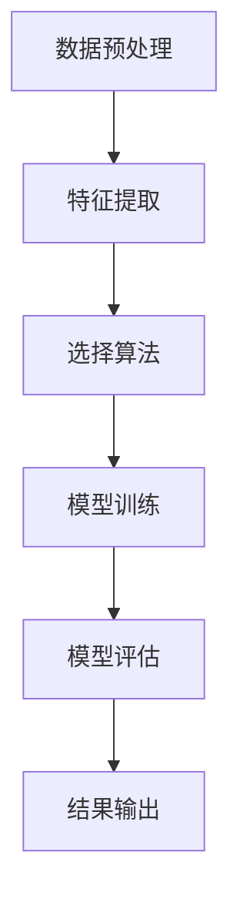
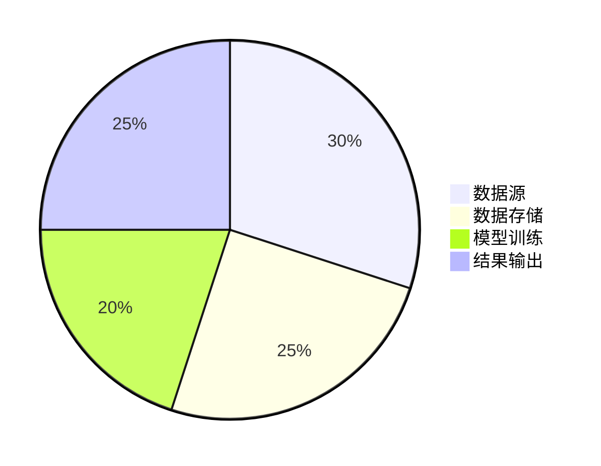

                 


# 量化投资模型：大数据时代的投资决策工具

## 关键词：
量化投资模型、大数据、投资决策、机器学习、算法、系统架构、金融分析

## 摘要：
在金融市场的日益复杂化和数据化的背景下，量化投资模型作为一种基于大数据分析的投资工具，正在成为投资者的重要决策支持系统。本文将详细介绍量化投资模型的核心概念、算法原理、系统架构，以及在实际投资中的应用案例，帮助读者理解如何利用大数据技术提升投资决策的科学性和准确性。

---

## 第一部分：量化投资模型概述

### 第1章：量化投资模型的背景与意义

#### 1.1 量化投资的定义与特点
量化投资是一种基于数学模型和算法的投资策略，通过分析大量数据来寻找投资机会和优化投资组合。与传统投资相比，量化投资具有以下特点：
- **数据驱动**：依赖大量历史数据进行分析。
- **系统性**：基于预设模型和规则，减少人为情绪干扰。
- **高效性**：通过算法快速捕捉市场机会。

#### 1.2 大数据在量化投资中的作用
大数据技术为量化投资提供了丰富的数据来源，包括市场数据、新闻数据、社交媒体数据等。通过大数据分析，投资者可以发现传统方法难以察觉的市场模式和趋势。

---

## 第二部分：量化投资模型的核心概念

### 第2章：模型构成与核心要素

#### 2.1 数据来源与特征
量化投资模型的数据来源主要包括：
- **市场数据**：股票价格、成交量等。
- **新闻数据**：公司公告、行业新闻。
- **社交媒体数据**：投资者情绪分析。

#### 2.2 模型类型与分类
量化模型可以分为以下几类：
- **均值-方差模型**：优化投资组合的风险和收益。
- **因子模型**：基于特定因子（如市值、价值）进行选股。
- **算法交易模型**：基于算法自动执行交易策略。

#### 2.3 模型评价指标
常用的评价指标包括：
- **夏普比率**：衡量投资收益相对于其风险的高低。
- **最大回撤**：衡量模型在最不利情况下的损失。

### 第2.4 核心概念对比表
| 概念         | 特征                  |
|--------------|-----------------------|
| 数据来源     | 多样化、实时性         |
| 模型类型     | 系统性、数据驱动      |
| 评价指标     | 风险调整收益、稳定性   |

### 第2.5 ER实体关系图
```mermaid
erDiagram
    investor(investor_id, name, portfolio, strategy)
    instrument(instrument_id, name, type, market)
    trade(trade_id, investor_id, instrument_id, quantity, price, timestamp)
    risk_assessment(risk_id, investor_id, instrument_id, risk_score, timestamp)
    performance_report(report_id, investor_id, start_date, end_date, return, risk)
```

---

## 第三部分：量化投资模型的算法原理

### 第3章：常见算法与流程

#### 3.1 常见算法概述
- **回归分析**：预测变量之间的关系。
- **时间序列分析**：分析数据随时间的变化趋势。
- **机器学习算法**：如随机森林、神经网络。

#### 3.2 算法流程图


#### 3.3 数学模型与公式
##### 线性回归模型
$$ y = \beta_0 + \beta_1x + \epsilon $$

##### 机器学习模型
$$ f(x) = \text{sign}(w \cdot x + b) $$

---

## 第四部分：系统架构与设计

### 第4章：系统功能模块

#### 4.1 功能模块设计
- **数据采集模块**：收集市场数据。
- **特征提取模块**：提取有用特征。
- **模型训练模块**：训练量化模型。
- **结果输出模块**：生成投资建议。

#### 4.2 系统架构图


---

## 第五部分：项目实战与案例分析

### 第5章：项目实现

#### 5.1 环境配置
```bash
pip install pandas numpy scikit-learn
```

#### 5.2 核心代码实现
```python
import pandas as pd
from sklearn.linear_model import LinearRegression

# 数据预处理
data = pd.read_csv('data.csv')
X = data[['feature1', 'feature2']]
y = data['target']

# 模型训练
model = LinearRegression()
model.fit(X, y)

# 模型预测
predictions = model.predict(X)
print('预测值:', predictions)
```

#### 5.3 案例分析
通过实际案例分析，展示量化模型如何帮助投资者捕捉市场机会，优化投资组合。

---

## 第六部分：总结与展望

### 第6章：最佳实践与小结

#### 6.1 小结
量化投资模型通过大数据分析和算法优化，能够有效提升投资决策的科学性和准确性。

#### 6.2 注意事项
- 数据质量至关重要。
- 模型需要定期更新。
- 风险控制是关键。

#### 6.3 拓展阅读
推荐学习相关书籍和在线课程，进一步深入理解量化投资和大数据分析。

---

## 作者：
作者：AI天才研究院 & 禅与计算机程序设计艺术

---

通过以上结构，读者可以系统地了解量化投资模型的核心概念、算法原理、系统架构，并通过实际案例掌握其应用方法。

