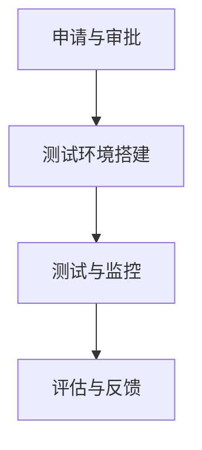
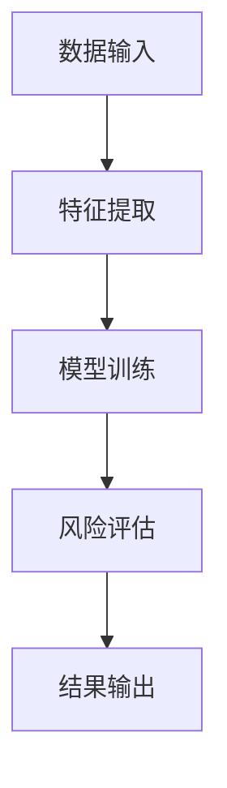
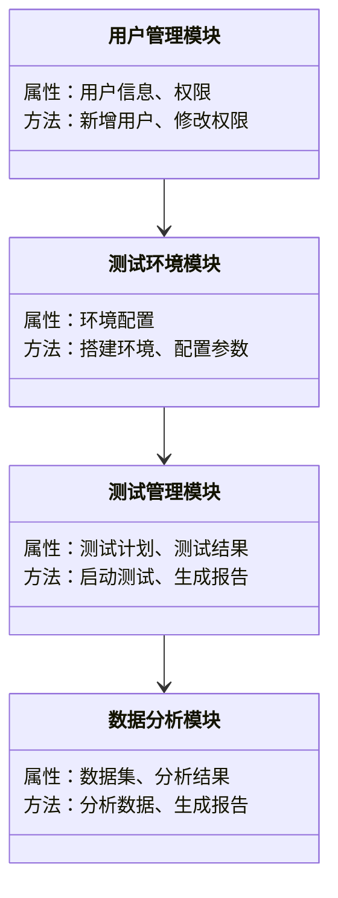
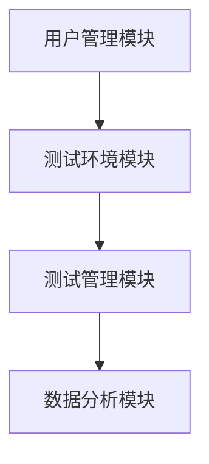
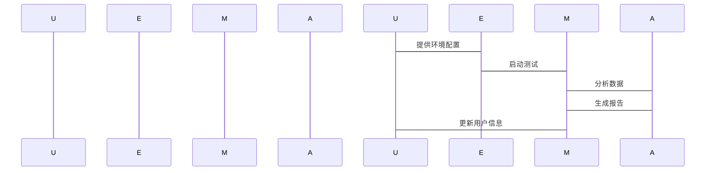

                 


# 金融科技监管沙盒模拟系统

## 关键词：金融科技、监管沙盒、模拟系统、风险评估、监管科技、人工智能

## 摘要：本文详细探讨了金融科技监管沙盒模拟系统的构建与应用，从背景、核心概念、算法原理、系统架构到项目实战，系统性地分析了如何利用技术手段实现金融创新与风险监管的平衡。通过本文，读者可以深入了解金融科技监管沙盒的运作机制，并掌握其在实际场景中的应用方法。

## 第一部分：金融科技监管沙盒的背景与概念

### 第1章：金融科技监管沙盒的背景与问题背景

#### 1.1 金融科技监管沙盒的定义与核心概念

**1.1.1 金融科技监管沙盒的定义**  
金融科技监管沙盒（Fintech Regulatory Sandbox）是一种创新的监管工具，旨在为金融机构和科技企业在受控的环境中测试其新产品、服务和商业模式，同时确保这些创新活动在风险可控的前提下进行。监管沙盒通过模拟真实的金融环境，帮助企业和监管机构在早期阶段识别和管理潜在风险。

**1.1.2 金融科技监管沙盒的核心要素**  
金融科技监管沙盒的核心要素包括：  
1. **受控环境**：在一个隔离的环境中测试创新，避免对真实市场造成影响。  
2. **监管参与**：监管机构全程监督，确保测试活动符合法规要求。  
3. **数据收集**：通过测试收集数据，评估创新对金融体系的影响。  
4. **风险控制**：设定明确的风险容忍度，确保测试过程中的风险可控。

**1.1.3 金融科技监管沙盒的边界与外延**  
金融科技监管沙盒的边界在于其测试范围和参与方的限制，而外延则涉及其对整个金融体系的潜在影响。监管沙盒通常专注于特定的金融领域，如支付、借贷或投资，且仅限于测试阶段，不涉及实际市场操作。

#### 1.2 金融科技监管沙盒的背景与问题背景

**1.2.1 金融科技发展的现状与挑战**  
金融科技的快速发展带来了许多创新，但也伴随着新的风险和挑战。传统金融监管模式难以适应快速变化的金融科技环境，因此需要一种更加灵活和创新的监管工具。

**1.2.2 传统金融监管模式的局限性**  
传统金融监管模式通常基于事后监管和规则导向，难以应对金融科技的快速创新和复杂性。监管沙盒作为一种新兴的监管工具，弥补了传统监管的不足，提供了更灵活和动态的监管方式。

## 第二部分：金融科技监管沙盒的核心概念与联系

### 第2章：金融科技监管沙盒的核心概念与联系

#### 2.1 金融科技监管沙盒的核心概念

**2.1.1 监管沙盒的模型与流程**  
金融科技监管沙盒通常包括以下几个阶段：  
1. **申请与审批**：企业提交测试申请，监管机构审核。  
2. **测试环境搭建**：为企业提供模拟的金融环境。  
3. **测试与监控**：企业在受控环境中测试创新，监管机构实时监控。  
4. **评估与反馈**：测试结束后，监管机构评估结果并提供反馈。

**2.1.2 监管沙盒的流程图**  


**2.1.3 监管沙盒的核心要素对比**  
下表展示了监管沙盒与其他监管工具的核心要素对比：

| 对比维度 | 监管沙盒 | 传统监管 |
|----------|----------|----------|
| 监管目标 | 创新测试 | 风险控制 |  
| 运行环境 | 受控环境 | 实际市场 |  
| 参与方   | 企业与监管机构 | 监管机构 |  

#### 2.2 金融科技监管沙盒与金融创新的关系

**2.2.1 监管沙盒对金融创新的促进作用**  
监管沙盒为金融机构和科技企业提供了安全的创新环境，降低了创新成本，加速了产品和服务的上市。

**2.2.2 监管沙盒对风险监管的影响**  
监管沙盒通过实时监控和数据收集，帮助监管机构更好地识别和管理创新带来的风险。

**2.2.3 实体关系图**  
```mermaid
erd
    entity 金融科技监管沙盒 {
        属性：测试环境、监管机构、创新企业
        关系：- 实施创新测试
    }
    entity 创新企业 {
        属性：创新产品、测试申请
        关系：- 提交测试申请
    }
    entity 监管机构 {
        属性：监管规则、风险评估
        关系：- 审核测试申请
    }
```

## 第三部分：金融科技监管沙盒模拟系统的算法与数学模型

### 第3章：金融科技监管沙盒模拟系统的算法与数学模型

#### 3.1 监管沙盒模拟系统的算法原理

**3.1.1 风险评估模型**  
风险评估模型用于评估创新产品对金融体系的风险影响。模型基于历史数据和实时数据，结合机器学习算法进行预测。

**3.1.2 风险评估模型的数学公式**  
风险评估模型可以表示为：  
$$ R = \alpha \cdot D + \beta \cdot M + \gamma \cdot T $$  
其中，$R$ 表示风险值，$D$ 表示数据特征，$M$ 表示模型特征，$T$ 表示时间特征，$\alpha$、$\beta$、$\gamma$ 是模型参数。

**3.1.3 风险评估模型的流程图**  


#### 3.2 监管沙盒模拟系统的数学模型

**3.2.1 风险评估模型的数学推导**  
假设我们有一个训练数据集，包含历史风险事件和相关特征。我们可以使用回归算法来训练模型，目标是预测新的创新产品带来的风险。

**3.2.2 模型的实现代码**  
```python
import pandas as pd
from sklearn.linear_model import LinearRegression
from sklearn.metrics import mean_squared_error

# 加载数据
data = pd.read_csv('risk_data.csv')

# 特征和目标变量
X = data[['D', 'M', 'T']]
y = data['Risk']

# 模型训练
model = LinearRegression()
model.fit(X, y)

# 预测
y_pred = model.predict(X)

# 评估
mse = mean_squared_error(y, y_pred)
print(f'Mean Squared Error: {mse}')
```

## 第四部分：金融科技监管沙盒模拟系统的系统分析与架构设计

### 第4章：金融科技监管沙盒模拟系统的系统分析与架构设计

#### 4.1 问题场景介绍

**4.1.1 监管沙盒模拟系统的应用场景**  
金融科技监管沙盒模拟系统主要用于测试和评估创新产品对金融体系的风险影响。通过模拟真实市场环境，帮助企业优化产品设计，降低风险。

**4.1.2 监管沙盒模拟系统的功能需求**  
系统需要具备以下功能：  
1. 提供模拟的金融环境。  
2. 支持多种创新产品的测试。  
3. 实时监控测试过程。  
4. 收集和分析测试数据。  

#### 4.2 系统功能设计

**4.2.1 系统功能模块**  
1. **用户管理模块**：管理用户权限。  
2. **测试环境模块**：搭建和配置测试环境。  
3. **测试管理模块**：管理测试流程。  
4. **数据分析模块**：分析测试数据。  

**4.2.2 领域模型类图**  


#### 4.3 系统架构设计

**4.3.1 系统架构图**  


**4.3.2 系统接口设计**  
系统主要接口包括：  
1. 用户登录接口。  
2. 环境配置接口。  
3. 测试启动接口。  
4. 数据分析接口。  

**4.3.3 系统交互流程图**  


## 第五部分：金融科技监管沙盒模拟系统的项目实战

### 第5章：金融科技监管沙盒模拟系统的项目实战

#### 5.1 环境安装与配置

**5.1.1 安装依赖**  
需要安装以下依赖：  
- Python 3.8+  
- Pandas  
- Scikit-learn  
- Mermaid工具  

**5.1.2 配置测试环境**  
按照监管沙盒的要求，配置测试环境的参数和规则。

#### 5.2 系统核心实现

**5.2.1 核心代码实现**  
```python
import pandas as pd
from sklearn.linear_model import LinearRegression
from sklearn.metrics import mean_squared_error

# 加载数据
data = pd.read_csv('risk_data.csv')

# 特征和目标变量
X = data[['D', 'M', 'T']]
y = data['Risk']

# 模型训练
model = LinearRegression()
model.fit(X, y)

# 预测
y_pred = model.predict(X)

# 评估
mse = mean_squared_error(y, y_pred)
print(f'Mean Squared Error: {mse}')
```

**5.2.2 代码解读与分析**  
上述代码实现了风险评估模型的训练和预测，使用了线性回归算法，评估模型的均方误差。

#### 5.3 项目实战案例分析

**5.3.1 实际案例分析**  
假设我们有一个支付创新产品，我们可以在监管沙盒中测试其风险，通过模型预测潜在风险。

**5.3.2 测试结果解读**  
通过测试结果，我们可以了解创新产品对金融体系的风险影响，为监管机构提供决策支持。

## 第六部分：金融科技监管沙盒模拟系统的总结与展望

### 第6章：金融科技监管沙盒模拟系统的总结与展望

#### 6.1 总结与经验分享

**6.1.1 项目总结**  
金融科技监管沙盒模拟系统通过提供受控的测试环境，帮助企业评估创新产品的风险，支持监管机构的决策。

**6.1.2 最佳实践 tips**  
1. 在测试环境中充分模拟真实市场。  
2. 定期更新测试规则和模型。  
3. 加强数据安全和隐私保护。  

#### 6.2 未来展望与拓展阅读

**6.2.1 未来展望**  
随着人工智能和大数据技术的发展，监管沙盒模拟系统将更加智能化和个性化，能够更好地支持金融创新。

**6.2.2 拓展阅读建议**  
1. 《金融科技：监管与创新》  
2. 《人工智能在金融监管中的应用》  

---

## 作者：AI天才研究院/AI Genius Institute & 禅与计算机程序设计艺术 /Zen And The Art of Computer Programming

