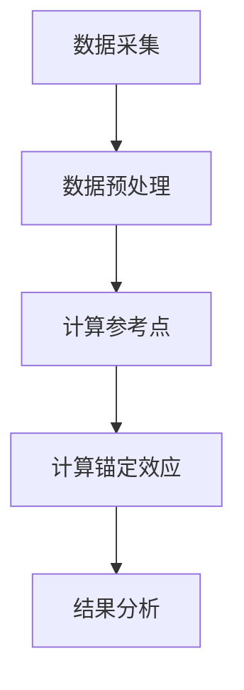

                 


# 锚定效应：参考点如何影响资产定价

> 关键词：锚定效应，资产定价，行为金融学，参考点，市场情绪，定价模型

> 摘要：本文深入探讨了锚定效应在资产定价中的作用，分析了其背后的理论基础、数学模型以及实际应用。通过系统化的分析与案例研究，揭示了参考点如何影响资产定价，并为实际操作提供了可行的解决方案。

---

## 第1章：锚定效应的定义与背景

### 1.1 什么是锚定效应

#### 1.1.1 锚定效应的定义
锚定效应（Anchoring Effect）是行为经济学中的一个重要概念，指个体在决策过程中，往往过度依赖某个初始的参考点（即“锚点”），导致决策结果偏离实际情况的现象。这个参考点可能是价格、数值、时间或某种特定的条件。

#### 1.1.2 锚定效应的核心特征
- **参考点依赖性**：决策者的行为高度依赖于某个特定的参考点。
- **认知偏差**：锚定效应是认知偏差的一种表现，反映了人类在信息处理中的非理性特征。
- **动态调整**：参考点并非固定不变，会根据市场环境和个体认知的变化而调整。

#### 1.1.3 锚定效应的起源与发展
锚定效应的概念最早由心理学家Amos Tversky和Daniel Kahneman提出，他们通过实验研究发现，个体在决策时往往会过度依赖初始信息，导致判断失误。

---

### 1.2 锚定效应在资产定价中的重要性

#### 1.2.1 资产定价的基本概念
资产定价是指通过对资产的内在价值、市场环境和风险因素的分析，确定其合理价格的过程。传统的资产定价模型（如CAPM和APT）假设市场参与者是理性的，但现实中，投资者的行为往往受到心理因素的影响。

#### 1.2.2 锚定效应与资产定价的关系
锚定效应通过影响投资者的决策过程，进而影响资产的定价。例如，投资者可能会过度依赖历史价格或市场情绪作为参考点，导致资产价格偏离其真实价值。

#### 1.2.3 锚定效应在金融市场中的应用
锚定效应在股票、债券、基金等资产的定价中都有广泛应用。例如，投资者在买卖股票时，往往会参考近期的价格波动或市场趋势。

---

## 第2章：锚定效应的理论基础

### 2.1 行为金融学基础

#### 2.1.1 行为金融学的定义与核心理论
行为金融学（Behavioral Finance）是研究金融市场中人类行为偏差及其对资产定价影响的学科。与传统金融学不同，行为金融学强调心理因素在投资决策中的作用。

#### 2.1.2 锚定效应在行为金融学中的地位
锚定效应是行为金融学的核心理论之一，它揭示了人类在决策过程中对参考点的过度依赖。

#### 2.1.3 行为金融学与传统金融学的对比
- **传统金融学**：假设投资者是理性的，市场是有效的。
- **行为金融学**：关注投资者的心理偏差及其对市场的影响。

---

### 2.2 锚定效应的核心原理

#### 2.2.1 初始参考点的形成
初始参考点可能是历史价格、市场预期或某种基准指数。例如，投资者在买卖股票时，可能会参考近期的收盘价作为参考点。

#### 2.2.2 参考点的调整机制
当市场环境发生变化时，参考点也会相应调整。例如，如果市场出现新的信息，投资者可能会调整其参考点。

#### 2.2.3 锚定效应的动态变化
锚定效应不是一成不变的，它会受到市场情绪、信息环境和个体认知的影响。

---

## 第3章：锚定效应与资产定价的联系

### 3.1 资产定价的基本模型

#### 3.1.1 市场定价模型概述
市场定价模型（如CAPM、APT）是传统金融学的核心工具，但它们假设投资者是理性的。

#### 3.1.2 初级定价模型的局限性
初级定价模型未能充分考虑投资者心理偏差对定价的影响。

#### 3.1.3 高级定价模型的引入
行为金融学引入了锚定效应等心理因素，丰富了资产定价的理论体系。

---

### 3.2 锚定效应在定价模型中的应用

#### 3.2.1 初始参考点的选取
投资者在定价时，可能会参考历史价格或市场预期作为初始参考点。

#### 3.2.2 参考点调整对定价的影响
参考点的调整会导致定价的波动。例如，如果市场预期上升，投资者可能会调整其参考点，导致资产价格上涨。

#### 3.2.3 锚定效应与市场情绪的关系
市场情绪（如乐观或悲观）会影响参考点的选择，从而影响资产定价。

---

## 第4章：锚定效应的数学模型与公式

### 4.1 锚定效应的数学表达

#### 4.1.1 初始参考点的数学定义
设初始参考点为$P_0$，表示投资者在定价时的初始参考价格。

#### 4.1.2 参考点调整的数学模型
参考点的调整可以通过以下公式表示：
$$ P_{\text{调整后}} = P_0 + \Delta P $$
其中，$\Delta P$是调整量，取决于市场环境和投资者情绪。

#### 4.1.3 锚定效应的量化公式
锚定效应的量化可以通过以下公式表示：
$$ \text{锚定效应} = |P_{\text{实际}} - P_{\text{参考点}}| $$

---

### 4.2 锚定效应的计算方法

#### 4.2.1 参考点的计算步骤
1. 确定初始参考点$P_0$。
2. 根据市场环境调整$P_0$，得到$P_{\text{调整后}}$。
3. 计算锚定效应。

#### 4.2.2 锚定效应的度量指标
锚定效应可以通过以下指标度量：
- 参考点与实际价格的差异。
- 市场情绪对参考点的影响程度。

---

## 第5章：系统分析与架构设计

### 5.1 系统功能设计

#### 5.1.1 系统目标与范围
本系统旨在通过分析锚定效应，帮助投资者更好地理解资产定价过程。

#### 5.1.2 系统核心功能模块
- 数据采集模块：采集市场数据和投资者情绪数据。
- 模型计算模块：计算锚定效应。
- 结果分析模块：分析锚定效应对资产定价的影响。

#### 5.1.3 系统功能流程图


---

### 5.2 系统架构设计

#### 5.2.1 系统架构概述
系统采用分层架构，包括数据层、计算层和应用层。

#### 5.2.2 系统模块划分
- 数据层：负责数据的存储和管理。
- 计算层：负责锚定效应的计算。
- 应用层：负责结果的展示和分析。

#### 5.2.3 系统接口设计
系统通过API接口与其他系统进行交互。

---

## 第6章：项目实战与案例分析

### 6.1 项目环境搭建

#### 6.1.1 系统环境要求
- 操作系统：Linux/Windows/MacOS
- 开发工具：Python、Jupyter Notebook
- 数据源：股票价格数据、市场情绪数据

#### 6.1.2 开发工具安装
安装Python和相关库（如Pandas、NumPy）。

---

### 6.2 核心代码实现

#### 6.2.1 参考点计算代码
```python
import pandas as pd

# 假设我们有历史价格数据
data = pd.read_csv('stock_prices.csv')
reference_point = data['price'].mean()
print("初始参考点：", reference_point)
```

#### 6.2.2 锚定效应模型实现
```python
def calculate_anchoring_effect(actual_price, reference_point):
    return abs(actual_price - reference_point)

# 示例计算
actual_price = 100
reference_point = 90
anchoring_effect = calculate_anchoring_effect(actual_price, reference_point)
print("锚定效应：", anchoring_effect)
```

---

## 第7章：最佳实践与总结

### 7.1 最佳实践
- 在实际应用中，应结合市场环境和投资者情绪，动态调整参考点。
- 使用多种模型进行验证，避免单一模型的偏差。

### 7.2 小结
本文通过理论分析和实际案例，揭示了锚定效应在资产定价中的重要性，并为实际操作提供了可行的解决方案。

### 7.3 注意事项
- 锚定效应是认知偏差的一种表现，投资者应尽量克服其影响。
- 在实际应用中，应结合多种因素进行综合分析。

### 7.4 拓展阅读
- 《Thinking, Fast and Slow》——Daniel Kahneman
- 《Behavioral Finance: The New Science of Investor Decision-Making》——Richard Thaler

---

作者：AI天才研究院/AI Genius Institute & 禅与计算机程序设计艺术 /Zen And The Art of Computer Programming

