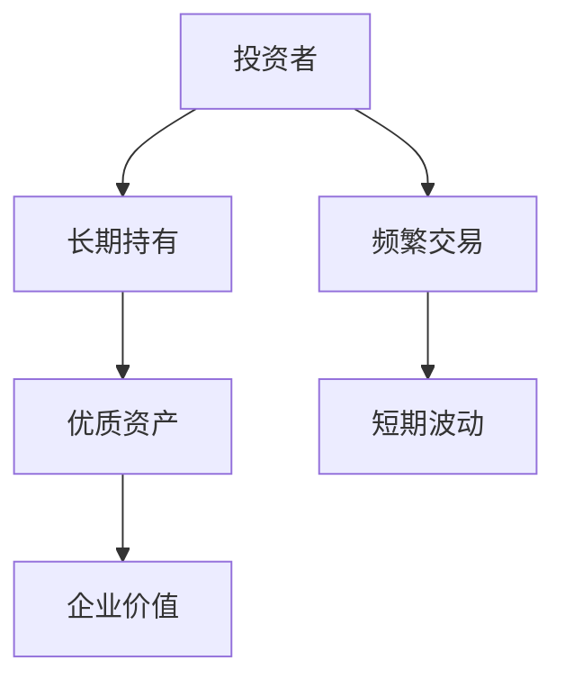

                 

# 长期持有vs频繁交易：巴菲特的选择

> 关键词：长期持有，巴菲特，投资策略，频繁交易，价值投资，风险管理

> 摘要：本文深入探讨了长期持有与频繁交易两种投资策略的优劣，分析了巴菲特为何选择长期持有策略，并通过实证数据、案例研究和策略对比，为投资者提供科学的投资决策参考。

---

## 第一部分: 长期持有与频繁交易的背景与核心概念

### 第1章: 长期持有与频繁交易的定义与区别

#### 1.1 长期持有的定义与特征

##### 1.1.1 长期持有的核心概念
长期持有是一种投资策略，强调买入优质资产并长期持有，不因短期市场波动频繁调整投资组合。其核心理念是通过长期持有优质资产，获得企业成长带来的复利收益。

##### 1.1.2 长期持有与频繁交易的对比
- **持有时间**：长期持有强调长期，通常为数年甚至更久；频繁交易强调短期，通常为数周、数天甚至数小时。
- **交易频率**：长期持有交易次数少，通常每年几次；频繁交易交易次数多，甚至每日多次。
- **市场波动应对**：长期持有注重忽略短期波动，关注企业长期价值；频繁交易注重捕捉短期波动，追求短期收益。

##### 1.1.3 长期持有的优势与劣势
- **优势**：
  - 减少交易成本和税费。
  - 避免短期波动的干扰，降低情绪化决策。
  - 通过复利效应，实现财富的长期增长。
- **劣势**：
  - 需要较高的选股能力，选择真正优质的资产。
  - 面对市场崩盘或黑天鹅事件时，可能承受较大的回撤风险。

#### 1.2 频繁交易的定义与特征

##### 1.2.1 频繁交易的核心概念
频繁交易是一种投资策略，强调通过频繁买卖资产，利用短期价格波动获利。其核心理念是通过技术分析和市场情绪预测，捕捉短期价格波动。

##### 1.2.2 频繁交易与长期持有的对比
- **风险承受**：频繁交易风险更高，因为需要承担更多的市场波动和流动性风险。
- **交易成本**：频繁交易成本更高，包括佣金、税费和滑点。
- **心理因素**：频繁交易更容易受到贪婪和恐惧的影响，导致非理性决策。

#### 1.3 巴菲特的投资理念与长期持有策略

##### 1.3.1 巴菲特的投资哲学
巴菲特的投资哲学基于价值投资，认为市场先生是仆人而非主人。他强调购买优质资产，长期持有，赚企业成长的钱，而不是赚市场的钱。

##### 1.3.2 长期持有的哲学基础
- **企业价值**：长期持有注重企业的内在价值，而非市场波动。
- **复利效应**：通过长期持有优质资产，实现财富的指数级增长。
- **安全边际**：买入时留有安全边际，降低短期波动带来的风险。

#### 1.4 长期持有与频繁交易的边界与外延

##### 1.4.1 长期持有适用的场景
- **市场波动较大**：长期持有适合长期趋势明显、市场波动较大的情况。
- **优质资产稀缺**：当优质资产稀缺时，长期持有更具优势。
- **投资者耐心不足**：长期持有需要投资者具备较高的耐心和纪律性。

##### 1.4.2 频繁交易适用的场景
- **市场短期波动大**：频繁交易适合短期趋势明显、市场波动剧烈的情况。
- **交易成本低**：当交易成本较低时，频繁交易更具优势。
- **投资者经验丰富**：频繁交易需要投资者具备较高的市场敏感性和交易技巧。

##### 1.4.3 两者的相互关系与动态平衡
长期持有和频繁交易并非完全对立，而是可以互补。例如，在市场剧烈波动时，适当进行短期交易对冲风险；而在市场稳定时，长期持有优质资产。

#### 1.5 核心概念结构与要素组成

##### 1.5.1 长期持有与频繁交易的比较框架
- **投资目标**：长期持有注重资产增值，频繁交易注重短期收益。
- **风险偏好**：长期持有风险较低，频繁交易风险较高。
- **交易成本**：长期持有成本较低，频繁交易成本较高。

##### 1.5.2 投资目标与策略的关系
- 长期目标与长期持有策略相匹配。
- 短期目标与频繁交易策略相匹配。

##### 1.5.3 风险偏好与收益预期的平衡
- 长期持有适合风险偏好较低的投资者，追求稳定收益。
- 频繁交易适合风险偏好较高的投资者，追求高收益。

### 第2章: 长期持有与频繁交易的核心概念与联系

#### 2.1 核心概念原理

##### 2.1.1 长期持有的价值投资原理
- **价值投资**：买入低于内在价值的资产，长期持有，等待市场回归理性。
- **复利效应**：通过长期持有，复利效应使财富呈指数级增长。

##### 2.1.2 频繁交易的技术分析原理
- **技术分析**：通过分析价格走势、成交量等技术指标，预测短期价格波动。
- **市场情绪**：利用市场情绪的波动，捕捉短期价格波动。

#### 2.2 核心概念属性特征对比表格

| 比较维度 | 长期持有 | 频繁交易 |
|----------|----------|----------|
| 投资期限 | 长期 | 短期 |
| 交易频率 | 低 | 高 |
| 风险承受 | 较低 | 较高 |
| 成本 | 低 | 高 |
| 税务影响 | 小 | 大 |

#### 2.3 ER实体关系图

---

## 第二部分: 长期持有与频繁交易的理论与实证分析

### 第3章: 长期持有策略的理论基础与实证分析

#### 3.1 长期持有策略的理论基础

##### 3.1.1 价值投资理论
- **价值投资**：买入低于内在价值的资产，长期持有。
- **安全边际**：买入时留有安全边际，降低风险。

##### 3.1.2 市场有效性的假设
- **有效市场假说**：市场通常是有效的，短期价格波动不可预测。
- **长期价格反映基本面**：长期价格反映企业的内在价值。

#### 3.2 长期持有策略的实证分析

##### 3.2.1 长期持有的历史表现
- **历史数据**：长期持有优质资产的历史回报通常优于频繁交易。
- **案例分析**：巴菲特的长期持有策略在过去几十年的表现优于频繁交易。

##### 3.2.2 长期持有的风险与收益
- **收益**：长期持有通常带来较高的复利收益。
- **风险**：短期波动可能导致回撤，但长期来看风险较低。

### 第4章: 频繁交易策略的理论基础与实证分析

#### 4.1 频繁交易策略的理论基础

##### 4.1.1 技术分析理论
- **技术分析**：通过分析价格走势、成交量等指标预测短期价格波动。
- **趋势交易**：跟随价格趋势，顺势交易。

##### 4.1.2 市场情绪理论
- **情绪驱动**：市场情绪波动影响价格短期走势。
- **贪婪与恐惧**：投资者的贪婪和恐惧导致价格短期波动。

#### 4.2 频繁交易策略的实证分析

##### 4.2.1 频繁交易的历史表现
- **高交易成本**：频繁交易的佣金、税费和滑点成本较高。
- **短期波动不可靠**：短期价格波动不可预测，频繁交易的成功率较低。

##### 4.2.2 频繁交易的风险与收益
- **收益**：频繁交易可能带来短期收益，但长期来看收益不稳定。
- **风险**：频繁交易风险较高，容易受到市场波动和情绪影响。

---

## 第三部分: 长期持有与频繁交易的策略对比与风险管理

### 第5章: 长期持有与频繁交易的策略对比

#### 5.1 策略优劣势对比

##### 5.1.1 长期持有的优势
- **低交易成本**：长期持有交易次数少，成本低。
- **复利效应**：长期持有能够实现财富的指数级增长。
- **心理优势**：长期持有减少情绪化决策，避免贪婪和恐惧。

##### 5.1.2 频繁交易的劣势
- **高交易成本**：频繁交易佣金、税费和滑点成本较高。
- **高风险**：频繁交易容易受到短期波动和情绪影响，风险较高。

#### 5.2 适合的投资者类型

##### 5.2.1 长期持有适合的投资者
- **风险偏好低**：能够承受较低的短期波动风险。
- **具备长期视角**：能够长期持有优质资产，不因短期波动影响决策。
- **具备选股能力**：能够识别优质资产。

##### 5.2.2 频繁交易适合的投资者
- **风险偏好高**：能够承受较高的短期波动风险。
- **具备短期预测能力**：能够通过技术分析或市场情绪预测短期价格波动。
- **经验丰富**：具备丰富的交易经验和市场敏感性。

### 第6章: 风险管理与心理因素

#### 6.1 风险管理的重要性

##### 6.1.1 长期持有中的风险管理
- **分散投资**：通过分散投资降低风险。
- **定期评估**：定期评估投资组合，确保符合长期目标。

##### 6.1.2 频繁交易中的风险管理
- **止损策略**：设置止损点，避免亏损过大。
- **控制仓位**：避免过度杠杆，控制仓位。

#### 6.2 心理因素的影响

##### 6.2.1 长期持有中的心理因素
- **耐心**：长期持有需要耐心等待市场回归理性。
- **纪律性**：坚持长期策略，避免短期波动干扰。

##### 6.2.2 频繁交易中的心理因素
- **贪婪**：容易受到贪婪驱动，追求短期收益。
- **恐惧**：容易受到恐惧影响，错失机会。

---

## 第四部分: 结论与建议

### 第7章: 总结与投资建议

#### 7.1 总结
- 长期持有和频繁交易各有优劣，投资者需要根据自身情况选择合适策略。
- 长期持有适合风险偏好低、具备长期视角和选股能力的投资者。
- 频繁交易适合风险偏好高、具备短期预测能力和交易经验的投资者。

#### 7.2 投资建议
1. **明确投资目标**：明确自己的投资目标和风险偏好。
2. **选择合适策略**：根据自身情况选择长期持有或频繁交易策略。
3. **加强风险管理**：无论选择哪种策略，都需要加强风险管理，避免重大损失。
4. **持续学习**：持续学习投资知识，提升自己的投资能力。

---

## 作者信息

作者：AI天才研究院/AI Genius Institute & 禅与计算机程序设计艺术 /Zen And The Art of Computer Programming

---

本文通过系统的分析和对比，为投资者提供了长期持有和频繁交易策略的深度剖析和实践建议，帮助投资者在复杂多变的市场中做出明智的投资决策。

