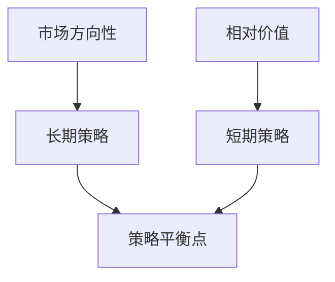
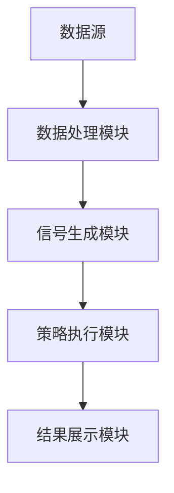

                 


# 长短期策略：平衡市场方向性与相对价值

## 关键词：长短期策略、市场方向性、相对价值、策略平衡、算法原理、系统架构、项目实战

## 摘要：  
在金融投资领域，长短期策略的平衡是实现稳健收益的关键。本文深入探讨了如何通过长短期策略的结合，平衡市场方向性与相对价值，以实现投资收益的最大化。文章首先介绍了长短期策略的背景与概念，接着分析了核心概念与联系，详细讲解了相关算法原理，并通过数学模型与系统架构进一步深化了策略实现。最后，通过项目实战展示了策略的应用，并总结了最佳实践。

---

## 第一部分：长短期策略的背景与概念

### 第1章：长短期策略的定义与分类

#### 1.1 长期策略的定义与特点
- **长期策略**：关注市场长期趋势，注重基本面分析，追求稳健收益。
- **特点**：  
  - 投资期限长，注重资产配置。  
  - 风险较低，收益稳定。  
  - 适用于稳健型投资者。

#### 1.2 短期策略的定义与特点
- **短期策略**：关注短期市场波动，注重技术分析，追求短期收益。
- **特点**：  
  - 投资期限短，注重交易机会。  
  - 风险较高，收益波动大。  
  - 适用于激进型投资者。

#### 1.3 长短期策略的分类与对比
- **分类**：  
  - 长期策略：价值投资、指数基金。  
  - 短期策略：趋势交易、套利交易。  
- **对比**：  
  | 属性 | 长期策略 | 短期策略 |  
  |------|----------|----------|  
  | 时间跨度 | 长期 | 短期 |  
  | 风险 | 低 | 高 |  
  | 收益 | 稳定 | 波动 |  

### 第2章：市场方向性与相对价值的平衡

#### 2.1 市场方向性的概念
- **市场方向性**：指整体市场趋势，如牛市、熊市。  
- **影响因素**：宏观经济、政策变化、市场情绪。  

#### 2.2 相对价值的定义
- **相对价值**：资产相对于市场的估值，如低市盈率、高股息率。  
- **计算方法**：市盈率、市净率、股息率等。  

#### 2.3 长短期策略在平衡中的作用
- **长期策略**：通过价值投资捕捉市场低估机会。  
- **短期策略**：通过趋势交易捕捉市场波动机会。  
- **平衡**：结合长期策略的稳健性和短期策略的灵活性，实现收益最大化。

---

## 第二部分：长短期策略的核心概念与联系

### 第3章：长短期策略的核心原理

#### 3.1 长短期策略的核心原理
- **长期策略**：基于基本面分析，寻找具有持续增长潜力的资产。  
- **短期策略**：基于技术分析，捕捉短期价格波动。  
- **平衡点**：通过动态调整资产配置，平衡短期波动与长期收益。

#### 3.2 长短期策略的ER实体关系图


---

## 第三部分：长短期策略的算法原理

### 第4章：长短期策略的数学模型与公式

#### 4.1 移动平均线模型
- **公式**：  
  $$ \text{MA}_n = \frac{1}{n} \sum_{i=1}^{n} p_i $$
  其中，\( p_i \) 是第 \( i \) 个交易日的价格，\( n \) 是窗口大小。
- **应用**：当价格高于移动平均线时，买入；当价格低于移动平均线时，卖出。

#### 4.2 相对强弱指数（RSI）模型
- **公式**：  
  $$ \text{RSI} = 100 - \frac{100}{1 + \frac{A}{B}} $$
  其中，\( A \) 是平均上涨幅度，\( B \) 是平均下跌幅度。
- **应用**：当RSI < 30时，买入；当RSI > 70时，卖出。

---

## 第四部分：长短期策略的系统架构设计

### 第5章：长短期策略的系统架构

#### 5.1 系统功能设计
- **模块划分**：  
  - 数据获取模块：采集市场数据。  
  - 信号生成模块：计算移动平均线和RSI指标。  
  - 策略执行模块：根据信号执行交易。  
- **流程**：  
  1. 数据获取模块采集市场数据。  
  2. 信号生成模块计算指标并生成信号。  
  3. 策略执行模块根据信号执行交易。

#### 5.2 系统架构图


---

## 第五部分：长短期策略的项目实战

### 第6章：长短期策略的实现与案例分析

#### 6.1 环境安装与配置
- **工具**：Python、Pandas、Matplotlib、Backtrader。  
- **步骤**：  
  1. 安装Python和相关库。  
  2. 配置数据源（如Yahoo Finance）。  

#### 6.2 核心代码实现
```python
import pandas as pd
import matplotlib.pyplot as plt

# 示例数据
data = {'价格': [100, 105, 98, 110, 115]}
df = pd.DataFrame(data)

# 计算移动平均线
window = 3
df['MA'] = df['价格'].rolling(window).mean()

# 绘制图表
plt.figure(figsize=(10, 6))
plt.plot(df['价格'], label='价格')
plt.plot(df['MA'], label='MA')
plt.legend()
plt.show()
```

#### 6.3 案例分析与解读
- **案例**：使用真实股票数据，计算移动平均线和RSI指标，生成交易信号并执行交易。  
- **结果**：展示策略收益与市场基准收益的对比。  

#### 6.4 策略优化与调整
- **优化点**：调整窗口大小、动态调整权重、结合多种指标。  
- **调整方法**：通过回测优化参数，结合机器学习模型改进预测准确性。

---

## 第六部分：总结与附录

### 第7章：长短期策略的总结与展望

#### 7.1 策略总结
- **优势**：通过平衡长短期策略，实现稳健收益。  
- **劣势**：需要动态调整，对市场敏感。  
- **最佳实践**：结合市场环境，灵活调整策略配置。

#### 7.2 附录
- **参考文献**：  
  - 《投资学》（书籍）  
  - 《技术分析实战技巧》（书籍）  
  - 《Python金融数据分析》（书籍）  

---

## 作者：AI天才研究院 & 禅与计算机程序设计艺术

