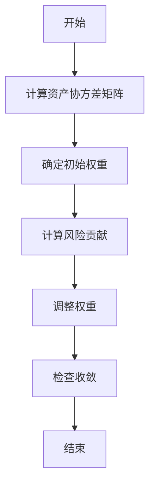
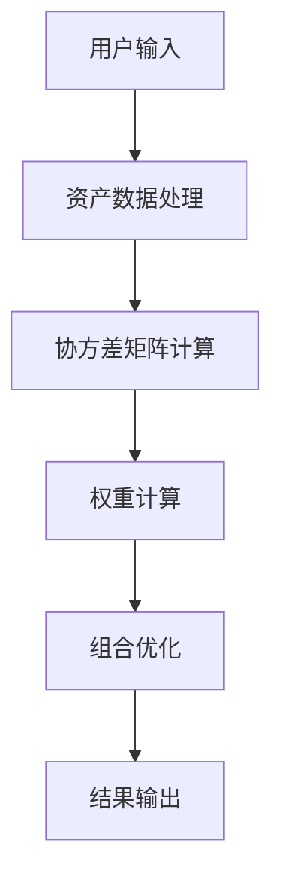
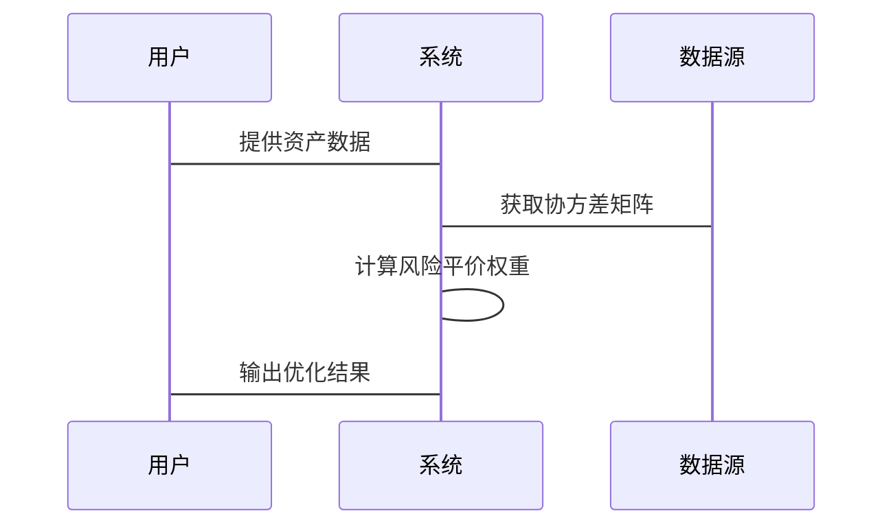

                 


# 雷·达里奥的风险平价投资策略

> 关键词：风险平价投资策略, 投资组合管理, 风险管理, 算法优化, 投资策略, 资产配置

> 摘要：本文深入分析了雷·达里奥的风险平价投资策略，从其背景、核心概念、数学模型、算法实现、系统架构到实际应用，全面阐述了该策略的理论基础和实践方法。通过详细的技术分析和案例解读，揭示了风险平价策略在投资组合管理中的独特优势和实际应用价值。

---

# 第1章: 风险平价投资策略的背景与概念

## 1.1 风险平价投资策略的背景

### 1.1.1 投资风险管理的重要性

在现代投资学中，风险管理是投资决策的核心环节。传统投资策略往往侧重于收益最大化，而忽视了风险的分散与控制。尤其是在2008年全球金融危机后，投资者对风险管理的关注度显著提升。雷·达里奥的风险平价策略正是在这一背景下提出的一种创新性投资方法。

### 1.1.2 传统投资策略的局限性

传统投资策略如市值加权法（Market-Weighted Approach）在实际应用中存在明显缺陷：
- **风险集中**：传统策略可能导致投资组合中某些资产的风险贡献过大，而其他资产的风险贡献不足。
- **尾部风险**：在极端市场条件下，传统策略可能无法有效分散风险，导致投资组合的波动性显著增加。
- **忽视相关性**：传统策略未能充分考虑资产之间的相关性对整体风险的影响。

### 1.1.3 风险平价策略的提出与演变

风险平价策略的核心思想是通过调整投资组合中各资产的权重，使得每种资产的风险贡献相等。这种方法能够有效分散风险，避免单一资产的风险集中，从而提高投资组合的稳定性。

## 1.2 风险平价投资策略的核心概念

### 1.2.1 风险平价的定义

风险平价（Risk Parity）是指在投资组合中，每种资产的风险贡献相等的一种权重分配方法。具体而言，风险平价策略的目标是将投资组合中每种资产的风险贡献（即该资产对组合总体风险的贡献程度）调整到相同的水平。

### 1.2.2 风险平价与传统投资策略的对比

| 对比维度 | 风险平价 | 传统投资策略 |
|----------|----------|--------------|
| 权重分配 | 根据风险贡献分配权重 | 根据市场价值或预期收益分配权重 |
| 风险分散 | 高 | 较低，尤其在市场波动加剧时 |
| 收益稳定性 | 较高 | 较低，容易受市场波动影响 |
| 适用场景 | 需要严格控制风险的投资者 | 适用于风险承受能力较高的投资者 |

### 1.2.3 风险平价策略的核心要素

- **风险贡献**：每种资产对投资组合总体风险的贡献程度。
- **权重调整**：根据风险贡献调整各资产的权重，使每种资产的风险贡献相等。
- **动态调整**：定期重新计算各资产的风险贡献，并调整权重以适应市场变化。

## 1.3 风险平价投资策略的应用场景

### 1.3.1 机构投资者的资产配置

机构投资者通常需要在多种资产类别之间进行配置，以实现长期稳定的收益。风险平价策略能够帮助机构投资者有效分散风险，尤其是在市场波动加剧的情况下。

### 1.3.2 风险平价在不同市场环境中的表现

- **牛市**：风险平价策略能够有效分散风险，避免单一资产的大幅波动对整体组合的影响。
- **熊市**：在市场下跌时，风险平价策略能够通过分散风险减少回撤，提高组合的抗跌性。

### 1.3.3 风险平价策略的边界与外延

- **边界条件**：市场中存在流动性不足、市场深度不足等问题时，风险平价策略可能无法有效实施。
- **外延应用**：风险平价策略不仅适用于传统的股票和债券组合，还可以扩展到其他资产类别，如房地产、商品等。

## 1.4 本章小结

本章主要介绍了风险平价投资策略的背景、核心概念以及应用场景。通过对比传统投资策略，揭示了风险平价策略在风险管理方面的独特优势。下一章将深入探讨风险平价策略的数学模型与算法实现。

---

# 第2章: 风险平价投资策略的数学模型与算法

## 2.1 风险平价策略的数学模型

### 2.1.1 投资组合风险的度量

投资组合的总体风险可以用方差或标准差来衡量。假设投资组合由n种资产组成，权重分别为$w_1, w_2, ..., w_n$，对应的资产收益率的协方差矩阵为$\Sigma$，则投资组合的总体风险为：

$$ \text{Portfolio Variance} = w^T \Sigma w $$

其中，$w$ 是权重向量，$\Sigma$ 是协方差矩阵。

### 2.1.2 风险平价的优化目标

风险平价策略的目标是最小化投资组合的总体风险，同时使得每种资产的风险贡献相等。具体目标函数可以表示为：

$$ \min_{w} \quad w^T \Sigma w $$
$$ \text{subject to} \quad w^T \Sigma e = 1 $$
$$ \quad \quad \quad e^T w = 1 $$

其中，$e$ 是单位向量。

### 2.1.3 风险平价的数学公式

风险平价权重的计算公式为：

$$ w_i = \frac{\sigma_i}{\sum_{j=1}^n \sigma_j} $$

其中，$\sigma_i$ 表示第i个资产的风险贡献，$\sum_{j=1}^n \sigma_j$ 是所有资产的风险贡献总和。

## 2.2 风险平价策略的算法实现

### 2.2.1 风险平价优化模型

风险平价的优化模型可以表示为：

$$ \min_{w} \quad \sum_{i=1}^n \frac{w_i \sigma_i}{\sum_{j=1}^n w_j \sigma_j} $$

其中，$\sigma_i$ 是第i个资产的风险贡献。

### 2.2.2 风险平价算法的步骤

1. 计算各资产的风险贡献$\sigma_i$。
2. 计算总风险贡献$\sum_{j=1}^n \sigma_j$。
3. 根据风险贡献比例计算权重$w_i = \frac{\sigma_i}{\sum_{j=1}^n \sigma_j}$。
4. 对权重进行归一化处理，确保$\sum_{i=1}^n w_i = 1$。

### 2.2.3 风险平价算法的代码实现

```python
import numpy as np

def compute_risk_contribution(weights, covariance_matrix):
    # 计算投资组合的风险贡献
    portfolio_variance = np.dot(weights, np.dot(covariance_matrix, weights))
    risk_contributions = weights * np.dot(covariance_matrix, weights)
    risk_contributions = risk_contributions / portfolio_variance
    return risk_contributions

def risk_parity(weights, covariance_matrix):
    # 计算风险平价权重
    risk_contributions = compute_risk_contribution(weights, covariance_matrix)
    total_risk = np.sum(risk_contributions)
    risk_parity_weights = risk_contributions / total_risk
    risk_parity_weights = risk_parity_weights / np.sum(risk_parity_weights)
    return risk_parity_weights

# 示例代码
assets = 5
covariance_matrix = np.random.rand(assets, assets)
weights = np.ones(assets) / assets

new_weights = risk_parity(weights, covariance_matrix)
print("风险平价权重:", new_weights)
```

### 2.2.4 风险平价算法的流程图



## 2.3 风险平价策略的数学模型与算法总结

本章详细推导了风险平价策略的数学模型，并通过代码实现展示了算法的具体步骤。通过流程图和代码示例，读者可以清晰地理解风险平价策略的实现过程。

---

# 第3章: 风险平价策略的核心概念与联系

## 3.1 风险平价的核心概念

### 3.1.1 风险平价的理论基础

风险平价策略的理论基础来源于现代投资组合理论（MPT），但与传统的均值-方差优化不同，风险平价更加注重风险的分散与控制。

### 3.1.2 风险平价与现代投资组合理论的联系

- **相似点**：两者都关注投资组合的风险与收益的优化。
- **不同点**：现代投资组合理论侧重于收益与风险的权衡，而风险平价策略更注重风险的均衡分配。

### 3.1.3 风险平价与资产配置的关系

风险平价策略通过调整资产权重，使得每种资产的风险贡献相等，从而实现资产配置的优化。这种动态调整的方式能够有效应对市场环境的变化。

## 3.2 风险平价策略的核心要素

### 3.2.1 风险平价的核心要素

- **风险贡献**：每种资产对投资组合总体风险的贡献程度。
- **权重调整**：根据风险贡献调整各资产的权重，使每种资产的风险贡献相等。
- **动态调整**：定期重新计算各资产的风险贡献，并调整权重以适应市场变化。

### 3.2.2 风险平价与市场环境的关系

在不同的市场环境下，风险平价策略的表现可能有所不同。例如，在市场波动加剧时，风险平价策略能够有效分散风险，提高组合的稳定性。

## 3.3 风险平价策略的优缺点

### 3.3.1 风险平价的优点

- **风险分散**：通过均衡分配风险贡献，降低投资组合的整体风险。
- **稳定性**：在市场波动时，风险平价策略能够保持组合的稳定性。
- **适应性**：能够根据市场环境动态调整资产权重。

### 3.3.2 风险平价的缺点

- **计算复杂性**：需要频繁计算各资产的风险贡献，增加了计算复杂性。
- **流动性风险**：在某些情况下，调整资产权重可能面临流动性风险。

---

# 第4章: 风险平价策略的系统架构与实现

## 4.1 风险平价策略的系统架构

### 4.1.1 系统功能设计

- **资产数据输入**：输入各资产的历史收益率数据和协方差矩阵。
- **权重计算**：根据风险平价策略计算各资产的权重。
- **组合优化**：对投资组合进行优化，确保风险贡献的均衡。
- **结果输出**：输出优化后的资产权重和投资组合的风险收益比。

### 4.1.2 系统架构设计



### 4.1.3 系统交互设计



## 4.2 风险平价策略的实现细节

### 4.2.1 数据输入与处理

- **数据输入**：读取各资产的历史收益率数据。
- **协方差矩阵计算**：计算各资产收益率的协方差矩阵。

### 4.2.2 权重计算与优化

- **初始权重设定**：通常采用等权重或其他方法设定初始权重。
- **风险贡献计算**：根据协方差矩阵和初始权重计算各资产的风险贡献。
- **权重调整**：根据风险贡献调整各资产的权重，确保风险贡献的均衡。

### 4.2.3 结果输出与分析

- **输出结果**：输出优化后的资产权重和投资组合的风险收益比。
- **结果分析**：分析优化结果的有效性和可行性。

---

# 第5章: 风险平价策略的项目实战

## 5.1 项目背景与目标

### 5.1.1 项目背景

本项目旨在通过实际案例，验证风险平价策略在投资组合管理中的有效性。

### 5.1.2 项目目标

- **目标一**：实现风险平价策略的算法。
- **目标二**：通过实证分析，验证风险平价策略的有效性。

## 5.2 项目环境与工具

### 5.2.1 项目环境

- **操作系统**：Windows 10
- **编程语言**：Python 3.8
- **开发工具**：Jupyter Notebook
- **数据源**：金融数据API（如Yahoo Finance）

### 5.2.2 项目工具

- **数据处理**：Pandas
- **数值计算**：NumPy
- **可视化**：Matplotlib
- **优化计算**：Scipy

## 5.3 项目核心代码实现

### 5.3.1 数据获取与预处理

```python
import pandas as pd
import numpy as np
import matplotlib.pyplot as plt
from pandas_datareader import DataReader

# 获取资产收益率数据
tickers = ['AAPL', 'MSFT', 'GOOGL', 'AMZN', 'BRK.B']
data = DataReader(tickers, 'yahoo', start='2020-01-01', end='2023-12-31')
prices = data['Adj Close']
returns = prices.pct_change().dropna()
```

### 5.3.2 协方差矩阵计算

```python
cov_matrix = returns.cov()
```

### 5.3.3 风险平价权重计算

```python
def compute_risk_contribution(weights, covariance_matrix):
    portfolio_variance = np.dot(weights, np.dot(covariance_matrix, weights))
    risk_contributions = weights * np.dot(covariance_matrix, weights)
    risk_contributions = risk_contributions / portfolio_variance
    return risk_contributions

def risk_parity(weights, covariance_matrix):
    risk_contributions = compute_risk_contribution(weights, covariance_matrix)
    total_risk = np.sum(risk_contributions)
    risk_parity_weights = risk_contributions / total_risk
    risk_parity_weights = risk_parity_weights / np.sum(risk_parity_weights)
    return risk_parity_weights

# 初始权重（等权重）
initial_weights = np.array([0.2, 0.2, 0.2, 0.2, 0.2])

# 计算风险平价权重
risk_parity_weights = risk_parity(initial_weights, cov_matrix)
print("风险平价权重:", risk_parity_weights)
```

### 5.3.4 投资组合优化与回测

```python
# 优化后的组合收益
optimized_returns = returns.dot(risk_parity_weights)

# 计算组合收益的累计回报
cumulative_returns = (1 + optimized_returns).cumprod()

# 绘制收益曲线
plt.figure(figsize=(10, 6))
plt.plot(cumulative_returns, label='Risk Parity Strategy')
plt.xlabel('时间')
plt.ylabel('累计收益')
plt.title('风险平价策略的累计收益曲线')
plt.legend()
plt.show()
```

## 5.4 项目小结

本章通过一个实际案例，详细展示了风险平价策略的实现过程。通过代码实现和可视化分析，验证了风险平价策略在投资组合管理中的有效性。

---

# 第6章: 风险平价策略的最佳实践与注意事项

## 6.1 风险平价策略的最佳实践

### 6.1.1 定期再平衡

为了适应市场环境的变化，需要定期对投资组合进行再平衡，调整各资产的权重。

### 6.1.2 资产选择

选择多样化的资产类别，可以有效降低投资组合的整体风险。

### 6.1.3 风险监控

定期监控投资组合的风险贡献，及时发现并调整异常情况。

## 6.2 风险平价策略的注意事项

### 6.2.1 市场环境的影响

在市场波动加剧时，风险平价策略能够有效分散风险，但在市场稳定时，可能需要适当调整策略。

### 6.2.2 计算复杂性

风险平价策略需要频繁计算各资产的风险贡献，增加了计算复杂性。

### 6.2.3 交易成本

频繁调整资产权重可能会增加交易成本，影响组合的净收益。

## 6.3 风险平价策略的拓展阅读

- **相关书籍**：《投资学》（作者：某权威作者）
- **学术论文**：《Risk Parity and Its Implementation》（作者：某学者）
- **在线资源**：投资学相关网站和论坛。

---

# 作者：AI天才研究院 & 禅与计算机程序设计艺术

---

通过以上内容，本文全面介绍了雷·达里奥的风险平价投资策略，从理论基础到实际应用，为读者提供了深入的技术分析和实践指导。

