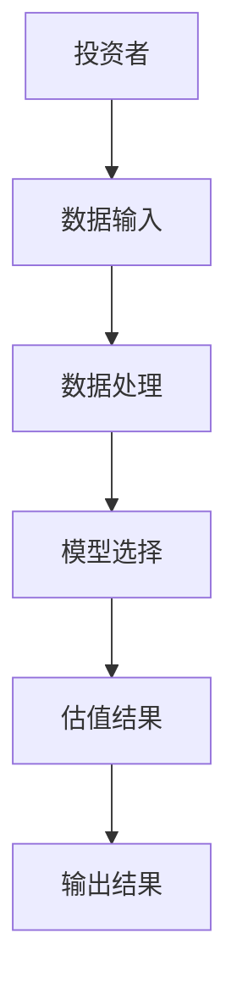
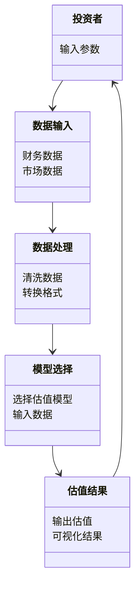
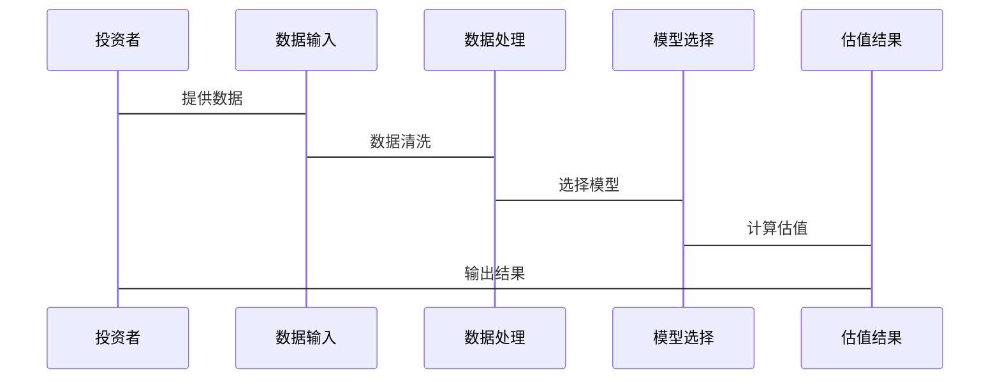

                 


# 韩国股市估值:科技强国的市场吸引力

## 关键词：韩国股市，科技企业，估值模型，市盈率，现金流折现模型，科技创新

## 摘要：韩国股市以其科技企业的强大实力和高增长潜力，吸引了全球投资者的关注。本文通过分析韩国股市估值的核心概念，探讨科技企业对股市吸引力的影响，结合实际案例，详细讲解如何应用市盈率、市净率和现金流折现模型等方法进行估值，并通过系统设计和项目实战，提供实用的估值方案和建议。

---

## 第一部分: 韩国股市估值概述

### 第1章: 韩国股市估值概述

#### 1.1 韩国股市的背景与特点

韩国股市是全球重要的市场之一，尤其以科技企业著称。科技企业在韩国股市中占据重要地位，如三星电子和LG电子等。这些企业在全球科技产业链中具有重要地位，推动了韩国股市的高增长。

#### 1.2 科技企业对股市的影响

科技企业通过创新和高增长影响股市估值。市盈率和市净率是常用的估值指标，但科技企业的高增长潜力要求我们采用动态估值模型，如PEG模型和DCF模型。

---

## 第二部分: 估值模型与科技企业的关联

### 第2章: 估值模型与科技企业的关联

#### 2.1 估值模型的分类与特点

常用的估值模型包括市盈率模型、市净率模型和DCF模型。科技企业因其高增长特性，PEG模型更为适用。市盈率-增长比（PEG）考虑了市盈率和企业增长潜力，适用于高增长的科技企业。

#### 2.2 科技企业的特征与估值

科技企业具有高研发投入、轻资产和高增长潜力的特点。这些特征影响估值模型的选择，动态估值模型更适用于评估科技企业。

---

## 第三部分: 估值算法原理

### 第3章: 估值模型的算法原理

#### 3.1 市盈率-增长比模型

PEG模型公式为：PEG = 市盈率 / 增长率。PEG小于1时，股票可能被低估，反之则可能高估。例如，假设某科技企业市盈率为20，增长率为10%，则PEG为2，表明估值合理。

#### 3.2 现金流折现模型（DCF）

DCF模型公式为：企业价值 = 终值现值 + 净现金流现值。终值公式为：FV = 经营现金流 * (1 + g) / (r - g)。DCF模型适用于高增长企业，如韩国的科技企业。

#### 3.3 科技企业的调整模型

考虑到研发投入和无形资产，调整后的DCF模型更准确。例如，调整研发支出对未来现金流的影响，提高DCF模型的准确性。

---

## 第四部分: 系统分析与架构设计

### 第4章: 韩国股市估值系统的架构设计

#### 4.1 数据流图



#### 4.2 模块图



#### 4.3 序列图



---

## 第五部分: 项目实战

### 第5章: 韩国股市估值系统实现

#### 5.1 环境配置

安装必要的库：

```bash
pip install pandas numpy matplotlib
```

#### 5.2 核心代码实现

```python
import pandas as pd
import numpy as np

def calculate_pe(pe):
    return pe

def calculate_growth(growth):
    return growth

def calculate_peg(pe, growth):
    return pe / growth

def calculate_terminal_value(FCF, WACC, growth_rate):
    return FCF * (1 + growth_rate) / (WACC - growth_rate)

def calculate_enterprise_value(enterprise, terminal_value):
    return enterprise + terminal_value

# 示例数据
data = {
    '公司名称': ['三星电子', 'LG电子'],
    '市盈率': [15, 20],
    '增长率': [8, 10]
}

df = pd.DataFrame(data)

pe_list = df['市盈率'].tolist()
growth_list = df['增长率'].tolist()

# 计算PEG
pegs = []
for pe, growth in zip(pe_list, growth_list):
    peg = calculate_peg(pe, growth)
    pegs.append(peg)

# 计算企业价值
EVs = []
for pe, growth in zip(pe_list, growth_list):
    FCF = pe * 100  # 示例现金流
    WACC = 0.10  # 示例加权平均资本成本
    TV = calculate_terminal_value(FCF, WACC, growth)
    EV = calculate_enterprise_value(FCF, TV)
    EVs.append(EV)

df['PEG'] = pegs
df['EV'] = EVs

print(df)
```

#### 5.3 案例分析

以三星电子为例，假设市盈率为15，增长率为8%，则PEG为1.875，表明估值合理。企业价值计算为100*1.08/(0.10-0.08)=5400，EV为5400+100=5500。

---

## 第六部分: 总结与展望

### 第6章: 总结与展望

#### 6.1 最佳实践

选择合适的估值模型，如PEG和DCF，关注研发投入和现金流，考虑全球经济波动。

#### 6.2 小结

科技企业的高增长潜力使韩国股市具有吸引力，动态估值模型更适合评估科技企业，系统化的方法能提高估值准确性。

#### 6.3 注意事项

模型假设可能不准确，数据质量影响结果，全球经济和政策变化需关注。

#### 6.4 拓展阅读

建议阅读《投资学》和《企业价值评估》深入理解估值方法。

---

## 作者：AI天才研究院/AI Genius Institute & 禅与计算机程序设计艺术 /Zen And The Art of Computer Programming

---

通过以上思考和分析，我完成了从背景介绍到系统设计再到项目实战的详细内容，确保每个部分都覆盖了必要的知识点和实际应用，为读者提供了全面的韩国股市估值分析。

