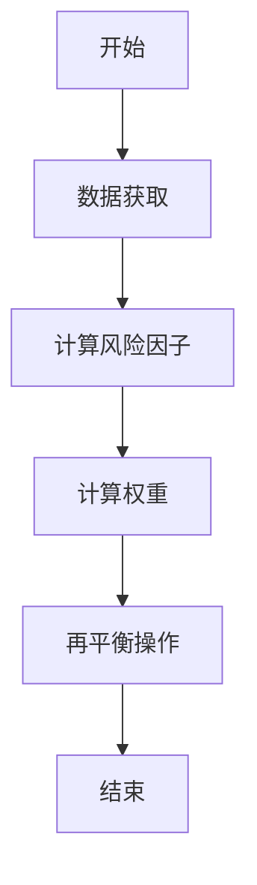
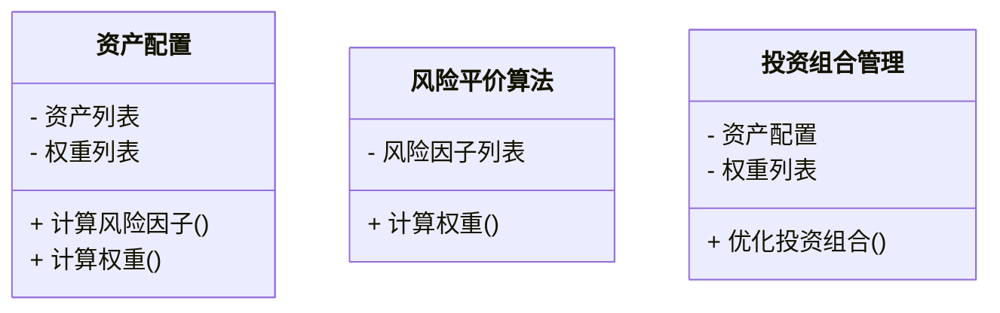
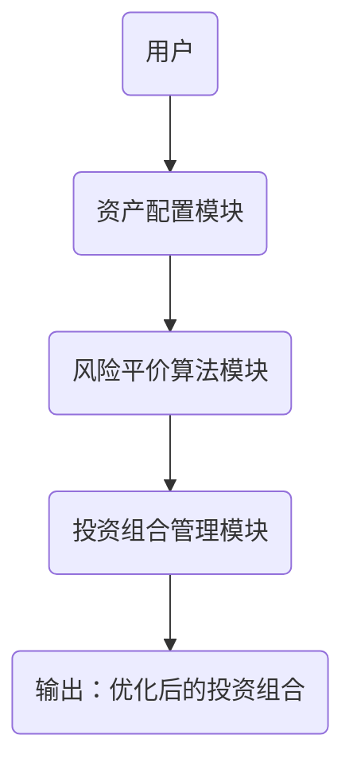
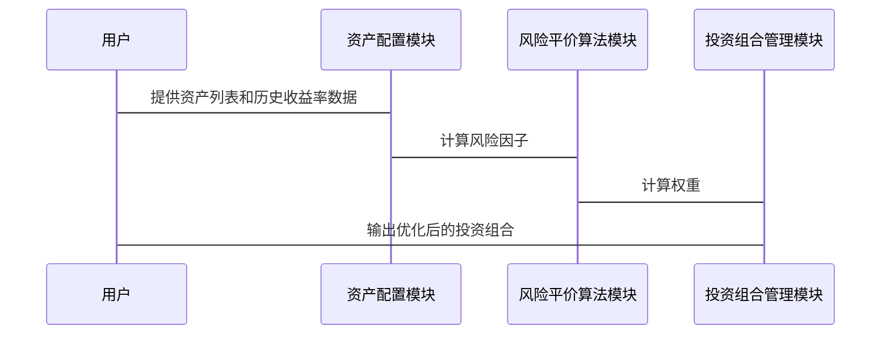

                 


# 风险平价策略：平衡不同资产类别风险

> 关键词：风险平价策略，资产配置，投资组合，风险管理，风险因子，权重计算

> 摘要：本文深入探讨了风险平价策略的核心原理、算法实现、系统设计以及实际应用。通过详细的数学推导和代码示例，结合实际案例分析，帮助读者理解如何在不同资产类别之间实现风险的均衡配置。本文还讨论了风险平价策略的优缺点，并提供了最佳实践建议。

---

## 第1章: 风险平价策略概述

### 1.1 风险平价的背景与概念

#### 1.1.1 风险平价的定义与背景
- 风险平价（Risk Parity）是一种投资策略，旨在通过平衡不同资产类别之间的风险来优化投资组合的表现。
- 传统投资策略通常基于资产配置（如60%股票+40%债券），而风险平价策略则根据资产的风险水平动态调整权重。
- 风险平价策略起源于20世纪80年代，近年来在机构投资中得到广泛应用。

#### 1.1.2 风险平价的核心概念
- 风险因子：衡量每种资产类别的风险水平，通常基于波动率或 VaR（Value at Risk）。
- 权重计算：根据风险因子计算每种资产的权重，确保投资组合的整体风险分散。
- 再平衡机制：定期调整权重以保持风险均衡，应对市场环境的变化。

#### 1.1.3 风险平价与传统投资策略的区别
- 传统策略：基于资产类别或行业的静态配置。
- 风险平价：动态调整权重，基于风险因子。

### 1.2 风险平价策略的适用场景

#### 1.2.1 机构投资者的应用
- 风险平价策略适合机构投资者，如养老基金、保险基金等，帮助他们实现风险分散和收益最大化。

#### 1.2.2 个人投资者的应用
- 个人投资者可以通过风险平价策略构建个性化的投资组合，根据自身风险承受能力调整资产配置。

#### 1.2.3 不同市场环境下的表现
- 在低波动率市场中，风险平价策略能够有效分散风险，降低投资组合的波动性。
- 在高波动率市场中，风险平价策略可能需要频繁调整权重，增加交易成本。

---

## 第2章: 风险平价策略的核心原理

### 2.1 风险平价的数学模型

#### 2.1.1 风险平价的公式推导
- 风险平价权重的计算公式：
  $$ \text{权重}_i = \frac{\text{风险因子}_i}{\sum_{j=1}^{n} \text{风险因子}_j} $$
- 风险因子通常基于资产的波动率或 VaR 计算得出。

#### 2.1.2 风险因子的计算方法
- 波动率：$$ \text{波动率} = \sqrt{\text{方差}} $$
- VaR：在给定置信水平下，资产的最大损失值。

#### 2.1.3 权重调整的数学原理
- 通过调整权重，使每种资产的风险贡献相等，从而实现风险的均衡配置。

### 2.2 风险平价策略的实现步骤

#### 2.2.1 数据获取与预处理
- 获取各资产类别的历史收益率数据。
- 数据清洗：处理缺失值和异常值。

#### 2.2.2 风险因子的计算与选择
- 计算每种资产的风险因子（如波动率或 VaR）。
- 根据风险因子选择合适的资产类别。

#### 2.2.3 权重计算与再平衡机制
- 根据风险因子计算每种资产的权重。
- 定期调整权重，保持风险均衡。

### 2.3 风险平价策略的优缺点分析

#### 2.3.1 优点：分散风险、降低波动性
- 通过动态调整权重，降低投资组合的整体波动性。
- 在市场波动加剧时，风险平价策略能够有效分散风险。

#### 2.3.2 缺点：计算复杂、市场环境适应性有限
- 风险平价策略需要频繁计算和调整权重，增加了交易成本和计算复杂度。
- 在某些市场环境中，风险平价策略可能无法有效分散风险。

#### 2.3.3 优缺点的平衡与权衡
- 在实际应用中，需要根据具体市场环境和投资目标，权衡风险平价策略的优缺点。

---

## 第3章: 风险平价策略的算法与实现

### 3.1 风险平价算法的详细讲解

#### 3.1.1 风险平价算法的流程图



#### 3.1.2 风险平价算法的Python实现

```python
import numpy as np

def compute_risk_factors(returns):
    # 计算协方差矩阵
    covariance = np.cov(returns)
    # 计算风险因子（例如，波动率）
    risk_factors = np.sqrt(np.diag(covariance))
    return risk_factors

def compute_weights(risk_factors):
    # 计算权重
    total_risk = np.sum(risk_factors)
    weights = risk_factors / total_risk
    return weights

# 示例数据：假设有3种资产的历史收益率
returns = np.array([
    [0.1, 0.05, 0.02],
    [0.08, 0.03, -0.01],
    [0.12, 0.07, 0.03],
    [0.09, 0.04, 0.05]
])

risk_factors = compute_risk_factors(returns)
weights = compute_weights(risk_factors)

print("风险因子:", risk_factors)
print("权重:", weights)
```

### 3.2 风险平价策略的数学模型

#### 3.2.1 风险平价的数学推导
- 假设投资组合包含n种资产，每种资产的风险因子为$ \sigma_i $。
- 风险平价权重的计算公式为：
  $$ \text{权重}_i = \frac{\sigma_i}{\sum_{j=1}^{n} \sigma_j} $$

#### 3.2.2 风险平价策略的优缺点分析
- 优点：分散风险，降低波动性。
- 缺点：计算复杂，市场适应性有限。

---

## 第4章: 风险平价策略的系统分析与架构设计

### 4.1 系统分析

#### 4.1.1 问题场景介绍
- 投资者需要构建一个风险平价的投资组合，包含股票、债券、商品等多种资产。
- 目标是通过动态调整权重，实现风险的均衡配置。

#### 4.1.2 系统功能设计
- 数据获取与处理：获取各资产的历史收益率数据。
- 风险因子计算：计算每种资产的风险因子。
- 权重计算：根据风险因子计算权重。
- 再平衡机制：定期调整权重，保持风险均衡。

### 4.2 系统架构设计

#### 4.2.1 领域模型设计



#### 4.2.2 系统架构设计



### 4.3 系统接口设计

#### 4.3.1 输入接口
- 用户输入：资产列表、历史收益率数据。

#### 4.3.2 输出接口
- 优化后的投资组合：权重列表、风险因子列表。

### 4.4 系统交互设计



---

## 第5章: 风险平价策略的项目实战

### 5.1 环境安装与配置

#### 5.1.1 Python环境安装
- 安装 Python 和 pip。
- 安装必要的库：numpy、pandas、scipy。

#### 5.1.2 数据获取工具
- 使用 pandas 或其他工具获取历史收益率数据。

### 5.2 核心代码实现

#### 5.2.1 风险因子计算
```python
import numpy as np

def compute_risk_factors(returns):
    covariance = np.cov(returns)
    risk_factors = np.sqrt(np.diag(covariance))
    return risk_factors

# 示例数据
returns = np.array([
    [0.1, 0.05, 0.02],
    [0.08, 0.03, -0.01],
    [0.12, 0.07, 0.03],
    [0.09, 0.04, 0.05]
])

risk_factors = compute_risk_factors(returns)
print("风险因子:", risk_factors)
```

#### 5.2.2 权重计算与再平衡
```python
def compute_weights(risk_factors):
    total_risk = np.sum(risk_factors)
    weights = risk_factors / total_risk
    return weights

weights = compute_weights(risk_factors)
print("权重:", weights)
```

### 5.3 实际案例分析

#### 5.3.1 项目背景
- 投资者希望构建一个包含股票、债券和商品的投资组合。
- 目标是通过风险平价策略实现风险分散和收益最大化。

#### 5.3.2 数据分析与处理
- 获取股票、债券和商品的历史收益率数据。
- 计算每种资产的风险因子（波动率）。

#### 5.3.3 权重计算与调整
- 根据风险因子计算每种资产的权重。
- 定期调整权重，保持风险均衡。

### 5.4 项目小结
- 通过实际案例分析，验证了风险平价策略的有效性。
- 在实际应用中，需要根据市场环境和投资目标动态调整权重。

---

## 第6章: 风险平价策略的最佳实践

### 6.1 小结
- 风险平价策略是一种有效的投资方法，能够帮助投资者实现风险分散和收益最大化。
- 通过动态调整权重，风险平价策略能够在不同市场环境中保持投资组合的稳定性。

### 6.2 注意事项
- 在实际应用中，需要考虑交易成本和计算复杂度。
- 风险平价策略可能在某些市场环境中表现不佳，需要根据具体情况进行调整。

### 6.3 拓展阅读
- 《Risk Parity Made Simple》
- 《Portfolio Optimization: Risk Parity Approach》

---

## 作者：AI天才研究院/AI Genius Institute & 禅与计算机程序设计艺术 /Zen And The Art of Computer Programming

