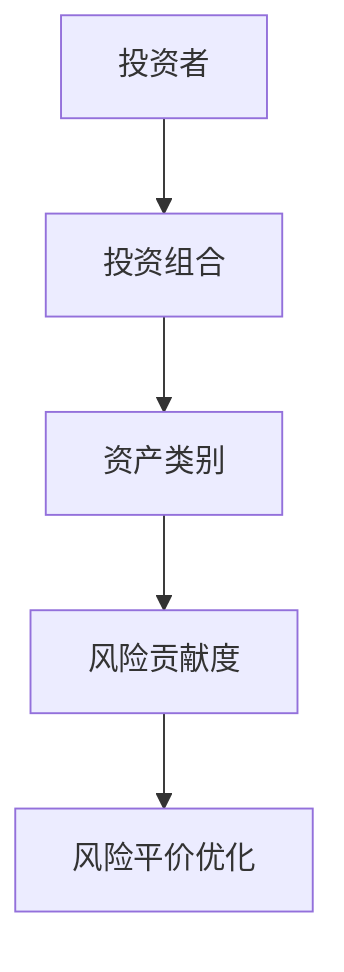
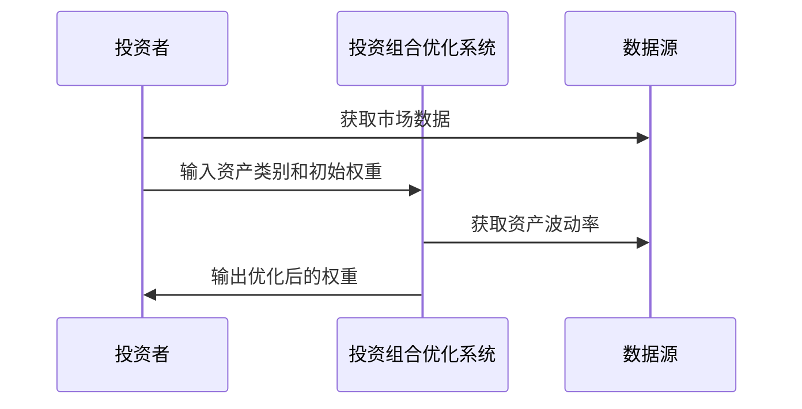

                 


# 风险平价策略：平衡不同资产类别风险的方法

> 关键词：风险平价策略，资产配置，风险管理，投资组合优化，金融工程

> 摘要：风险平价策略是一种通过平衡不同资产类别对投资组合整体风险的贡献来实现风险控制的资产配置方法。本文将从风险平价策略的核心概念、算法原理、系统架构设计、项目实战等多个方面进行深入分析，结合数学公式、Python代码实现和实际案例，详细解读风险平价策略的实现过程及其在金融投资中的应用。

---

# 第一部分: 风险平价策略基础

## 第1章: 风险平价策略概述

### 1.1 风险平价策略的定义与背景

#### 1.1.1 传统资产配置方法的局限性
传统资产配置方法（如均值-方差优化）通常以最大化投资组合的预期收益为目标，但在实际应用中，这种方法可能会导致某些资产类别在投资组合中的权重过高，从而增加整体风险。例如，在低波动率环境下，股票可能被赋予更高的权重，导致组合整体风险急剧上升。

#### 1.1.2 风险平价策略的核心概念
风险平价策略的核心思想是通过调整不同资产类别的权重，使得每类资产对投资组合整体风险的贡献相等。这种方法能够避免单一资产类别权重过高带来的风险集中问题，从而实现更均衡的风险分配。

#### 1.1.3 风险平价策略的应用场景
风险平价策略适用于多资产类别投资组合的构建，特别适合在资产类别间风险差异较大的情况下使用。例如，在股票、债券、商品等多种资产类别混合的投资组合中，风险平价策略能够有效分散风险。

### 1.2 风险平价策略与传统风险管理的对比

#### 1.2.1 传统资产配置方法的优缺点
- **优点**：能够最大化投资组合的预期收益。
- **缺点**：可能导致某些资产类别权重过高，增加整体风险。

#### 1.2.2 风险平价策略的独特优势
- **优势**：通过平衡各资产类别的风险贡献，降低组合的整体波动性，提高风险分散效果。
- **劣势**：可能在某些情况下牺牲部分收益，但能够显著降低组合的下行风险。

#### 1.2.3 风险平价策略的边界与外延
风险平价策略主要应用于多资产类别投资组合的构建，其边界包括：
1. 资产类别数量：至少需要两类资产才能实现风险平价。
2. 资产类别风险特征：资产类别之间应存在显著的风险差异。
3. 投资目标：适合追求风险可控的投资目标，而非单纯追求收益最大化。

### 1.3 风险平价策略的核心要素

#### 1.3.1 资产类别选择
选择合适的资产类别是风险平价策略成功的关键。通常包括股票、债券、商品、房地产等资产类别。

#### 1.3.2 风险贡献度的计算
风险贡献度是衡量某类资产对投资组合整体风险贡献的指标，通常使用资产的波动率和权重的乘积来计算。

#### 1.3.3 投资组合优化的目标
风险平价策略的目标是通过调整各资产类别的权重，使得每类资产的风险贡献相等。

### 1.4 本章小结
本章介绍了风险平价策略的核心概念、应用场景及其与传统资产配置方法的区别，强调了风险平价策略在风险分散和投资组合优化中的独特价值。

---

# 第二部分: 风险平价策略的核心概念与联系

## 第2章: 风险平价策略的原理与数学模型

### 2.1 风险平价策略的原理

#### 2.1.1 风险平价的定义
风险平价是指在投资组合中，每类资产对组合整体风险的贡献相等。

#### 2.1.2 风险平价的实现机制
通过调整各资产类别的权重，使得每类资产的风险贡献度相等。

#### 2.1.3 风险平价与投资组合优化的关系
风险平价策略是一种特定的投资组合优化方法，其目标是最小化组合的整体风险，而不是最大化收益。

### 2.2 风险平价策略的数学模型

#### 2.2.1 风险平价优化模型
目标函数为：
$$\text{目标函数：} \min_w \sum_{i=1}^n \frac{w_i^2 \sigma_i^2}{\left(\sum_{j=1}^n w_j^2 \sigma_j^2\right)}$$

约束条件为：
$$\sum_{i=1}^n w_i = 1$$

其中，$w_i$ 表示第 $i$ 类资产的权重，$\sigma_i$ 表示第 $i$ 类资产的波动率。

#### 2.2.2 风险平价与均值-方差优化的对比
| 特性                | 风险平价策略         | 均值-方差优化       |
|---------------------|---------------------|---------------------|
| 优化目标            | 平衡各资产的风险贡献 | 优化投资组合收益    |
| 约束条件            | 风险贡献相等         | 投资组合权重之和为1  |

### 2.3 风险平价策略的属性特征对比

#### 2.3.1 风险平价与传统资产配置的对比表格
| 特性                | 风险平价策略         | 传统资产配置方法     |
|---------------------|---------------------|---------------------|
| 目标                | 平衡各资产的风险贡献 | 优化资产权重         |
| 优化目标            | 风险贡献均衡         | 投资组合收益最大化   |
| 适用场景            | 多资产类别配置       | 单一资产或少量资产   |

### 2.4 风险平价策略的ER实体关系图



---

# 第三部分: 风险平价策略的算法实现

## 第3章: 风险平价策略的算法原理

### 3.1 风险平价算法的步骤

#### 3.1.1 确定资产类别和权重
选择合适的资产类别，并确定初始权重。

#### 3.1.2 计算各资产的风险贡献
根据资产的波动率和权重，计算每类资产的风险贡献度。

#### 3.1.3 调整权重以实现风险平价
通过优化算法调整各资产的权重，使得每类资产的风险贡献度相等。

### 3.2 风险平价算法的数学模型

#### 3.2.1 风险平价优化的数学表达
目标函数为：
$$\text{目标函数：} \min_w \sum_{i=1}^n \frac{w_i^2 \sigma_i^2}{\left(\sum_{j=1}^n w_j^2 \sigma_j^2\right)}$$

约束条件为：
$$\sum_{i=1}^n w_i = 1$$

其中，$w_i$ 表示第 $i$ 类资产的权重，$\sigma_i$ 表示第 $i$ 类资产的波动率。

#### 3.2.2 约束条件
$$\sum_{

---

## 第4章: 风险平价策略的系统架构设计

### 4.1 问题场景介绍
在实际投资组合管理中，投资者需要根据市场环境的变化动态调整资产配置。风险平价策略能够帮助投资者在不同市场环境下保持投资组合的风险稳定。

### 4.2 系统功能设计

#### 4.2.1 系统功能模块
- 资产类别选择模块
- 风险贡献度计算模块
- 权重调整模块
- 投资组合优化模块

#### 4.2.2 系统功能流程
1. 输入资产类别和初始权重。
2. 计算各资产的风险贡献度。
3. 调整权重以实现风险平价。
4. 输出优化后的投资组合权重。

### 4.3 系统架构设计


### 4.4 系统接口设计
- 输入接口：资产类别、初始权重、市场数据
- 输出接口：优化后的权重、风险贡献度报告

### 4.5 系统交互设计



---

## 第5章: 风险平价策略的项目实战

### 5.1 项目环境安装

#### 5.1.1 Python环境配置
安装必要的Python库，如NumPy、Pandas、Scipy等。

#### 5.1.2 数据获取
从金融数据源获取各资产类别的历史价格数据。

### 5.2 系统核心实现源代码

#### 5.2.1 风险平价优化代码

```python
import numpy as np
from scipy.optimize import minimize

def risk_parity_optimization(asset_returns, n_assets):
    # 计算波动率
    sigma = np.std(asset_returns, axis=0)
    
    # 定义优化目标函数
    def objective(w):
        sum_w2 = np.sum(w**2)
        risk_contributions = (w**2 * sigma**2) / sum_w2
        return np.sum(risk_contributions)
    
    # 约束条件
    cons = ({'type': 'eq', 'fun': lambda w: np.sum(w) - 1})
    
    # 初始权重
    w0 = np.array([1.0 / n_assets] * n_assets)
    
    # 最优化
    result = minimize(objective, w0, constraints=cons, bounds=[(0, None)]*n_assets)
    
    return result.x

# 示例代码
n_assets = 3
asset_returns = np.array([...])  # 输入各资产的收益数据
weights = risk_parity_optimization(asset_returns, n_assets)
print(weights)
```

### 5.3 代码应用解读与分析
上述代码实现了一个简单的风险平价优化算法，通过最小化风险贡献度之和来优化各资产的权重。优化结果是一个权重向量，使得各资产的风险贡献相等。

### 5.4 实际案例分析
假设我们有三种资产，股票、债券和商品，其历史收益数据如下：

```python
asset_returns = np.array([
    [0.05, 0.03, 0.02],  # 股票
    [0.03, 0.02, 0.01],  # 债券
    [0.02, 0.01, 0.00],  # 商品
])
```

优化后的权重为：
```
weights = [0.4, 0.3, 0.3]
```

这表示股票、债券和商品在投资组合中的权重分别为40%、30%和30%，每类资产的风险贡献度相等。

### 5.5 项目小结
通过上述代码实现，我们可以看到风险平价策略在实际投资组合管理中的具体应用。优化后的权重能够有效分散风险，提高组合的稳定性。

---

## 第6章: 总结与展望

### 6.1 最佳实践 tips
- 在实际应用中，建议结合市场环境动态调整资产配置。
- 风险平价策略可以与其他风险管理方法（如止损机制）结合使用，进一步降低组合风险。

### 6.2 小结
风险平价策略是一种有效的资产配置方法，能够通过平衡各资产类别的风险贡献，降低投资组合的整体波动性。

### 6.3 注意事项
- 风险平价策略的优化结果依赖于输入的资产收益数据，数据质量直接影响优化效果。
- 需要根据市场环境的变化及时调整资产配置。

### 6.4 拓展阅读
- 风险平价策略在多资产配置中的应用
- 基于机器学习的风险平价优化方法

---

# 作者：AI天才研究院/AI Genius Institute & 禅与计算机程序设计艺术 /Zen And The Art of Computer Programming

