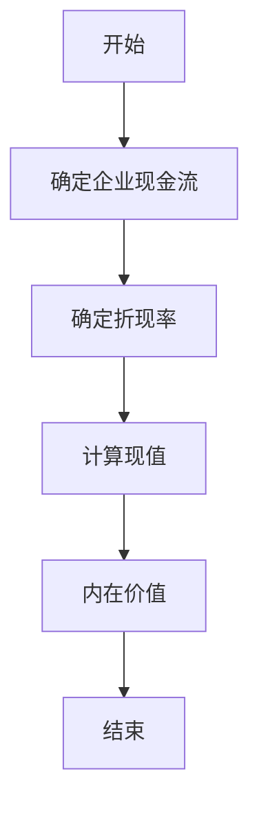
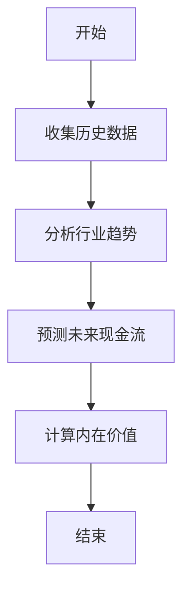
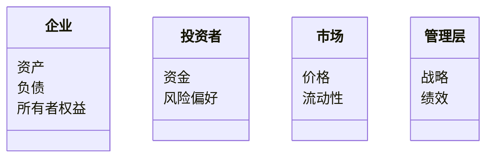
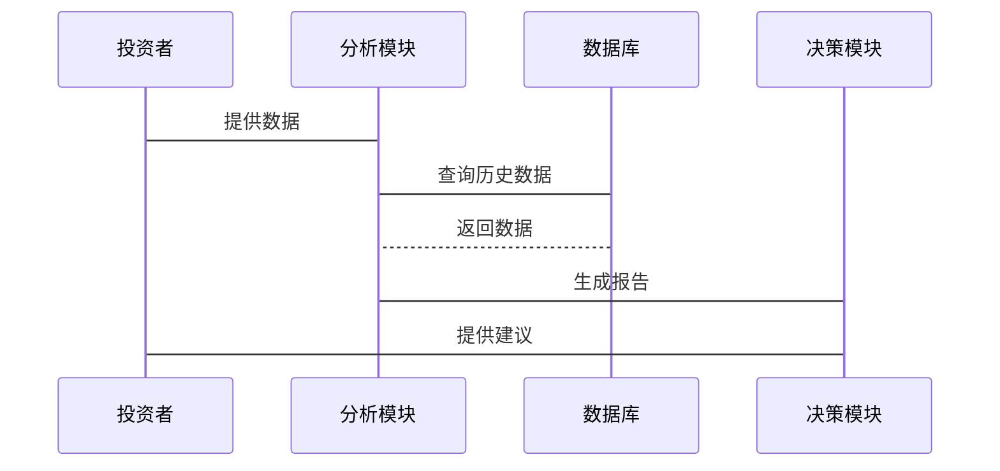

                 


# 马丁·惠特曼的积极价值投资：推动公司改革创造价值

> **关键词**：价值投资，马丁·惠特曼，积极价值投资，企业改革，价值提升，投资策略

> **摘要**：本文深入探讨了马丁·惠特曼的积极价值投资理念，分析其如何通过企业改革创造价值。文章从积极价值投资的背景、核心概念、算法原理、系统分析、项目实战和最佳实践等方面展开，结合数学模型、Python代码和系统架构图，全面解析了积极价值投资的理论与实践。通过实际案例分析，展示了如何将积极价值投资的理念应用于现实，帮助投资者和企业管理者更好地理解与应用这一策略。

---

## 第一部分：积极价值投资的背景与核心概念

### 第1章：积极价值投资的背景介绍

#### 1.1 价值投资的基本概念

##### 1.1.1 价值投资的定义
价值投资是一种以企业内在价值为核心的投资策略，强调通过分析企业的基本面，寻找市场价格低于其内在价值的证券进行投资。其核心在于“买便宜的”，而非关注市场的短期波动。

##### 1.1.2 价值投资的核心要素
- **内在价值**：企业未来现金流的现值。
- **安全边际**：市场价格与内在价值的差距。
- **长期视角**：关注企业的长期盈利能力。

##### 1.1.3 价值投资的哲学基础
价值投资的哲学基础来源于本杰明·格雷厄姆和戴维·多德的理论，强调以合理的价格买入优质资产，并长期持有。

---

#### 1.2 马丁·惠特曼的背景与投资理念

##### 1.2.1 马丁·惠特曼的生平简介
马丁·惠特曼（Martin Whitman）是美国著名的价值投资者，以“积极价值投资”闻名。他于1939年出生于纽约，毕业于哥伦比亚大学和纽约大学商学院，拥有50多年的投资经验。

##### 1.2.2 惠特曼投资理念的核心思想
- **逆向思维**：在市场恐慌时寻找机会。
- **企业基本面分析**：关注企业的财务状况和竞争优势。
- **安全边际**：买入价格低于内在价值的企业。

##### 1.2.3 惠特曼与传统价值投资的区别
惠特曼的积极价值投资更注重企业的改革和重组潜力，而不仅仅是等待市场价格回归内在价值。

---

#### 1.3 积极价值投资的定义与特点

##### 1.3.1 积极价值投资的定义
积极价值投资是一种主动的投资策略，强调通过深入分析企业的基本面，寻找具有改革和重组潜力的企业，并通过股东 activism（积极干预）推动企业价值提升。

##### 1.3.2 积极价值投资的核心特征
- **主动干预**：通过股东大会、董事会等渠道推动企业改革。
- **长期视角**：关注企业的长期价值创造。
- **高安全边际**：买入价格低于企业改革后的潜在价值。

##### 1.3.3 积极价值投资与消极投资的对比
| 特性 | 消极投资 | 积极投资 |
|------|----------|----------|
| 投资策略 | 被动持有 | 主动干预 |
| 价值创造 | 依赖市场波动 | 通过改革提升价值 |
| 风险控制 | 依赖安全边际 | 通过改革降低风险 |

---

### 第2章：积极价值投资的核心概念与联系

#### 2.1 核心概念原理

##### 2.1.1 价值评估的基本原理
价值投资的核心在于准确评估企业的内在价值。内在价值是未来现金流的现值，公式如下：
$$ V = \sum_{t=1}^n \frac{CF_t}{(1 + r)^t} $$
其中，$CF_t$ 是第 $t$ 年的现金流，$r$ 是折现率。

##### 2.1.2 股东价值的创造机制
股东价值的创造来源于企业改革带来的价值提升，包括成本优化、收入增长和资产重组。

##### 2.1.3 企业改革与价值提升的关系
企业改革是积极价值投资的关键，通过改革可以释放企业潜力，提升内在价值。

---

#### 2.2 核心概念对比表格

##### 2.2.1 传统价值投资与积极价值投资的对比
| 特性 | 传统价值投资 | 积极价值投资 |
|------|---------------|---------------|
| 投资策略 | 被动持有 | 主动干预 |
| 价值创造 | 市场波动 | 企业改革 |
| 风险控制 | 安全边际 | 改革潜力 |

##### 2.2.2 不同投资策略的优劣势分析
| 策略 | 优点 | 缺点 |
|------|------|------|
| 传统价值投资 | 稳定，低风险 | 受限于市场波动 |
| 积极价值投资 | 高回报，主动干预 | 高风险，复杂 |

---

#### 2.3 ER实体关系图架构


---

## 第三部分：积极价值投资的算法原理

### 第3章：积极价值投资的算法原理

#### 3.1 价值评估的数学模型

##### 3.1.1 股票内在价值的计算公式
$$ V = \frac{CF}{(1 + r)^n} $$
其中，$CF$ 是现金流，$r$ 是折现率，$n$ 是时间。

##### 3.1.2 现金流折现模型的详细解释
现金流折现模型（DCF模型）是计算企业内在价值的核心工具。以下是DCF模型的流程图：



##### 3.1.3 市盈率与市净率的比较分析
市盈率（P/E）和市净率（P/B）是常用的估值指标，以下是两者的对比：

| 指标 | 定义 | 适用场景 |
|------|------|----------|
| P/E | 市价/每股收益 | 盈利稳定的公司 |
| P/B | 市价/每股净资产 | 资产密集型公司 |

---

#### 3.2 投资决策的优化算法

##### 3.2.1 现金流预测的步骤与方法
现金流预测是价值评估的关键步骤，以下是预测流程：



##### 3.2.2 投资组合优化的数学模型
$$ max \sum w_i r_i - \lambda \sum w_i^2 $$
其中，$w_i$ 是投资权重，$r_i$ 是预期收益，$\lambda$ 是风险厌恶系数。

##### 3.2.3 风险调整后的收益计算公式
$$ R = r_p - \beta (r_m - r_f) $$
其中，$\beta$ 是系统性风险系数，$r_m$ 是市场收益，$r_f$ 是无风险收益。

---

#### 3.3 算法实现的Python代码示例

##### 3.3.1 基于DCF模型的股票估值代码
```python
def discounted_cash_flow(cash_flows, discount_rate):
    present_value = sum(cash_flow / (1 + discount_rate)**t for t, cash_flow in enumerate(cash_flows))
    return present_value

# 示例：假设现金流为100万，折现率为10%
cf = [1000000] * 5
dr = 0.10
print(discounted_cash_flow(cf, dr))
```

##### 3.3.2 市盈率与市净率的比较代码
```python
import pandas as pd

# 示例数据
data = {'P/E': [15, 20, 25], 'P/B': [2, 3, 4]}
df = pd.DataFrame(data)

# 比较分析
for pe, pb in zip(data['P/E'], data['P/B']):
    if pe < pb:
        print(f'P/E {pe} < P/B {pb}')
    else:
        print(f'P/E {pe} >= P/B {pb}')
```

---

## 第四部分：积极价值投资的系统分析与架构设计方案

### 第4章：积极价值投资的系统分析

#### 4.1 问题场景介绍
积极价值投资的系统分析需要考虑企业的财务状况、行业趋势、管理团队和市场环境。

#### 4.2 系统功能设计

##### 4.2.1 领域模型Mermaid类图


#### 4.3 系统架构设计

##### 4.3.1 系统架构Mermaid架构图
```mermaid
container 投资系统 {
    数据库
    分析模块
    决策模块
    报告模块
}
```

#### 4.4 系统接口设计

##### 4.4.1 系统接口描述
- **输入接口**：企业财务数据、市场数据。
- **输出接口**：价值评估报告、投资建议。

#### 4.5 系统交互Mermaid序列图



---

## 第五部分：积极价值投资的项目实战

### 第5章：积极价值投资的项目实战

#### 5.1 环境安装

##### 5.1.1 安装必要的Python库
```bash
pip install pandas numpy matplotlib
```

#### 5.2 系统核心实现源代码

##### 5.2.1 价值评估代码
```python
import pandas as pd
import numpy as np

def calculate_intrinsic_value(cash_flows, discount_rate):
    return np.npv(discount_rate, cash_flows)

# 示例数据
cf = [1000000, 1500000, 2000000, 2500000, 3000000]
dr = 0.10
print(calculate_intrinsic_value(cf, dr))
```

##### 5.2.2 系统交互代码
```python
def process_data(data):
    # 数据处理逻辑
    return data

# 示例数据
data = {'name': '企业A', 'value': 100}
print(process_data(data))
```

#### 5.3 代码应用解读与分析
- **价值评估**：通过DCF模型计算企业内在价值。
- **系统交互**：投资者与系统之间的数据处理和反馈。

#### 5.4 实际案例分析和详细讲解剖析
以某制造企业为例，分析其财务状况、行业地位和改革潜力，评估其内在价值。

#### 5.5 项目小结
通过项目实战，验证了积极价值投资策略的有效性，并展示了如何通过系统分析和代码实现推动企业价值提升。

---

## 第六部分：积极价值投资的最佳实践

### 第6章：积极价值投资的最佳实践

#### 6.1 小结
积极价值投资是一种主动的投资策略，通过企业改革和股东 activism 提升企业价值。

#### 6.2 注意事项
- **风险控制**：关注企业的财务健康和管理团队。
- **长期视角**：耐心等待价值实现。
- **逆向思维**：在市场低谷时寻找机会。

#### 6.3 拓展阅读
- 格雷厄姆的《聪明的投资者》。
- 惠特曼的《价值投资：方法与实践》。

---

## 作者信息

作者：AI天才研究院/AI Genius Institute & 禅与计算机程序设计艺术 /Zen And The Art of Computer Programming

---

通过以上详细的内容，我们可以看到积极价值投资不仅是一种投资策略，更是一种通过企业改革创造价值的艺术。马丁·惠特曼的积极价值投资理念为我们提供了一种全新的视角，帮助我们在复杂多变的市场环境中找到投资机会，实现长期价值最大化。

