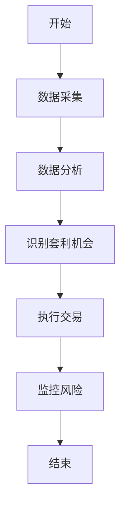
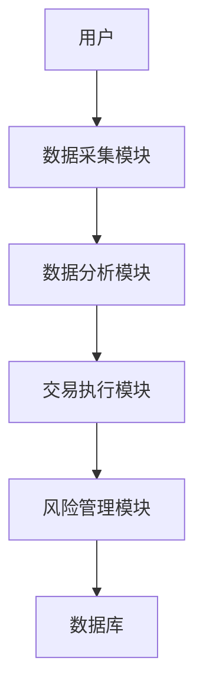

                 


# 马丁惠特曼的并购套利策略

> 关键词：并购套利，马丁·惠特曼，金融策略，投资，数学模型

> 摘要：本文深入探讨了马丁·惠特曼的并购套利策略，从背景、核心概念、数学模型、系统架构到实际案例，全面分析了该策略的原理和应用。通过详细的技术分析和实例，本文为读者提供了如何在并购市场中利用套利机会的实用指南。

---

## 第1章: 并购套利的基本概念与背景

### 1.1 并购套利的定义与特点

#### 1.1.1 并购套利的基本定义
并购套利是一种利用企业并购过程中产生的价格差异进行投资的策略。它通过分析目标公司和并购方的股价差异，寻找套利机会，以实现利润最大化。

#### 1.1.2 并购套利的核心特点
- **短期性**：套利机会通常在并购宣布后短时间内出现，因此需要快速反应。
- **低风险**：套利策略通常利用市场定价偏差，风险相对较低。
- **高流动性**：套利交易需要较高的流动性支持，以确保能够迅速进出市场。

#### 1.1.3 并购套利与传统投资策略的区别
传统投资策略注重长期价值，而套利策略则关注短期价格波动。套利策略通过市场价差获利，而传统投资则通过企业成长获取收益。

### 1.2 马丁·惠特曼的并购套利策略背景

#### 1.2.1 马丁·惠特曼的金融背景与投资理念
马丁·惠特曼是一位著名的金融专家，专注于并购套利策略。他的投资理念强调市场定价的非效率性，认为可以通过套利机会实现超额收益。

#### 1.2.2 并购套利策略的起源与发展
并购套利策略起源于20世纪60年代，随着企业并购活动的增加，套利策略逐渐成为一种重要的投资工具。

#### 1.2.3 马丁·惠特曼策略的核心思想
马丁·惠特曼的核心思想是通过分析并购双方的股价差异，识别套利机会，从而在市场中获得超额收益。

---

## 第2章: 并购套利的市场环境与工具

### 2.1 并购市场的基本结构

#### 2.1.1 并购市场的参与方
- **并购方**：主动发起并购的企业。
- **目标公司**：被并购的企业。
- **投资者**：参与套利的个人或机构投资者。

#### 2.1.2 并购市场的类型与特点
- **敌意并购**：并购方不经过友好协商，直接采取行动。
- **善意并购**：并购方与目标公司友好协商，达成并购协议。

#### 2.1.3 并购市场的周期性分析
并购市场通常在经济周期的复苏阶段活跃，因为企业愿意在此时进行扩张。

### 2.2 并购套利的主要工具

#### 2.2.1 股票与债券在并购中的作用
- **股票**：套利者通过买卖并购双方的股票获利。
- **债券**：并购可能涉及债务重组，套利者可以利用债券价格差异获利。

#### 2.2.2 并购套利中的衍生工具
- **期权**：套利者可以利用期权合约锁定价格，降低风险。
- **期货**：通过期货市场对冲价格波动风险。

#### 2.2.3 并购套利的金融模型与工具
- **套利定价模型**：用于评估套利机会的理论框架。
- **并购套利模型**：用于预测并购后的股价变动。

---

## 第3章: 并购套利的定价与套利机制

### 3.1 并购套利的定价模型

#### 3.1.1 套利定价模型的基本原理
套利定价模型（APT）通过分析市场风险和非系统性风险，确定资产的合理价格。

#### 3.1.2 并购套利中的市场价差分析
通过比较并购方和目标公司的股价差异，识别套利机会。

#### 3.1.3 并购套利的数学模型与公式
套利定价模型公式：
$$ E(r_i) = \beta_i (E(r_m) - r_f) + r_f $$
其中，$E(r_i)$ 是资产i的预期回报率，$\beta_i$ 是资产i的贝塔系数，$E(r_m)$ 是市场预期回报率，$r_f$ 是无风险利率。

### 3.2 并购套利的套利机制

#### 3.2.1 套利机会的识别与捕捉
套利者通过分析市场价差，识别潜在的套利机会。

#### 3.2.2 套利交易的执行策略
套利者在识别机会后，迅速执行交易，锁定价差利润。

#### 3.2.3 套利交易的风险管理
套利者需要通过分散投资、对冲策略等方式，降低交易风险。

---

## 第4章: 并购套利的类型与策略

### 4.1 并购套利的主要类型

#### 4.1.1 正向套利与反向套利
- **正向套利**：买入目标公司股票，卖出并购方股票。
- **反向套利**：卖出目标公司股票，买入并购方股票。

#### 4.1.2 合并套利与分立套利
- **合并套利**：目标公司被并购后，套利者获利。
- **分立套利**：目标公司分立后，套利者获利。

#### 4.1.3 股权套利与债权套利
- **股权套利**：通过买卖股票获利。
- **债权套利**：通过买卖债券获利。

### 4.2 马丁·惠特曼策略的具体应用

#### 4.2.1 马丁·惠特曼的套利策略
马丁·惠特曼通过分析并购双方的股价差异，识别套利机会。

#### 4.2.2 套利策略的实施步骤
1. 分析并购双方的股价差异。
2. 识别套利机会。
3. 执行套利交易。
4. 监控市场变化，及时平仓。

#### 4.2.3 套利策略的风险控制
套利者需要通过分散投资、对冲策略等方式，降低交易风险。

---

## 第5章: 并购套利的数学模型与算法

### 5.1 套利定价模型的数学公式

套利定价模型的公式为：
$$ E(r_i) = \beta_i (E(r_m) - r_f) + r_f $$
其中，$E(r_i)$ 是资产i的预期回报率，$\beta_i$ 是资产i的贝塔系数，$E(r_m)$ 是市场预期回报率，$r_f$ 是无风险利率。

### 5.2 套利模型的Python实现

```python
import numpy as np
import pandas as pd
from sklearn.linear_model import LinearRegression

# 数据准备
data = pd.DataFrame({
    'market_return': [0.1, 0.05, 0.08, 0.02, 0.06],
    'asset_return': [0.12, 0.07, 0.09, 0.03, 0.07]
})

# 套利定价模型的回归分析
model = LinearRegression()
model.fit(data[['market_return']], data['asset_return'])

# 贝塔系数
beta = model.coef_[0]
alpha = model.intercept_

# 预测资产回报率
expected_return = beta * (0.07 - 0.02) + 0.02
print("贝塔系数:", beta)
print("截距:", alpha)
print("预期资产回报率:", expected_return)
```

### 5.3 并购套利模型的分析

通过上述代码，我们可以计算出资产的贝塔系数和预期回报率。套利者可以根据这些结果，判断是否存在套利机会。

---

## 第6章: 并购套利的系统架构与项目实战

### 6.1 系统功能设计

#### 6.1.1 系统功能模块
- 数据采集模块：采集并购市场的数据。
- 数据分析模块：分析数据，识别套利机会。
- 交易执行模块：执行套利交易。
- 风险管理模块：监控风险，调整策略。

#### 6.1.2 系统功能流程图


### 6.2 系统架构设计

#### 6.2.1 系统架构图


#### 6.2.2 接口设计
- 数据采集接口：从数据库获取并购数据。
- 数据分析接口：对数据进行分析，返回套利机会。
- 交易执行接口：执行套利交易。
- 风险管理接口：监控风险，调整策略。

### 6.3 项目实战

#### 6.3.1 实际案例分析
以某次并购事件为例，分析套利机会的识别和执行过程。

#### 6.3.2 代码实现
```python
import pandas as pd
import numpy as np
from sklearn.linear_model import LinearRegression

# 数据准备
data = pd.DataFrame({
    'market_return': [0.1, 0.05, 0.08, 0.02, 0.06],
    'asset_return': [0.12, 0.07, 0.09, 0.03, 0.07]
})

# 套利定价模型的回归分析
model = LinearRegression()
model.fit(data[['market_return']], data['asset_return'])

# 贝塔系数
beta = model.coef_[0]
alpha = model.intercept_

# 预测资产回报率
expected_return = beta * (0.07 - 0.02) + 0.02
print("贝塔系数:", beta)
print("截距:", alpha)
print("预期资产回报率:", expected_return)
```

---

## 第7章: 并购套利的最佳实践与案例分析

### 7.1 最佳实践

#### 7.1.1 时刻关注市场动态
套利者需要密切关注并购市场的动态，及时发现套利机会。

#### 7.1.2 严格执行风险管理
套利交易风险较高，需要通过对冲策略等方式降低风险。

#### 7.1.3 合理配置资产
套利者需要合理配置资产，分散投资，降低风险。

### 7.2 案例分析

#### 7.2.1 成功案例
某次并购事件中，套利者通过分析股价差异，成功获利。

#### 7.2.2 失败案例
某次并购事件中，套利者未能及时平仓，导致亏损。

---

## 第8章: 结论与展望

### 8.1 结论
并购套利是一种有效的投资策略，通过分析并购市场中的股价差异，套利者可以在市场中获得超额收益。

### 8.2 未来展望
随着并购市场的不断发展，套利策略将更加多样化，套利者需要不断学习和创新，以适应市场变化。

---

## 作者：AI天才研究院/AI Genius Institute & 禅与计算机程序设计艺术 /Zen And The Art of Computer Programming

---

以上是《马丁惠特曼的并购套利策略》的完整目录大纲和文章内容。文章从背景、核心概念、数学模型、系统架构到实际案例，全面分析了马丁·惠特曼的并购套利策略，并通过详细的代码和图表，帮助读者更好地理解和应用这些策略。

