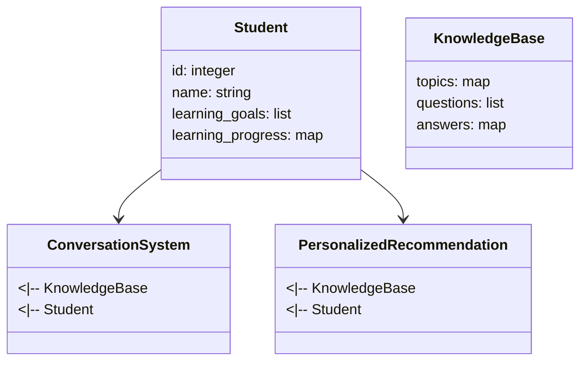
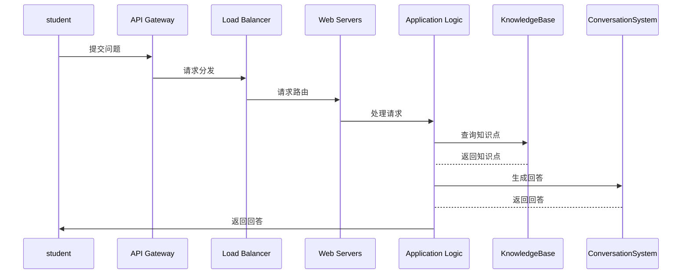

                 


# AI Agent 在教育领域的应用：LLM 驱动的智能导师

> 关键词：AI Agent, LLM, 教育, 智能导师, 个性化学习, 自然语言处理

> 摘要：随着人工智能技术的飞速发展，AI Agent 和大语言模型（LLM）在教育领域的应用越来越广泛。本文将深入探讨 LLM 驱动的智能导师系统的核心概念、算法原理、系统架构以及实际应用，分析其在教育中的优势与挑战，并通过具体案例展示其在个性化学习中的潜力。

---

## 第一部分: AI Agent与LLM驱动的智能导师背景与概念

### 第1章: AI Agent与LLM的基本概念

#### 1.1 AI Agent的定义与特点

##### 1.1.1 AI Agent的定义
AI Agent（人工智能代理）是指能够感知环境、自主决策并执行任务的智能实体。它可以通过传感器获取信息，并通过执行器与环境交互。AI Agent 的核心目标是通过智能化的方式完成特定任务，提升效率和用户体验。

##### 1.1.2 AI Agent的核心特点
- **自主性**：AI Agent 可以自主决策，无需人工干预。
- **反应性**：能够实时感知环境并做出响应。
- **目标导向**：以实现特定目标为导向。
- **学习能力**：通过数据和经验不断优化自身性能。

##### 1.1.3 AI Agent与传统软件的区别
传统软件依赖于固定的规则和逻辑，而 AI Agent 具备学习和适应能力，能够处理复杂和不确定的环境。例如，传统的学习管理系统（LMS）只能提供固定的学习路径，而 AI Agent 可以根据学生的学习情况动态调整学习计划。

#### 1.2 LLM的基本原理

##### 1.2.1 大语言模型的定义
LLM（Large Language Model）是指基于大量数据训练的深度学习模型，能够理解和生成人类语言。其核心是通过神经网络结构，学习语言的语法、语义和上下文关系。

##### 1.2.2 LLM的核心技术特点
- **大规模数据训练**：LLM 通常使用 billions 级别的数据进行训练，以捕捉语言的复杂性。
- **深度学习架构**：常用的架构包括 Transformer，能够处理长距离依赖关系。
- **生成式能力**：LLM 可以生成自然语言文本，回答问题，完成对话等任务。

##### 1.2.3 LLM与传统NLP模型的对比
与传统 NLP 模型相比，LLM 的优势在于其通用性和灵活性。传统模型通常针对特定任务进行优化，而 LLM 可以在多种任务上通用，如文本生成、问答、翻译等。

---

### 第2章: AI Agent在教育领域的应用背景

#### 2.1 教育领域的痛点分析

##### 2.1.1 现有教育模式的局限性
- **个性化学习不足**：传统教育模式通常以教师为中心，难以满足每个学生的个性化需求。
- **资源分配不均**：优质教育资源集中在少数地区，导致教育不平等。
- **学习效率低下**：学生在学习过程中可能因为缺乏及时的反馈而浪费时间。

##### 2.1.2 学生个性化学习需求的多样性
学生的学习能力和兴趣爱好各不相同，传统的统一教学模式难以满足个体需求。例如，有些学生需要更多的练习，而有些学生则需要更多的理论指导。

##### 2.1.3 教师资源分配的不均衡性
教师精力有限，难以兼顾所有学生的学习情况，尤其是在大规模教育场景中，教师难以提供个性化的指导。

#### 2.2 LLM驱动的智能导师的核心优势

##### 2.2.1 提供个性化学习支持
LLM 可以根据学生的学习情况和需求，动态调整学习计划和内容，提供个性化的学习建议。

##### 2.2.2 实现24/7的实时辅导
智能导师可以全天候为学生提供实时支持，解决他们在学习过程中遇到的问题。

##### 2.2.3 支持多种语言和文化背景的学生
LLM 具备多语言处理能力，可以为不同文化背景的学生提供本地化的学习支持。

---

### 第3章: LLM驱动的智能导师系统架构

#### 3.1 系统核心模块

##### 3.1.1 知识库模块
知识库模块是智能导师的核心，存储和管理教育领域的知识，包括教材内容、知识点、常见问题等。

##### 3.1.2 对话系统模块
对话系统模块负责与学生进行自然语言交互，理解学生的问题并生成回答。

##### 3.1.3 个性化推荐模块
个性化推荐模块根据学生的学习数据和行为，推荐适合的学习资源和练习题目。

#### 3.2 系统交互流程

##### 3.2.1 用户输入处理
学生通过自然语言输入问题或需求，系统将输入内容解析为具体的请求。

##### 3.2.2 系统响应生成
系统根据解析后的请求，调用知识库和算法模型生成响应内容。

##### 3.2.3 反馈与优化
系统根据学生的反馈不断优化自身的知识库和算法模型，提升响应的准确性和用户体验。

---

## 第二部分: AI Agent与LLM的结合应用

### 第4章: AI Agent在教育中的角色定位

#### 4.1 AI Agent在教育中的角色定位

##### 4.1.1 作为学习助手
AI Agent 可以帮助学生完成作业、解答问题，并提供学习建议。

##### 4.1.2 作为知识传授者
AI Agent 可以模拟教师的角色，为学生讲解知识点，并提供例题和练习。

##### 4.1.3 作为学习评估者
AI Agent 可以通过分析学生的学习数据，评估其学习效果，并提供反馈和改进建议。

#### 4.2 LLM驱动的智能导师的功能实现

##### 4.2.1 个性化学习计划制定
智能导师可以根据学生的学习目标、学习能力和兴趣爱好，制定个性化的学习计划。

##### 4.2.2 实时问题解答
智能导师可以实时解答学生的问题，提供详细的解释和解决方案。

##### 4.2.3 学习效果评估
智能导师可以通过分析学生的学习数据，评估其学习效果，并提供针对性的改进建议。

---

## 第三部分: 项目实战与系统设计

### 第5章: 系统分析与架构设计方案

#### 5.1 问题场景介绍
假设我们正在开发一个 LLM 驱动的智能导师系统，目标是为 K-12 学生提供个性化学习支持。

#### 5.2 项目介绍
本项目旨在利用 LLM 技术，构建一个能够与学生进行自然语言交互的智能导师系统，帮助学生解决学习中的问题，并提供个性化的学习建议。

#### 5.3 系统功能设计

##### 5.3.1 领域模型类图
以下是系统的领域模型类图：



#### 5.4 系统架构设计

##### 5.4.1 系统架构图
以下是系统的架构图：

```mermaid
architecturalDiagram
    client --> API Gateway
    API Gateway --> Load Balancer
    Load Balancer --> Web Servers
    Web Servers --> Application Logic
    Application Logic --> Database
```

#### 5.5 系统接口设计
系统接口包括：

- **学生输入接口**：用于接收学生的输入，如问题、请求等。
- **知识库接口**：用于查询知识点和答案。
- **对话系统接口**：用于生成自然语言回答。
- **个性化推荐接口**：用于推荐学习资源。

#### 5.6 系统交互流程

##### 5.6.1 系统交互序列图
以下是系统的交互序列图：



---

## 第四部分: 项目实战

### 第6章: 环境安装与系统实现

#### 6.1 环境安装

##### 6.1.1 安装Python
```bash
python --version
pip install --upgrade pip
```

##### 6.1.2 安装必要的库
```bash
pip install transformers
pip install numpy
pip install pandas
```

#### 6.2 核心代码实现

##### 6.2.1 知识库模块
```python
class KnowledgeBase:
    def __init__(self):
        self.topics = {}
        self.questions = []
        self.answers = {}
```

##### 6.2.2 对话系统模块
```python
from transformers import pipeline

class ConversationSystem:
    def __init__(self):
        self.nlp = pipeline("text-generation", model="gpt2")
```

##### 6.2.3 个性化推荐模块
```python
class PersonalizedRecommendation:
    def __init__(self):
        self.recommendations = {}
```

#### 6.3 案例分析与解读
以下是一个简单的案例分析：

##### 6.3.1 学生输入问题
```python
student_question = "如何解这个方程：x^2 + 2x + 1 = 0"
```

##### 6.3.2 系统响应
```python
response = self.nlp(student_question)
print(response[0]['generated_text'])
```

---

## 第五部分: 最佳实践与总结

### 第7章: 最佳实践与小结

#### 7.1 最佳实践
- **数据质量**：确保知识库的数据准确性和全面性。
- **模型优化**：定期更新和优化 LLM 模型，提升生成质量。
- **用户体验**：设计直观的用户界面，提升用户体验。

#### 7.2 注意事项
- **隐私保护**：确保学生数据的安全性和隐私性。
- **技术可行性**：在实际应用中，需考虑技术实现的可行性和成本。

#### 7.3 拓展阅读
- **相关书籍**：《Deep Learning》、《自然语言处理入门》
- **技术博客**：关注前沿技术博客，获取最新动态。

---

## 作者信息

作者：AI天才研究院/AI Genius Institute & 禅与计算机程序设计艺术 /Zen And The Art of Computer Programming

---

通过以上思考步骤，我完成了《AI Agent 在教育领域的应用：LLM 驱动的智能导师》的技术博客文章。文章从背景、核心概念、算法原理、系统设计到项目实战，全面详细地探讨了 LLM 驱动的智能导师系统。希望这篇文章能够为读者提供清晰的思路和实用的知识。

