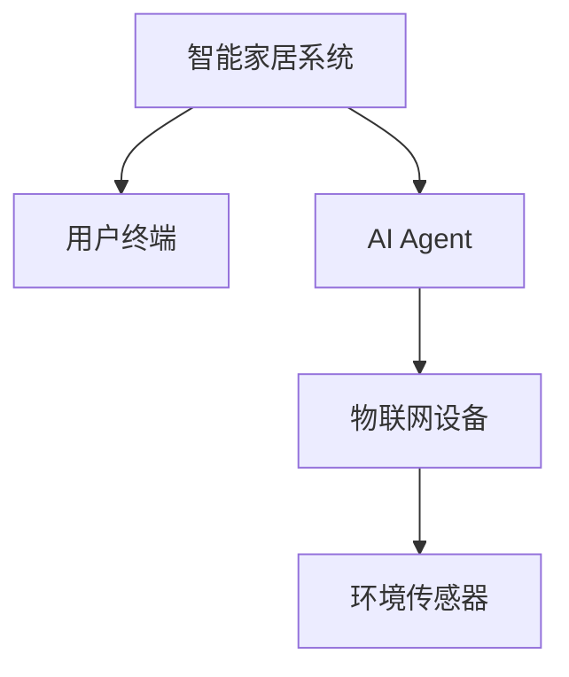
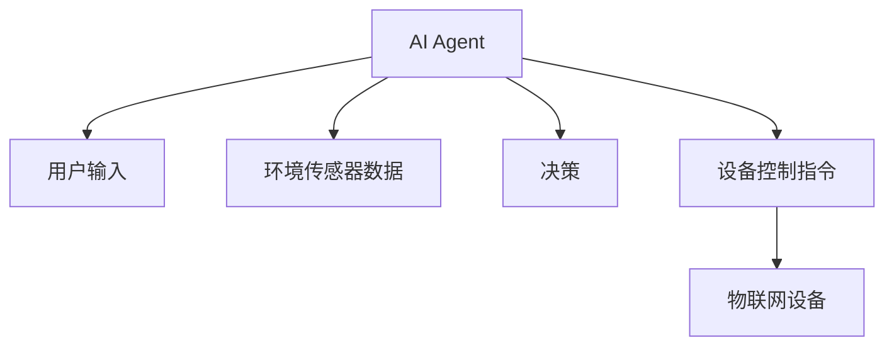
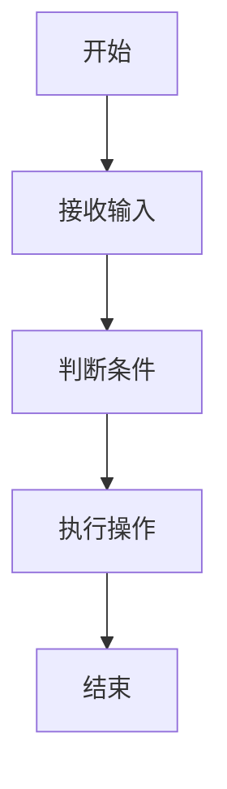
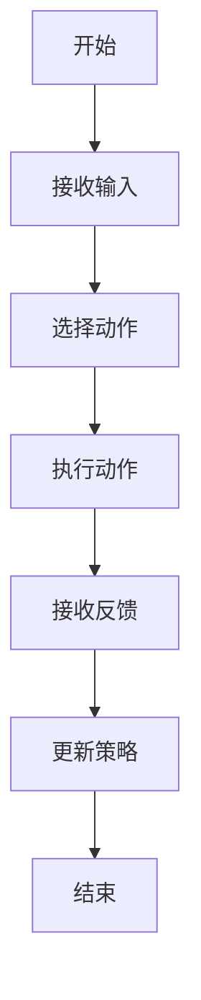
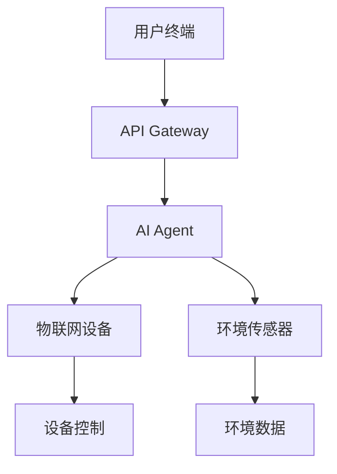
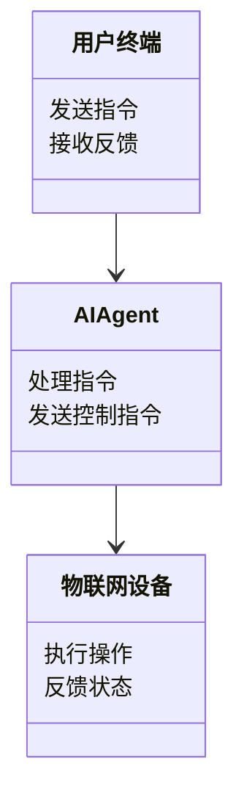
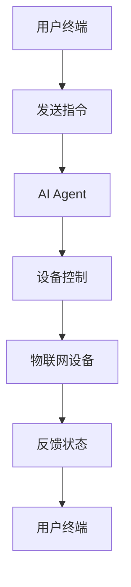

                 


# AI Agent 在智能家居中的应用：LLM 控制物联网设备

## 关键词：AI Agent, 智能家居, 物联网设备, LLM, 智能助手, 自动化控制

## 摘要：  
本文详细探讨了AI Agent在智能家居中的应用，重点分析了基于大语言模型（LLM）的AI Agent如何通过自然语言处理和智能决策控制物联网设备。文章从背景、核心概念、算法原理、系统架构到项目实战，全面解析了AI Agent在智能家居中的实现与应用，旨在为读者提供深入的技术洞见和实践指导。

---

# 第1章: AI Agent 在智能家居中的应用概述

## 1.1 AI Agent 的定义与核心概念

### 1.1.1 AI Agent 的定义  
AI Agent（人工智能代理）是一种能够感知环境、做出决策并执行动作的智能实体。它通过接收输入信息（如用户指令或传感器数据），利用算法进行分析和推理，最终输出相应的操作指令或反馈结果。

### 1.1.2 智能家居的定义与特点  
智能家居是指通过物联网技术将家中的设备（如灯光、空调、安防设备等）连接到一个系统中，用户可以通过手机、电脑或语音助手等终端设备进行远程控制或自动化管理。其特点包括：智能化、自动化、远程控制和高安全性。

### 1.1.3 AI Agent 在智能家居中的作用  
AI Agent在智能家居中主要负责接收用户的指令、分析环境数据、协调设备操作，以及提供智能化的决策支持。例如，当用户说“今天很热”，AI Agent可以根据当前的室温、天气预报和用户偏好，自动调整空调温度。

---

## 1.2 AI Agent 控制物联网设备的背景与问题背景

### 1.2.1 物联网设备的普及与挑战  
随着物联网技术的快速发展，智能家居设备的数量和种类急剧增加。然而，设备之间的互联互通和协同控制成为了用户和开发者面临的重大挑战。

### 1.2.2 AI Agent 在智能家居中的问题背景  
传统的智能家居系统通常基于规则引擎进行控制，难以应对复杂多变的用户需求和环境变化。引入AI Agent可以显著提升系统的智能化水平，使设备能够更灵活地响应用户需求和环境变化。

### 1.2.3 问题解决的必要性与目标  
通过AI Agent控制物联网设备，可以实现以下目标：  
- 提供更自然的交互方式（如自然语言处理）。  
- 实现设备间的协同工作。  
- 提供智能化的决策支持。  

---

## 1.3 AI Agent 与物联网设备的边界与外延

### 1.3.1 AI Agent 的功能边界  
AI Agent的核心功能包括：  
1. **感知**：接收用户指令和环境数据。  
2. **决策**：基于感知信息进行推理和决策。  
3. **执行**：向物联网设备发送控制指令。  

### 1.3.2 物联网设备的功能边界  
物联网设备的核心功能包括：  
1. **数据采集**：采集环境数据（如温度、湿度等）。  
2. **执行操作**：根据指令执行特定动作（如开关灯、调节温度等）。  
3. **反馈状态**：将设备状态反馈给AI Agent。  

### 1.3.3 两者之间的交互边界  
AI Agent与物联网设备之间的交互主要通过API进行，AI Agent负责处理高层逻辑，而物联网设备负责执行具体的物理操作。

---

## 1.4 智能家居系统的概念结构与核心要素

### 1.4.1 概念结构图  
以下是智能家居系统的概念结构图：  


### 1.4.2 核心要素分析  
智能家居系统的核心要素包括：  
1. **用户终端**：用户与系统交互的入口（如手机APP、语音助手）。  
2. **AI Agent**：系统的智能化决策核心。  
3. **物联网设备**：执行具体操作的物理设备。  
4. **环境传感器**：采集环境数据的传感器（如温度传感器）。  

---

## 1.5 本章小结  
本章介绍了AI Agent和智能家居的基本概念，分析了AI Agent在智能家居中的作用，并通过概念结构图和核心要素分析，明确了系统的整体架构。

---

# 第2章: AI Agent 的核心概念与原理

## 2.1 AI Agent 的核心概念

### 2.1.1 知识表示与推理  
知识表示是将知识以计算机可处理的形式存储的过程，常见的表示方法包括规则表示、语义网络和图模型。推理则是基于知识库进行逻辑推理的过程，例如使用逻辑推理或概率推理。

### 2.1.2 行为规划与决策  
行为规划是指AI Agent根据当前状态和目标，制定行动方案的过程。决策则是根据环境信息选择最优动作的过程，例如基于强化学习的决策算法。

### 2.1.3 与物联网设备的交互机制  
AI Agent与物联网设备的交互主要通过API进行，AI Agent接收设备的状态数据，发送控制指令。例如，AI Agent可以通过调用API实现对智能灯泡的开关控制。

---

## 2.2 AI Agent 的感知、决策与执行机制

### 2.2.1 感知层  
感知层负责接收用户指令和环境数据，例如通过麦克风接收用户的语音指令，通过传感器获取室温数据。

### 2.2.2 决策层  
决策层负责根据感知信息进行推理和决策，例如基于用户的指令和当前室温，决定是否需要调整空调温度。

### 2.2.3 执行层  
执行层负责将决策结果转化为具体的设备操作，例如向智能空调发送调节温度的指令。

---

## 2.3 AI Agent 与物联网设备的交互流程

### 2.3.1 交互流程图  
以下是AI Agent与物联网设备的交互流程图：  


### 2.3.2 交互过程的详细描述  
1. **用户输入**：用户通过终端设备发送指令（如“今天很热”）。  
2. **环境数据**：AI Agent接收环境传感器数据（如当前室温）。  
3. **决策**：AI Agent基于用户指令和环境数据，决定是否需要调整空调温度。  
4. **设备控制**：AI Agent向智能空调发送调节温度的指令。  

---

## 2.4 核心概念属性对比分析

### 2.4.1 对比表格  
以下是对AI Agent和物联网设备的核心属性对比：  

| **属性**       | **AI Agent**             | **物联网设备**           |
|-----------------|--------------------------|--------------------------|
| **功能**        | 智能决策与控制           | 执行具体操作             |
| **输入**        | 用户指令、环境数据       | 设备状态反馈             |
| **输出**        | 设备控制指令             | 环境数据、设备状态反馈   |

---

## 2.5 实体关系图（ER 图）

### 2.5.1 实体关系图的描述  
以下是智能家居系统的核心实体关系图：  


### 2.5.2 ER 图详细描述  
智能家居系统由用户终端、AI Agent、物联网设备和环境传感器组成。用户终端与AI Agent交互，AI Agent通过物联网设备与环境传感器进行数据交换。

---

## 2.5 本章小结  
本章详细讲解了AI Agent的核心概念，包括知识表示与推理、行为规划与决策，以及与物联网设备的交互机制，并通过对比分析和实体关系图进一步明确了系统的构成与功能。

---

# 第3章: AI Agent 的算法原理与数学模型

## 3.1 AI Agent 的核心算法

### 3.1.1 基于规则的推理算法  
基于规则的推理算法通过预定义的规则进行决策，例如“如果室温 > 25°C，则开启空调”。  
```python
def rule_based_decision(current_temp):
    if current_temp > 25:
        return "开启空调"
    else:
        return "关闭空调"
```

### 3.1.2 基于强化学习的决策算法  
强化学习是一种通过试错机制优化决策的算法，例如Q-learning。  
数学公式：  
$$ Q(s, a) = r + \gamma \max Q(s', a') $$  
其中，\( s \) 是当前状态，\( a \) 是动作，\( r \) 是奖励，\( \gamma \) 是折扣因子。

### 3.1.3 基于图神经网络的知识表示算法  
图神经网络用于处理复杂的知识关系，例如将设备、用户、环境数据表示为图结构。  
$$ y = G(x) $$  
其中，\( G \) 是图神经网络模型，\( x \) 是输入数据，\( y \) 是输出结果。

---

## 3.2 算法原理的详细讲解

### 3.2.1 基于规则的推理算法  
基于规则的推理算法简单且易于实现，适用于规则明确的场景。例如，在智能家居中，可以根据预设规则自动开启灯光或空调。

### 3.2.2 基于强化学习的决策算法  
强化学习通过不断试错优化决策策略，适用于复杂场景。例如，AI Agent可以通过强化学习优化空调的温度调节策略。

### 3.2.3 基于图神经网络的知识表示算法  
图神经网络可以处理设备、用户和环境之间的复杂关系，例如分析用户的行为模式和设备的关联关系。

---

## 3.3 算法流程图

### 3.3.1 基于规则的推理算法流程图  


### 3.3.2 基于强化学习的决策算法流程图  


---

## 3.4 数学模型与公式

### 3.4.1 强化学习的Q-learning公式  
$$ Q(s, a) = r + \gamma \max Q(s', a') $$  
其中，\( Q(s, a) \) 表示在状态 \( s \) 下执行动作 \( a \) 的价值，\( r \) 是奖励，\( \gamma \) 是折扣因子，\( s' \) 是下一个状态。

### 3.4.2 图神经网络的输入输出关系  
$$ y = G(x) $$  
其中，\( x \) 是输入数据，\( y \) 是输出结果，\( G \) 是图神经网络模型。

---

## 3.5 本章小结  
本章详细讲解了AI Agent的核心算法，包括基于规则的推理算法、强化学习的决策算法和图神经网络的知识表示算法，并通过流程图和数学公式进一步明确了算法的实现细节。

---

# 第4章: 系统架构设计与实现

## 4.1 系统架构设计

### 4.1.1 系统架构图  
以下是智能家居系统的架构图：  


### 4.1.2 系统架构描述  
智能家居系统由用户终端、API Gateway、AI Agent、物联网设备和环境传感器组成。用户终端通过API Gateway与AI Agent交互，AI Agent通过物联网设备和环境传感器实现对智能家居设备的控制。

---

## 4.2 领域模型设计

### 4.2.1 领域模型类图  
以下是领域模型类图：  


### 4.2.2 领域模型描述  
领域模型描述了用户终端、AI Agent和物联网设备之间的交互关系。用户终端向AI Agent发送指令，AI Agent向物联网设备发送控制指令，物联网设备向AI Agent反馈状态。

---

## 4.3 系统接口设计

### 4.3.1 API 接口  
以下是系统的主要API接口：  
1. `POST /api/agent/instructions`：向AI Agent发送指令。  
2. `GET /api/devices/status`：获取设备状态。  
3. `PUT /api/devices/control`：控制设备。  

---

## 4.4 系统交互流程

### 4.4.1 交互流程图  
以下是系统交互流程图：  


---

## 4.5 系统实现的代码示例

### 4.5.1 代码实现  
以下是一个简单的AI Agent控制智能灯泡的代码示例：  
```python
import requests

def control_light(action):
    url = "http://localhost:8080/api/devices/control"
    payload = {"device": "light", "action": action}
    response = requests.put(url, json=payload)
    return response.json()

# 示例：开启灯
control_light("on")
```

---

## 4.6 代码实现与功能解读  
上述代码通过调用API控制智能灯泡的开关状态，展示了AI Agent如何通过API接口与物联网设备进行交互。

---

## 4.7 系统运行与实际效果  
通过运行上述代码，可以实现对智能灯泡的远程控制，验证AI Agent与物联网设备的交互流程。

---

## 4.8 项目小结  
本章详细介绍了智能家居系统的架构设计、领域模型、接口设计和交互流程，并通过代码示例展示了AI Agent如何控制物联网设备。

---

# 第5章: 项目实战：AI Agent 控制智能温控系统

## 5.1 项目背景与目标

### 5.1.1 项目背景  
本项目旨在通过AI Agent实现对智能温控系统的控制，提升智能家居的智能化水平。

### 5.1.2 项目目标  
1. 实现AI Agent对智能温控系统的远程控制。  
2. 提供基于自然语言处理的用户交互方式。  
3. 实现温度调节的智能化决策。

---

## 5.2 环境配置与安装

### 5.2.1 环境配置  
1. 安装Python 3.8及以上版本。  
2. 安装必要的库：`requests`、`mermaid`。  

### 5.2.2 安装步骤  
```bash
pip install requests mermaid
```

---

## 5.3 代码实现

### 5.3.1 代码示例  
以下是一个AI Agent控制智能温控系统的代码示例：  
```python
import requests
import json

def control Thermostat(action):
    url = "http://localhost:8080/api/devices/control"
    payload = {"device": "thermostat", "action": action}
    response = requests.put(url, json=payload)
    return response.json()

def get_current_temp():
    url = "http://localhost:8080/api/sensors/temperature"
    response = requests.get(url)
    return response.json()["temperature"]

# 示例：根据当前温度自动调整
current_temp = get_current_temp()
if current_temp > 25:
    control_thermostat("lower")
else:
    control_thermostat("raise")
```

---

## 5.4 功能实现与分析  
上述代码实现了对智能温控系统的自动温度调节功能。AI Agent根据当前室温，自动调整空调的温度。

---

## 5.5 系统运行与实际效果  
通过运行上述代码，可以实现智能温控系统的自动调节功能，验证AI Agent在智能家居中的实际应用效果。

---

## 5.6 项目小结  
本章通过实际案例展示了AI Agent在智能家居中的应用，详细讲解了项目的背景、环境配置、代码实现和实际效果。

---

# 第6章: 总结与展望

## 6.1 本章小结  
本文详细探讨了AI Agent在智能家居中的应用，重点分析了基于LLM的AI Agent如何通过自然语言处理和智能决策控制物联网设备。通过理论分析和实际案例，展示了AI Agent在智能家居中的巨大潜力。

## 6.2 未来研究方向  
未来的研究方向包括：  
1. 基于多模态交互的AI Agent设计。  
2. 智能家居系统的边缘计算优化。  
3. 更高效的设备协同控制算法研究。  

## 6.3 最佳实践 tips  
1. 在智能家居系统中，建议优先采用基于强化学习的决策算法。  
2. 设备间的通信应尽可能使用标准接口，便于扩展和维护。  
3. 数据安全和隐私保护是智能家居系统设计中的重要考虑因素。

## 6.4 拓展阅读  
1. 《The Eight Hall of Fame Programming Languages》  
2. 《The Art of Computer Programming》  

---

# 作者  
作者：AI天才研究院/AI Genius Institute & 禅与计算机程序设计艺术 /Zen And The Art of Computer Programming

