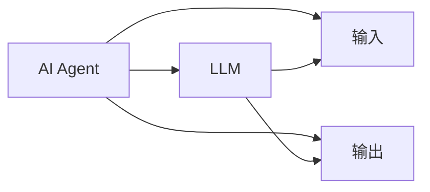

                 

# AI Agent 的可控生成：精确控制 LLM 的输出

## 关键词：AI Agent, LLM, 可控生成, 输出控制, 语言模型, 人工智能

## 摘要：本文详细探讨AI Agent如何精确控制大语言模型（LLM）的输出，涵盖技术背景、核心概念、算法原理、系统设计与实现、项目实战以及最佳实践。通过深入分析AI Agent在LLM输出控制中的作用，本文为读者提供了一套系统的方法论，帮助他们理解和实现可控生成技术。

---

# 第1章 AI Agent 的可控生成概述

## 1.1 问题背景
### 1.1.1 大语言模型（LLM）的崛起
- 介绍LLM的快速发展及其在自然语言处理领域的应用。
- 分析LLM的强大生成能力带来的机遇与挑战。

### 1.1.2 LLM 输出不可控的挑战
- 探讨LLM生成内容可能偏离预期目标的问题。
- 分析输出不可控对实际应用场景的影响。

### 1.1.3 AI Agent 的定义与作用
- 明确AI Agent的概念及其在LLM控制中的角色。
- 介绍AI Agent如何通过策略和反馈机制实现对LLM的精确控制。

## 1.2 问题描述
### 1.2.1 LLM 输出失控的表现形式
- 列举LLM输出失控的具体表现，如生成错误信息、偏离主题等。
- 分析这些表现对实际应用的潜在风险。

### 1.2.2 AI Agent 在输出控制中的角色
- 解释AI Agent在LLM输出控制中的关键作用。
- 说明AI Agent如何通过算法和策略实现对LLM的引导和修正。

### 1.2.3 可控生成的目标与意义
- 明确可控生成的目标，即通过AI Agent实现对LLM输出的精确控制。
- 分析可控生成技术在实际应用中的重要意义。

## 1.3 问题解决
### 1.3.1 可控生成的实现方法
- 介绍几种常见的可控生成方法，如基于规则的控制、基于奖励的控制等。
- 分析每种方法的优缺点及其适用场景。

### 1.3.2 AI Agent 的核心功能
- 详细说明AI Agent的核心功能，如意图理解、策略生成、输出校验等。
- 通过实例说明AI Agent如何实现对LLM的精确控制。

### 1.3.3 可控生成的边界与外延
- 明确可控生成的边界，即AI Agent干预的范围和限度。
- 分析可控生成技术的外延，如与其他AI技术的结合应用。

## 1.4 核心概念与要素
### 1.4.1 AI Agent 的核心要素
- 列出AI Agent的核心要素，如意图解析模块、策略生成模块等。
- 详细说明每个要素的功能及其在可控生成中的作用。

### 1.4.2 LLM 的关键属性
- 介绍LLM的关键属性，如生成能力、理解能力等。
- 分析这些属性对可控生成的影响。

### 1.4.3 可控生成的系统架构
- 描述可控生成系统的整体架构。
- 通过图表展示系统各模块之间的关系。

## 1.5 本章小结
- 总结本章的主要内容，强调AI Agent在可控生成中的重要性。

---

# 第2章 AI Agent 的核心概念与联系

## 2.1 核心概念原理
### 2.1.1 AI Agent 的基本原理
- 解释AI Agent的基本原理，包括感知、决策和执行过程。
- 通过实例说明AI Agent如何与LLM交互。

### 2.1.2 LLM 的生成机制
- 介绍LLM的生成机制，如基于Transformer的生成模型。
- 分析LLM生成过程中的关键步骤。

### 2.1.3 可控生成的实现逻辑
- 详细说明可控生成的实现逻辑，包括输入处理、生成策略、输出控制等环节。
- 通过流程图展示可控生成的整体逻辑。

## 2.2 核心概念对比分析
### 2.2.1 开放式与封闭式模型的对比
- 对比开放式模型和封闭式模型在可控生成中的表现。
- 分析两种模型的优缺点及其适用场景。

### 2.2.2 不同 AI Agent 模型的优缺点
- 比较不同AI Agent模型的特点，如基于规则的AI Agent和基于学习的AI Agent。
- 通过实例说明不同模型在可控生成中的应用效果。

### 2.2.3 可控生成与不可控生成的对比
- 对比可控生成和不可控生成的特点。
- 分析两种生成方式在实际应用中的表现。

## 2.3 系统架构图
### 2.3.1 ER 实体关系图

---

# 第3章 AI Agent 的算法原理讲解

## 3.1 算法原理
### 3.1.1 AI Agent 的算法流程
- 详细说明AI Agent的算法流程，包括意图解析、策略生成、输出校验等步骤。
- 通过流程图展示算法的整体流程。

### 3.1.2 算法实现细节
- 介绍算法实现的关键细节，如意图解析的实现方法、策略生成的优化技巧等。
- 通过代码示例说明算法实现的具体步骤。

### 3.1.3 数学模型与公式
- 介绍算法中的数学模型，如概率分布模型、损失函数等。
- 通过公式展示数学模型的具体形式。

## 3.2 算法实现代码
### 3.2.1 环境安装
- 介绍需要安装的环境和依赖库，如Python、TensorFlow等。
- 提供环境安装的命令示例。

### 3.2.2 核心实现代码
- 提供AI Agent算法的核心实现代码，如意图解析模块、策略生成模块等。
- 通过代码示例说明算法实现的具体细节。

### 3.2.3 代码解读与分析
- 对代码进行逐行解读，说明每部分代码的功能和作用。
- 分析代码的优化点和改进方向。

## 3.3 算法优化与改进
### 3.3.1 算法优化方法
- 介绍几种常见的算法优化方法，如参数调整、模型优化等。
- 通过实例说明优化方法的具体应用。

### 3.3.2 算法改进方向
- 分析算法的局限性，提出改进的方向和建议。
- 通过实例说明改进方案的具体实施方法。

---

# 第4章 AI Agent 的系统分析与架构设计

## 4.1 系统分析
### 4.1.1 系统功能分析
- 分析AI Agent系统的功能需求，如输入处理、生成策略、输出控制等。
- 通过功能需求说明系统的核心功能。

### 4.1.2 系统性能分析
- 分析系统在性能方面的表现，如响应速度、生成精度等。
- 提出优化系统性能的建议。

### 4.1.3 系统安全性分析
- 分析系统在安全性方面的表现，如防止恶意输入、数据泄露等。
- 提出提升系统安全性的措施。

## 4.2 系统架构设计
### 4.2.1 系统架构概述
- 介绍系统的整体架构，如数据层、处理层、控制层等。
- 通过图表展示系统架构的层次关系。

### 4.2.2 系统模块设计
- 分解系统模块，如输入处理模块、生成策略模块、输出控制模块等。
- 详细说明每个模块的功能和实现方法。

### 4.2.3 系统交互设计
- 说明系统模块之间的交互关系，如输入处理模块与生成策略模块的交互。
- 通过流程图展示系统交互的逻辑流程。

## 4.3 系统接口设计
### 4.3.1 系统接口定义
- 定义系统的接口，如API接口、命令行接口等。
- 说明接口的输入输出格式和调用方式。

### 4.3.2 接口实现细节
- 介绍接口实现的具体细节，如API接口的实现方法、命令行接口的使用方法等。
- 提供接口实现的代码示例。

### 4.3.3 接口测试与验证
- 分析接口的测试方法，如单元测试、集成测试等。
- 提供接口测试的代码示例和测试结果分析。

---

# 第5章 AI Agent 的项目实战

## 5.1 项目介绍
### 5.1.1 项目背景
- 介绍项目的背景和目标。
- 说明项目在实际应用中的意义。

### 5.1.2 项目目标
- 明确项目的具体目标，如实现对LLM的精确控制等。
- 分析项目目标的实现方法和路径。

## 5.2 核心实现
### 5.2.1 环境安装
- 介绍项目所需的环境和依赖库，如Python、TensorFlow等。
- 提供环境安装的命令示例。

### 5.2.2 核心实现代码
- 提供项目的核心实现代码，如AI Agent算法的实现、LLM的调用等。
- 通过代码示例说明项目的实现细节。

### 5.2.3 代码解读与分析
- 对代码进行逐行解读，说明每部分代码的功能和作用。
- 分析代码的优化点和改进方向。

## 5.3 实际案例分析
### 5.3.1 案例背景
- 介绍案例的背景和需求。
- 说明案例的具体应用场景。

### 5.3.2 案例实现
- 详细说明案例的实现过程，包括需求分析、设计、实现、测试等步骤。
- 提供案例实现的代码示例和运行结果。

### 5.3.3 案例分析
- 分析案例的实现效果，如生成内容的准确性和可控性等。
- 总结案例的成功经验和教训。

## 5.4 项目小结
- 总结项目的实现过程和成果。
- 提出项目的改进方向和未来的发展计划。

---

# 第6章 AI Agent 的最佳实践

## 6.1 最佳实践
### 6.1.1 可控生成的注意事项
- 提出在可控生成过程中需要注意的事项，如模型选择、数据质量等。
- 分析这些注意事项对生成效果的影响。

### 6.1.2 AI Agent 的优化技巧
- 介绍几种优化AI Agent性能和生成效果的技巧，如参数调优、模型选择等。
- 通过实例说明优化技巧的具体应用。

## 6.2 小结
- 总结全文的主要内容。
- 强调AI Agent在可控生成中的重要性。

## 6.3 注意事项
- 提醒读者在实际应用中需要注意的问题。
- 分析这些问题对生成效果的影响。

## 6.4 拓展阅读
- 推荐一些与AI Agent和可控生成相关的书籍和论文。
- 提供进一步学习和研究的方向。

---

# 作者：AI天才研究院/AI Genius Institute & 禅与计算机程序设计艺术 /Zen And The Art of Computer Programming

---

这篇文章全面探讨了AI Agent如何实现对LLM的精确控制，涵盖了从理论到实践的各个方面。通过详细的分析和实例，读者可以深入了解AI Agent的核心概念、算法原理、系统设计和实际应用。

