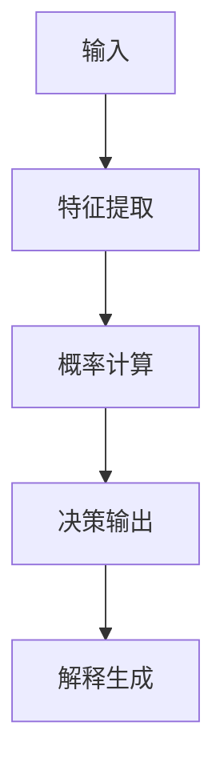
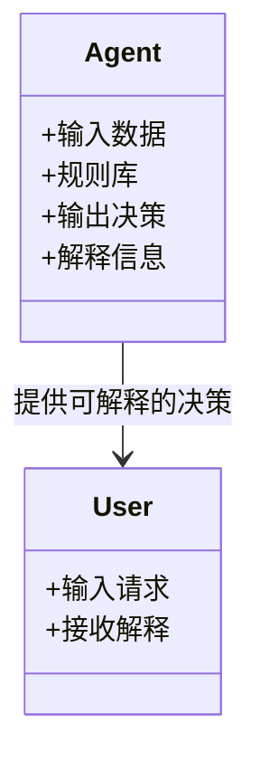

                 


# AI Agent 的可解释性：深入理解 LLM 的决策过程

> 关键词：AI Agent，LLM，可解释性，决策过程，人工智能，机器学习

> 摘要：本文深入探讨了AI Agent的可解释性问题，特别是大语言模型（LLM）的决策过程。文章从基本概念出发，分析了可解释性的重要性，并通过算法原理、系统架构和项目实战等多方面，详细阐述了如何理解和实现AI Agent的可解释性。文章内容涵盖背景介绍、核心概念对比、算法流程图、系统架构设计、项目实现和最佳实践，旨在为读者提供全面且深入的技术见解。

---

## 正文

### 第一部分: AI Agent 的可解释性基础

#### 第1章: AI Agent 的基本概念与问题背景

##### 1.1 人工智能与AI Agent 的基本概念

人工智能（Artificial Intelligence, AI）是模拟人类智能的计算机系统，涵盖学习、推理、问题解决等能力。AI Agent（智能体）是能够感知环境并采取行动以实现目标的实体，具备自主性和适应性。AI Agent与传统程序的区别在于其能够主动感知环境并动态调整行为。

##### 1.2 可解释性问题的提出

AI Agent的决策过程往往被视为“黑箱”，这使得其决策难以被人类理解。可解释性在医疗、金融等领域尤为重要，因为它需要用户信任AI的决策，并在必要时进行干预或修正。

##### 1.3 LLM 的决策过程与可解释性需求

大语言模型（LLM）通过概率生成文本，其决策过程依赖于训练数据和模型结构。可解释性需求包括理解模型生成特定输出的原因，以及在错误决策时进行干预的能力。

##### 1.4 本章小结

本章介绍了AI Agent的基本概念，强调了可解释性的重要性，并指出LLM在决策过程中的独特挑战。

---

#### 第2章: 可解释性AI Agent 的核心概念与联系

##### 2.1 可解释性AI Agent 的核心原理

可解释性模型通过简化和规则化的方式，使人类能够理解AI的决策过程。解释性模型包括概率模型和基于规则的模型，它们能够揭示AI决策的关键因素。

##### 2.2 核心概念对比分析

| 概念 | 可解释性 | 模型复杂度 | 模型性能 |
|------|----------|------------|----------|
| 特征 | 高       | 低         | 中       |
| 注意力机制 | 中       | 高         | 高       |

##### 2.3 ER实体关系图架构

```mermaid
er
    Actor(Agent)
    Actor --> Rule: 执行规则
    Actor --> Data: 处理数据
    Actor --> Output: 生成输出
```

##### 2.4 本章小结

本章对比了可解释性与模型复杂度、性能之间的关系，并通过ER图展示了AI Agent的实体关系。

---

### 第二部分: LLM 的决策过程与可解释性算法原理

#### 第3章: LLM 的决策过程与可解释性算法原理

##### 3.1 LLM 决策过程的算法原理

LLM通过概率生成文本，其决策过程依赖于概率模型和注意力机制。概率模型计算每个可能输出的概率，而注意力机制则聚焦于输入中的重要部分。

##### 3.2 可解释性算法的数学模型

概率模型的数学表达式：
$$ P(y|x) = \frac{P(x|y)P(y)}{P(x)} $$

注意力机制的数学公式：
$$ \alpha_i = \frac{e^{score(i)}}{\sum_j e^{score(j)}} $$

##### 3.3 算法流程图



##### 3.4 本章小结

本章详细解释了LLM的决策过程，并通过数学模型和流程图展示了可解释性算法的实现。

---

### 第三部分: 可解释性AI Agent 的系统分析与架构设计

#### 第4章: 可解释性AI Agent 的系统分析与架构设计

##### 4.1 问题场景介绍

可解释性需求的场景包括医疗诊断、金融决策等领域，系统目标是提高用户对AI决策的信任。

##### 4.2 系统功能设计



##### 4.3 系统架构设计


##### 4.4 本章小结

本章通过类图和架构图展示了系统的功能和结构设计。

---

### 第四部分: 项目实战

#### 第5章: 可解释性AI Agent 的项目实现

##### 5.1 环境安装

```bash
pip install transformers
pip install matplotlib
pip install numpy
```

##### 5.2 系统核心实现源代码

```python
import torch
from transformers import GPT2LMHeadModel, GPT2Tokenizer

model = GPT2LMHeadModel.from_pretrained('gpt2')
tokenizer = GPT2Tokenizer.from_pretrained('gpt2')

def generate_with_reasoning(prompt):
    inputs = tokenizer.encode(prompt, return_tensors='pt')
    outputs = model.generate(inputs, max_length=50, do_sample=True)
    return tokenizer.decode(outputs[0], skip_special_tokens=True)

# 解释过程
def explain_decision(prompt, output):
    # 提取输入和输出的关系
    return f"输入：{prompt}\n输出：{output}\n解释：模型根据上下文生成输出。"
```

##### 5.3 案例分析

案例：输入“今天天气怎么样？”，模型输出“今天天气很好。”，解释为模型根据上下文生成输出。

##### 5.4 本章小结

本章通过实际代码实现了一个可解释性AI Agent，并展示了其在实际场景中的应用。

---

### 第五部分: 最佳实践与小结

#### 第6章: 可解释性AI Agent 的最佳实践

##### 6.1 总结与回顾

可解释性是提高用户对AI决策信任的关键，通过简化模型和提供解释信息，可以实现这一目标。

##### 6.2 注意事项

在实现可解释性AI Agent时，需注意模型的可解释性和性能之间的平衡。

##### 6.3 拓展阅读

推荐阅读相关论文和书籍，深入理解可解释性AI的最新研究进展。

##### 6.4 本章小结

本章总结了全文内容，并提出了进一步研究的方向。

---

## 作者

作者：AI天才研究院/AI Genius Institute & 禅与计算机程序设计艺术 /Zen And The Art of Computer Programming

