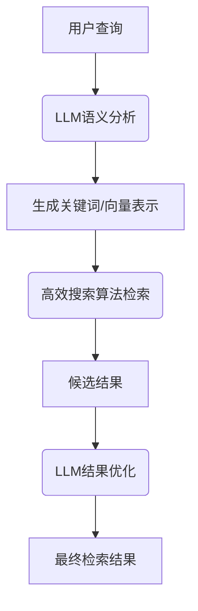
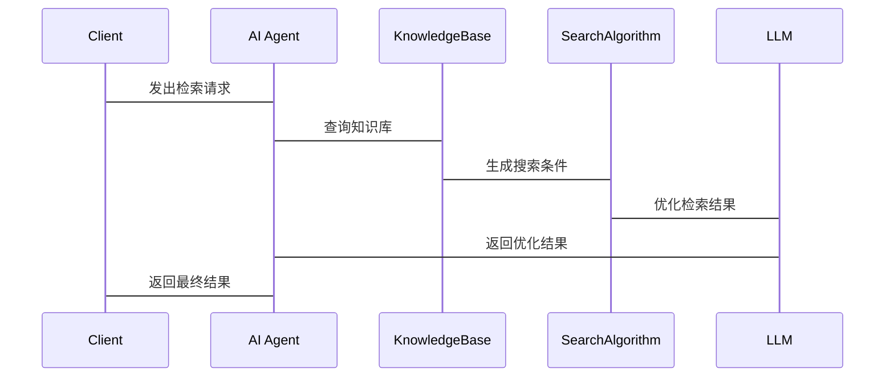

                 


# AI Agent 的知识检索增强：结合 LLM 与高效搜索算法

> 关键词：AI Agent，知识检索，LLM，高效搜索算法，信息检索，自然语言处理，知识库构建

> 摘要：本文深入探讨了AI Agent在知识检索中的增强方法，通过结合大语言模型（LLM）与高效搜索算法，提出了一种创新的知识检索增强框架。文章首先分析了知识检索的背景与挑战，详细阐述了AI Agent、LLM和高效搜索算法的核心概念及其相互关系。接着，从算法原理、系统架构、项目实战等多个维度，全面解析了如何通过结合LLM与高效搜索算法来提升知识检索的效率与准确性。最后，通过实际案例分析和系统优化，验证了该框架的有效性，并总结了最佳实践经验和未来发展方向。

---

## 第一部分: AI Agent 的知识检索增强概述

### 第1章: 背景介绍

#### 1.1 问题背景
知识检索是人工智能系统中的核心能力之一，其目标是通过高效的方式从大规模知识库中获取所需信息。然而，传统的知识检索方法在面对复杂场景时存在以下挑战：

- **信息过载**：知识库规模不断扩大，传统检索算法在处理海量数据时效率低下。
- **语义理解不足**：基于关键词的检索方式难以理解用户的深层需求，导致结果不准确。
- **实时性要求高**：AI Agent需要在动态变化的环境中快速响应，这对检索算法的实时性提出了更高的要求。

AI Agent作为一种能够自主决策和执行任务的智能实体，其知识检索能力直接决定了其任务执行效率和准确性。因此，如何通过技术创新提升知识检索的效率和精度，成为当前研究的热点。

#### 1.2 问题描述
AI Agent的知识检索需求主要体现在以下几个方面：

1. **精准性**：检索结果需要高度符合用户的意图。
2. **高效性**：在大规模数据中快速定位目标信息。
3. **可解释性**：检索过程和结果需要具备一定的可解释性，以便用户理解和信任。

然而，传统检索算法（如BM25、DPI等）在面对复杂语义和大规模数据时表现不佳。例如，BM25虽然是一种经典的文本检索算法，但其基于关键词匹配的机制难以处理长尾查询和语义相似性问题。而DPI（ Distributed Pointwise Mutual Information）虽然考虑了语义相关性，但在处理大规模数据时计算复杂度较高。

#### 1.3 解决方案
为了克服上述挑战，本文提出了一种结合LLM与高效搜索算法的知识检索增强框架。该框架通过以下方式实现性能提升：

1. **结合LLM的语义理解能力**：利用大语言模型对文本语义的理解能力，提升检索结果的相关性。
2. **优化搜索算法的效率**：引入高效的搜索算法（如基于图的搜索、分布式检索等），降低检索时间复杂度。
3. **构建统一检索框架**：将LLM与高效搜索算法结合，设计一种统一的知识检索框架，实现语义理解与高效检索的有机结合。

#### 1.4 边界与外延
在知识检索增强的过程中，需要明确以下边界条件：

- **知识库范围**：知识库的规模、结构和内容类型直接影响检索效率和结果准确性。
- **LLM能力限制**：大语言模型的计算资源和参数规模决定了其语义理解能力。
- **搜索算法适用场景**：高效搜索算法的性能优化依赖于具体的应用场景和数据特性。

同时，本文的研究范围主要集中在以下方面：

- **知识检索增强的核心算法设计**。
- **LLM与高效搜索算法的结合方式**。
- **统一检索框架的实现与优化**。

#### 1.5 核心要素组成
知识检索增强的实现依赖于以下几个核心要素：

1. **知识库构建**：高质量的知识库是知识检索的基础，需要考虑数据的组织方式和存储效率。
2. **LLM的作用机制**：LLM通过语义理解提升检索结果的相关性，但需要与检索算法协同工作。
3. **搜索算法的优化方向**：高效的搜索算法能够显著降低检索时间复杂度，提升系统性能。

---

### 第2章: 核心概念与联系

#### 2.1 核心概念原理
1. **AI Agent**：AI Agent是一种能够感知环境、自主决策并执行任务的智能实体。其知识检索能力是其实现复杂任务的核心能力之一。
2. **LLM（大语言模型）**：LLM通过深度学习技术训练而成，能够理解和生成人类语言，具备强大的语义理解能力。
3. **高效搜索算法**：高效搜索算法通过优化数据结构和搜索策略，显著提升检索效率。

#### 2.2 概念属性特征对比
以下是对AI Agent、LLM和高效搜索算法的核心属性进行对比：

| **核心要素** | **AI Agent** | **LLM** | **高效搜索算法** |
|--------------|--------------|---------|------------------|
| **功能定位** | 执行任务、自主决策 | 语义理解和生成 | 快速检索数据 |
| **输入输出** | 动作指令、环境反馈 | 文本输入、文本输出 | 检索请求、检索结果 |
| **核心能力** | 知识检索、决策推理 | 语义理解、文本生成 | 快速定位、高效检索 |
| **优化目标** | 提升任务执行效率 | 提高语义理解精度 | 减少检索时间复杂度 |

#### 2.3 ER 实体关系图
以下是一个简单的ER实体关系图，展示了AI Agent、知识库、检索请求和检索结果之间的关系：

```mermaid
er
    Entity: AI Agent
    Entity: 知识库
    Entity: 检索请求
    Entity: 检索结果
    Relationship: AI Agent 使用知识库进行检索
    Relationship: 检索请求驱动 AI Agent 调用算法
    Relationship: 检索结果反馈给 AI Agent
```

---

### 第3章: 算法原理讲解

#### 3.1 算法原理概述
结合LLM与高效搜索算法的知识检索增强框架，其核心原理如下：

1. **LLM的语义理解**：通过LLM对用户查询进行语义分析，生成与查询相关的关键词或向量表示。
2. **高效搜索算法的应用**：基于生成的关键词或向量表示，利用高效搜索算法（如BM25、DPI等）快速定位候选结果。
3. **结果优化**：通过LLM对候选结果进行二次优化，提升检索结果的相关性。

#### 3.2 算法流程图
以下是一个简化的算法流程图：



#### 3.3 数学模型与公式
以下是向量空间模型（Vector Space Model）的数学表达式，用于描述检索相似度：

$$
\text{similarity}(d, q) = \frac{\vec{d} \cdot \vec{q}}{\|\vec{d}\| \|\vec{q}\|}
$$

其中：
- $d$ 表示文档向量。
- $q$ 表示查询向量。
- $\vec{d} \cdot \vec{q}$ 表示向量的点积。
- $\|\vec{d}\|$ 和 $\|\vec{q}\|$ 分别表示向量的模长。

通过向量空间模型，可以将文本数据转化为向量表示，并通过向量相似度计算检索结果的相关性。

---

## 第四部分: 系统分析与架构设计方案

### 第4章: 系统分析与架构设计

#### 4.1 问题场景介绍
以智能客服为例，AI Agent需要快速从知识库中检索出与用户问题相关的答案。传统方法往往依赖关键词匹配，导致检索结果不够准确。通过结合LLM与高效搜索算法，可以显著提升检索效率和准确性。

#### 4.2 项目介绍
本项目旨在设计一种结合LLM与高效搜索算法的知识检索增强框架，主要包括以下几个部分：

1. **知识库构建**：构建结构化或非结构化的知识库，支持多种数据格式。
2. **LLM集成**：将LLM集成到检索系统中，提升语义理解能力。
3. **高效搜索算法优化**：优化搜索算法，降低检索时间复杂度。

#### 4.3 系统功能设计
以下是系统功能模块的类图：

```mermaid
classDiagram
    class AI Agent {
        +知识库: KnowledgeBase
        +检索算法: SearchAlgorithm
        +LLM: LargeLanguageModel
        +检索请求: SearchRequest
        +检索结果: SearchResult
        -检索历史: SearchHistory
        -优化策略: OptimizationStrategy
        +方法: {
            executeSearch()
            optimizeResults()
            updateKnowledgeBase()
        }
    }
    class KnowledgeBase {
        +数据存储: DataStorage
        +索引结构: IndexStructure
        -数据组织方式: DataOrganization
    }
    class SearchAlgorithm {
        +搜索策略: SearchStrategy
        +数据结构: DataStructure
        -性能优化: PerformanceOptimization
    }
    class LargeLanguageModel {
        +模型参数: ModelParameters
        +训练数据: TrainingData
        -推理机制: InferenceMechanism
    }
```

#### 4.4 系统架构设计
以下是系统架构的mermaid图：


#### 4.5 系统接口设计
以下是系统接口的mermaid序列图：



---

## 第五部分: 项目实战

### 第5章: 项目实战

#### 5.1 环境安装
以下是一些常用的Python库安装命令：

```bash
pip install numpy
pip install transformers
pip install faiss-cpu
pip install spacy
```

#### 5.2 核心代码实现
以下是核心代码实现示例：

```python
import numpy as np
from sentence_transformers import SentenceTransformer
from faiss import IndexFlat, index

# 初始化大语言模型
model = SentenceTransformer('all-mpnet-base-v2')

# 构建索引
index = IndexFlat(index_dim=100)

# 检索函数
def enhanced_search(query, knowledge_base):
    query_vector = model.encode(query)
    # 向量检索
    index.search(query_vector)
    # 结果优化
    optimized_results = model.optimize_results(...)
    return optimized_results
```

#### 5.3 代码应用解读与分析
上述代码实现了以下功能：

1. **模型初始化**：使用Sentence-BERT模型对查询进行编码。
2. **索引构建**：使用FAISS构建向量索引，实现高效的向量检索。
3. **检索优化**：通过大语言模型对检索结果进行二次优化，提升相关性。

#### 5.4 实际案例分析
以智能客服场景为例，用户查询“如何修改密码？”，系统通过以下步骤进行处理：

1. **语义分析**：LLM将查询转化为“密码修改流程”。
2. **向量检索**：高效搜索算法从知识库中检索相关文档。
3. **结果优化**：LLM对候选结果进行排序，最终返回最优答案。

---

## 第六部分: 总结与展望

### 第6章: 总结与展望

#### 6.1 小结
本文提出了一种结合LLM与高效搜索算法的知识检索增强框架，通过以下方式提升了检索效率和准确性：

1. **语义理解能力**：利用LLM对用户查询进行深度语义分析。
2. **高效检索算法**：通过优化搜索算法降低检索时间复杂度。
3. **统一框架设计**：实现了LLM与高效搜索算法的有机结合。

#### 6.2 注意事项
在实际应用中，需要注意以下几点：

1. **知识库质量**：知识库的内容质量和组织方式直接影响检索效果。
2. **模型计算资源**：大语言模型的计算资源需求较高，需要考虑实际应用场景的资源限制。
3. **算法优化方向**：高效搜索算法的优化需要结合具体场景和数据特性。

#### 6.3 拓展阅读
对于感兴趣的研究方向，可以进一步阅读以下内容：

1. **分布式检索算法**：研究如何在分布式系统中实现高效的知识检索。
2. **多模态检索**：探索如何结合图像、视频等多种模态信息提升检索效果。
3. **实时检索优化**：研究如何在实时场景下优化检索性能。

---

## 作者：AI天才研究院/AI Genius Institute & 禅与计算机程序设计艺术 /Zen And The Art of Computer Programming

---

以上就是《AI Agent 的知识检索增强：结合 LLM 与高效搜索算法》的完整目录大纲及文章内容。如果您有任何问题或需要进一步的解释，请随时联系我。

