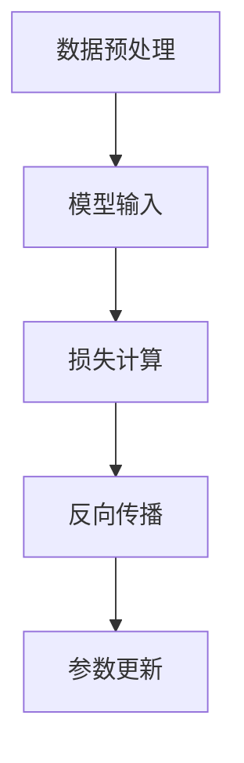
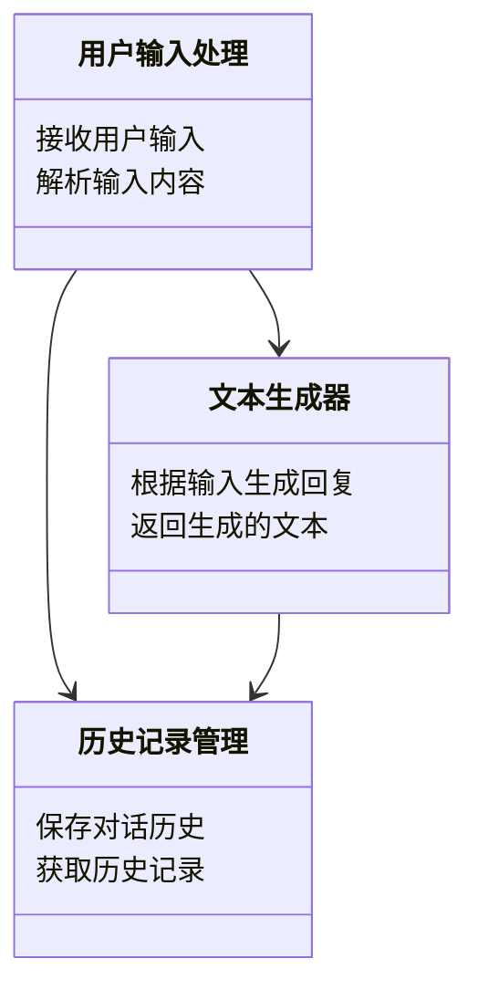
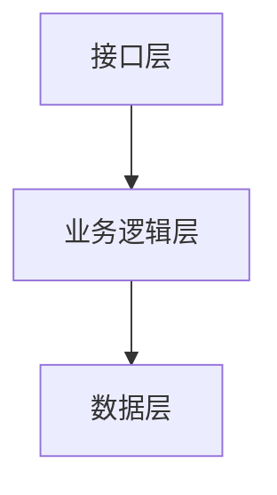
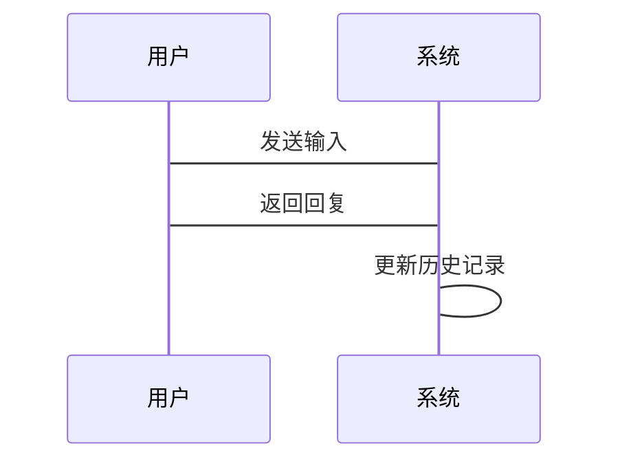

                 

# 第三章: LLM 的数学模型与算法实现

## 3.1 LLM 的数学模型

### 3.1.1 概率模型
LLM 的目标是根据输入生成合理的输出，这可以通过概率模型来实现。概率模型试图计算在给定输入条件下输出的概率分布，从而生成最可能的下一个词。概率模型的数学表达式可以表示为：

$$ P(y|x) = \prod_{i=1}^{n} P(y_i|x_{<i}, y_{<i}) $$

其中，$x$ 表示输入序列，$y$ 表示输出序列，$P(y_i|x_{<i}, y_{<i})$ 是在给定之前的输入和输出条件下，生成第 $i$ 个词的概率。

### 3.1.2 Transformer 架构
Transformer 架构是 LLM 的核心，它由编码器和解码器两个部分组成。编码器负责将输入序列转换为一个上下文向量，解码器则根据编码器生成的向量生成输出序列。编码器和解码器均由多个堆叠的自注意力（Self-Attention）层组成。

#### 3.1.2.1 自注意力机制
自注意力机制通过计算输入序列中每个词与其他词的相关性，生成一个注意力权重矩阵。注意力机制的数学表达式为：

$$ \text{Attention}(Q, K, V) = \text{softmax}\left( \frac{QK^T}{\sqrt{d_k}} \right)V $$

其中，$Q$、$K$、$V$ 分别是查询、键和值矩阵，$d_k$ 是键的维度。

#### 3.1.2.2 前向网络
前向网络负责将自注意力的结果进行前向传播，通常由多个全连接层组成，每个层都包含ReLU激活函数。

### 3.1.3 损失函数与优化
LLM 的训练目标是最小化预测与真实值之间的差异。通常使用交叉熵损失函数：

$$ \mathcal{L} = -\sum_{i=1}^{n} \sum_{j=1}^{m} y_{i,j} \log p(y_{i,j}|x_i) $$

其中，$y_{i,j}$ 是真实标签的概率，$p(y_{i,j}|x_i)$ 是模型预测的概率。优化算法通常采用Adam优化器：

$$ \theta_{t+1} = \theta_t - \eta \frac{\partial \mathcal{L}}{\partial \theta_t} $$

其中，$\theta$ 是模型参数，$\eta$ 是学习率。

## 3.2 LLM 的算法实现

### 3.2.1 训练流程
LLM 的训练流程包括数据预处理、模型构建、损失计算、反向传播和参数更新五个步骤。以下是训练流程的mermaid图：

### 3.2.2 模型优化
模型优化主要通过调整超参数（如学习率、批量大小）和使用早停（Early Stopping）技术来实现。早停技术可以防止过拟合，通过监控验证集损失值，在验证集损失值不再下降时提前终止训练。

## 3.3 本章小结
本章详细介绍了 LLM 的数学模型，包括概率模型、Transformer 架构以及损失函数和优化算法。通过自注意力机制和前向网络的结合，模型能够有效地捕捉输入序列中的长距离依赖关系。同时，训练过程通过交叉熵损失和Adam优化器实现参数更新。

# 第四章: LLM 对话系统的系统设计与架构

## 4.1 系统功能需求

### 4.1.1 核心功能
- 用户输入处理：接收用户的文本输入。
- 文本生成：根据输入生成回复。
- 历史记录管理：保存对话历史，以便后续使用。

### 4.1.2 边界条件
- 输入限制：支持的文本长度和格式。
- 响应时间：生成回复的时间限制。
- 安全性：防止恶意输入攻击。

## 4.2 系统架构设计

### 4.2.1 领域模型
领域模型描述了系统的功能模块及其交互关系。以下是领域模型的 mermaid 类图：

### 4.2.2 系统架构
系统架构采用分层设计，包括接口层、业务逻辑层和数据层。以下是系统架构的 mermaid 图：

### 4.2.3 接口设计
系统提供以下接口：

- `generate_response(input_text: str) -> str`：生成回复。
- `get_history() -> List[str]`：获取对话历史。
- `add_to_history(response_text: str)`：添加到对话历史。

## 4.3 交互流程设计

### 4.3.1 序列图
以下是系统交互的 mermaid 序列图：

## 4.4 本章小结
本章详细描述了 LLM 对话系统的功能需求、系统架构和交互流程。通过领域模型和系统架构的设计，确保系统各部分协同工作，实现高效的对话功能。

# 附录

## 附录A: 术语表
- LLM：Large Language Model，大语言模型。
- Transformer：一种深度学习模型，广泛应用于自然语言处理。
- Self-Attention：自注意力机制，用于捕捉序列中的长距离依赖关系。

## 附录B: 参考文献
1. Vaswani, A., et al. "Attention Is All You Need." arXiv preprint arXiv:1706.03798, 2017.
2. Kingma, D. P., and J. Ba. "Adam: A Method for Stochastic Optimization." arXiv preprint arXiv:1412.6980, 2014.

# 作者
作者：AI天才研究院 & 禅与计算机程序设计艺术

---

这篇文章详细探讨了 AI Agent 的自然语言交互，特别是基于 LLM 的对话系统设计。从数学模型到系统架构，文章深入浅出地介绍了 LLM 的工作原理和实现细节，为读者提供了全面的技术视角。希望这篇文章能够帮助读者更好地理解和应用 LLM 对话系统。

