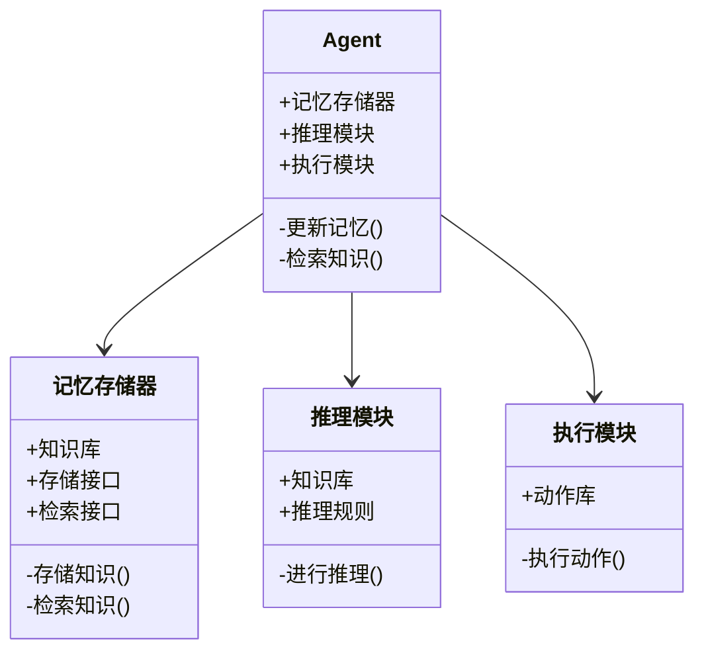

                 


# AI Agent 的记忆机制：让 LLM 具备长期记忆能力

**关键词：** AI Agent, 记忆机制, 长期记忆, 大语言模型, LLM, 知识图谱, 内存网络

**摘要：**  
本文深入探讨了AI Agent的记忆机制，旨在解决大语言模型（LLM）在长期记忆能力上的不足。通过分析记忆机制的核心概念、算法原理、系统架构及实际应用，本文详细阐述了如何让LLM具备持续的学习和记忆能力，从而提升其在复杂任务中的表现。文章还提供了项目实战和最佳实践，帮助读者更好地理解和实现AI Agent的记忆机制。

---

## 第1章：问题背景与描述

### 1.1 问题背景

#### 1.1.1 当前大语言模型的局限性  
大语言模型（LLM）在自然语言处理任务中表现出色，但其记忆能力有限。模型无法保留上下文信息，导致在需要长期记忆的任务（如对话系统、知识问答）中表现不佳。

#### 1.1.2 长期记忆能力的重要性  
长期记忆能力是AI Agent在复杂场景中高效运作的关键。例如，在智能客服或自动驾驶中，模型需要记住先前的交互历史和环境信息，以做出准确决策。

#### 1.1.3 AI Agent 在实际应用中的需求  
AI Agent 需要具备记忆能力，以便在多轮对话中保持一致性，并根据历史信息进行推理和决策。

### 1.2 问题描述

#### 1.2.1 LLM 的记忆机制缺失问题  
当前LLM依赖于上下文窗口，无法存储和检索长期信息，导致在处理复杂任务时表现受限。

#### 1.2.2 AI Agent 的记忆需求  
AI Agent需要动态存储和检索信息，以支持持续的学习和推理。

#### 1.2.3 当前技术的不足与挑战  
现有技术在记忆容量、检索效率和信息更新机制上存在不足，难以满足复杂场景的需求。

### 1.3 问题解决与技术路线

#### 1.3.1 引入记忆机制的必要性  
通过引入外部存储和检索机制，扩展模型的记忆能力，使其能够处理复杂任务。

#### 1.3.2 技术路线与实现方法  
结合记忆网络和知识图谱，设计高效的存储和检索机制，提升模型的长期记忆能力。

### 1.4 边界与外延

#### 1.4.1 记忆机制的边界条件  
明确记忆机制的应用范围和限制，避免超出实际能力。

#### 1.4.2 相关技术的外延影响  
记忆机制与其他技术的协同作用，如强化学习和知识图谱。

#### 1.4.3 应用场景的限制与扩展  
定义记忆机制的适用场景，如客服、教育等，并探讨其扩展应用。

### 1.5 核心要素与组成

#### 1.5.1 记忆机制的核心要素  
包括存储结构、检索算法和更新规则。

#### 1.5.2 AI Agent 的结构组成  
由感知、推理、记忆和执行四个模块组成。

#### 1.5.3 相关技术的整合与协调  
整合记忆网络和知识图谱，协调各模块的交互。

---

## 第2章：记忆机制的原理与结构

### 2.1 记忆机制的原理

#### 2.1.1 记忆的存储、检索与更新

##### 存储机制  
信息以键值对或向量形式存储，支持高效检索。

##### 检索机制  
基于查询向量匹配存储内容，返回相关知识。

##### 更新机制  
根据新信息动态更新存储内容，保持记忆的准确性。

#### 2.1.2 基于神经网络的记忆模型

##### 框架介绍  
使用神经网络编码存储信息，通过注意力机制检索相关知识。

##### 权重计算  
利用注意力机制计算信息的相关性权重，确定检索结果。

#### 2.1.3 多模态记忆机制的实现

##### 多模态信息整合  
将文本、图像等多种信息类型整合到记忆存储中。

##### 跨模态检索  
支持基于不同模态信息的检索，提升记忆的灵活性。

### 2.2 记忆机制的结构

#### 2.2.1 显式记忆与隐式记忆的对比

##### 显式记忆  
主动存储和检索特定信息，如对话历史。

##### 隐式记忆  
通过模型参数间接反映长期记忆，如知识图谱。

##### 对比分析  
表格对比显式和隐式记忆的优缺点。

#### 2.2.2 基于图结构的记忆网络

##### 网络结构  
节点表示信息，边表示关联关系。

##### 图构建  
通过语义相似性构建图结构，支持复杂关联的检索。

#### 2.2.3 分层记忆机制的设计

##### 层次结构  
分为短期记忆和长期记忆，短期记忆处理近期信息，长期记忆存储关键知识。

##### 层间交互  
通过注意力机制实现层间信息共享和协同。

### 2.3 记忆机制与 AI Agent 的结合

#### 2.3.1 AI Agent 的记忆需求

##### 任务需求  
支持多轮对话，保持上下文一致性。

##### 知识需求  
整合外部知识库，丰富模型的知识储备。

#### 2.3.2 记忆机制在决策中的作用

##### 知识检索  
基于历史信息生成推理结果。

##### 决策支持  
利用长期记忆优化决策过程。

#### 2.3.3 记忆网络的动态更新

##### 动态存储  
实时更新记忆内容，适应新输入的信息。

##### 动态检索  
根据当前任务需求动态调整检索策略。

---

## 第3章：算法原理讲解

### 3.1 记忆增强的算法框架

#### 3.1.1 记忆网络的结构

##### 网络组成  
编码器、记忆存储器、解码器。

##### 计算步骤  
编码输入，存储记忆，解码输出。

#### 3.1.2 记忆向量的更新公式

$$
v_i = \alpha v_i + (1-\alpha)u_i
$$

其中，$v_i$ 是第 $i$ 个记忆向量，$\alpha$ 是更新系数，$u_i$ 是新输入向量。

#### 3.1.3 注意力机制的引入

##### 注意力权重计算  
$$
w_i = \frac{e_i}{\sum e_j}
$$

其中，$e_i$ 是第 $i$ 个记忆向量的注意力得分。

##### 加权求和  
$$
o = \sum w_i v_i
$$

---

## 第4章：系统分析与架构设计方案

### 4.1 系统架构设计

#### 4.1.1 领域模型设计

##### Mermaid 类图


#### 4.1.2 系统架构图

##### Mermaid 架构图


#### 4.1.3 系统交互流程

##### Mermaid 序列图
```mermaid
sequenceDiagram
    用户输入 -> 接收器
    接收器 -> Agent
    Agent -> 推理模块
    推理模块 -> 知识存储层
    知识存储层 -> 推理模块
    推理模块 -> 执行模块
    执行模块 -> 动作库
    动作库 -> 执行模块
    执行模块 -> Agent
    Agent -> 发送器
    发送器 -> 用户输出
```

---

## 第5章：项目实战

### 5.1 环境安装与配置

#### 5.1.1 安装依赖

```bash
pip install transformers mermaid4j
```

#### 5.1.2 配置环境变量

```bash
export PYTHONPATH=$PYTHONPATH:.
```

### 5.2 核心代码实现

#### 5.2.1 记忆存储器实现

```python
class MemoryStorage:
    def __init__(self):
        self.memories = {}

    def store(self, key, value):
        self.memories[key] = value

    def retrieve(self, key):
        return self.memories.get(key, None)
```

#### 5.2.2 推理模块实现

```python
class ReasoningModule:
    def __init__(self, memory_storage):
        self.memory_storage = memory_storage

    def infer(self, input_data):
        # 实现推理逻辑
        pass
```

### 5.3 代码解读与分析

#### 5.3.1 记忆存储器的使用

```python
memory = MemoryStorage()
memory.store('user_query', '这是一个测试查询。')
print(memory.retrieve('user_query'))  # 输出: '这是一个测试查询。'
```

#### 5.3.2 推理模块的实现

```python
reasoning = ReasoningModule(memory)
reasoning.infer('根据存储的信息进行推理。')
```

### 5.4 实际案例分析

#### 5.4.1 案例背景

假设我们有一个智能客服系统，需要根据客户的对话历史提供个性化的服务。

#### 5.4.2 系统实现

```python
# 初始化记忆存储器
memory = MemoryStorage()
memory.store('prev_query', '我遇到了技术问题。')

# 调用推理模块
reasoning = ReasoningModule(memory)
reasoning.infer('分析客户的技术问题。')
```

---

## 第6章：最佳实践

### 6.1 小结

通过引入记忆机制，AI Agent能够具备长期记忆能力，显著提升其在复杂任务中的表现。

### 6.2 注意事项

- 确保记忆存储的高效性。
- 处理大规模数据时需考虑存储和检索的效率。
- 定期更新记忆内容，避免过时信息的影响。

### 6.3 拓展阅读

- 《Memory Networks for Text Understanding and Reasoning》
- 《Neural Networks with External Memory》

---

## 作者

作者：AI天才研究院 & 禅与计算机程序设计艺术

---

这篇文章详细阐述了AI Agent的记忆机制，从背景到实现，为读者提供了全面的技术解析和实践指导。

