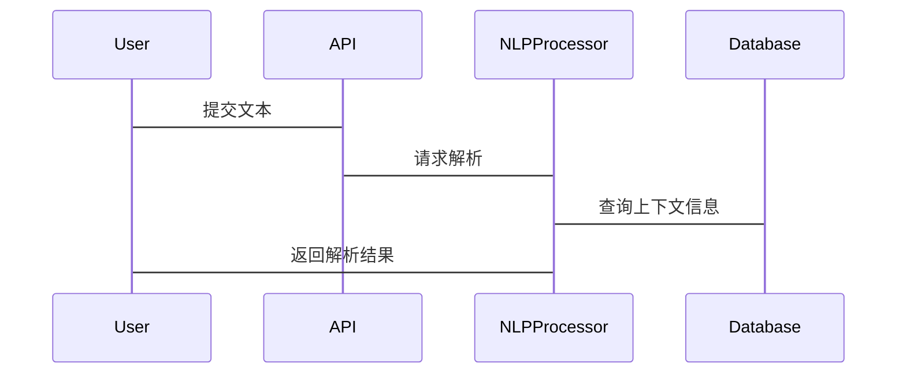

                 


# AI Agent 的语言理解：提升 LLM 的语义解析能力

> 关键词：AI Agent, LLM, 语义解析, 大语言模型, 语言理解, 语义分析

> 摘要：本文详细探讨了AI Agent在提升大语言模型（LLM）语义解析能力中的作用。从核心概念到算法原理，从系统设计到项目实战，系统性地分析了如何通过AI Agent优化LLM的语义理解能力。本文内容涵盖背景介绍、核心概念与联系、算法原理、系统分析与架构设计、项目实战等多方面内容，为读者提供全面而深入的技术指导。

---

## 第一部分：AI Agent与语言理解概述

### 第1章：AI Agent与语言理解概述

#### 1.1 AI Agent的基本概念

- **1.1.1 AI Agent的定义**
  - AI Agent（人工智能代理）是指能够感知环境并采取行动以实现目标的智能实体。
  - 典型的AI Agent具备自主性、反应性、目标导向和社交能力。

- **1.1.2 AI Agent的核心特征**
  - 自主性：能够在没有外部干预的情况下独立运作。
  - 反应性：能够根据环境反馈调整行为。
  - 目标导向：所有行动都围绕实现特定目标展开。
  - 社交能力：能够与其他AI Agent或人类进行有效交互。

- **1.1.3 AI Agent与传统程序的区别**
  - AI Agent具备学习和适应能力，而传统程序通常遵循固定的规则。
  - AI Agent能够处理不确定性，传统程序在确定性环境中表现最佳。

#### 1.2 大语言模型（LLM）的基本原理

- **1.2.1 LLM的定义与特点**
  - 大语言模型（Large Language Model，LLM）是基于深度学习的自然语言处理模型，通常使用Transformer架构。
  - LLM的特点包括大规模数据训练、上下文理解能力、生成能力强等。

- **1.2.2 LLM的训练过程**
  - 预训练：使用大规模文本数据进行无监督学习，目标是理解语言的结构和语义。
  - 微调：在特定任务上进行有监督训练，提升模型在特定领域的性能。

- **1.2.3 LLM的应用场景**
  - 自然语言处理：文本生成、问答系统、机器翻译等。
  - 语义理解：意图识别、实体抽取、情感分析等。

#### 1.3 语义解析的重要性

- **1.3.1 什么是语义解析**
  - 语义解析是指从自然语言文本中提取语义信息的过程，包括意图识别、实体抽取、关系抽取等。

- **1.3.2 语义解析的关键挑战**
  - 语言的歧义性：同一句话可能有多种解释。
  - 数据的稀疏性：某些语义信息在训练数据中可能不够充分。
  - 上下文依赖性：语义理解需要依赖上下文信息。

- **1.3.3 语义解析的典型应用**
  - 智能助手：如Siri、Alexa等。
  - 问答系统：如智能客服。
  - 信息抽取：从文本中提取关键信息。

#### 1.4 AI Agent与LLM的结合

- **1.4.1 AI Agent如何利用LLM进行语言理解**
  - AI Agent通过调用LLM API，将用户输入的自然语言转化为结构化的语义信息。
  - 例如，用户对智能助手说“订一张去北京的机票”，AI Agent通过LLM解析出“订票”、“北京”、“机票”等语义信息。

- **1.4.2 LLM如何增强AI Agent的语义解析能力**
  - LLM具备强大的上下文理解和生成能力，能够帮助AI Agent更准确地理解用户意图。
  - 例如，当用户表达模糊需求时，LLM可以推测出用户的深层需求。

- **1.4.3 AI Agent与LLM结合的优势**
  - 提升语义解析的准确性和鲁棒性。
  - 支持多语言、多领域的需求处理。
  - 实现更自然的人机交互。

#### 1.5 本章小结

- 本章介绍了AI Agent和LLM的基本概念、特点及其在语义解析中的作用。
- 强调了AI Agent与LLM结合的重要性，为后续章节奠定了基础。

---

## 第二部分：语义解析的核心概念与联系

### 第2章：语义解析的核心概念与联系

#### 2.1 语义解析的核心原理

- **2.1.1 语义解析的基本流程**
  - 输入：自然语言文本。
  - 输出：结构化的语义信息。
  - 过程：文本预处理、语义分析、结果后处理。

- **2.1.2 语义解析的关键技术**
  - 分词：将文本分割成有意义的词语。
  - 词性标注：给每个词语标注其词性。
  - 句法分析：分析句子的语法结构。
  - 语义分析：理解词语之间的语义关系。

- **2.1.3 语义解析的数学模型**
  - 基于概率的模型：如隐马尔可夫模型（HMM）。
  - 基于深度学习的模型：如BERT、GPT等。

#### 2.2 AI Agent与语义解析的关系

- **2.2.1 AI Agent如何依赖语义解析**
  - AI Agent通过语义解析将用户输入转化为可执行的任务。
  - 例如，用户说“明天北京下雨吗？”，AI Agent需要解析出“天气查询”、“北京”、“明天”等信息。

- **2.2.2 语义解析如何提升AI Agent的智能性**
  - 更准确地理解用户需求，减少误识别。
  - 支持复杂语义的理解，如多轮对话、上下文依赖的需求。

- **2.2.3 AI Agent与语义解析的协同进化**
  - AI Agent的发展推动了语义解析技术的进步。
  - 语义解析技术的提升反过来增强了AI Agent的能力。

#### 2.3 核心概念对比分析

- **2.3.1 核心概念对比表格**
  | 比较维度 | AI Agent | LLM | 语义解析 |
  |----------|----------|-----|----------|
  | 定义     | 智能实体，具备目标导向和自主性 | 大规模预训练语言模型 | 从文本中提取语义信息 |
  | 核心能力 | 语义理解与执行 | 生成与理解自然语言 | 语义分析 |
  | 应用场景 | 智能助手、自动化系统 | 文本生成、机器翻译 | 问答系统、信息抽取 |

- **2.3.2 实体关系图（使用Mermaid）**
  ```mermaid
  graph TD
      A[AI Agent] --> L[LLM]
      L --> S[语义解析]
      A --> S
  ```

#### 2.4 本章小结

- 本章分析了语义解析的核心概念及其在AI Agent中的应用。
- 通过对比分析和实体关系图，明确了各概念之间的关系。

---

## 第三部分：算法原理讲解

### 第3章：语义解析的关键算法

#### 3.1 上下文理解算法

- **3.1.1 上下文理解的算法步骤**
  - 文本预处理：分词、词性标注。
  - 上下文建模：使用BERT等模型进行上下文表示。
  - 意图预测：基于上下文表示预测意图。

- **3.1.2 上下文理解的实现代码示例**
  ```python
  import transformers

  model = transformers.BertTokenizer.from_pretrained('bert-base-chinese')
  encoder = transformers.BertForMaskedLM.from_pretrained('bert-base-chinese')

  def contextual_understanding(text):
      inputs = model.encode_plus(text, return_tensors='pt')
      outputs = encoder(**inputs)
      return outputs.last_hidden_state
  ```

- **3.1.3 上下文理解的数学模型**
  - 使用自注意力机制（Self-Attention）捕捉文本中的长程依赖关系。
  - 公式：$$ \text{Attention}(Q, K, V) = \text{softmax}\left(\frac{QK^T}{\sqrt{d_k}}\right)V $$

#### 3.2 意图识别算法

- **3.2.1 意图识别的算法步骤**
  - 文本预处理：分词、词性标注。
  - 特征提取：使用词袋模型或词嵌入模型提取特征。
  - 意图分类：使用SVM、随机森林或深度学习模型进行分类。

- **3.2.2 意图识别的实现代码示例**
  ```python
  from sklearn.feature_extraction.text import TfidfVectorizer
  from sklearn.svm import SVC

  vectorizer = TfidfVectorizer()
  clf = SVC()

  def intent_recognition(text, vectorizer, clf):
      features = vectorizer.fit_transform([text])
      return clf.predict(features)[0]
  ```

- **3.2.3 意图识别的数学模型**
  - 使用TF-IDF（Term Frequency-Inverse Document Frequency）进行特征提取。
  - 公式：$$ \text{TF-IDF}(t, d) = \text{TF}(t, d) \times \text{IDF}(t) $$

#### 3.3 实体抽取算法

- **3.3.1 实体抽取的算法步骤**
  - 文本预处理：分词、词性标注。
  - 特征提取：使用CRF（条件随机场）或深度学习模型提取特征。
  - 实体识别：基于特征进行实体标签预测。

- **3.3.2 实体抽取的实现代码示例**
  ```python
  import CRF

  def entity_extraction(text):
      tokens = word_tokenize(text)
      features = CRF_features(tokens)
      model = CRF.train(features)
      return model.predict(tokens)
  ```

- **3.3.3 实体抽取的数学模型**
  - 使用CRF模型，结合词性、上下文信息等特征进行预测。
  - 公式：$$ P(y_i|x_i) = \text{max}_{y_{i-1}, y_{i}} \sum_{k=1}^n \lambda_k f_k(x_i, y_{i-1}, y_i) $$

#### 3.4 本章小结

- 本章详细讲解了语义解析中的关键算法，包括上下文理解、意图识别和实体抽取。
- 通过代码示例和数学公式，帮助读者理解这些算法的实现原理。

---

## 第四部分：数学公式

### 第4章：语义解析的数学模型与公式

#### 4.1 语义解析中的概率模型

- **4.1.1 语言模型的概率表示**
  - 使用概率论表示语义解析中的不确定性。
  - 公式：$$ P(w_1, w_2, \ldots, w_n) = \prod_{i=1}^n P(w_i | w_1, w_2, \ldots, w_{i-1}) $$

- **4.1.2 基于马尔可夫链的语义解析**
  - 使用马尔可夫假设，简化计算复杂度。
  - 公式：$$ P(w_i | w_1, \ldots, w_{i-1}) = P(w_i | w_{i-1}) $$

#### 4.2 语义解析中的深度学习模型

- **4.2.1 基于Transformer的自注意力机制**
  - 使用自注意力机制捕捉文本中的长程依赖关系。
  - 公式：$$ \text{Attention}(Q, K, V) = \text{softmax}\left(\frac{QK^T}{\sqrt{d_k}}\right)V $$

- **4.2.2 基于BERT的语义表示**
  - 使用BERT模型进行上下文表示。
  - 公式：$$ \text{BERT}(x) = \text{BERT}_{\text{base}}(x) $$

#### 4.3 语义解析中的损失函数

- **4.3.1 基于分类的损失函数**
  - 使用交叉熵损失函数进行意图分类。
  - 公式：$$ \mathcal{L} = -\sum_{i=1}^n y_i \log p(y_i) $$

- **4.3.2 基于生成的损失函数**
  - 使用生成对抗网络（GAN）进行语义生成。
  - 公式：$$ \mathcal{L}_{\text{GAN}} = \mathcal{L}_{\text{D}} + \mathcal{L}_{\text{G}} $$

#### 4.4 本章小结

- 本章分析了语义解析中的数学模型与公式，包括概率模型、深度学习模型和损失函数。
- 通过公式推导，帮助读者理解语义解析的技术原理。

---

## 第五部分：系统分析与架构设计

### 第5章：系统分析与架构设计

#### 5.1 系统应用场景

- **5.1.1 语义解析系统的主要应用场景**
  - 智能客服：通过语义解析理解用户的问题，提供准确的回答。
  - 智能助手：帮助用户完成日程安排、信息查询等任务。
  - 信息抽取：从大量文本中提取关键信息，如事件、人物、地点等。

#### 5.2 系统功能设计

- **5.2.1 功能模块划分**
  - 文本预处理模块：负责分词、词性标注等任务。
  - 语义分析模块：包括意图识别、实体抽取等功能。
  - 结果后处理模块：将结构化的语义信息转化为可执行的任务。

- **5.2.2 领域模型设计（使用Mermaid）**
  ```mermaid
  graph TD
      TextPreprocessing --> SemanticAnalysis
      SemanticAnalysis --> ResultPostprocessing
  ```

#### 5.3 系统架构设计

- **5.3.1 系统架构设计（使用Mermaid）**
  ```mermaid
  graph LR
      Client --> API
      API --> NLPProcessor
      NLPProcessor --> Database
      Database --> Result
  ```

- **5.3.2 模块交互流程**
  - 用户输入文本，经过API层传递给NLPProcessor。
  - NLPProcessor进行文本预处理、语义分析，并将结果存储在数据库中。
  - 最终结果返回给用户。

#### 5.4 系统接口设计

- **5.4.1 API接口定义**
  - 输入：自然语言文本。
  - 输出：结构化的语义信息。

- **5.4.2 接口交互流程**
  - 用户通过API调用系统，系统返回解析后的结果。

#### 5.5 系统交互流程（使用Mermaid）



#### 5.6 本章小结

- 本章分析了语义解析系统的应用场景、功能模块和系统架构。
- 使用Mermaid图展示了模块交互流程，帮助读者理解系统设计。

---

## 第六部分：项目实战

### 第6章：项目实战：提升LLM的语义解析能力

#### 6.1 环境安装

- **6.1.1 安装Python环境**
  - 使用Anaconda或virtualenv创建独立的Python环境。
  - 安装Python 3.8及以上版本。

- **6.1.2 安装必要的库**
  - transformers：用于BERT等模型的加载。
  - scikit-learn：用于机器学习模型的训练。
  - mermaid：用于生成图表。

  ```bash
  pip install transformers scikit-learn mermaid
  ```

#### 6.2 系统核心实现源代码

- **6.2.1 文本预处理模块**
  ```python
  from transformers import BertTokenizer

  tokenizer = BertTokenizer.from_pretrained('bert-base-chinese')

  def preprocess(text):
      tokens = tokenizer.encode_plus(text, return_tensors='pt')
      return tokens
  ```

- **6.2.2 意图识别模块**
  ```python
  from sklearn.feature_extraction.text import TfidfVectorizer
  from sklearn.svm import SVC

  vectorizer = TfidfVectorizer()
  clf = SVC()

  def intent_recognition(text):
      features = vectorizer.fit_transform([text])
      return clf.predict(features)[0]
  ```

- **6.2.3 实体抽取模块**
  ```python
  import CRF

  def entity_extraction(text):
      tokens = word_tokenize(text)
      features = CRF_features(tokens)
      model = CRF.train(features)
      return model.predict(tokens)
  ```

#### 6.3 代码应用解读与分析

- **6.3.1 文本预处理模块**
  - 使用BERTtokenizer对文本进行分词和编码。
  - 返回编码后的张量，供后续模块使用。

- **6.3.2 意图识别模块**
  - 使用TF-IDF进行特征提取。
  - 使用SVM进行意图分类。
  - 返回预测的意图类别。

- **6.3.3 实体抽取模块**
  - 使用CRF模型进行实体抽取。
  - 返回文本中的实体标签。

#### 6.4 实际案例分析

- **6.4.1 案例1：意图识别**
  - 输入文本：“明天北京下雨吗？”
  - 预处理：分词为“明天”、“北京”、“下雨”、“吗”。
  - 特征提取：使用TF-IDF计算各词的权重。
  - 意图识别：预测结果为“天气查询”。

- **6.4.2 案例2：实体抽取**
  - 输入文本：“请把明天的会议记录发给我。”
  - 预处理：分词为“请”、“把”、“明天”、“的”、“会议记录”、“发给我”。
  - 实体抽取：提取出“明天”、“会议记录”。

#### 6.5 项目小结

- 本章通过具体的项目实战，展示了如何实现提升LLM语义解析能力的系统。
- 通过代码示例和案例分析，帮助读者理解系统实现的细节。

---

## 第七部分：最佳实践与总结

### 第7章：最佳实践与总结

#### 7.1 最佳实践

- **7.1.1 系统设计建议**
  - 确保系统的可扩展性，便于后续功能的添加。
  - 使用模块化设计，便于维护和升级。

- **7.1.2 开发注意事项**
  - 数据质量：确保训练数据的多样性和代表性。
  - 模型优化：使用交叉验证等方法优化模型性能。
  - 性能调优：通过网格搜索等方法寻找最优参数。

- **7.1.3 测试与部署**
  - 进行单元测试和集成测试，确保系统稳定性。
  - 使用容器化技术（如Docker）进行部署和管理。

#### 7.2 小结

- 本文系统性地探讨了AI Agent在提升LLM语义解析能力中的作用。
- 从核心概念到算法原理，从系统设计到项目实战，为读者提供了全面而深入的技术指导。

#### 7.3 注意事项

- 在实际应用中，注意数据隐私和安全问题。
- 确保系统的可解释性，便于调试和优化。
- 定期更新模型和算法，以适应语言理解和语义解析技术的快速发展。

#### 7.4 拓展阅读

- 推荐阅读《Deep Learning》（Ian Goodfellow等著）了解深度学习的基本原理。
- 推荐阅读《Natural Language Processing with PyTorch》（张雨强著）学习NLP的具体实现。

---

## 作者：AI天才研究院 & 禅与计算机程序设计艺术

---

通过以上详细的内容规划，我们可以看到，本文不仅涵盖了AI Agent和语义解析的基本概念，还深入探讨了相关的算法原理、系统设计和项目实战。结合理论与实践，帮助读者全面理解并掌握如何通过AI Agent提升LLM的语义解析能力。

