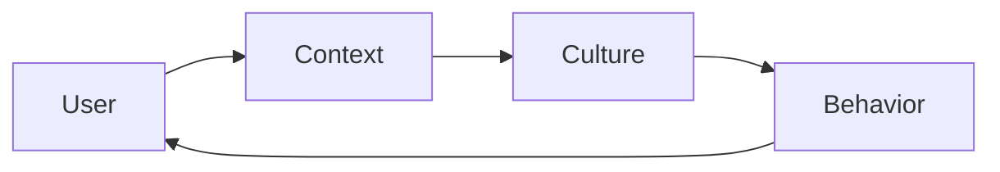
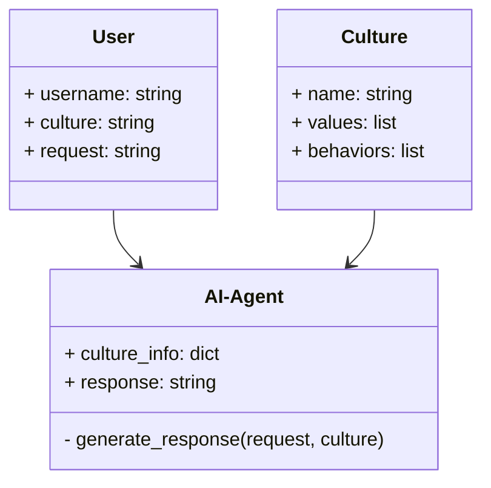
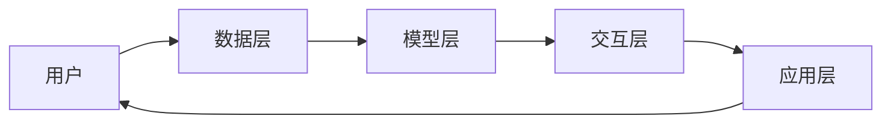

                 


# AI Agent 的跨文化交流：增强 LLM 的文化敏感度

> 关键词：AI Agent, 跨文化交際, 文化敏感性, 大语言模型, 跨文化对话生成

> 摘要：本文探讨了AI Agent在跨文化交流中的应用，重点分析了如何增强大语言模型（LLM）的文化敏感性。文章从背景、核心概念、算法原理、系统架构到项目实战，详细阐述了AI Agent在跨文化交際中的关键技术和实际应用，旨在帮助读者理解并提升AI系统在跨文化环境中的适应性和敏感性。

---

## 第一部分：背景与核心概念

### 第1章：AI Agent 与跨文化交流的背景

#### 1.1 AI Agent 的定义与核心特征
- **AI Agent 的定义**  
  AI Agent（人工智能代理）是指能够感知环境、自主决策并执行任务的智能实体。与传统程序不同，AI Agent 具备自主性、反应性、目标导向性和社会性等特征。

- **AI Agent 的核心特征**  
  - 自主性：无需外部干预，自主完成任务。  
  - 反应性：能够实时感知环境并做出响应。  
  - 目标导向性：基于目标驱动行为。  
  - 社会性：能够与其他实体（包括人类和AI Agent）进行交互。

- **AI Agent 与传统程序的区别**  
  AI Agent 具备学习和适应能力，能够处理复杂和不确定的环境，而传统程序通常基于固定的规则执行任务。

#### 1.2 跨文化交際的定義與重要性
- **跨文化交際的定义**  
  跨文化交際是指来自不同文化背景的个体或群体之间的交流与互动。这种交流涉及语言、习俗、价值观、信仰等多个层面。

- **跨文化交際的核心要素**  
  - 语言：不同语言的表达方式和语境差异。  
  - 习俗：不同文化中的行为规范和礼仪。  
  - 价值观：不同文化对重要性排序的不同。  
  - 信仰：宗教、哲学等对行为的影响。

- **跨文化交際在當今社會的重要性**  
  隨著全球化的发展，跨文化交際变得越来越频繁。在商业、教育、社交等领域，理解并尊重不同文化背景是成功交流的关键。

#### 1.3 AI Agent 在跨文化交流中的作用
- **AI Agent 在跨文化交際中的角色**  
  AI Agent 可以作为中介者、翻译者或指导者，在跨文化交際中提供支持和帮助。

- **AI Agent 的文化敏感性需求**  
  为了有效参与跨文化交際，AI Agent 必须具备文化敏感性，能够理解和适应不同文化背景下的交流需求。

- **AI Agent 在跨文化交際中的潜力与挑战**  
  潜力：通过文化敏感性增强，AI Agent 可以在跨文化交際中提供更精准和自然的交互。  
  挑战：如何在复杂的文化背景下保持一致性和准确性，同时避免文化偏见。

---

## 第二部分：文化敏感性与AI Agent 的核心概念

### 第2章：文化敏感性与AI Agent 的核心概念

#### 2.1 文化敏感性的定义与属性
- **文化敏感性的定义**  
  文化敏感性是指个体或系统在不同文化背景下能够理解和适应行为的能力。

- **文化敏感性的核心属性对比表**

| 属性         | 文化中立性 | 文化适应性 | 文化敏感性 |
|--------------|------------|------------|------------|
| 定义         | 无特定文化偏向 | 根据文化背景调整 | 能够感知并适应文化差异 |
| 应用场景     | 多文化环境 | 特定文化环境 | 多文化环境 |
| 优势         | 避免文化冲突 | 提高文化适应性 | 提高跨文化交際的流畅性 |

- **文化敏感性的重要性**  
  在跨文化交際中，文化敏感性是确保交流顺畅和避免误解的关键因素。

#### 2.2 AI Agent 的文化敏感性模型
- **文化敏感性模型的构建**  
  文化敏感性模型旨在帮助AI Agent理解和适应不同文化背景下的交流需求。

- **文化敏感性模型的ER实体关系图（Mermaid流程图）**



- **模型的核心要素**  
  - 用户（User）：发起交流的个体。  
  - 上下文（Context）：交流发生的环境。  
  - 文化（Culture）：用户所属的文化背景。  
  - 行为（Behavior）：基于文化背景的交互方式。

---

## 第三部分：AI Agent 的算法原理

### 第3章：文化敏感性增强算法

#### 3.1 文化表示学习
- **文化表示学习的定义**  
  文化表示学习是指通过机器学习方法，将文化信息转化为可计算的表示。

- **文化表示学习的数学模型**

$$ \text{文化表示} = f_{\theta}(\text{输入}) $$

其中，$f_{\theta}$ 是参数化的函数，$\theta$ 是模型的参数。

- **文化表示学习的实现步骤**
  1. 数据收集：收集来自不同文化背景的文本数据。  
  2. 数据预处理：清洗和标注数据。  
  3. 模型训练：使用深度学习模型（如神经网络）训练文化表示。  
  4. 模型评估：通过交叉验证评估模型的性能。

#### 3.2 跨文化对话生成算法
- **跨文化对话生成算法的流程（Mermaid流程图）**


- **跨文化对话生成算法的Python实现示例**

```python
def cultural_dialogue_generation(request, culture_info):
    # 分析请求的文化背景
    culture = analyze_culture(request, culture_info)
    # 生成文化相关的回复
    response = generate_response(request, culture)
    return response
```

- **算法的核心思想**  
  通过分析用户的文化背景，生成符合该文化背景的回复，从而实现跨文化对话的流畅性。

---

## 第四部分：系统分析与架构设计

### 第4章：AI Agent 跨文化交際系统的架构

#### 4.1 系統應用場景介紹
- **跨文化交際的典型場景**  
  - 商业谈判：不同文化背景的企业家之间的交流。  
  - 教育辅导：为不同文化背景的学生提供学习支持。  
  - 社交互动：跨文化社交中的日常对话。

- **系统的总体架构**  
  系统由数据层、模型层、交互层和应用层组成。

#### 4.2 系统功能设计（领域模型）
- **领域模型的Mermaid类图**



#### 4.3 系统架构设计（Mermaid架构图）



---

## 第五部分：项目实战

### 第5章：文化敏感性增强的AI Agent 实现

#### 5.1 环境安装
- **安装Python和相关库**  
  ```bash
  pip install python-magic
  pip install numpy
  pip install torch
  ```

#### 5.2 核心代码实现
- **文化解析模块**

```python
def analyze_culture(request, culture_info):
    # 通过NLP技术分析请求的文化背景
    pass
```

- **文化适配模块**

```python
def generate_response(request, culture):
    # 根据文化背景生成回复
    pass
```

#### 5.3 实际案例分析
- **案例：跨文化商业谈判**  
  用户来自不同文化背景，系统通过分析用户的语言和行为，生成符合双方文化背景的谈判策略。

---

## 第六部分：总结与展望

### 第6章：最佳实践与小结

#### 6.1 最佳实践
- 在AI Agent 的设计中，始终关注文化敏感性。  
- 定期更新和优化文化表示模型，以适应新的文化需求。

#### 6.2 小结
本文系统地探讨了AI Agent 在跨文化交流中的应用，重点分析了如何通过文化敏感性增强大语言模型的跨文化交際能力。通过算法和系统设计，展示了如何在实际场景中实现文化敏感性增强的AI Agent。

---

## 作者

**作者：AI天才研究院/AI Genius Institute & 禅与计算机程序设计艺术 /Zen And The Art of Computer Programming**

---

**摘要**：本文深入探讨了AI Agent在跨文化交流中的应用，通过系统化的分析和实践，展示了如何增强大语言模型的文化敏感性，以实现更自然和流畅的跨文化交際。

