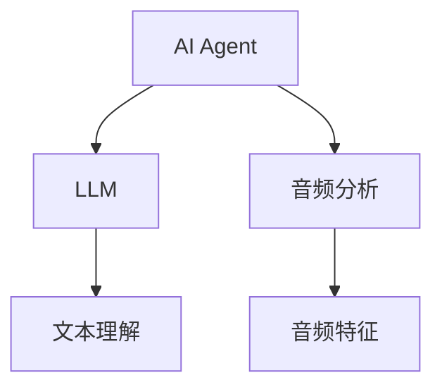
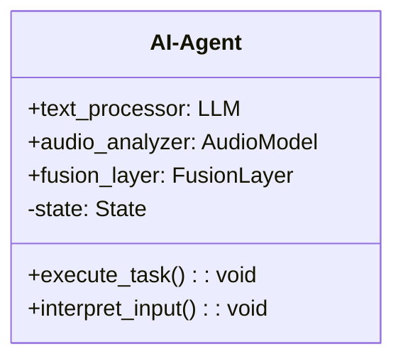
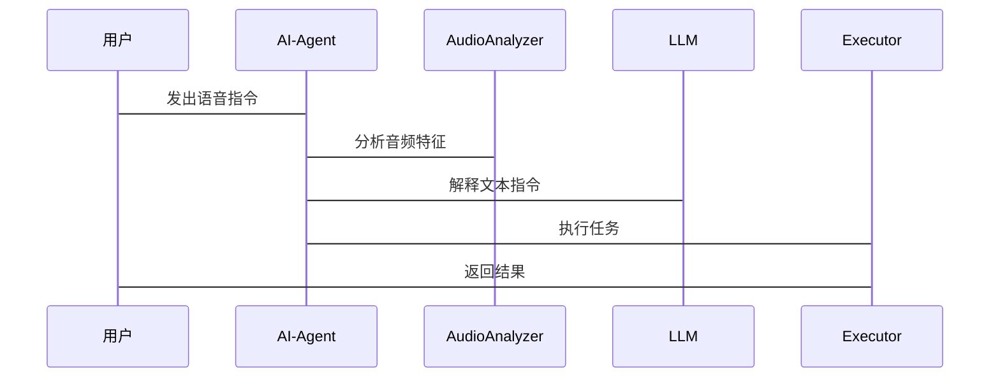

                 


# AI Agent 的跨模态理解：整合 LLM 与音频分析

## 关键词：AI Agent, 跨模态理解, LLM, 音频分析, 多模态数据

## 摘要：  
本文探讨AI Agent如何通过整合大语言模型（LLM）与音频分析技术，实现跨模态理解。文章从背景、核心概念、算法原理、系统架构到项目实战，全面分析技术细节，并通过案例展示实际应用。旨在为AI Agent在多模态数据处理中的发展提供理论与实践指导。

---

# 第一部分: 背景介绍

## 第1章: 背景介绍

### 1.1 问题背景

#### 1.1.1 多模态数据的挑战  
在现实场景中，数据呈现多样化形式：文本、图像、音频、视频等。单一模态难以覆盖所有信息，需通过跨模态整合提升理解能力。  

#### 1.1.2 AI Agent 的需求与目标  
AI Agent需具备处理多种数据类型的能力，以适应复杂场景。跨模态理解是其实现智能交互的核心。  

#### 1.1.3 跨模态理解的重要性  
跨模态理解可增强AI Agent的感知能力，使其能从多维度获取信息，提升任务执行效率与准确性。

### 1.2 问题描述

#### 1.2.1 AI Agent 的核心任务  
AI Agent需整合LLM的文本处理能力与音频分析的特征提取能力，实现多模态数据的协同处理。

#### 1.2.2 跨模态数据的整合需求  
数据多样化的场景要求AI Agent具备整合文本与音频信息的能力，以提供更精准的服务。

#### 1.2.3 当前技术的局限性  
现有技术多专注于单一模态处理，跨模态整合面临数据异构性、信息关联性等挑战。

### 1.3 问题解决思路

#### 1.3.1 整合 LLM 与音频分析的技术优势  
结合LLM强大的文本理解和音频分析的特征提取能力，提升AI Agent的跨模态处理能力。

#### 1.3.2 跨模态数据处理的算法框架  
采用多模态特征融合算法，实现文本与音频数据的有效整合。

#### 1.3.3 实际应用场景的实现路径  
从数据采集、特征提取到模型训练，构建完整的跨模态理解系统。

### 1.4 边界与外延

#### 1.4.1 跨模态理解的边界  
AI Agent仅处理文本与音频数据，不涉及图像等其他模态。  

#### 1.4.2 AI Agent 的能力范围  
AI Agent专注于跨模态理解任务，不具备自主学习能力。  

#### 1.4.3 技术的适用场景与限制  
适用于需要文本与音频信息交互的场景，如智能音箱、语音助手等。

### 1.5 核心要素组成

#### 1.5.1 多模态数据的采集与处理  
采集文本与音频数据，进行预处理与特征提取。  

#### 1.5.2 LLM 的文本理解能力  
利用LLM进行文本语义分析，提取关键信息。  

#### 1.5.3 音频分析的特征提取  
通过音频分析提取音调、节奏等特征，辅助理解音频内容。

---

# 第二部分: 核心概念与联系

## 第2章: 核心概念与联系

### 2.1 AI Agent 的定义与属性

#### 2.1.1 AI Agent 的定义  
AI Agent是具备感知与交互能力的智能体，能在复杂环境中执行任务。

#### 2.1.2 核心属性对比  

| 属性 | 描述 |
|------|------|
| 感知能力 | 多模态数据处理能力 |
| 学习能力 | 基于LLM的文本理解 |
| 交互能力 | 自然语言对话与音频指令处理 |

### 2.2 跨模态理解的核心概念

#### 2.2.1 跨模态数据的整合  
将文本与音频数据进行融合，提升信息理解的准确性和全面性。

#### 2.2.2 跨模态模型的设计原理  
基于深度学习的模型架构，实现跨模态特征的融合与关联。

### 2.3 LLM 与音频分析的对比分析

#### 2.3.1 LLM 的文本处理能力  
强大的文本生成与理解能力，支持复杂的语义分析。  

#### 2.3.2 音频分析的特征提取  
提取音调、频率等特征，辅助识别语音内容。  

#### 2.3.3 两者的对比与联系  
LLM擅长语义理解，音频分析擅长特征提取，两者结合实现跨模态协同。

### 2.4 实体关系图



---

# 第三部分: 算法原理

## 第3章: 算法原理

### 3.1 算法实现

#### 3.1.1 LLM 的文本处理流程  

1. 文本预处理：分词、去停用词。  
2. 特征提取：利用词嵌入生成文本向量。  
3. 模型训练：基于预训练语言模型进行微调。  

#### 3.1.2 音频分析流程  

1. 数据预处理：降噪、分割。  
2. 特征提取：提取梅尔频谱、MFCC特征。  
3. 模型训练：基于深度学习模型进行分类或回归。  

#### 3.1.3 跨模态融合  

1. 特征融合：将文本向量与音频特征拼接。  
2. 融合策略：采用注意力机制或加性融合。  

### 3.2 代码实现

```python
import librosa
from transformers import AutoTokenizer, AutoModel

# 音频特征提取
def extract_audio_features(audio_path):
    audio, sr = librosa.load(audio_path, sr=None, duration=3)
    mfccs = librosa.feature.mfcc(y=audio, sr=sr)
    return mfccs.T

# LLM 初始化
tokenizer = AutoTokenizer.from_pretrained("bert-base-uncased")
model = AutoModel.from_pretrained("bert-base-uncased")

# 跨模态融合
def multimodal_inference(text, audio_features):
    text_emb = model.encode(text, return_tensors='np')
    audio_emb = audio_features
    fused_emb = np.concatenate([text_emb, audio_emb], axis=1)
    return fused_emb
```

### 3.3 数学模型

融合模型的数学表达式：  
$$ f_{\text{fuse}}(x_{\text{text}}, x_{\text{audio}}) = \text{Concat}(x_{\text{text}}, x_{\text{audio}}) $$  

损失函数：  
$$ \mathcal{L} = \frac{1}{N}\sum_{i=1}^{N} \left( y_i - \hat{y}_i \right)^2 $$  

优化目标：  
$$ \min_{\theta} \mathcal{L} $$  

---

# 第四部分: 系统分析与架构设计

## 第4章: 系统分析与架构设计

### 4.1 项目介绍

#### 4.1.1 项目场景  
AI Agent在智能家居中的应用，支持语音指令与文本交互。

#### 4.1.2 系统功能设计  



### 4.2 系统架构设计

#### 4.2.1 系统架构  


#### 4.2.2 交互流程  



### 4.3 接口设计

#### 4.3.1 API 接口  

1. `process_audio(audio_data)`：处理音频输入。  
2. `process_text(text_input)`：处理文本输入。  
3. `execute_task(task)`：执行任务。  

---

# 第五部分: 项目实战

## 第5章: 项目实战

### 5.1 环境安装

```bash
pip install librosa transformers numpy
```

### 5.2 核心代码实现

#### 5.2.1 数据预处理  

```python
import librosa
import numpy as np

def preprocess_audio(audio_path):
    audio, sr = librosa.load(audio_path, sr=None, duration=3)
    mfccs = librosa.feature.mfcc(y=audio, sr=sr)
    return mfccs.T
```

#### 5.2.2 模型训练  

```python
from transformers import AutoTokenizer, AutoModel
import torch

tokenizer = AutoTokenizer.from_pretrained("bert-base-uncased")
model = AutoModel.from_pretrained("bert-base-uncased")
```

#### 5.2.3 跨模态融合  

```python
def multimodal_fuse(text_emb, audio_emb):
    fused_emb = torch.cat([text_emb, audio_emb], dim=1)
    return fused_emb
```

### 5.3 案例分析

#### 5.3.1 智能音箱案例  

AI Agent通过融合语音指令与文本描述，准确识别用户的意图，实现智能家居设备的控制。

#### 5.3.2 优缺点分析  

优点：提升交互准确性；缺点：计算资源消耗大，实时性可能受限。

---

# 第六部分: 最佳实践

## 第6章: 最佳实践

### 6.1 小结  
整合LLM与音频分析可显著提升AI Agent的跨模态理解能力，但需解决数据异构性和计算效率问题。

### 6.2 注意事项  
1. 数据预处理需谨慎，确保特征提取的有效性。  
2. 模型训练需优化超参数，提升性能。  
3. 实际应用中需考虑硬件资源限制。  

### 6.3 拓展阅读  
推荐学习多模态融合、深度学习模型优化等相关内容，以深入理解技术细节。

---

# 作者：AI天才研究院 & 禅与计算机程序设计艺术

