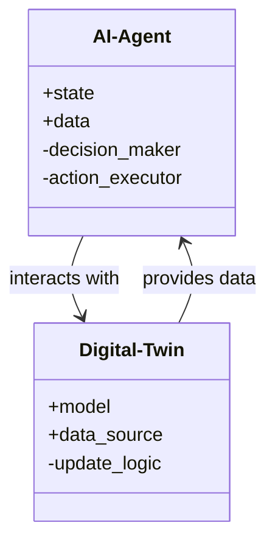

                 


# AI Agent与企业数字孪生技术的融合应用

**关键词：** AI Agent, 数字孪生, 融合应用, 企业数字化, 智能决策

**摘要：**  
随着企业数字化转型的深入推进，AI Agent与企业数字孪生技术的融合应用成为提升企业智能化水平的重要方向。本文系统地探讨了AI Agent与数字孪生技术的核心概念、融合需求、算法原理、系统架构及实际应用。通过分析两者的优势与互补性，本文揭示了它们在企业数字化管理中的巨大潜力，并通过具体案例展示了如何实现二者的有效结合，为企业提供实时、动态、智能的决策支持。

---

## 第1章: AI Agent与企业数字孪生技术概述

### 1.1 AI Agent的基本概念与技术背景

#### 1.1.1 AI Agent的定义与核心特征
AI Agent（人工智能代理）是指能够感知环境、自主决策并采取行动以实现特定目标的智能实体。其核心特征包括：
- **自主性**：无需外部干预，自主完成任务。
- **反应性**：能够实时感知环境并做出响应。
- **目标导向性**：以明确的目标为导向进行决策。
- **学习能力**：通过数据和经验不断优化自身行为。

#### 1.1.2 AI Agent的分类与应用场景
AI Agent可以根据智能水平分为以下几类：
- **反应式AI Agent**：基于当前感知做出反应，适用于实时任务（如自动驾驶）。
- **认知式AI Agent**：具备推理和规划能力，适用于复杂决策场景（如供应链管理）。
- **协作式AI Agent**：能够与其他Agent或人类协作完成任务（如多智能体游戏）。

应用场景包括智能制造、智慧城市、金融投资、医疗诊断等领域。

#### 1.1.3 AI Agent在企业数字化转型中的作用
AI Agent通过自动化决策、实时响应和智能优化，助力企业提升效率、降低成本，并实现业务流程的智能化升级。

---

### 1.2 企业数字孪生技术的定义与特点

#### 1.2.1 数字孪生的定义与技术架构
数字孪生（Digital Twin）是指通过物理模型、传感器数据、历史数据等，构建虚拟模型，实时反映物理实体的状态。其技术架构通常包括：
- **数据采集层**：通过传感器、数据库获取实时数据。
- **模型构建层**：基于数据构建数字模型。
- **交互与分析层**：用户通过可视化界面进行交互和分析。

#### 1.2.2 数字孪生在企业管理中的应用价值
数字孪生为企业提供了实时监控、预测分析、优化决策的能力，广泛应用于生产优化、设备维护、供应链管理等领域。

#### 1.2.3 数字孪生与传统企业信息化的区别
数字孪生区别于传统信息化系统的静态性和滞后性，强调实时性、动态性和交互性。

---

### 1.3 AI Agent与数字孪生的融合背景

#### 1.3.1 数字化转型对企业的新要求
企业需要更快的响应速度、更高的决策效率和更强的智能化能力。

#### 1.3.2 AI Agent与数字孪生的契合点
- 数字孪生提供实时数据和虚拟模型，AI Agent利用这些数据进行决策和行动。
- AI Agent通过优化算法提升数字孪生的预测准确性。

#### 1.3.3 两者的融合对企业管理的提升作用
通过融合，企业能够实现动态优化、智能决策和实时响应，显著提升竞争力。

---

## 第2章: AI Agent与数字孪生技术的融合需求与挑战

### 2.1 企业数字化转型中的主要问题

#### 2.1.1 传统信息化系统的局限性
传统系统缺乏实时性和智能化，难以应对复杂变化。

#### 2.1.2 数据孤岛与信息碎片化问题
数据分散在不同系统中，难以有效整合和利用。

#### 2.1.3 业务流程中的效率瓶颈
流程复杂、审批繁琐，影响效率。

---

### 2.2 AI Agent与数字孪生融合的需求分析

#### 2.2.1 提高企业决策的智能化水平
通过AI Agent的智能决策能力，优化数字孪生的分析结果。

#### 2.2.2 实现企业系统的动态优化
AI Agent能够实时调整数字孪生模型，提升系统运行效率。

#### 2.2.3 支持企业实时响应与快速迭代
融合后的系统能够快速响应变化，实现业务的敏捷迭代。

---

### 2.3 融合过程中面临的技术挑战

#### 2.3.1 数据隐私与安全问题
数据在传输和处理过程中可能面临泄露风险。

#### 2.3.2 复杂环境下的AI Agent决策能力
在动态复杂环境中，AI Agent的决策准确性和响应速度面临挑战。

#### 2.3.3 数字孪生模型的实时更新与维护
需要高效的技术支持实时更新和维护数字孪生模型。

---

## 第3章: AI Agent与数字孪生技术的核心概念与联系

### 3.1 AI Agent的核心原理

#### 3.1.1 感知与决策机制
AI Agent通过传感器或数据源获取信息，利用算法进行分析和决策。

#### 3.1.2 行为执行与反馈循环
AI Agent根据决策执行动作，并通过反馈循环不断优化行为。

#### 3.1.3 多智能体协作模型
多个AI Agent协作完成复杂任务，需解决通信、协调和冲突问题。

---

### 3.2 数字孪生技术的原理与架构

#### 3.2.1 数据采集与建模过程
通过传感器和数据库获取数据，构建数字模型。

#### 3.2.2 虚拟模型与物理实体的映射关系
数字模型与物理实体一一对应，实时同步状态变化。

#### 3.2.3 数据流与信息更新机制
数据实时流动，确保数字模型与物理实体同步更新。

---

### 3.3 AI Agent与数字孪生的关系与联系

#### 3.3.1 数据共享与协同
AI Agent利用数字孪生的数据进行决策，数字孪生通过AI Agent的反馈优化模型。

#### 3.3.2 交互与协作
AI Agent与数字孪生形成闭环系统，协同工作实现动态优化。

---

## 第4章: AI Agent与数字孪生技术的算法原理

### 4.1 强化学习算法在AI Agent中的应用

#### 4.1.1 强化学习的基本原理
通过试错和奖励机制，优化决策策略。

#### 4.1.2 强化学习在AI Agent中的实现
通过构建状态、动作、奖励的闭环，训练AI Agent的决策能力。

#### 4.1.3 强化学习的数学模型
$$ V(s) = \max_{a} [r + V(s') ] $$
其中，\( V(s) \)表示状态s的价值，\( s' \)是执行动作a后的状态。

---

### 4.2 图神经网络在数字孪生中的应用

#### 4.2.1 图神经网络的基本原理
通过图结构数据进行节点间关系建模和预测。

#### 4.2.2 图神经网络在数字孪生中的实现
构建企业实体关系图，利用图神经网络进行实时预测和优化。

#### 4.2.3 图神经网络的数学模型
$$ f(x) = \sigma(A x + b) $$
其中，\( A \)是邻接矩阵，\( x \)是输入特征，\( \sigma \)是激活函数。

---

## 第5章: AI Agent与数字孪生技术的系统架构

### 5.1 问题场景介绍
某制造企业希望通过AI Agent与数字孪生技术优化生产流程。

### 5.2 系统功能设计

#### 5.2.1 领域模型设计
使用Mermaid类图展示系统模块关系。



### 5.3 系统架构设计


### 5.4 系统接口设计

#### 5.4.1 API接口
- `/api/data`：获取实时数据
- `/api/model`：更新数字模型

#### 5.4.2 交互流程
1. 客户端发送请求到API网关。
2. API网关调用服务层获取数据。
3. 服务层通过AI-Agent进行数据分析。
4. AI-Agent调用Digital-Twin进行模型更新。
5. 结果返回客户端。

---

## 第6章: 项目实战

### 6.1 环境安装

#### 6.1.1 安装Python环境
```bash
python -m pip install --upgrade pip
pip install numpy
pip install keras
pip install pymermaid
```

#### 6.1.2 安装其他工具
安装Jupyter Notebook和相关开发工具。

---

### 6.2 系统核心实现源代码

#### 6.2.1 AI-Agent实现
```python
class AI-Agent:
    def __init__(self):
        self.state = None
        self.decision_maker = DecisionMaker()
        self.action_executor = ActionExecutor()
    
    def感知(self, data):
        self.state = data
        return self.决策()
    
    def决策(self):
        return self.decision_maker.predict(self.state)
    
    def执行(self, action):
        return self.action_executor.execute(action)
```

#### 6.2.2 数字孪生实现
```python
class Digital-Twin:
    def __init__(self):
        self.model = None
        self.data_source = DataSource()
    
    def更新(self, data):
        self.data_source.update(data)
        self.模型更新()
    
    def模型更新(self):
        # 更新模型逻辑
        pass
```

---

### 6.3 案例分析与详细讲解

#### 6.3.1 案例介绍
某制造企业利用AI Agent与数字孪生技术优化生产线。

#### 6.3.2 实施步骤
1. 数据采集与建模。
2. AI Agent训练与部署。
3. 系统集成与测试。
4. 实际运行与优化。

---

## 第7章: 最佳实践与注意事项

### 7.1 最佳实践Tips
- 数据隐私保护：采用加密和访问控制技术。
- 系统可扩展性：设计模块化架构，便于后续扩展。

### 7.2 小结
本文详细探讨了AI Agent与数字孪生技术的融合应用，分析了其在企业数字化转型中的重要作用，并通过实际案例展示了如何实现二者的有效结合。

### 7.3 注意事项
- 确保数据安全和隐私保护。
- 定期更新模型，保持系统的实时性。

### 7.4 拓展阅读
建议深入研究强化学习和图神经网络的相关文献，探索更多应用场景。

---

## 作者：AI天才研究院 & 禅与计算机程序设计艺术

---

**摘要**  
本文系统地探讨了AI Agent与数字孪生技术的融合应用，分析了其在企业数字化转型中的潜力和价值。通过详细的技术分析和实际案例，本文为企业的智能化升级提供了理论支持和实践指导。

