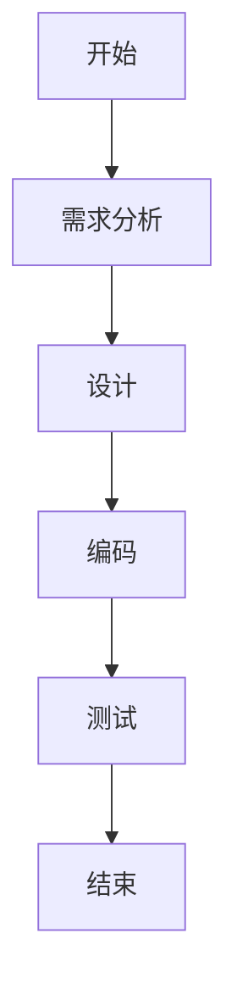
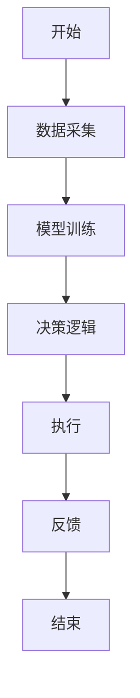
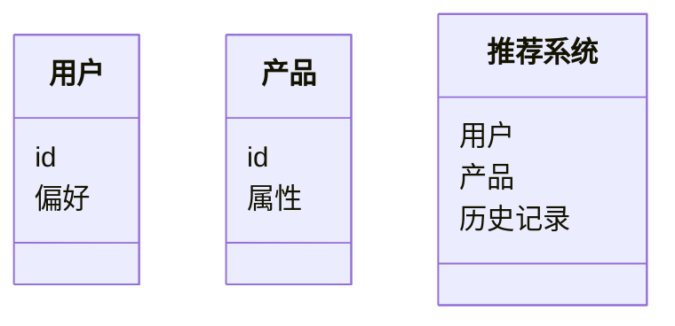
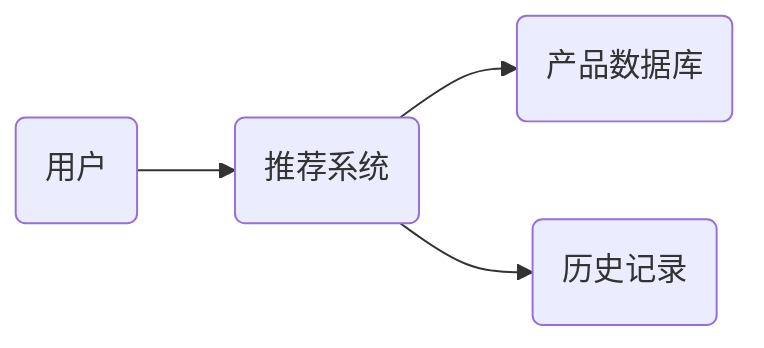
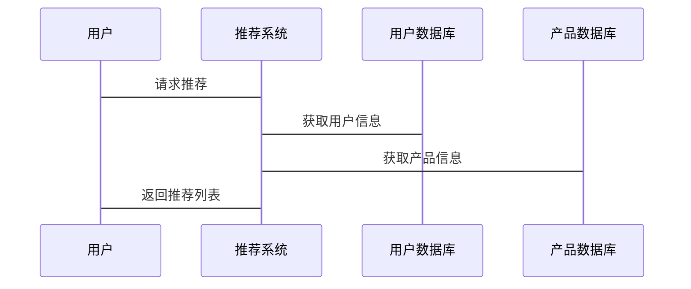

                 


# AI Agent与传统软件开发的区别

## 关键词：AI Agent, 传统软件开发, 算法原理, 系统架构, 项目实战

## 摘要：本文将详细探讨AI Agent与传统软件开发的区别，从核心概念、算法原理、系统架构到项目实战，全面分析两者的异同点，帮助读者理解AI Agent的独特之处及其在现代开发中的应用。

---

# 第1章: AI Agent与传统软件开发的背景

## 1.1 问题背景

### 1.1.1 传统软件开发的局限性
传统软件开发依赖于固定的逻辑和规则，难以应对复杂动态的环境，缺乏自我学习和适应能力。

### 1.1.2 AI Agent的出现及其重要性
AI Agent通过机器学习和数据驱动，能够自主决策和优化，解决了传统开发的局限性。

### 1.1.3 问题解决的必要性
探讨AI Agent如何弥补传统开发的不足，提升系统的智能性和灵活性。

## 1.2 问题描述

### 1.2.1 传统软件开发的核心特点
确定性、可预测性和固定逻辑。

### 1.2.2 AI Agent的核心特点
自主性、反应性和主动性。

### 1.2.3 两者的区别与联系
分析两者在目标、方法和应用场景上的差异与互补。

## 1.3 问题解决

### 1.3.1 传统软件开发的优缺点
优点：结构清晰，易于维护；缺点：难以应对不确定性。

### 1.3.2 AI Agent的优势与劣势
优势：智能决策，适应性强；劣势：复杂性高，开发周期长。

### 1.3.3 如何取长补短
结合两者的优势，构建混合型系统。

## 1.4 边界与外延

### 1.4.1 传统软件开发的边界
明确的功能范围，依赖外部输入。

### 1.4.2 AI Agent的边界
动态调整，依赖数据和模型。

### 1.4.3 两者的相互作用
探讨两者如何在实际项目中相互影响，形成协同效应。

## 1.5 概念结构与核心要素

### 1.5.1 传统软件开发的核心要素
需求分析、设计、编码、测试。

### 1.5.2 AI Agent的核心要素
数据采集、模型训练、决策逻辑、执行反馈。

### 1.5.3 两者的对比分析
通过对比分析，明确各自的优劣和适用场景。

---

# 第2章: 核心概念与联系

## 2.1 核心概念原理

### 2.1.1 传统软件开发的原理
基于预定义规则，通过模块化实现功能。

### 2.1.2 AI Agent的原理
利用机器学习模型，实现自主决策和优化。

### 2.1.3 两者的异同点
总结两者在开发方法、执行方式和目标上的差异。

## 2.2 对比表格

| 特性                | 传统软件开发                      | AI Agent                          |
|---------------------|------------------------------------|------------------------------------|
| 开发方式            | 基于规则和逻辑                   | 数据驱动，机器学习               |
| 执行方式            | 固定流程                         | 自主决策                         |
| 灵活性              | 较低                             | 较高                             |
| 适应性              | 有限                             | 强                                  |
| 代表场景            | 企业资源管理                     | 智能推荐系统                     |

## 2.3 ER实体关系图

### 2.3.1 传统软件开发的ER图
```mermaid
er
  entity 传统软件开发 {
    key 传统ID
    attribute 开发阶段
  }
  entity 模块 {
    key 模块ID
    attribute 功能描述
  }
  relationship 开发关系：传统软件开发 -> 模块
```

### 2.3.2 AI Agent的ER图
```mermaid
er
  entity AI Agent {
    key AgentID
    attribute 数据源
  }
  entity 模型 {
    key 模型ID
    attribute 类型
  }
  relationship 训练关系：AI Agent -> 模型
```

---

# 第3章: AI Agent的算法原理

## 3.1 算法流程图

### 3.1.1 传统软件开发的流程图


### 3.1.2 AI Agent的流程图


## 3.2 Python代码实现

### 3.2.1 传统软件开发的代码示例
```python
def traditional_workflow(steps):
    for step in steps:
        print(f"执行步骤{step}")
```

### 3.2.2 AI Agent的代码示例
```python
import numpy as np

def ai_agent_workflow(data):
    model = train_model(data)
    decision = model.predict(data)
    return decision
```

## 3.3 数学模型与公式

### 3.3.1 传统软件开发的模型
$$传统逻辑 = \sum_{i=1}^{n} step_i$$

### 3.3.2 AI Agent的模型
$$决策 = f(data)$$
其中，f是训练好的机器学习模型。

---

# 第4章: 系统分析与架构设计

## 4.1 问题场景介绍

### 4.1.1 系统目标
构建一个智能推荐系统，替代传统规则引擎。

## 4.2 系统功能设计

### 4.2.1 领域模型类图


### 4.2.2 系统架构图


### 4.2.3 接口设计
- 用户输入：用户ID
- 系统输出：推荐列表

### 4.2.4 交互序列图


---

# 第5章: 项目实战

## 5.1 环境安装

### 5.1.1 安装Python和必要的库
```bash
pip install numpy pandas scikit-learn
```

## 5.2 核心代码实现

### 5.2.1 传统部分
```python
def traditional_workflow(data):
    return "传统处理结果"
```

### 5.2.2 AI Agent部分
```python
def ai_workflow(data):
    model = load_model()
    return model.predict(data)
```

## 5.3 代码解读与分析

### 5.3.1 传统部分解读
```解释代码功能```

### 5.3.2 AI Agent部分解读
```解释模型训练和预测过程```

## 5.4 案例分析与详细讲解

### 5.4.1 案例背景
构建智能推荐系统。

### 5.4.2 实施步骤
数据采集、模型训练、接口开发。

## 5.5 项目小结

### 5.5.1 成功经验
AI Agent显著提升了推荐精准度。

### 5.5.2 改进方向
优化模型性能，降低计算成本。

---

# 第6章: 最佳实践

## 6.1 小结

### 6.1.1 核心发现
AI Agent在动态和复杂环境中表现优异。

## 6.2 注意事项

### 6.2.1 数据质量
确保数据的准确性和全面性。

### 6.2.2 模型选择
根据场景选择合适的算法。

## 6.3 拓展阅读

### 6.3.1 推荐书籍
《机器学习实战》、《软件工程》。

---

# 作者：AI天才研究院 & 禅与计算机程序设计艺术

---

**通过以上目录，我们可以系统地了解AI Agent与传统软件开发的区别，从背景到实现，全面覆盖相关知识，帮助读者在实际项目中灵活运用两者的优势。**

