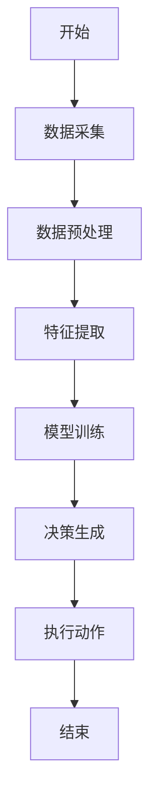
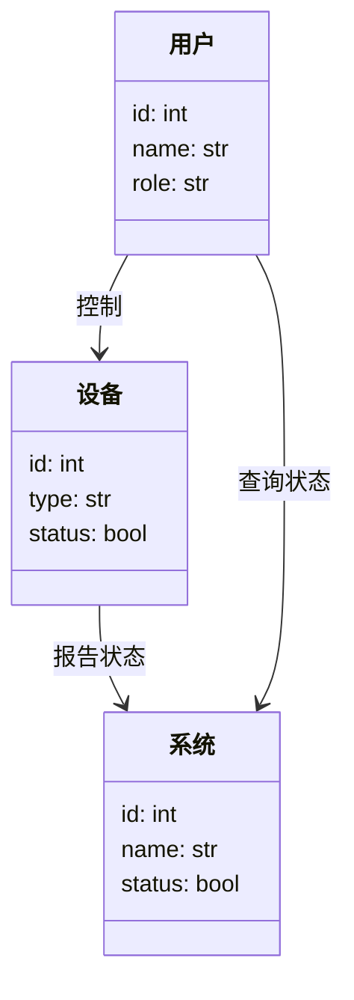
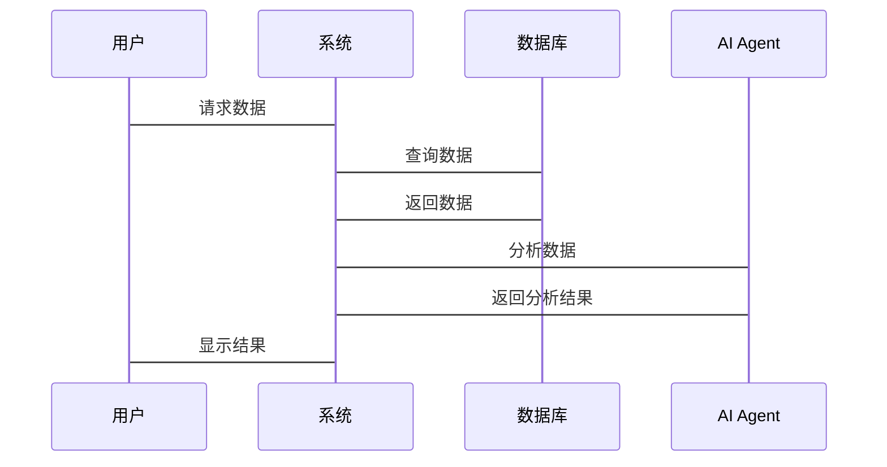

                 


# AI Agent与物联网的结合应用

## 关键词：
AI Agent、物联网、边缘计算、智能决策、数据处理

## 摘要：
本文系统地探讨了AI Agent与物联网的结合应用，从基本概念到算法原理，再到系统架构设计和实际项目实现，全面分析了这一领域的核心内容和最新进展。文章首先介绍了AI Agent和物联网的基本概念，分析了它们结合的背景和应用场景。接着，详细讲解了AI Agent与物联网的核心概念，包括它们的属性特征对比和实体关系分析。然后，深入探讨了AI Agent与物联网结合的算法原理，包括各种学习算法及其在物联网中的应用。随后，分析了系统的架构设计，用类图和架构图展示了系统结构，用序列图展示了接口和交互。最后，通过项目实战，指导读者如何安装环境，实现核心功能，并分析了实际案例。文章还总结了最佳实践、注意事项和拓展阅读内容，为读者提供了全面的指导和参考。

---

# 第一部分：AI Agent与物联网的结合背景与基础

## 第1章：AI Agent与物联网的概述

### 1.1 AI Agent的基本概念
#### 1.1.1 AI Agent的定义与特点
- **定义**：AI Agent是一种能够感知环境并采取行动以实现目标的智能实体。
- **特点**：自主性、反应性、目标导向、学习能力。
- **与其他智能体的区别**：与传统自动化系统的区别在于其自主决策和学习能力。

#### 1.1.2 AI Agent的核心功能与分类
- **核心功能**：感知、决策、执行、反馈。
- **分类**：简单反射型、基于模型的反应型、目标驱动型、效用驱动型。

#### 1.1.3 AI Agent与传统自动化系统的区别
- **自主性**：AI Agent能够自主决策，而传统系统通常需要人工干预。
- **学习能力**：AI Agent能够通过经验改进，传统系统通常基于固定的规则。

### 1.2 物联网的基本概念
#### 1.2.1 物联网的定义与架构
- **定义**：物联网是指通过各种信息传感设备，如传感器、射频识别（RFID）技术、全球定位系统（GPS）、红外感应器等，按照约定的协议，把任何物品与互联网连接起来，进行信息交换和通信。
- **架构**：感知层、网络层、应用层。

#### 1.2.2 物联网的关键技术与组成部分
- **关键技术**：传感器技术、通信技术、数据存储与处理技术。
- **组成部分**：智能终端设备、网络通信模块、数据处理中心、用户界面。

#### 1.2.3 物联网的应用场景与挑战
- **应用场景**：智能家居、智慧城市、工业物联网（IIoT）、医疗物联网。
- **挑战**：数据量大、数据类型多样、数据处理复杂、安全性问题。

### 1.3 AI Agent与物联网的结合背景
#### 1.3.1 物联网数据处理的痛点
- 数据量大，处理复杂。
- 数据类型多样，难以统一处理。
- 数据实时性要求高，需要快速决策。

#### 1.3.2 AI Agent在物联网中的潜在价值
- 提高数据处理效率。
- 实现智能化决策。
- 提供个性化服务。

#### 1.3.3 当前技术发展的趋势与机遇
- AI技术的快速发展。
- 物联网设备的普及。
- 云计算和边缘计算的结合。

## 第2章：AI Agent与物联网的核心概念与联系

### 2.1 AI Agent与物联网的核心概念对比
#### 2.1.1 AI Agent的核心概念属性
- 自主性：AI Agent能够自主决策。
- 反应性：能够感知环境并实时响应。
- 目标导向：所有行动都以实现特定目标为导向。
- 学习能力：能够通过经验改进性能。

#### 2.1.2 物联网的核心概念属性
- 感知性：通过传感器感知物理世界。
- 连通性：设备之间能够通信。
- 数据处理：能够对数据进行分析和处理。
- 用户交互：能够与用户进行交互。

#### 2.1.3 两者概念属性对比分析
- **对比表格**：
| 属性 | AI Agent | 物联网 |
|------|----------|--------|
| 自主性 | 高 | 中 |
| 反应性 | 高 | 中 |
| 数据处理 | 强大 | 有限 |
| 用户交互 | 直接 | 间接 |

### 2.2 AI Agent与物联网的实体关系分析
#### 2.2.1 实体关系图（ER图）的构建
```mermaid
er
  actor: 用户
  system: 物联网系统
  agent: AI Agent
  device: 物联网设备
  relation: 用户与物联网系统交互
  relation: 物联网系统与AI Agent协作
  relation: AI Agent与物联网设备通信
```

## 第3章：AI Agent与物联网的算法原理

### 3.1 AI Agent的核心算法
#### 3.1.1 基于强化学习的AI Agent算法
- **定义**：通过与环境交互，学习策略以最大化累积奖励。
- **算法流程**：
  1. 状态感知：AI Agent感知当前环境状态。
  2. 动作选择：基于当前状态选择一个动作。
  3. 奖励反馈：执行动作后，获得环境的奖励反馈。
  4. 策略更新：根据奖励反馈更新策略。

#### 3.1.2 基于监督学习的AI Agent算法
- **定义**：通过大量标注数据进行训练，学习输入到输出的映射。
- **算法流程**：
  1. 数据采集：收集输入数据和对应的标签。
  2. 模型训练：使用训练数据训练模型。
  3. 模型预测：对新的输入数据进行预测。

#### 3.1.3 基于无监督学习的AI Agent算法
- **定义**：通过发现数据中的模式来进行学习，无需标注数据。
- **算法流程**：
  1. 数据采集：收集大量未标注数据。
  2. 数据处理：对数据进行预处理。
  3. 模型训练：发现数据中的潜在模式。

### 3.2 物联网数据处理的算法
#### 3.2.1 数据采集与预处理算法
- **数据采集**：通过传感器采集实时数据。
- **数据预处理**：去除噪声、归一化、数据清洗。

#### 3.2.2 数据分析与特征提取算法
- **数据分析**：使用统计方法分析数据。
- **特征提取**：提取关键特征，用于后续分析。

#### 3.2.3 数据预测与决策算法
- **数据预测**：使用机器学习模型预测未来趋势。
- **决策算法**：基于预测结果做出决策。

### 3.3 AI Agent与物联网结合的算法实现
#### 3.3.1 算法流程图


#### 3.3.2 算法实现代码
```python
import numpy as np
from sklearn import linear_model

# 数据预处理
data = np.array([[1, 2], [3, 4], [5, 6]])
X = data[:, 0].reshape(-1, 1)
y = data[:, 1]

# 模型训练
model = linear_model.LinearRegression()
model.fit(X, y)

# 预测
new_X = np.array([[7]]).reshape(-1, 1)
predicted_y = model.predict(new_X)
print(predicted_y)
```

#### 3.3.3 算法的数学模型和公式
- **线性回归模型**：$y = \beta_0 + \beta_1 x + \epsilon$
- **损失函数**：$L = \frac{1}{2n}\sum_{i=1}^{n}(y_i - \hat{y_i})^2$
- **优化目标**：最小化损失函数。

---

# 第二部分：AI Agent与物联网的系统架构设计

## 第4章：系统分析与架构设计

### 4.1 问题场景介绍
- **问题描述**：如何实现一个基于AI Agent的物联网系统，实现智能决策和自动化控制。

### 4.2 系统功能设计
#### 4.2.1 领域模型设计


#### 4.2.2 系统架构设计


### 4.3 系统接口设计
#### 4.3.1 系统接口描述
- **用户接口**：Web界面或API。
- **设备接口**：传感器和执行器的通信接口。
- **系统接口**：与第三方服务的接口。

#### 4.3.2 系统交互设计


---

# 第三部分：AI Agent与物联网的项目实战

## 第5章：项目实战

### 5.1 环境安装与配置
- **安装Python**：确保安装了Python 3.8以上版本。
- **安装依赖库**：使用pip安装numpy、scikit-learn、mermaid等库。

### 5.2 系统核心功能实现
#### 5.2.1 数据采集与处理
```python
import serial

# 串口配置
ser = serial.Serial('COM3', 9600)

# 数据采集
data = ser.readline().decode('utf-8').strip()
print(data)
```

#### 5.2.2 AI Agent算法实现
```python
class AI_Agent:
    def __init__(self):
        self.model = linear_model.LinearRegression()

    def train(self, X, y):
        self.model.fit(X, y)

    def predict(self, X):
        return self.model.predict(X)
```

#### 5.2.3 系统集成与测试
- **系统集成**：将AI Agent与物联网设备集成。
- **功能测试**：测试系统的核心功能。

### 5.3 项目案例分析与实现
#### 5.3.1 案例分析
- **案例背景**：智能家居中的温度控制。
- **需求分析**：根据室内温度自动调节空调。

#### 5.3.2 案例实现
```python
# 温度传感器数据采集
ser = serial.Serial('COM3', 9600)
data = ser.readline().decode('utf-8').strip()
temperature = float(data)

# AI Agent决策
if temperature > 25:
    action = '开启空调'
else:
    action = '关闭空调'

print(action)
```

### 5.4 项目小结
- **项目总结**：实现了一个基于AI Agent的物联网温度控制系统。
- **经验教训**：数据采集和处理是关键，算法的选择和优化也很重要。

---

## 第6章：最佳实践与注意事项

### 6.1 最佳实践
- **数据处理**：确保数据的准确性和完整性。
- **算法选择**：根据具体场景选择合适的算法。
- **系统架构**：设计合理的系统架构，确保系统的可扩展性和可维护性。

### 6.2 小结
- **总结**：AI Agent与物联网的结合应用具有广阔的前景，但也面临诸多挑战。

### 6.3 注意事项
- **数据安全**：保护用户数据的安全，防止数据泄露。
- **系统稳定性**：确保系统的稳定运行，避免因故障导致的重大损失。

### 6.4 拓展阅读
- **推荐书籍**：《人工智能：一种现代方法》、《物联网技术与应用》。
- **推荐网站**：GitHub上的相关项目，如TensorFlow、Keras等。

---

## 作者：AI天才研究院/AI Genius Institute & 禅与计算机程序设计艺术/Zen And The Art of Computer Programming

