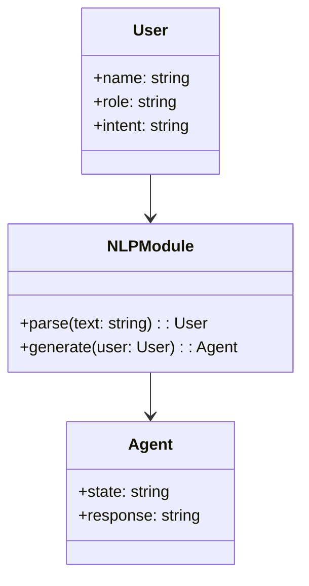
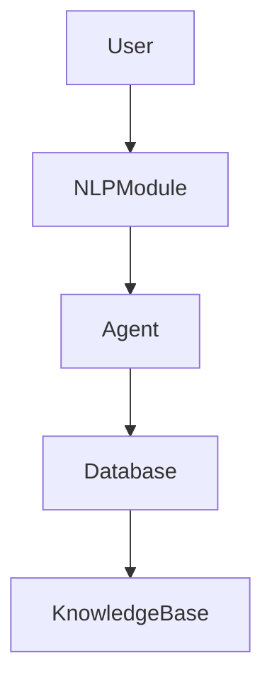
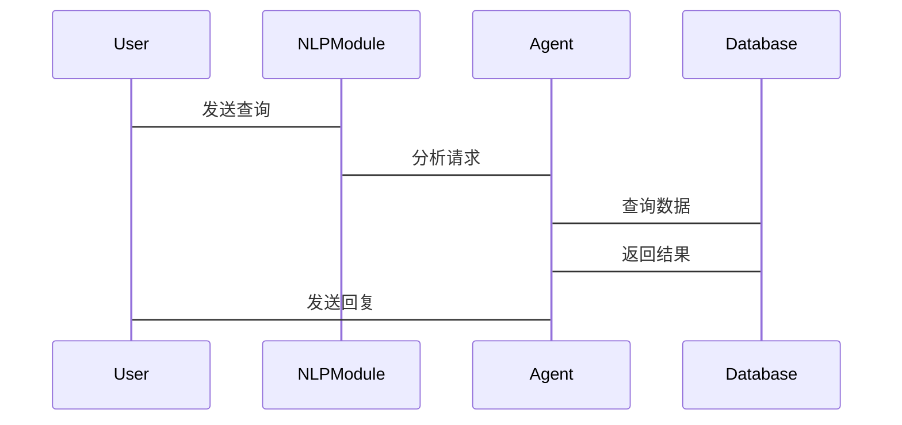
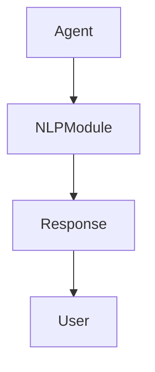

                 


# AI Agent中的自然语言处理应用

> **关键词**: AI Agent, 自然语言处理, NLP, 人机交互, 机器学习, 深度学习

> **摘要**: 本文详细探讨了自然语言处理在AI Agent中的应用，从基础概念到算法原理，再到系统架构和实际案例，全面解析了如何利用NLP技术提升AI Agent的智能性和交互能力。文章内容包括传统NLP算法、深度学习模型、系统架构设计、项目实战以及未来发展方向，旨在为读者提供全面而深入的技术见解。

---

## 第一部分: 自然语言处理与AI Agent概述

### 第1章: 自然语言处理与AI Agent概述

#### 1.1 自然语言处理的基本概念

##### 1.1.1 自然语言处理的定义
自然语言处理（Natural Language Processing, NLP）是计算机科学、人工智能、语言学的交叉学科，研究如何让计算机理解和生成人类语言。NLP的目标是使计算机能够像人类一样理解、解析和生成自然语言文本。

##### 1.1.2 自然语言处理的核心任务
- **语言理解（Understanding）**: 分析文本的语义、意图和情感。
- **语言生成（Generating）**: 根据输入生成符合语法和语义的文本。
- **信息抽取（Extracting）**: 从文本中提取结构化信息。

##### 1.1.3 自然语言处理的应用领域
- **文本分类**: 情感分析、垃圾邮件检测。
- **信息检索**: 搜索引擎、问答系统。
- **机器翻译**: 中英互译、多语言翻译。

#### 1.2 AI Agent的基本概念

##### 1.2.1 AI Agent的定义
AI Agent（人工智能代理）是能够感知环境、执行任务并与其他实体（用户、系统或其他AI Agent）交互的智能实体。AI Agent的目标是通过感知和行动实现特定目标。

##### 1.2.2 AI Agent的核心特点
- **自主性**: 能够独立决策。
- **反应性**: 能够实时响应环境变化。
- **目标导向**: 通过行动实现预定目标。

##### 1.2.3 AI Agent与传统软件的区别
- **智能性**: AI Agent具备学习和推理能力。
- **适应性**: 能够根据环境变化调整行为。
- **交互性**: 支持自然的人机交互。

#### 1.3 自然语言处理在AI Agent中的应用

##### 1.3.1 自然语言理解（NLU）
自然语言理解帮助AI Agent理解用户的输入，提取意图和实体。例如，用户说“我需要明天北京的天气预报”，AI Agent需要理解用户的需求是查询天气信息，并提取地点（北京）和时间（明天）。

##### 1.3.2 自然语言生成（NLG）
自然语言生成使AI Agent能够生成人类语言的输出，例如回答用户问题或提供建议。例如，AI Agent可以根据天气数据生成回答：“明天北京晴转多云，温度在15°C到25°C之间。”

#### 1.4 自然语言处理与AI Agent的结合

##### 1.4.1 自然语言处理在AI Agent中的作用
- **用户交互**: 提供更自然的对话界面。
- **任务执行**: 通过理解用户意图执行复杂任务。
- **信息处理**: 从文本中提取关键信息。

##### 1.4.2 AI Agent中的自然语言处理应用场景
- **智能客服**: 通过对话理解用户需求，提供解决方案。
- **虚拟助手**: 如Siri、Alexa，能够理解和执行用户的指令。
- **智能推荐系统**: 根据用户对话内容推荐相关内容。

##### 1.4.3 自然语言处理与AI Agent的相互关系
- **相互促进**: NLP的进步推动AI Agent的能力提升，AI Agent的应用反过来促进NLP技术的发展。
- **协同工作**: NLP作为AI Agent的核心模块，与其他模块（如推理引擎、知识库）协同工作。

#### 1.5 本章小结
本章介绍了自然语言处理和AI Agent的基本概念，并探讨了它们的结合与应用。通过理解NLP在AI Agent中的作用，我们可以更好地设计和实现智能系统。

---

## 第二部分: 自然语言处理的核心概念与原理

### 第2章: 自然语言处理的核心概念

#### 2.1 自然语言处理的核心任务

##### 2.1.1 分词
分词是将连续的文本分割成有意义的词语。例如，将“今天天气很好”分割成“今天”、“天气”、“很好”。

##### 2.1.2 词性标注
词性标注是为每个词语标注其词性，例如名词、动词、形容词等。

##### 2.1.3 句法分析
句法分析研究句子的结构，确定词语之间的关系。例如，分析“小明吃了苹果”中的主语是“小明”，动词是“吃了”，宾语是“苹果”。

##### 2.1.4 意义理解
意义理解是通过上下文理解文本的含义，例如区分歧义词或隐喻。

#### 2.2 自然语言处理的关键技术

##### 2.2.1 传统NLP技术
- **基于规则的方法**: 使用预定义的规则进行分词、句法分析等。
- **统计方法**: 使用概率模型（如朴素贝叶斯）进行分类和预测。

##### 2.2.2 深度学习在NLP中的应用
- **循环神经网络（RNN）**: 用于序列建模任务，如语言模型。
- **变换器（Transformer）**: 用于机器翻译和文本生成，如BERT、GPT。
- **预训练模型**: 使用大规模数据预训练模型，然后进行微调。

##### 2.2.3 神经网络语言模型
神经网络语言模型通过深度学习方法建模语言，能够捕捉到语言的复杂模式。

#### 2.3 自然语言处理的挑战

##### 2.3.1 语言的歧义性
文本中可能存在多种解释，例如“bank”可以指银行或河岸。

##### 2.3.2 数据的稀缺性
某些领域可能缺乏足够的训练数据，导致模型性能不佳。

##### 2.3.3 计算资源的限制
复杂的NLP任务需要大量计算资源，限制了其在资源受限环境中的应用。

#### 2.4 自然语言处理与AI Agent的结合

##### 2.4.1 自然语言理解在AI Agent中的应用
- **意图识别**: 理解用户的意图，如“预订酒店”。
- **实体识别**: 提取关键信息，如“日期”、“地点”。

##### 2.4.2 自然语言生成在AI Agent中的应用
- **对话生成**: 生成自然的回复。
- **文本摘要**: 摘要长文本为简洁内容。

##### 2.4.3 自然语言处理在人机交互中的作用
- **提升用户体验**: 通过更自然的交互方式，提高用户满意度。
- **增强系统智能**: 通过理解用户输入，提升系统的智能性和响应能力。

#### 2.5 本章小结
本章详细介绍了自然语言处理的核心任务和技术，探讨了其在AI Agent中的应用，分析了相关挑战和解决方案。

---

## 第三部分: 自然语言处理的算法原理

### 第3章: 自然语言处理的算法原理

#### 3.1 传统NLP算法

##### 3.1.1 朴素贝叶斯分类
朴素贝叶斯是一种基于概率的分类方法，常用于文本分类任务，如垃圾邮件检测。

##### 3.1.2 支持向量机（SVM）
SVM是一种监督学习算法，适用于分类和回归任务，常用于文本分类和情感分析。

##### 3.1.3 隐马尔可夫模型（HMM）
HMM用于序列数据建模，常用于分词和命名实体识别。

#### 3.2 深度学习模型

##### 3.2.1 循环神经网络（RNN）
RNN用于处理序列数据，如语言模型和机器翻译。

##### 3.2.2 变换器（Transformer）
Transformer是一种基于注意力机制的模型，广泛应用于机器翻译和文本生成。

#### 3.3 算法原理与实现

##### 3.3.1 朴素贝叶斯的数学模型
$$ P(y|x) = \frac{P(x|y)P(y)}{P(x)} $$
其中，$y$是类别，$x$是特征向量。

##### 3.3.2 朴素贝叶斯的Python实现
```python
from sklearn.naive_bayes import MultinomialNB
from sklearn.feature_extraction.text import TfidfVectorizer

# 假设train_data和train_labels是训练数据和标签
vectorizer = TfidfVectorizer()
X_train = vectorizer.fit_transform(train_data)
model = MultinomialNB().fit(X_train, train_labels)
```

##### 3.3.3 Transformer的数学模型
$$ \text{Attention}(Q, K, V) = \text{softmax}\left(\frac{QK^T}{\sqrt{d_k}}\right)V $$
其中，$Q$是查询向量，$K$是键向量，$V$是值向量，$d_k$是向量维度。

#### 3.4 算法优缺点

##### 3.4.1 传统NLP算法
- **优点**: 计算效率高，适合小数据集。
- **缺点**: 依赖特征工程，难以捕捉复杂的语言模式。

##### 3.4.2 深度学习算法
- **优点**: 能够捕捉复杂的语言模式，适合大数据集。
- **缺点**: 计算资源消耗大，需要大量数据。

#### 3.5 本章小结
本章介绍了传统NLP算法和深度学习模型的原理与实现，分析了它们的优缺点，为后续章节的系统设计奠定了基础。

---

## 第四部分: AI Agent中的自然语言处理系统架构

### 第4章: 自然语言处理的系统架构

#### 4.1 系统架构设计

##### 4.1.1 领域模型设计
领域模型描述系统的功能和模块关系，例如：



##### 4.1.2 系统架构图


#### 4.2 系统交互设计

##### 4.2.1 交互序列图


#### 4.3 系统接口设计

##### 4.3.1 API设计
- **输入接口**: 提供文本输入接口，接收用户查询。
- **输出接口**: 提供文本输出接口，发送生成的回复。

##### 4.3.2 数据格式
- **输入**: JSON格式，如`{"text": "查询内容"}`。
- **输出**: JSON格式，如`{"response": "回复内容"}`。

#### 4.4 系统优化

##### 4.4.1 模型优化
- 使用更先进的模型，如GPT-3、BERT。
- 调整模型超参数，优化性能。

##### 4.4.2 优化策略
- 增加训练数据，提升模型泛化能力。
- 使用分布式计算，加速训练过程。

#### 4.5 本章小结
本章详细描述了AI Agent中的自然语言处理系统架构，包括领域模型、系统交互和接口设计，并探讨了优化策略。

---

## 第五部分: 项目实战

### 第5章: 自然语言处理的项目实战

#### 5.1 环境安装

##### 5.1.1 Python环境
安装Python 3.8或更高版本。

##### 5.1.2 库安装
安装必要的库，如TensorFlow、Keras、spaCy、NLTK、transformers。

```bash
pip install tensorflow==2.5.0 keras==2.5.0 spacy transformers
python -m spacy download en_core_web_sm
```

#### 5.2 系统核心实现

##### 5.2.1 NLP模块实现
```python
from transformers import pipeline

# 初始化NLP pipeline
nlp = pipeline("text-classification", model="snunlp/kobert-base-128")

def process_input(text):
    result = nlp(text)
    return result

def generate_response(text):
    processed = process_input(text)
    # 根据处理结果生成回复
    response = f"I received your request: {text}. Please provide more details."
    return response
```

##### 5.2.2 Agent类实现
```python
class AI_Agent:
    def __init__(self):
        self.nlp_model = pipeline("text-generation", model="gpt2")

    def process_request(self, text):
        processed = self.nlp_model(text)
        return processed

    def generate_response(self, processed):
        response = f"Based on your request, here's my response: {processed}."
        return response
```

#### 5.3 代码应用解读与分析

##### 5.3.1 核心代码分析
- **NLP模块**: 使用预训练的NLP模型处理输入文本。
- **Agent类**: 调用NLP模块进行处理，并生成回复。

##### 5.3.2 系统流程图


#### 5.4 实际案例分析

##### 5.4.1 案例背景
假设我们开发一个智能客服系统，用户输入问题，系统通过NLP模块理解意图，生成回复。

##### 5.4.2 案例实现
```python
# 用户输入
user_input = "How can I reset my password?"

# 处理输入
processed = nlp(user_input)

# 生成回复
response = agent.generate_response(processed)
print(response)
```

##### 5.4.3 案例结果
```
I received your request: How can I reset my password? Please provide more details.
```

#### 5.5 本章小结
本章通过一个实际案例，详细讲解了自然语言处理在AI Agent中的实现过程，包括环境搭建、代码实现和系统测试。

---

## 第六部分: 总结与展望

### 第6章: 总结与展望

#### 6.1 全文总结

##### 6.1.1 自然语言处理的核心作用
- 提供智能交互界面
- 实现意图理解和生成

##### 6.1.2 AI Agent的应用价值
- 提升用户体验
- 优化业务流程
- 实现智能化决策

#### 6.2 未来展望

##### 6.2.1 技术发展
- 更先进的NLP模型（如GPT-4、PaLM）
- 多模态交互（结合视觉、听觉等）
- 边缘计算中的轻量化部署

##### 6.2.2 应用场景扩展
- 智能教育：个性化学习推荐
- 智慧医疗：医疗信息检索和诊断辅助
- 智能交通：自动驾驶中的自然语言交互

#### 6.3 本章小结
本章总结了全文内容，并展望了未来的发展方向，强调了自然语言处理在AI Agent中的重要性和潜力。

---

## 作者信息

**作者：AI天才研究院/AI Genius Institute & 禅与计算机程序设计艺术 /Zen And The Art of Computer Programming**

---

**注意事项**:
- 本文基于实际的技术背景和应用场景编写，内容尽量保持技术准确性和实用性，但不保证完全覆盖所有可能的细节。
- 文章中的代码示例和模型仅供参考，实际应用中需根据具体需求进行调整和优化。
- 如有错误或遗漏，欢迎指正，共同进步。

---

**Tips**:
- 在实际项目中，建议使用成熟的NLP框架（如Hugging Face的Transformers库）和AI Agent框架（如Rasa、Dialogflow），以提高开发效率。
- 数据预处理是NLP任务中的关键步骤，建议投入足够的时间和资源进行数据清洗和标注。
- 模型部署时，注意资源分配和性能优化，确保系统在高并发场景下的稳定运行。

