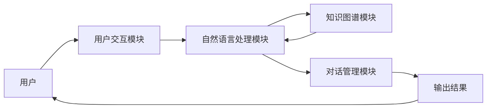
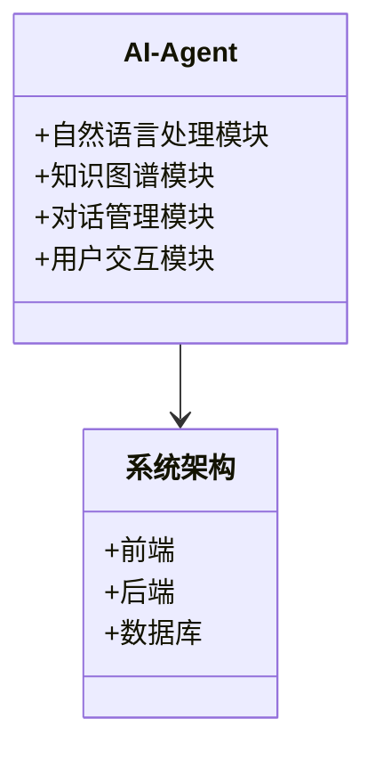
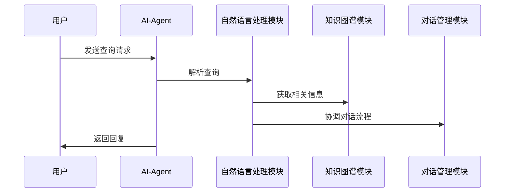

                 


# AI Agent商业化：从原型到产品的转化之路

## 关键词
AI Agent, 商业化, 原型, 产品, 大语言模型, 知识图谱, 对话生成

## 摘要
本文详细探讨了AI Agent从原型到产品的商业化转化过程。首先介绍了AI Agent的核心概念和商业化背景，然后深入解析了其核心技术，包括大语言模型和对话生成。接着分析了系统架构设计，并通过项目实战展示了如何将AI Agent原型转化为实际产品。最后总结了商业化过程中的关键点和未来发展方向。

---

# 第一部分: AI Agent商业化背景与核心概念

## 第1章: AI Agent概述

### 1.1 AI Agent的基本概念

#### 1.1.1 AI Agent的定义与核心特征
AI Agent（人工智能代理）是指能够感知环境、自主决策并执行任务的智能实体。其核心特征包括：
- **自主性**：无需外部干预，自主完成任务。
- **反应性**：能实时感知环境变化并做出反应。
- **学习能力**：通过数据和经验不断优化性能。
- **交互能力**：能与人类或其他系统进行有效沟通。

#### 1.1.2 AI Agent与传统软件的区别
AI Agent与传统软件的主要区别在于：
- **智能性**：AI Agent具备学习和推理能力，而传统软件通常是基于固定的逻辑执行任务。
- **适应性**：AI Agent能够根据环境变化自适应调整行为，传统软件则不具备这种能力。
- **数据驱动**：AI Agent依赖于大量数据进行训练和推理，而传统软件通常基于规则和逻辑。

#### 1.1.3 AI Agent的分类与应用场景
AI Agent可以根据功能和应用场景分为以下几类：
- **单一智能体**：专注于单一任务，如语音助手。
- **多智能体系统**：多个智能体协同完成复杂任务，如自动驾驶。
- **基于规则的智能体**：基于预定义规则执行任务，如游戏AI。
- **基于模型的智能体**：基于环境模型进行决策，如智能推荐系统。

应用场景包括：
- 智能客服
- 智能助手
- 自动驾驶
- 智能推荐系统

### 1.2 AI Agent商业化的技术基础

#### 1.2.1 大语言模型的发展历程
大语言模型（Large Language Models, LLMs）的发展经历了以下几个阶段：
- **早期模型**：如BERT和GPT，具备基本的文本理解和生成能力。
- **大模型时代**：如GPT-3、GPT-4，模型参数量大幅增加，性能显著提升。
- **当前趋势**：模型更加注重多模态和实时交互能力。

#### 1.2.2 多智能体系统的基本原理
多智能体系统（Multi-Agent System, MAS）由多个智能体组成，每个智能体具备独立决策能力，通过协同完成复杂任务。其基本原理包括：
- **智能体通信**：通过消息传递进行协作。
- **任务分配**：智能体根据自身能力和环境信息分配任务。
- **冲突解决**：在目标和资源冲突时，智能体需要协商解决。

#### 1.2.3 知识图谱与对话生成技术
知识图谱（Knowledge Graph）是将实体及其关系以图结构表示的技术，是AI Agent理解外部世界的基础。对话生成技术基于自然语言处理（NLP）模型，结合知识图谱实现更智能的对话生成。

### 1.3 AI Agent商业化的发展背景

#### 1.3.1 人工智能技术的成熟与普及
近年来，AI技术的快速发展为AI Agent的商业化奠定了基础，尤其是在大语言模型和多智能体系统方面。

#### 1.3.2 商业化AI Agent的应用潜力
AI Agent在多个领域展现出巨大潜力，包括：
- **金融领域**：智能投资顾问、风险评估。
- **医疗领域**：辅助诊断、药物研发。
- **教育领域**：智能教学助手、个性化学习方案。

---

# 第二部分: AI Agent的核心技术解析

## 第2章: AI Agent核心技术解析

### 2.1 大语言模型的算法原理

#### 2.1.1 Transformer模型结构解析
Transformer模型由编码器和解码器组成，编码器负责将输入序列编码为固定长度的向量，解码器负责根据编码结果生成输出序列。其核心在于自注意力机制（Self-Attention）。

##### 自注意力机制的数学公式
自注意力机制的计算公式如下：
$$
\text{Attention}(Q, K, V) = \text{softmax}\left(\frac{QK^T}{\sqrt{d_k}}\right)V
$$
其中，$Q$、$K$、$V$分别为查询、键、值向量，$d_k$为键的维度。

#### 2.1.2 大语言模型的训练与优化
大语言模型通常采用预训练-微调（Pre-training & Fine-tuning）策略。预训练阶段使用大规模通用数据训练模型，微调阶段针对特定任务进行优化。

#### 2.1.3 大语言模型的实现代码示例
以下是一个简单的Transformer模型实现代码：

```python
import torch
import torch.nn as nn

class Transformer(nn.Module):
    def __init__(self, d_model, nhead, dropout=0.1):
        super(Transformer, self).__init__()
        self.encoder = nn.TransformerEncoder(
            nn.TransformerEncoderLayer(d_model=d_model, nhead=nhead, dropout=dropout),
            num_layers=6
        )
        self.decoder = nn.TransformerDecoder(
            nn.TransformerDecoderLayer(d_model=d_model, nhead=nhead, dropout=dropout),
            num_layers=6
        )

    def forward(self, src, tgt):
        encoded = self.encoder(src)
        decoded = self.decoder(tgt, encoded)
        return decoded
```

### 2.2 对话生成技术的实现原理

#### 2.2.1 对话生成的流程
对话生成流程包括：
1. **输入处理**：接收用户输入并解析。
2. **语义理解**：通过NLP模型理解用户意图。
3. **生成回复**：基于理解生成回复内容。
4. **反馈优化**：根据用户反馈优化生成策略。

#### 2.2.2 基于知识图谱的对话生成
知识图谱为对话生成提供了丰富的上下文信息。通过将用户输入映射到知识图谱，模型可以生成更准确和相关的回复。

#### 2.2.3 对话生成的实现代码示例
以下是一个简单的对话生成模型实现代码：

```python
import torch
import torch.nn as nn

class DialogGenerator(nn.Module):
    def __init__(self, vocab_size, embedding_dim, hidden_dim):
        super(DialogGenerator, self).__init__()
        self.embedding = nn.Embedding(vocab_size, embedding_dim)
        self.lstm = nn.LSTM(embedding_dim, hidden_dim, batch_first=True)
        self.fc = nn.Linear(hidden_dim, vocab_size)

    def forward(self, input_seq):
        embedded = self.embedding(input_seq)
        output, _ = self.lstm(embedded)
        output = self.fc(output)
        return output
```

---

# 第三部分: AI Agent系统分析与架构设计

## 第3章: 商业化AI Agent系统架构

### 3.1 系统功能模块设计

#### 3.1.1 核心功能模块
- **自然语言处理模块**：负责理解和生成自然语言。
- **知识图谱模块**：提供领域知识支持。
- **对话管理模块**：协调多个对话流程。
- **用户交互模块**：处理用户输入和输出。

#### 3.1.2 功能模块的交互流程
以下是一个功能模块交互流程的mermaid图：



### 3.2 系统架构设计

#### 3.2.1 系统架构图
以下是一个系统架构图的mermaid图：



### 3.3 接口设计与交互流程

#### 3.3.1 系统接口设计
- **输入接口**：接收用户输入的自然语言文本。
- **输出接口**：返回生成的回复文本。

#### 3.3.2 交互流程图
以下是一个交互流程图的mermaid图：



---

# 第四部分: AI Agent项目实战

## 第4章: AI Agent项目实战

### 4.1 环境安装与配置

#### 4.1.1 安装依赖
安装必要的Python库：
```bash
pip install torch transformers mermaid4jupyter
```

#### 4.1.2 配置环境
配置运行环境，包括GPU支持和模型加载路径。

### 4.2 核心代码实现

#### 4.2.1 模型训练代码
以下是一个训练代码示例：

```python
import torch
import torch.optim as optim

model = Transformer(vocab_size, embedding_dim, hidden_dim)
criterion = nn.CrossEntropyLoss()
optimizer = optim.Adam(model.parameters(), lr=learning_rate)

for epoch in range(num_epochs):
    for batch in train_loader:
        outputs = model(batch.text)
        loss = criterion(outputs, batch.target)
        loss.backward()
        optimizer.step()
        optimizer.zero_grad()
```

#### 4.2.2 模型推理代码
以下是一个推理代码示例：

```python
with torch.no_grad():
    inputs = torch.tensor(encoder.encode(input_text))
    outputs = model(inputs)
    predicted = torch.argmax(outputs, dim=1)
    print(decoder.decode(predicted))
```

### 4.3 实际案例分析

#### 4.3.1 案例背景
以智能客服系统为例，介绍AI Agent在实际中的应用。

#### 4.3.2 系统实现与优化
详细描述系统实现过程中的关键点和优化策略，包括模型调优、性能优化等。

### 4.4 项目总结

#### 4.4.1 项目成果
总结项目实现的成果，包括模型性能、系统稳定性等。

#### 4.4.2 经验与教训
总结项目中的经验教训，为后续项目提供参考。

---

# 第五部分: 总结与展望

## 第5章: 总结与展望

### 5.1 商业化AI Agent的核心要点
- **技术优势**：AI Agent具备智能性和适应性，能够显著提升用户体验。
- **商业化潜力**：在多个领域展现出巨大的应用潜力。

### 5.2 未来发展方向
- **多模态融合**：结合视觉、听觉等多模态信息，提升AI Agent的感知能力。
- **实时交互优化**：优化实时交互性能，提升用户体验。
- **伦理与安全**：加强AI Agent的伦理规范和安全防护，确保其安全可靠。

### 5.3 最佳实践 tips
- **数据质量**：确保训练数据的多样性和高质量。
- **模型优化**：持续优化模型结构和参数，提升性能。
- **用户反馈**：建立有效的用户反馈机制，及时优化系统。

---

# 作者：AI天才研究院 & 禅与计算机程序设计艺术

---

通过以上内容，本文详细探讨了AI Agent从原型到产品的商业化转化过程，涵盖了技术背景、核心算法、系统设计和项目实战等多个方面。希望本文能为AI Agent的商业化提供有价值的参考和指导。

