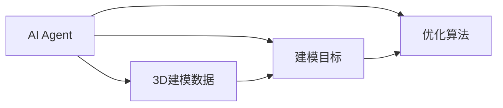
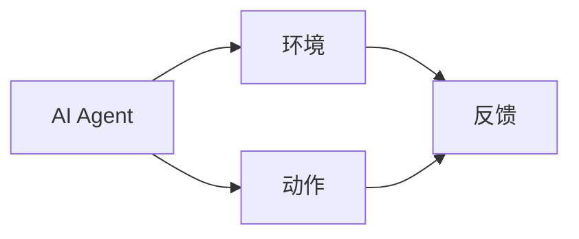
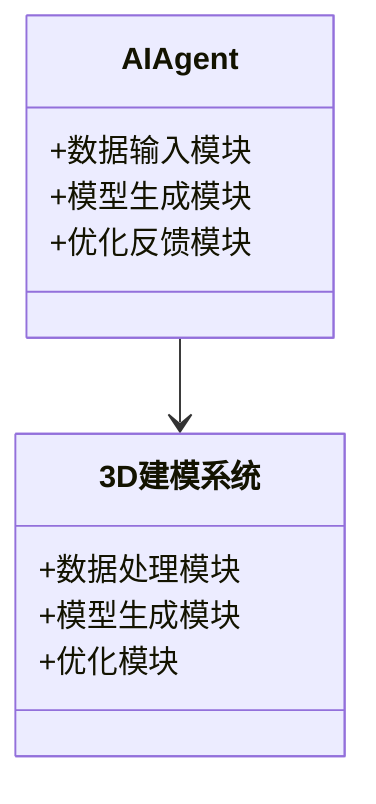
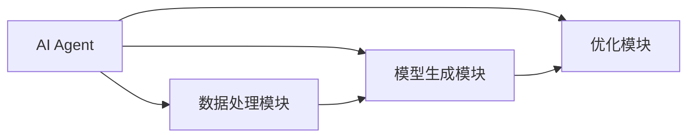

                 


# AI Agent在3D建模中的应用：自动生成与优化

> 关键词：AI Agent, 3D建模, 自动生成, 优化算法, 机器学习, 深度学习, 强化学习

> 摘要：随着人工智能技术的快速发展，AI Agent在3D建模中的应用越来越广泛。本文详细探讨了AI Agent在3D建模中的核心概念、算法原理、系统架构、项目实战以及最佳实践。通过分析AI Agent在3D建模中的创新应用，结合实际案例和代码实现，帮助读者理解如何利用AI Agent实现3D建模的自动化与优化。

---

# 第一部分: AI Agent与3D建模基础

## 第1章: AI Agent的基本概念与3D建模概述

### 1.1 AI Agent的基本概念
#### 1.1.1 AI Agent的定义与特点
AI Agent（人工智能代理）是一种能够感知环境并采取行动以实现目标的智能实体。它具备以下特点：
- **自主性**：能够在没有外部干预的情况下独立运行。
- **反应性**：能够实时感知环境并做出反应。
- **目标导向**：通过优化目标函数来实现特定目标。
- **学习能力**：能够通过数据和经验不断优化自身性能。

#### 1.1.2 AI Agent的核心功能与应用场景
AI Agent的核心功能包括数据处理、决策制定和行动执行。它广泛应用于推荐系统、游戏AI、机器人控制等领域。

#### 1.1.3 AI Agent与传统自动化工具的区别
与传统自动化工具相比，AI Agent具备更强的智能性和适应性，能够通过学习和优化实现更复杂的任务。

### 1.2 3D建模的基本概念与技术
#### 1.2.1 3D建模的定义与分类
3D建模是通过数学方法描述三维物体形状的过程。常见的建模技术包括多边形建模、NURBS建模和基于点云的建模。

#### 1.2.2 传统3D建模技术的优缺点
- **优点**：精度高、可控性强。
- **缺点**：效率低、依赖人工干预。

#### 1.2.3 3D建模在各领域的应用现状
3D建模技术在游戏开发、影视制作、虚拟现实、工业设计等领域得到了广泛应用。

### 1.3 AI Agent在3D建模中的作用与优势
#### 1.3.1 AI Agent如何提升3D建模效率
通过自动化处理和优化算法，AI Agent能够显著提高3D建模的速度和质量。

#### 1.3.2 AI Agent在3D建模中的创新应用
AI Agent可以用于3D模型的自动生成、优化、修复和风格迁移。

#### 1.3.3 AI Agent与3D建模结合的未来趋势
未来，AI Agent将在3D建模的智能化和自动化方面发挥更大的作用，推动3D建模技术的发展。

## 第2章: AI Agent与3D建模的核心概念

### 2.1 AI Agent在3D建模中的核心概念
#### 2.1.1 AI Agent与3D建模的关系
AI Agent通过感知环境和学习数据，优化3D建模过程。

#### 2.1.2 AI Agent在3D建模中的角色与功能
AI Agent在3D建模中扮演数据处理、模型生成和优化的角色。

#### 2.1.3 3D建模过程中的AI Agent工作流程
AI Agent通过数据输入、模型生成和优化反馈，实现3D建模的自动化。

### 2.2 AI Agent与3D建模的核心要素
#### 2.2.1 数据输入与处理
AI Agent需要处理3D建模相关的数据，包括点云数据和图像数据。

#### 2.2.2 模型生成与优化
AI Agent通过生成对抗网络和强化学习，优化3D模型的结构和质量。

#### 2.2.3 结果输出与反馈
AI Agent将优化后的模型输出，并根据反馈进一步优化。

### 2.3 AI Agent与3D建模的实体关系图


---

# 第二部分: AI Agent在3D建模中的算法原理

## 第3章: AI Agent的算法原理

### 3.1 AI Agent的算法原理
#### 3.1.1 基于强化学习的AI Agent算法
强化学习是一种通过奖励机制优化AI Agent行为的算法。

#### 3.1.2 基于生成对抗网络的AI Agent算法
生成对抗网络通过生成器和判别器的对抗训练，生成高质量的3D模型。

#### 3.1.3 基于监督学习的AI Agent算法
监督学习通过标注数据训练AI Agent，使其能够预测和生成3D模型。

### 3.2 3D建模中的AI Agent算法实现

#### 3.2.1 强化学习算法在3D建模中的应用


#### 3.2.2 生成对抗网络在3D建模中的应用


#### 3.2.3 监督学习算法在3D建模中的应用


---

## 第4章: 3D建模中的AI Agent系统架构

### 4.1 3D建模系统场景介绍
3D建模系统通常包括数据输入、模型生成和结果输出三个部分。

### 4.2 3D建模系统功能设计
#### 4.2.1 领域模型


#### 4.2.2 系统架构


---

## 第5章: 3D建模中的AI Agent项目实战

### 5.1 项目环境安装
需要安装Python、TensorFlow和Keras等依赖库。

### 5.2 系统核心实现
#### 5.2.1 AI Agent核心代码实现
```python
class AI-Agent:
    def __init__(self):
        self.model = self.build_model()

    def build_model(self):
        # 构建AI Agent模型
        pass

    def train(self, data):
        # 训练模型
        pass

    def generate_model(self, input):
        # 生成3D模型
        pass
```

#### 5.2.2 3D建模代码实现
```python
def build_3d_model():
    # 构建3D模型
    pass
```

### 5.3 实际案例分析
分析一个AI Agent在3D建模中的实际应用案例，展示其优势和效果。

---

## 第6章: 最佳实践与小结

### 6.1 最佳实践
- 数据质量是关键。
- 模型调优需要不断尝试。
- 多领域知识结合是提升AI Agent性能的重要手段。

### 6.2 小结
通过本文的详细讲解，读者可以全面了解AI Agent在3D建模中的应用，掌握其核心概念、算法原理和实际应用技巧。

### 6.3 注意事项
在实际应用中，需要关注模型的泛化能力和计算效率。

### 6.4 拓展阅读
推荐读者阅读相关领域的书籍和论文，深入学习AI Agent和3D建模的知识。

---

# 作者

作者：AI天才研究院/AI Genius Institute & 禅与计算机程序设计艺术 /Zen And The Art of Computer Programming

