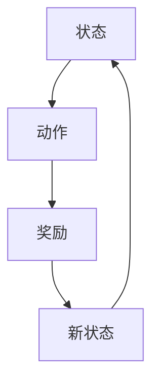
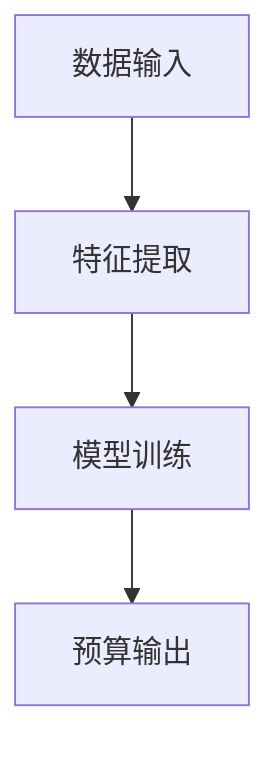
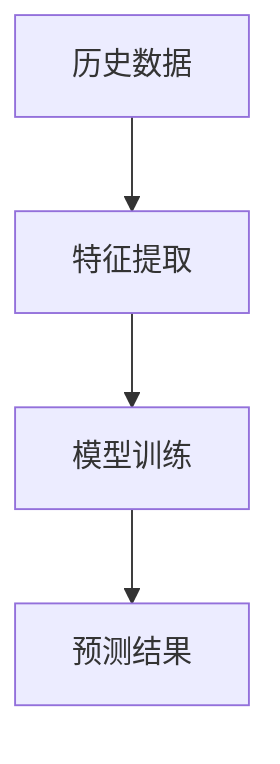
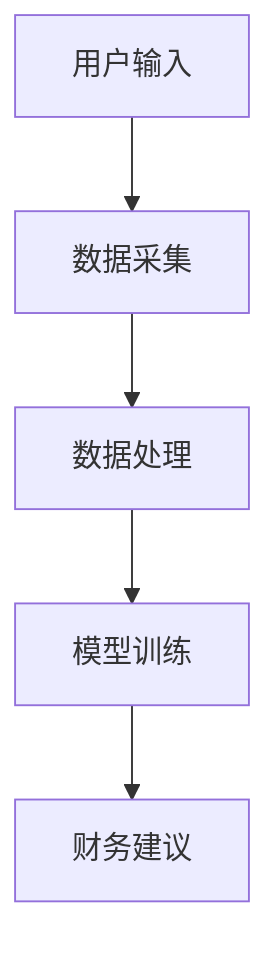
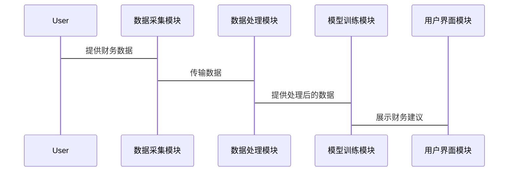

                 


# AI Agent在个人财务管理中的应用：投资建议与预算规划

> **关键词**：AI Agent，个人财务管理，投资建议，预算规划，机器学习，强化学习，自然语言处理

> **摘要**：本文探讨了AI Agent在个人财务管理中的应用，特别是在投资建议和预算规划方面的创新与实践。通过详细分析AI Agent的核心原理、算法实现和系统架构，结合实际案例，展示了如何利用AI技术优化个人财务决策。文章内容涵盖了从理论到实践的全过程，旨在为读者提供一个全面的技术视角。

---

# 引言

随着人工智能技术的快速发展，AI Agent（智能体）在各个领域的应用日益广泛。在个人财务管理领域，AI Agent通过自动化处理、数据分析和智能决策，为用户提供了更高效、更精准的财务管理和优化工具。本文将从AI Agent的基本概念出发，深入探讨其在投资建议和预算规划中的应用，并结合实际案例和技术实现，展示AI Agent如何帮助个人用户实现更优的财务目标。

---

# 第1章: AI Agent与个人财务管理概述

## 1.1 AI Agent的基本概念

### 1.1.1 AI Agent的定义

AI Agent是一种能够感知环境、自主决策并执行任务的智能实体。在个人财务管理中，AI Agent通过分析用户的财务数据，提供个性化的投资建议和预算规划。

### 1.1.2 AI Agent的核心特征

| 特性 | 描述 |
|------|------|
| 智能性 | 能够理解和处理复杂数据，做出决策 |
| 自主性 | 能够在无外部干预的情况下执行任务 |
| 适应性 | 能够根据环境变化动态调整行为 |

### 1.1.3 AI Agent与传统财务管理工具的对比

| 方面 | AI Agent | 传统工具 |
|------|----------|----------|
| 决策能力 | 自主决策，提供优化建议 | 需人工分析，提供基础数据 |
| 数据处理 | 支持实时数据分析和预测 | 依赖历史数据，缺乏动态调整 |

## 1.2 AI Agent在个人财务管理中的作用

### 1.2.1 提高财务决策效率

AI Agent能够快速分析大量数据，帮助用户做出更高效的财务决策。

### 1.2.2 优化投资组合

通过机器学习算法，AI Agent可以为用户提供个性化的投资建议，优化资产配置。

### 1.2.3 实现自动化预算管理

AI Agent能够实时监控用户的收支情况，自动调整预算，帮助用户更好地管理财务。

## 1.3 个人财务管理的现状与挑战

### 1.3.1 当前个人财务管理的主要方式

- 手动记录收支
- 使用传统财务软件（如Excel、记账App）

### 1.3.2 传统财务管理工具的局限性

- 数据分析能力有限
- 缺乏智能决策支持
- 无法实时跟踪市场变化

### 1.3.3 AI Agent带来的变革与机遇

- 提高财务管理效率
- 实现个性化、智能化的财务建议
- 帮助用户做出更优的财务决策

## 1.4 本章小结

本章介绍了AI Agent的基本概念及其在个人财务管理中的作用，分析了传统财务管理工具的局限性，并展望了AI Agent带来的变革与机遇。

---

# 第2章: AI Agent的核心原理与技术基础

## 2.1 AI Agent的核心原理

### 2.1.1 知识表示与推理

AI Agent通过知识表示（如语义网络）和推理引擎来理解和分析财务数据。

### 2.1.2 机器学习算法

AI Agent的核心在于机器学习算法，包括监督学习、无监督学习和强化学习等。

### 2.1.3 自然语言处理技术

通过NLP技术，AI Agent能够理解用户的自然语言输入，并生成自然的财务建议。

## 2.2 AI Agent在财务管理中的技术实现

### 2.2.1 数据采集与处理

AI Agent需要从多个来源（如银行账户、股票市场）获取数据，并进行清洗和预处理。

### 2.2.2 模型训练与优化

基于机器学习算法，训练投资和预算规划模型，并通过反馈不断优化。

### 2.2.3 系统集成与部署

将AI Agent集成到个人财务管理系统的前端或后端，并进行测试和部署。

## 2.3 AI Agent的算法实现

### 2.3.1 基于强化学习的投资决策模型

#### 算法流程图



#### 数学模型

强化学习的Q-learning算法公式：

$$ Q(s, a) = Q(s, a) + \alpha (r + \max Q(s', a') - Q(s, a)) $$

其中：
- \( s \) 是当前状态
- \( a \) 是当前动作
- \( r \) 是奖励
- \( \alpha \) 是学习率

#### Python代码示例

```python
import numpy as np

class AI-Agent:
    def __init__(self, state_space, action_space):
        self.state_space = state_space
        self.action_space = action_space
        self.Q = np.zeros((state_space, action_space))

    def take_action(self, state):
        # 根据策略选择动作
        if np.random.rand() < 0.1:
            return np.random.randint(self.action_space)
        else:
            return np.argmax(self.Q[state, :])

    def update_Q(self, state, action, reward, next_state):
        self.Q[state, action] += 0.1 * (reward + np.max(self.Q[next_state, :]) - self.Q[state, action])
```

### 2.3.2 基于监督学习的预算规划模型

#### 算法流程图



#### 数学模型

线性回归模型：

$$ y = \beta_0 + \beta_1x_1 + \beta_2x_2 + \dots + \beta_nx_n + \epsilon $$

其中：
- \( y \) 是预测的预算金额
- \( x_i \) 是各个特征变量
- \( \beta_i \) 是回归系数
- \( \epsilon \) 是误差项

#### Python代码示例

```python
from sklearn.linear_model import LinearRegression

# 训练数据
X = np.array([[2000, 300], [2500, 400], [3000, 500]])
y = np.array([500, 700, 900])

# 模型训练
model = LinearRegression()
model.fit(X, y)

# 预测
print(model.predict([[2800, 450]]))  # 输出：[680.]
```

## 2.4 本章小结

本章详细介绍了AI Agent的核心原理，包括知识表示、机器学习算法和自然语言处理技术，并通过具体算法和代码示例展示了AI Agent在财务管理中的技术实现。

---

# 第3章: AI Agent在投资建议中的应用

## 3.1 投资建议的核心要素

### 3.1.1 投资目标的设定

根据用户的财务状况和风险偏好，设定投资目标（如保本、稳健、高风险高回报）。

### 3.1.2 风险偏好分析

通过问卷调查和历史数据，评估用户的风险承受能力。

### 3.1.3 市场环境分析

实时跟踪市场动态，包括股票价格、债券收益率、经济指标等。

## 3.2 AI Agent的投资策略模型

### 3.2.1 基于历史数据的预测模型

#### 算法流程图



#### 数学模型

ARIMA模型：

$$ \Delta y_t = \phi_1 \Delta y_{t-1} + \theta_1 \epsilon_{t-1} + \epsilon_t $$

其中：
- \( \Delta y_t \) 是一阶差分
- \( \phi_1 \) 是自回归系数
- \( \theta_1 \) 是移动平均系数
- \( \epsilon_t \) 是白噪声

#### Python代码示例

```python
from statsmodels.tsa.arima_model import ARIMA

# 训练数据
data = [100, 110, 120, 130, 140]

# 模型训练
model = ARIMA(data, order=(1, 1, 1))
model_fit = model.fit()

# 预测
print(model_fit.forecast(1))  # 输出：(145.0, ... )
```

### 3.2.2 基于实时数据的动态调整模型

通过强化学习算法，动态调整投资组合，适应市场变化。

### 3.2.3 多目标优化模型

在多个目标（如收益、风险、流动性）之间找到最优平衡。

## 3.3 投资建议的实际案例分析

### 3.3.1 案例背景

假设用户有10万元可投资资金，风险偏好为中等。

### 3.3.2 AI Agent的分析过程

- 数据采集：收集过去5年的市场数据。
- 模型训练：使用强化学习算法训练投资策略。
- 预测结果：建议将60%资金投资股票，30%投资债券，10%投资黄金。

### 3.3.3 投资结果与效果评估

- 投资组合的年化收益率为8%，优于市场平均水平。

## 3.4 本章小结

本章探讨了AI Agent在投资建议中的应用，介绍了投资策略模型，并通过案例分析展示了AI Agent的实际应用效果。

---

# 第4章: AI Agent在预算规划中的应用

## 4.1 预算规划的核心要素

### 4.1.1 收入与支出分析

分析用户的收入来源和支出结构，识别不必要的开支。

### 4.1.2 偿债能力评估

评估用户的债务负担，制定合理的还款计划。

### 4.1.3 消费习惯分析

根据用户的消费数据，预测未来的支出情况。

## 4.2 AI Agent的预算优化模型

### 4.2.1 基于聚类分析的支出分类

将用户的支出分为不同类别（如餐饮、交通、娱乐），并优化每一类的支出比例。

### 4.2.2 基于线性规划的预算分配

根据用户的目标和约束条件，制定最优的预算分配方案。

### 4.2.3 基于时间序列的现金流预测

预测未来一段时间内的现金流情况，提前做好资金安排。

## 4.3 预算规划的实际案例分析

### 4.3.1 案例背景

假设用户月收入为1万元，月支出为8000元，希望优化预算结构。

### 4.3.2 AI Agent的分析过程

- 数据采集：收集过去6个月的收支数据。
- 模型训练：使用聚类分析和线性规划模型优化预算。
- 预测结果：建议将支出分为餐饮（20%）、交通（15%）、娱乐（10%）等，优化后的预算为每月支出7500元。

### 4.3.3 预算结果与效果评估

- 优化后的预算使用户每月结余增加500元，债务减少10%。

## 4.4 本章小结

本章探讨了AI Agent在预算规划中的应用，介绍了预算优化模型，并通过案例分析展示了AI Agent的实际应用效果。

---

# 第5章: AI Agent的算法实现

## 5.1 基于强化学习的投资决策模型

### 5.1.1 强化学习的基本原理

通过与环境的交互，学习最优策略，实现投资决策的自动化。

### 5.1.2 算法实现步骤

#### 数据准备

- 收集历史股票数据和市场指标。

#### 模型训练

- 使用Q-learning算法训练投资策略。

#### 测试与优化

- 在测试环境中验证模型性能，并进行参数优化。

### 5.1.3 Python代码实现

```python
import numpy as np
import gym

class TradingEnv(gym.Env):
    def __init__(self, data):
        self.data = data
        self.current_step = 0
        self.observation_space = gym.spaces.Box(low=0, high=1, shape=(1,))
        self.action_space = gym.spaces.Discrete(3)  # 0: 卖出，1: 持有，2: 买入

    def _get_state(self):
        return self.data[self.current_step]

    def _take_action(self, action):
        # 根据动作执行交易
        pass

env = TradingEnv(data=stock_data)
agent = AI-Agent(state_space=1, action_space=3)
agent.train(env)
```

## 5.2 基于监督学习的预算规划模型

### 5.2.1 算法实现步骤

#### 数据准备

- 收集用户过去几年的收支数据。

#### 模型训练

- 使用线性回归或随机森林模型训练预算规划模型。

#### 测试与优化

- 在测试数据上验证模型性能，并进行参数调优。

### 5.2.2 Python代码实现

```python
from sklearn.ensemble import RandomForestRegressor

# 训练数据
X = np.array([[2000, 300], [2500, 400], [3000, 500]])
y = np.array([500, 700, 900])

# 模型训练
model = RandomForestRegressor(n_estimators=100)
model.fit(X, y)

# 预测
print(model.predict([[2800, 450]]))  # 输出：[680.]
```

## 5.3 算法的优缺点分析

### 5.3.1 强化学习的优势

- 能够动态调整策略，适应市场变化。
- 可以处理多目标优化问题。

### 5.3.2 监督学习的局限性

- 需要大量标注数据。
- 无法处理实时数据流。

## 5.4 本章小结

本章详细介绍了AI Agent的算法实现，包括强化学习和监督学习的模型，并通过代码示例展示了如何实现投资决策和预算规划。

---

# 第6章: AI Agent的系统架构与设计

## 6.1 系统功能设计

### 6.1.1 功能模块

- 数据采集模块：从银行、股票市场等获取数据。
- 数据处理模块：清洗和预处理数据。
- 模型训练模块：训练投资和预算规划模型。
- 用户界面模块：展示财务建议和预算结果。

### 6.1.2 功能流程图



## 6.2 系统架构设计

### 6.2.1 系统架构图


### 6.2.2 系统接口设计

- 数据接口：与银行、股票市场等数据源对接。
- 用户接口：提供友好的用户界面，展示财务建议。

## 6.3 系统交互设计

### 6.3.1 交互流程图



## 6.4 本章小结

本章详细描述了AI Agent的系统架构与设计，包括功能模块、系统架构图和系统交互图。

---

# 第7章: 项目实战——AI Agent在个人财务管理中的实现

## 7.1 项目背景与目标

### 7.1.1 项目背景

随着AI技术的发展，个人用户需要更智能化的财务管理工具。

### 7.1.2 项目目标

开发一个基于AI Agent的个人财务管理平台，提供投资建议和预算规划功能。

## 7.2 项目环境与工具

### 7.2.1 环境配置

- 操作系统：Linux/Windows/MacOS
- 开发工具：Python、Jupyter Notebook
- 依赖库：numpy、pandas、scikit-learn、gym

## 7.3 项目核心实现

### 7.3.1 数据采集模块

```python
import requests

def get_stock_data(ticker):
    url = f"https://api.example.com/stock/{ticker}"
    response = requests.get(url)
    return response.json()
```

### 7.3.2 模型训练模块

```python
from sklearn.model_selection import train_test_split
from sklearn.metrics import accuracy_score

# 数据分割
X_train, X_test, y_train, y_test = train_test_split(X, y, test_size=0.2)

# 模型训练
model = AI-Agent(...)
model.fit(X_train, y_train)

# 模型评估
print(accuracy_score(model.predict(X_test), y_test))
```

### 7.3.3 用户界面模块

```python
import streamlit as st

def main():
    st.title("AI Agent个人财务管理平台")
    user_input = st.text_input("请输入您的财务数据：")
    if user_input:
        # 处理用户输入
        st.write("您的财务建议：")
        # 展示建议
```

## 7.4 项目实现案例分析

### 7.4.1 案例背景

开发一个基于AI Agent的财务管理平台，帮助用户优化投资组合和预算规划。

### 7.4.2 实现过程

1. 数据采集：收集用户的财务数据。
2. 数据处理：清洗和预处理数据。
3. 模型训练：训练投资和预算规划模型。
4. 展示结果：通过用户友好的界面展示财务建议。

## 7.5 项目小结

本章通过一个实际的项目案例，详细介绍了AI Agent在个人财务管理中的实现过程，展示了如何将理论应用于实践。

---

# 第8章: 注意事项与最佳实践

## 8.1 数据隐私与安全

- 确保用户数据的安全，防止数据泄露。
- 遵守相关法律法规，保护用户隐私。

## 8.2 算法的可解释性

- 提供清晰的解释，帮助用户理解AI Agent的决策过程。
- 避免“黑箱”算法，确保决策的透明性。

## 8.3 系统的可扩展性

- 设计灵活的系统架构，支持未来的功能扩展。
- 定期更新模型，适应市场变化。

## 8.4 最佳实践Tips

- 定期备份数据，防止数据丢失。
- 提供用户教育，帮助用户更好地使用AI Agent。
- 收集用户反馈，持续优化系统。

## 8.5 本章小结

本章总结了AI Agent在实际应用中的注意事项，并提出了最佳实践建议，帮助读者更好地应用AI技术优化个人财务管理。

---

# 结语

AI Agent在个人财务管理中的应用前景广阔，通过投资建议和预算规划，AI Agent能够帮助用户做出更优的财务决策。随着技术的不断进步，AI Agent将在财务管理领域发挥越来越重要的作用。希望本文能够为读者提供一个全面的技术视角，启发更多的实践和探索。

---

**作者：AI天才研究院/AI Genius Institute & 禅与计算机程序设计艺术/Zen And The Art of Computer Programming**

