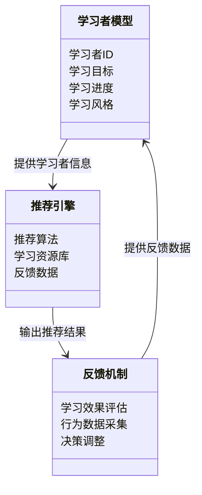

                 


# AI Agent在个性化学习系统中的角色

> 关键词：AI Agent，个性化学习，教育技术，机器学习，推荐系统

> 摘要：  
个性化学习是现代教育的重要趋势，而AI Agent在其中扮演着关键角色。本文详细探讨AI Agent如何通过智能化决策和推荐算法，实现个性化的学习路径规划和动态资源匹配，从而提升学习效果。文章从AI Agent的核心原理到系统架构，从算法实现到项目实战，全面剖析其在个性化学习中的应用。

---

# 正文

## 第一部分: AI Agent与个性化学习系统背景介绍

### 第1章: AI Agent的基本概念与核心原理

#### 1.1 AI Agent的定义与特点
- **AI Agent的定义**：  
  AI Agent（人工智能代理）是一种能够感知环境、自主决策并执行任务的智能实体。它通过与用户的交互或环境的反馈，动态调整行为以实现目标。

- **AI Agent的核心特点**：
  - 智能性：基于数据和模型进行决策。
  - 自主性：无需人工干预，自主完成任务。
  - 适应性：根据环境变化动态调整行为。
  - 可解释性：决策过程可被理解和追溯。

- **AI Agent与传统AI的区别**：  
  AI Agent不仅是数据处理工具，还能通过交互和反馈不断优化自身行为，具有更强的适应性和主动性。

#### 1.2 个性化学习系统的背景与需求
- **个性化学习的定义与目标**：  
  个性化学习是指根据学习者的兴趣、能力、学习风格等因素，提供量身定制的学习内容和路径，以最大化学习效果。

- **当前个性化学习系统的主要挑战**：  
  - 学生学习差异性大，难以统一处理。
  - 动态学习需求难以实时捕捉和满足。
  - 多模态数据（文本、语音、行为数据等）的融合与分析难度高。

- **AI Agent在个性化学习中的角色定位**：  
  AI Agent作为个性化学习系统的“智能大脑”，负责分析学习者的行为数据、评估学习效果，并实时调整学习计划和资源推荐。

---

### 第2章: AI Agent在教育领域的应用背景

#### 2.1 教育技术的发展历程
- **从传统教育到数字化教育的演变**：  
  从纸质教材到在线课程，教育技术逐步数字化，但缺乏智能化。

- **智能化教育的兴起**：  
  随着AI技术的发展，教育系统开始具备智能推荐、实时反馈等功能。

- **AI技术在教育中的应用现状**：  
  AI Agent已应用于学习路径规划、学习资源推荐、学习效果评估等领域。

#### 2.2 个性化学习的核心需求
- **学生学习差异性分析**：  
  学生的知识基础、学习速度、兴趣爱好各不相同，需要个性化的学习方案。

- **学习者个性化需求的动态变化**：  
  学习者的需求会随着学习进展而变化，系统需要实时调整。

- **教学资源的智能化匹配**：  
  系统需要根据学习者的需求，动态匹配最合适的教学资源。

#### 2.3 AI Agent在个性化学习中的价值
- **提供个性化学习路径规划**：  
  AI Agent根据学习者的特点，制定最优的学习路径。

- **实现实时学习反馈与优化**：  
  通过实时分析学习数据，AI Agent可以快速调整学习计划。

- **支持多模态学习数据的处理与分析**：  
  AI Agent可以整合文本、语音、视频等多种数据，全面了解学习者的需求。

---

## 第二部分: AI Agent的核心概念与原理

### 第3章: AI Agent的核心原理与算法

#### 3.1 AI Agent的决策机制
- **基于规则的决策系统**：  
  通过预设的规则进行决策，适用于简单场景。

- **基于机器学习的决策模型**：  
  使用监督学习、无监督学习等方法，训练模型进行决策。

- **基于强化学习的决策优化**：  
  通过试错和奖励机制，优化决策策略。

#### 3.2 个性化学习中的推荐算法
- **基于协同过滤的推荐算法**：  
  根据学习者的行为相似性推荐内容。

- **基于内容的推荐算法**：  
  根据学习内容的特征进行推荐。

- **基于混合模型的推荐算法**：  
  结合协同过滤和内容推荐的优点，提升推荐效果。

#### 3.3 AI Agent的数学模型与公式
- **协同过滤算法公式**：  
  $$sim(i,j) = \frac{\sum_{k=1}^{n} (r_{i,k} - \bar{r_i})(r_{j,k} - \bar{r_j})}{\sqrt{\sum_{k=1}^{n} (r_{i,k} - \bar{r_i})^2} \sqrt{\sum_{k=1}^{n} (r_{j,k} - \bar{r_j})^2}}}$$

---

## 第三部分: 系统分析与架构设计方案

### 第4章: 系统架构与实现

#### 4.1 问题场景介绍
- **学习者需求分析**：  
  学习者需要个性化学习计划和动态调整的资源推荐。

- **系统功能设计**：  
  包括学习者模型、推荐引擎、反馈机制等模块。

#### 4.2 系统功能设计（领域模型）


#### 4.3 系统架构设计


---

## 第四部分: 项目实战

### 第5章: 项目实现与案例分析

#### 5.1 环境安装
- 安装Python、TensorFlow、Keras等工具。

#### 5.2 核心代码实现
```python
def collaborative_filtering(user_matrix):
    # 计算平均评分
    avg_rating = np.mean(user_matrix, axis=1)
    # 计算相似度
    similarity = np.zeros((n_users, n_users))
    for i in range(n_users):
        for j in range(n_users):
            if i != j:
                numerator = np.sum((user_matrix[i] - avg_rating[i]) * (user_matrix[j] - avg_rating[j]))
                denominator = np.sqrt(np.sum((user_matrix[i] - avg_rating[i])**2)) * np.sqrt(np.sum((user_matrix[j] - avg_rating[j])**2))
                similarity[i, j] = numerator / denominator
    return similarity
```

#### 5.3 案例分析
- 案例背景：某学习者在数学学习中遇到困难。
- 系统推荐个性化学习资源和路径，帮助其逐步掌握知识点。

---

## 第五部分: 总结与展望

### 第6章: 总结与展望

#### 6.1 小结
- AI Agent在个性化学习中的核心作用体现在智能化决策和动态推荐上。

#### 6.2 注意事项
- 数据隐私保护需高度重视。
- 系统需具备良好的可解释性和透明性。

#### 6.3 未来展望
- 结合区块链技术，提升数据安全性和信任度。
- 引入更多AI技术，如生成式AI，进一步提升个性化学习体验。

---

# 作者：AI天才研究院/AI Genius Institute & 禅与计算机程序设计艺术 /Zen And The Art of Computer Programming

