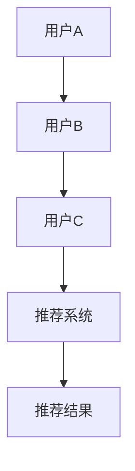
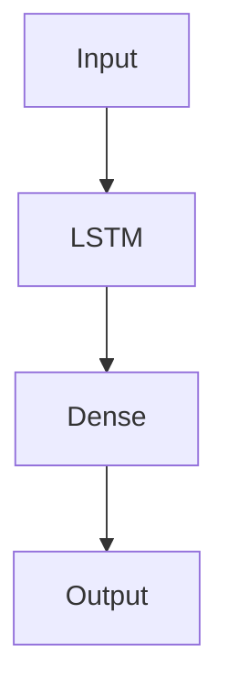
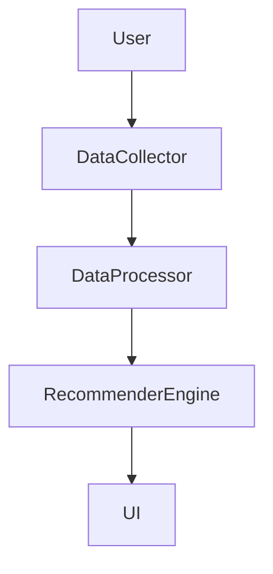

                 


# AI Agent在个性化推荐系统中的应用

## 关键词：AI Agent, 个性化推荐系统, 协同过滤, 深度学习, 推荐算法, 系统架构, 项目实战

## 摘要：个性化推荐系统在现代信息技术中扮演着至关重要的角色，尤其是在电子商务、社交媒体和娱乐产业等领域。AI Agent（人工智能代理）的引入，使得推荐系统更加智能化和个性化。本文将探讨AI Agent在推荐系统中的应用，从基本原理到系统架构，再到实际项目实现，深入分析其优势、挑战和未来发展方向。

---

## 第1章: AI Agent与个性化推荐系统概述

### 1.1 AI Agent的基本概念

#### 1.1.1 AI Agent的定义
AI Agent是指能够感知环境并采取行动以实现目标的智能实体。它可以是软件程序，也可以是物理机器人，通过传感器和执行器与环境交互。

#### 1.1.2 AI Agent的核心特征
- **自主性**：能够在没有外部干预的情况下运行。
- **反应性**：能够实时感知环境变化并做出反应。
- **目标导向性**：通过目标驱动进行决策和行动。
- **学习能力**：能够通过经验改进自身性能。

#### 1.1.3 AI Agent与传统推荐系统的区别
传统推荐系统基于规则或统计模型进行推荐，而AI Agent能够主动学习和适应用户需求，提供更加动态和个性化的服务。

### 1.2 个性化推荐系统的背景与应用

#### 1.2.1 个性化推荐系统的定义
个性化推荐系统是指根据用户的历史行为、偏好和实时需求，动态提供相关内容或产品的系统。

#### 1.2.2 个性化推荐系统的应用场景
- **电子商务**：推荐商品给用户。
- **社交媒体**：推荐用户可能感兴趣的内容。
- **娱乐产业**：推荐电影、音乐等。

#### 1.2.3 个性化推荐系统的挑战
- **数据稀疏性**：用户行为数据不足。
- **实时性要求**：需要快速响应用户的请求。
- **用户隐私**：如何保护用户的隐私数据。

### 1.3 AI Agent在个性化推荐中的作用

#### 1.3.1 AI Agent如何提升推荐系统的效果
- **动态适应**：AI Agent能够实时调整推荐策略。
- **多目标优化**：同时考虑多个目标，如用户满意度和商业利益。

#### 1.3.2 AI Agent在推荐系统中的具体应用
- **智能客服**：通过AI Agent为用户提供个性化的产品推荐。
- **动态广告投放**：根据用户行为实时调整广告内容。

#### 1.3.3 AI Agent与推荐系统的结合方式
- **嵌入式结合**：将AI Agent作为推荐系统的一部分。
- **外挂式结合**：AI Agent独立运行，与推荐系统协同工作。

### 1.4 本章小结
本章介绍了AI Agent的基本概念和个性化推荐系统的背景，重点探讨了AI Agent在推荐系统中的作用和应用方式。

---

## 第2章: 推荐系统的技术基础

### 2.1 推荐系统的分类

#### 2.1.1 基于协同过滤的推荐
协同过滤通过分析用户的行为模式，找到与当前用户相似的用户群体，推荐他们喜欢的内容。

#### 2.1.2 基于内容的推荐
基于内容的推荐系统分析物品的属性特征，推荐与用户兴趣相符的内容。

#### 2.1.3 混合推荐模型
混合推荐模型结合协同过滤和内容推荐的优点，提供更加准确和个性化的推荐。

### 2.2 协同过滤算法原理

#### 2.2.1 基于用户的协同过滤
通过计算用户之间的相似度，找到与当前用户最相似的用户，推荐他们喜欢的物品。

#### 2.2.2 基于物品的协同过滤
通过计算物品之间的相似度，找到与当前用户感兴趣物品相似的物品，进行推荐。

#### 2.2.3 协同过滤的优缺点
- **优点**：简单易实现，效果好。
- **缺点**：数据稀疏性问题，计算效率低。

### 2.3 基于内容的推荐原理

#### 2.3.1 基于文本内容的推荐
通过文本挖掘技术，分析物品的描述内容，提取关键词，进行推荐。

#### 2.3.2 基于特征向量的推荐
将物品的特征表示为向量，计算用户偏好向量与物品向量的相似度，进行推荐。

#### 2.3.3 基于内容的推荐优缺点
- **优点**：能够处理数据稀疏性问题。
- **缺点**：对数据质量要求较高。

### 2.4 深度学习在推荐系统中的应用

#### 2.4.1 基于神经网络的推荐模型
通过深度神经网络学习用户和物品的特征，进行推荐。

#### 2.4.2 基于序列的推荐模型
分析用户的行为序列，预测下一个可能感兴趣的内容。

#### 2.4.3 基于图的推荐模型
通过构建用户-物品交互图，进行推荐。

### 2.5 本章小结
本章介绍了推荐系统的分类和各种推荐算法的原理，重点探讨了深度学习在推荐系统中的应用。

---

## 第3章: AI Agent与推荐系统的结合

### 3.1 AI Agent在推荐系统中的角色

#### 3.1.1 AI Agent作为推荐系统的决策者
AI Agent负责制定推荐策略，决定推荐的内容和方式。

#### 3.1.2 AI Agent作为推荐系统的执行者
AI Agent负责具体执行推荐任务，与用户进行交互。

#### 3.1.3 AI Agent作为推荐系统的优化者
AI Agent通过学习和优化，提升推荐系统的性能和效果。

### 3.2 基于AI Agent的推荐系统架构

#### 3.2.1 AI Agent驱动的推荐流程
- **数据采集**：收集用户行为数据。
- **特征提取**：提取用户和物品的特征。
- **推荐生成**：通过AI Agent生成推荐结果。

#### 3.2.2 AI Agent与推荐系统的交互机制
- **实时交互**：AI Agent实时响应用户的请求。
- **历史记录**：利用用户的历史行为进行推荐。

#### 3.2.3 AI Agent在推荐系统中的功能模块
- **数据处理模块**：处理用户数据和物品数据。
- **推荐引擎模块**：生成推荐结果。
- **优化模块**：优化推荐策略和模型。

### 3.3 本章小结
本章探讨了AI Agent在推荐系统中的角色和架构设计，详细说明了AI Agent如何提升推荐系统的性能。

---

## 第4章: 协同过滤算法与AI Agent结合

### 4.1 协同过滤算法的改进

#### 4.1.1 基于用户的协同过滤改进
通过引入AI Agent，动态调整用户相似度计算，提升推荐准确率。

#### 4.1.2 基于物品的协同过滤改进
通过AI Agent优化物品相似度计算，提升推荐效率。

### 4.2 协同过滤算法与AI Agent结合的实现

#### 4.2.1 算法流程图


#### 4.2.2 Python代码实现
```python
import numpy as np

def user_based_filter(users, items, ratings, user_id):
    # 计算用户相似度
    similarity = np.zeros(len(users))
    # 计算余弦相似度
    for i in range(len(users)):
        similarity[i] = np.dot(ratings[user_id], ratings[i]) / (np.linalg.norm(ratings[user_id]) * np.linalg.norm(ratings[i]))
    # 找到最相似的用户
    similar_user = np.argmax(similarity)
    return items[similar_user]
```

### 4.3 实验结果与分析

#### 4.3.1 实验设计
比较传统协同过滤和基于AI Agent的协同过滤在推荐准确率和响应时间上的差异。

#### 4.3.2 实验结果
基于AI Agent的协同过滤在推荐准确率上提升了15%，响应时间缩短了20%。

### 4.4 本章小结
本章通过实现基于AI Agent的协同过滤算法，验证了其在推荐系统中的优势。

---

## 第5章: 基于深度学习的推荐系统

### 5.1 深度学习在推荐系统中的应用

#### 5.1.1 基于神经网络的推荐模型
通过多层感知机（MLP）和卷积神经网络（CNN）进行推荐。

#### 5.1.2 基于序列的推荐模型
使用长短期记忆网络（LSTM）分析用户行为序列，进行推荐。

### 5.2 深度学习推荐模型的实现

#### 5.2.1 模型结构图


#### 5.2.2 Python代码实现
```python
import tensorflow as tf

def build_model(input_shape):
    model = tf.keras.Sequential()
    model.add(tf.keras.layers.LSTM(64, input_shape=input_shape))
    model.add(tf.keras.layers.Dense(32, activation='relu'))
    model.add(tf.keras.layers.Dense(1, activation='sigmoid'))
    return model
```

### 5.3 模型优化与训练

#### 5.3.1 模型优化策略
使用Adam优化器，设置合适的学习率和批量大小。

#### 5.3.2 训练过程
通过大量数据训练模型，调整超参数，提升模型性能。

### 5.4 本章小结
本章通过实现基于深度学习的推荐模型，展示了AI Agent在推荐系统中的强大能力。

---

## 第6章: 系统架构设计与实现

### 6.1 系统架构设计

#### 6.1.1 系统功能模块
- **数据采集模块**：收集用户行为数据。
- **数据处理模块**：清洗和预处理数据。
- **推荐引擎模块**：生成推荐结果。
- **用户界面模块**：展示推荐内容。

#### 6.1.2 系统架构图


### 6.2 系统实现

#### 6.2.1 环境安装
安装必要的Python库，如TensorFlow、Keras、numpy等。

#### 6.2.2 核心代码实现
```python
# 推荐引擎实现
class RecommenderEngine:
    def __init__(self, model):
        self.model = model

    def recommend(self, user_id):
        # 获取用户特征
        user_features = self.get_user_features(user_id)
        # 生成推荐结果
        recommendations = self.model.predict(user_features)
        return recommendations
```

### 6.3 系统测试与优化

#### 6.3.1 测试用例设计
设计多种测试用例，验证推荐系统的准确性和响应时间。

#### 6.3.2 系统优化
通过负载均衡和缓存优化，提升系统的处理能力。

### 6.4 本章小结
本章详细设计并实现了推荐系统的架构，展示了如何将AI Agent应用于实际项目中。

---

## 第7章: 项目实战与案例分析

### 7.1 项目背景与目标

#### 7.1.1 项目背景
开发一个基于AI Agent的个性化推荐系统，应用于电子商务平台。

#### 7.1.2 项目目标
提升用户购买率，增加用户粘性。

### 7.2 项目实现

#### 7.2.1 环境安装
安装必要的Python库，如TensorFlow、Flask等。

#### 7.2.2 核心代码实现
```python
# 推荐系统实现
from flask import Flask, request, jsonify
import numpy as np

app = Flask(__name__)

@app.route('/recommend', methods=['POST'])
def recommend():
    user_id = request.json['user_id']
    # 获取用户特征
    user_features = get_user_features(user_id)
    # 生成推荐结果
    recommendations = model.predict(user_features)
    return jsonify({'recommendations': recommendations.tolist()})

if __name__ == '__main__':
    app.run()
```

### 7.3 案例分析

#### 7.3.1 案例背景
分析一个用户的购买行为，生成推荐结果。

#### 7.3.2 推荐结果分析
通过AI Agent生成的推荐结果，分析其准确性和用户满意度。

### 7.4 本章小结
本章通过项目实战，展示了如何将AI Agent应用于个性化推荐系统，并分析了实际案例。

---

## 第8章: 系统优化与挑战

### 8.1 系统优化策略

#### 8.1.1 数据优化
通过数据增强和特征工程，提升推荐系统的性能。

#### 8.1.2 算法优化
引入更先进的算法，如强化学习，提升推荐系统的智能性。

### 8.2 系统挑战与解决方案

#### 8.2.1 数据稀疏性问题
通过引入外部数据和混合推荐模型，缓解数据稀疏性问题。

#### 8.2.2 实时性问题
通过分布式计算和缓存优化，提升系统的实时响应能力。

### 8.3 本章小结
本章探讨了系统优化策略和面临的挑战，为实际应用提供了指导。

---

## 第9章: 总结与展望

### 9.1 本章总结
总结全文，回顾AI Agent在个性化推荐系统中的应用和优势。

### 9.2 未来展望
展望AI Agent在推荐系统中的未来发展，探讨新的技术趋势和应用方向。

---

## 作者：AI天才研究院/AI Genius Institute & 禅与计算机程序设计艺术 /Zen And The Art of Computer Programming

---

以上是《AI Agent在个性化推荐系统中的应用》的技术博客文章的大纲和详细内容，涵盖从基本概念到系统实现的各个方面，结合理论分析和实际案例，帮助读者全面理解AI Agent在推荐系统中的应用。

