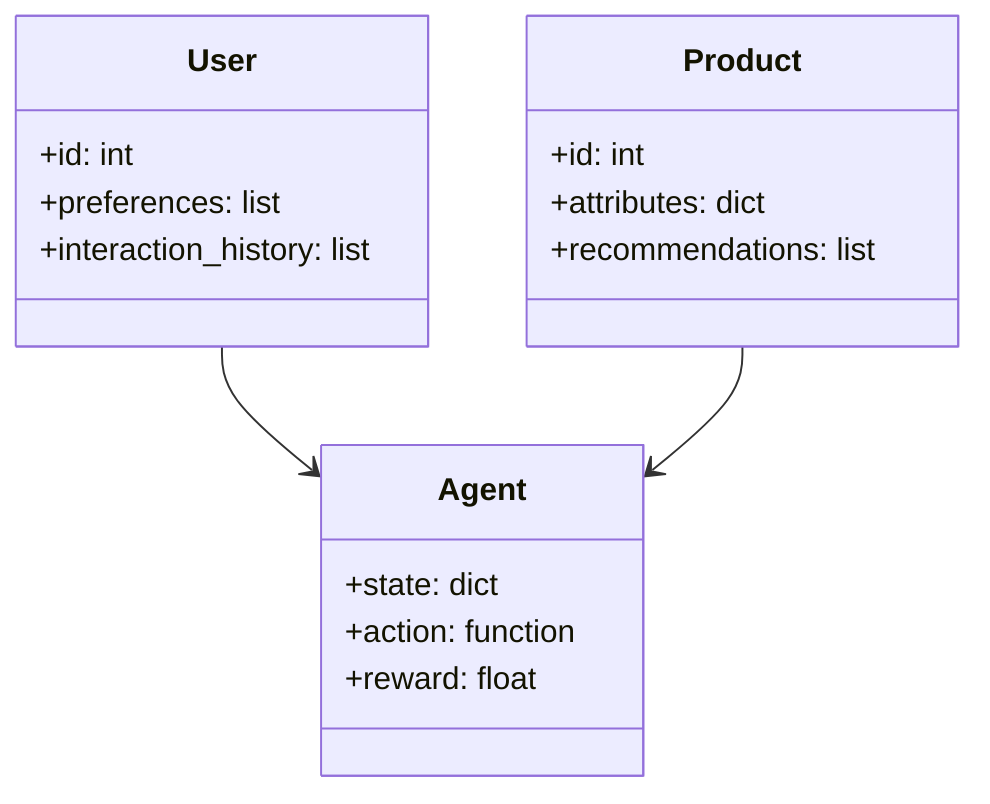
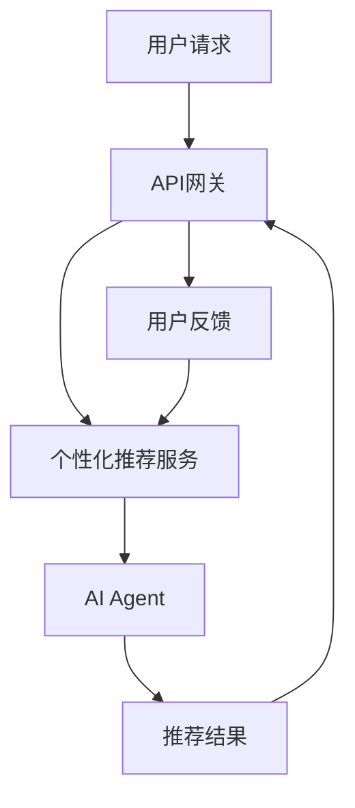
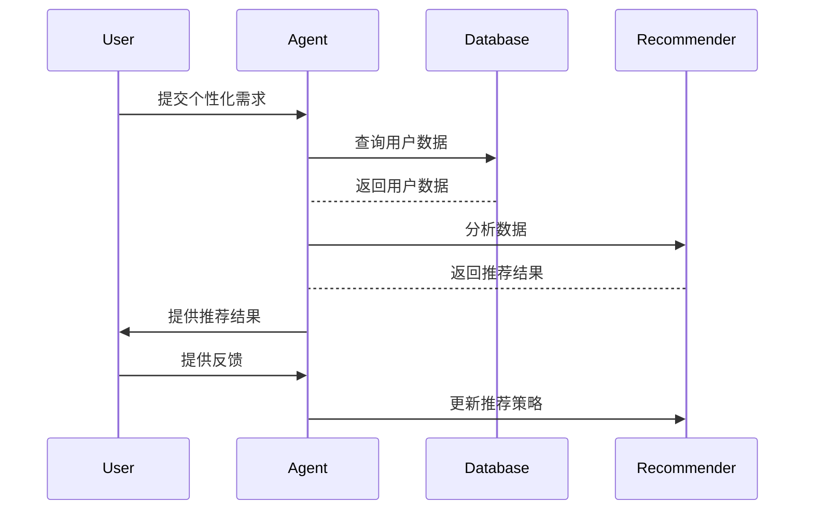

                 


# AI Agent在产品个性化定制中的创新应用

---

## 关键词  
AI Agent, 产品个性化定制, 人工智能, 强化学习, 推荐系统, 系统架构, 创新应用

---

## 摘要  
随着人工智能技术的快速发展，AI Agent（人工智能代理）在产品个性化定制中的应用日益广泛。本文从AI Agent的基本概念出发，结合个性化定制的背景与需求，详细探讨了AI Agent的核心原理、算法实现、系统架构设计以及实际应用案例。通过理论与实践相结合的方式，本文深入分析了AI Agent如何赋能产品个性化定制，并提供了丰富的代码示例和系统设计图，帮助读者全面理解这一创新技术的应用潜力。

---

## 第一部分: AI Agent与产品个性化定制的背景与概念

### 第1章: AI Agent的基本概念与个性化定制的背景

#### 1.1 AI Agent的定义与特点
##### 1.1.1 AI Agent的定义  
AI Agent（人工智能代理）是指能够感知环境、自主决策并执行任务的智能实体。它能够通过传感器获取信息，利用算法进行分析和判断，并通过执行器与环境交互。AI Agent的核心目标是通过智能算法优化决策过程，实现目标最大化。

##### 1.1.2 AI Agent的核心特点  
- **自主性**：AI Agent能够在没有外部干预的情况下独立运行。  
- **反应性**：能够实时感知环境变化并做出反应。  
- **目标导向**：所有行为都围绕实现特定目标展开。  
- **学习能力**：能够通过经验优化自身的决策策略。  

##### 1.1.3 AI Agent与传统AI的区别  
AI Agent与传统AI的区别在于其“代理”特性。传统AI通常专注于特定任务（如图像识别、语音识别），而AI Agent是一个动态的、目标导向的实体，能够与环境交互并主动完成任务。

---

#### 1.2 产品个性化定制的背景与需求
##### 1.2.1 个性化定制的定义与重要性  
个性化定制是指根据用户的特定需求，量身定制产品或服务的过程。随着消费者对个性化需求的增加，个性化定制在各个领域（如电商、教育、医疗等）变得越来越重要。

##### 1.2.2 当前市场对个性化定制的需求  
- 用户需求多样化：不同用户对产品的偏好和需求存在显著差异。  
- 竞争加剧：企业通过个性化定制提升用户体验，以在激烈的市场竞争中脱颖而出。  
- 技术进步：人工智能和大数据技术的发展为个性化定制提供了技术支持。  

##### 1.2.3 个性化定制的核心挑战  
- 数据量大：需要处理大量用户数据以实现精准定制。  
- 决策复杂：个性化定制通常涉及多个决策点，需要综合考虑多种因素。  
- 实时性要求高：部分场景需要实时响应用户的个性化需求。  

---

#### 1.3 AI Agent在个性化定制中的作用
##### 1.3.1 AI Agent如何赋能个性化定制  
AI Agent能够通过实时感知用户需求、分析数据并做出决策，帮助企业在个性化定制中实现高效、精准的目标。  

##### 1.3.2 AI Agent在个性化定制中的优势  
- **精准决策**：通过强化学习和推荐系统，AI Agent能够快速找到最优解决方案。  
- **高效执行**：AI Agent能够快速响应用户需求，缩短决策时间。  
- **持续优化**：通过学习用户的反馈，AI Agent能够不断优化个性化定制策略。  

##### 1.3.3 AI Agent与个性化定制的结合场景  
- **电商推荐**：根据用户的购买历史和偏好，推荐个性化商品。  
- **教育定制**：根据学生的学习情况，定制个性化的学习计划。  
- **医疗诊断**：根据患者的症状和病史，推荐个性化的治疗方案。  

---

#### 1.4 本章小结  
本章主要介绍了AI Agent的基本概念、个性化定制的背景与需求，以及AI Agent在个性化定制中的作用。通过这些内容，我们明确了AI Agent在个性化定制中的潜力和重要性。

---

## 第二部分: AI Agent的核心原理与算法

### 第2章: AI Agent的核心原理

#### 2.1 AI Agent的基本原理
##### 2.1.1 AI Agent的感知与决策机制  
AI Agent通过传感器获取环境信息（如用户数据、市场趋势等），然后通过算法分析这些信息，制定决策策略。  

##### 2.1.2 AI Agent的行为规划  
行为规划是AI Agent的核心功能之一，它通过分析可能的行为及其结果，选择最优的行为路径。  

##### 2.1.3 AI Agent的自我学习与优化  
AI Agent通过强化学习等方法，不断优化自身的决策策略，提升个性化定制的精准度。

---

#### 2.2 AI Agent的核心算法
##### 2.2.1 强化学习算法  
强化学习是一种通过试错方式优化决策策略的算法。AI Agent通过与环境交互，逐步学习最优策略。  

##### 2.2.2 监督学习算法  
监督学习是一种基于标注数据的训练方法，AI Agent通过学习大量标注数据，预测用户需求。  

##### 2.2.3 聚类与推荐算法  
聚类算法用于将用户分为不同的群体，推荐算法则根据用户的群体特征推荐个性化产品。  

---

#### 2.3 算法原理的数学模型与公式
##### 2.3.1 强化学习的数学模型  
强化学习的目标是通过最大化累积奖励来优化决策策略。数学模型如下：  
$$ V(s) = \max_a Q(s,a) $$  
其中，$V(s)$ 表示状态 $s$ 的价值函数，$Q(s,a)$ 表示状态 $s$ 下采取行动 $a$ 的价值函数。

##### 2.3.2 推荐系统的协同过滤公式  
协同过滤是一种基于用户相似性推荐个性化产品的算法。数学公式如下：  
$$ \hat{r}_{u,i} = \frac{\sum_{k} w_{u,k} \cdot w_{i,k}}{\sum_{k} w_{u,k} \cdot w_{i,k}} } $$  
其中，$\hat{r}_{u,i}$ 表示用户 $u$ 对产品 $i$ 的预测评分，$w_{u,k}$ 和 $w_{i,k}$ 表示用户 $u$ 和产品 $i$ 在第 $k$ 个特征上的权重。

---

#### 2.4 算法实现的代码示例
##### 2.4.1 强化学习算法实现  
以下是一个强化学习算法的简单实现示例：  
```python
class Agent:
    def __init__(self, state_space, action_space):
        self.state_space = state_space
        self.action_space = action_space
        self.q_table = np.zeros((state_space, action_space))
 
    def take_action(self, state):
        return np.argmax(self.q_table[state])
 
    def update_q_table(self, state, action, reward):
        self.q_table[state, action] += reward
```

---

### 第3章: 系统分析与架构设计方案

#### 3.1 问题场景介绍  
个性化定制系统需要处理大量用户数据，实时响应用户的个性化需求，并根据反馈不断优化推荐策略。

#### 3.2 项目介绍  
本项目旨在通过AI Agent实现个性化定制，提升用户体验和企业竞争力。

#### 3.3 系统功能设计  
##### 3.3.1 领域模型设计  
以下是领域模型的类图：  


#### 3.4 系统架构设计  
以下是系统架构设计图：  


#### 3.5 系统接口设计  
- **输入接口**：接收用户的个性化需求和历史数据。  
- **输出接口**：返回个性化推荐结果。  
- **反馈接口**：接收用户的反馈并优化推荐策略。  

#### 3.6 系统交互设计  
以下是系统交互的序列图：  


---

### 第4章: 项目实战

#### 4.1 环境安装  
要运行以下代码，需要安装Python和相关库（如NumPy、scikit-learn）。  

#### 4.2 系统核心实现源代码  
以下是一个简单的AI Agent实现示例：  
```python
import numpy as np
from sklearn.cluster import KMeans

class AI_Agent:
    def __init__(self, data):
        self.data = data
        self.model = KMeans(n_clusters=3)
        self.model.fit(data)
 
    def recommend_product(self, user_preference):
        cluster = self.model.predict(user_preference.reshape(1, -1))[0]
        return self.data[cluster]
 
    def update_model(self, new_data):
        self.data = np.vstack((self.data, new_data))
        self.model.fit(self.data)
```

#### 4.3 代码应用解读与分析  
上述代码实现了一个基于聚类的推荐系统。AI Agent通过聚类算法将用户数据分为不同的群体，并根据用户的偏好推荐个性化产品。

#### 4.4 实际案例分析  
以电商推荐为例，AI Agent可以根据用户的购买历史和偏好，推荐个性化商品。  

#### 4.5 项目小结  
本章通过实际案例展示了AI Agent在个性化定制中的应用，详细解读了系统的实现过程和代码逻辑。

---

## 第三部分: 总结与展望

### 第5章: 总结与展望

#### 5.1 本章总结  
本文详细介绍了AI Agent在产品个性化定制中的创新应用，涵盖了AI Agent的基本概念、核心算法、系统架构设计以及实际应用案例。通过理论与实践相结合的方式，我们深入分析了AI Agent在个性化定制中的潜力和优势。

#### 5.2 未来展望  
未来，随着人工智能技术的不断发展，AI Agent在个性化定制中的应用将更加广泛。我们可以期待以下趋势：  
- 更加智能化的推荐算法。  
- 更加个性化的决策系统。  
- 更加高效的人机交互方式。  

---

## 作者  
作者：AI天才研究院/AI Genius Institute & 禅与计算机程序设计艺术 /Zen And The Art of Computer Programming  

---

本文通过系统化的分析和详细的代码示例，全面探讨了AI Agent在产品个性化定制中的创新应用。希望读者通过本文能够深入了解AI Agent的核心原理和实际应用场景，并为未来的相关研究和实践提供参考。

